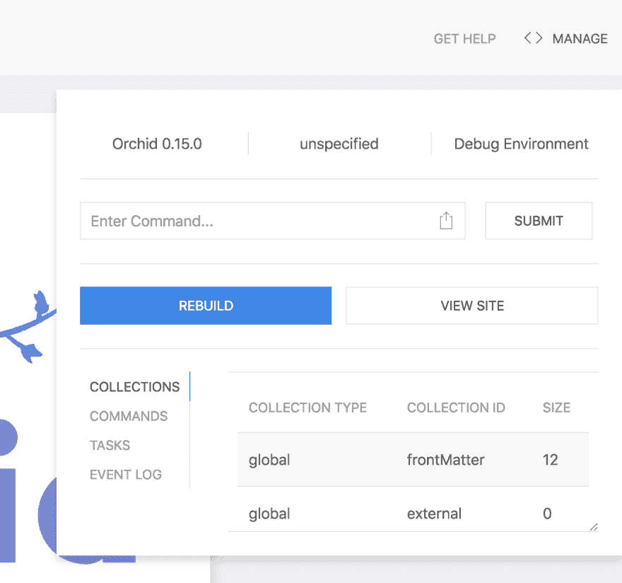
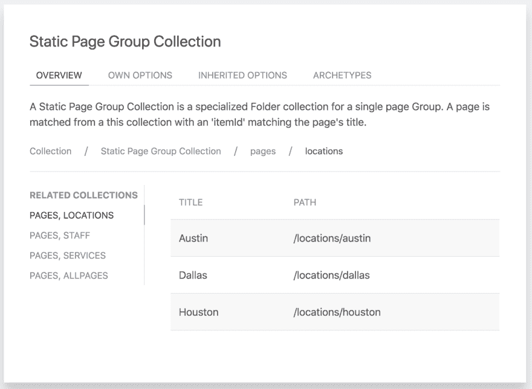
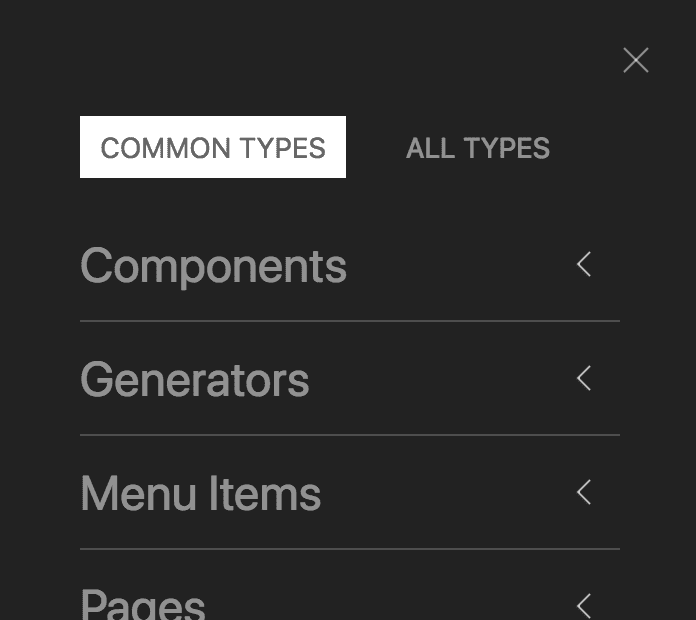
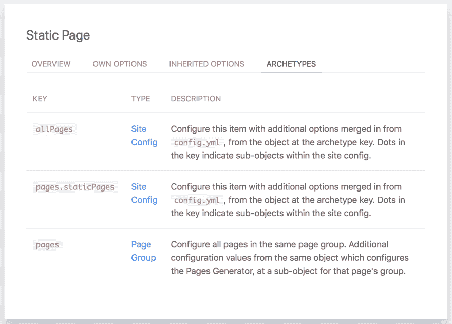

# 兰花教程 07 -惊人的，自动记录管理面板

> 原文：<https://dev.to/cjbrooks12/orchid-tutorial-07---the-amazing-auto-documenting-admin-panel-47l4>

## 简介

如果你一直在跟随这些教程，或者一直在探索其他一些优秀的兰花插件，你可能会开始意识到你可以用兰花做多少事情，尤其是记住如何使用它是多么困难。浏览文档以找到您需要的一小段代码可能有点棘手，如果您还没有使用最新版本，您必须希望它是最新的并且没有发生变化。

幸运的是，兰花为所有这些问题提供了一个解决方案:一个管理面板，它在一个中心位置为您提供最相关的文档，完全符合您的兰花版本。本教程将引导你设置这个插件，并在管理面板中导航，帮助你找到你需要的东西。

在继续之前，请确保您已经按照前面的教程进行了操作，并且已经使用`gradle orchidServe`启动了您的本地兰花服务器。在本教程中，我们将基于这个例子。

你可以自己跟随这个教程，或者在 [OrchidTutorials 库](https://github.com/JavaEden/OrchidTutorials/tree/master/07)中找到它的源代码。

##  [兰花](https://github.com/orchidhq) / [兰花](https://github.com/orchidhq/Orchid)

### 构建和部署与您一起成长的漂亮的文档站点

<article class="markdown-body entry-content container-lg" itemprop="text">

[](https://orchid.run/) 
**构建和部署与您一起成长的精美文档网站**

* * *

[](https://bintray.com/javaeden/Orchid/OrchidCore/_latestVersion)[](https://www.gnu.org/licenses/lgpl-3.0)[](https://travis-ci.org/orchidhq/orchid)[](https://ci.appveyor.com/project/cjbrooks12/orchid/branch/dev)[](https://www.codacy.com/app/cjbrooks12/Orchid?utm_source=github.com&utm_medium=referral&utm_content=orchidhq/orchid&utm_campaign=Badge_Coverage)

[快速入门](https://orchid.run/wiki/user-manual/getting-started/quickstart)[文档](https://orchid.run/wiki/user-manual/getting-started)[教程](https://orchid.run/wiki/learn)[展示](https://orchid.run/showcase)[支持](https://gitter.im/JavaEden/Orchid)

## 快速启动

*   [](https://orchid.run/wiki/user-manual/getting-started/quickstart#gradle)
*   [](https://orchid.run/wiki/user-manual/getting-started/quickstart#maven)
*   [](https://orchid.run/wiki/user-manual/getting-started/quickstart#sbt)
*   [](https://app.netlify.com/start/deploy?repository=https://github.com/orchidhq/OrchidStarter)

## 证明文件

兰花的用户手册将带您了解兰花的主要功能，并让您更深入地了解每个主题和功能。

[文档](https://orchid.run/wiki/user-manual/getting-started)

## 教程

有几个教程旨在引导您从头开始构建一个兰花站点。所有教程的源代码也可以在[或教程库](https://github.com/orchidhq/OrchidTutorials)中找到。

[教程](https://orchid.run/wiki/learn)

## 显示优点的东西

查看陈列柜，看看兰花的行动。

[展示区](https://orchid.run/showcase)

## 支持

### 贡献者

这个项目的存在要感谢所有做出贡献的人。要参与，请见[投稿. md](https://github.com/orchidhq/orchid/blob/dev/.github/CONTRIBUTING.md)

[](https://github.com/orchidhq/orchid/graphs/contributors) 

### 巴克斯

感谢我们所有的支持者！<g-emoji class="g-emoji" alias="pray" fallback-src="https://github.githubassets.cimg/icons/emoji/unicode/1f64f.png">🙏</g-emoji>

[](https://opencollective.com/orchidssg#backers) 

### 赞助商

通过成为赞助商来支持这个项目。您的徽标将显示在此处，并带有指向您网站的链接。

[ ](https://opencollective.com/orchidssg/sponsor/0/website) [  ](https://opencollective.com/orchidssg/sponsor/1/website) [  ](https://opencollective.com/orchidssg/sponsor/2/website) [  ](https://opencollective.com/orchidssg/sponsor/3/website) [  ](https://opencollective.com/orchidssg/sponsor/4/website) [  ](https://opencollective.com/orchidssg/sponsor/5/website) [  ](https://opencollective.com/orchidssg/sponsor/6/website) [  ](https://opencollective.com/orchidssg/sponsor/7/website) [  ](https://opencollective.com/orchidssg/sponsor/8/website) [](https://opencollective.com/orchidssg/sponsor/9/website) 

### 许可证

Orchid 是在 GNU 宽松通用公共许可证(LGPL-3.0)下许可的开源软件。请看 [License.md](https://github.com/orchidhq/orchid/blob/dev/License.md)

### 接触

…

</article>

[View on GitHub](https://github.com/orchidhq/Orchid)

## 先做第一件事

兰花从根本上来说是灵活和可插拔的。我们用来构建网站的静态页面实际上只是一个插件，以一种固执己见的方式构建在核心框架之上，来制作静态页面！这允许你挑选你想在你的网站上使用的功能，而不是给你一大堆你永远不会用的东西。

兰花的管理面板是另一个功能，可作为一个插件，并不包括在默认情况下。让我们继续用这个新插件来设置我们的站点。

### 添加“插件文档”插件

由于兰花是一个基于 Java 的框架，它充分利用了几个著名的工具来管理插件。插件作为普通的 Maven 依赖项分发，当包含在类路径中时，会自动引导，无需进一步配置。

这意味着你只需要在你的`build.gradle`中添加一行就可以安装管理面板了。添加以下依赖项，您就可以开始了！

```
orchidCompile "io.github.javaeden.orchid:OrchidPluginDocs:0.15.0" 
```

Enter fullscreen mode Exit fullscreen mode

为了添加新的依赖项，您需要完全重启 Orchid，但是一旦它开始备份，请尝试访问[http://localhost:8080/admin](http://localhost:8080/admin)来查看您闪亮的新管理面板，然后继续阅读以了解如何使用它！

## 管理面板功能

### 收藏检验

在前面的教程中，我已经向你展示了如何从模板功能和菜单项创建到你的站点页面的链接。我刚刚告诉你如何确定页面链接的范围，这样它们就能准确地选择你期望的页面，这是一个由`itemId`(页面标题)、`collectionId`和`collectionType`组成的独特组合。

我向您展示了如何为 Pages 插件找到这些`collectionId`和`collectionType`值，但是如果我从来没有告诉过您呢？你怎么知道`collectionId`和`collectionType`是什么？这是兰花的管理面板可以为你解决的第一个问题。

让我们首先打开“管理面板”，单击页面右上角的“管理”。它将打开一个弹出面板，如下所示:

[](https://res.cloudinary.com/practicaldev/image/fetch/s--OHy_0gMM--/c_limit%2Cf_auto%2Cfl_progressive%2Cq_auto%2Cw_880/https://thepracticaldev.s3.amazonaws.com/i/9vp0kat5iolvuh8nrqyv.png)

你可以在这个面板中找到很多很酷的东西，但是最重要的是它右下角的表格。这个表格的表头正是我们之前不知道怎么找的`collectionId`和`collectionType`！您知道您有“页面组”的集合，但是那里还有其他几个集合！

每个生成页面的插件也会为这些页面创建集合，它们都会反映在这个列表中。这意味着这个表格能够完全捕获来自*的*所有*页面集合以及你安装或创建的所有*插件，而不仅仅是官方的兰花插件。这个事实本身就很有帮助，因为它成为查找过滤页面链接所需的精确值的快速参考，但是这些集合还有更多可以由 Orchid 的管理面板解锁。让我们单击该表的“页面，位置”行，您将看到一个如下所示的页面:

[](https://res.cloudinary.com/practicaldev/image/fetch/s--bVNFQOHJ--/c_limit%2Cf_auto%2Cfl_progressive%2Cq_auto%2Cw_880/https://thepracticaldev.s3.amazonaws.com/i/zweqjeciah6wlli6bo3e.png)

这一页上有很多内容，但让我们把它分解一下。它有 4 个选项卡，但我们现在只看第一个。我稍后将回到其他三个选项卡。

该页面从集合的描述开始。我在上面提到过,`itemId`通常是页面的标题。这个值实际上是由集合决定的，将在本节中描述。因此,“管理面板”会向您显示`collectionId`和`collectionType`,点击它会告诉您如何链接到它的'`itemId`,这是唯一链接到一个页面所需的最后一部分。在 Orchid 中定位页面没有什么魔力，在管理面板中就可以很容易地访问到。

在描述下面，您将看到相关收藏的列表。这些收藏与您当前正在查看的收藏共享一个`collectionType`。一个插件通常会产生几个集合，它们应该通过一个公共的`collectionType`相互关联。这个侧边栏使得从一个插件中浏览所有收藏变得容易。

在相关收藏列表的旁边，您会发现一个表格，其中包含了当前收藏中包含的所有页面，可以使用相应的`itemId`单独选择这些页面。这些页面显示了它的标题(因为它通常被用作`itemId`)，以及它的 URL，所以你可以确定你知道它是哪个页面。单击此表中的任何一行都会将您带到该页面。

### 插件发现和文档

现在我们已经了解了如何找到你的插件生成的所有集合，让我们看看管理面板还提供了什么样的信息。

在教程 5 中，我们学习了 Orchid 如何为您生成站点菜单，并且我介绍了几个不同的菜单项，它们对于创建动态菜单很有用。但是就像收藏一样，如果我没有告诉你，你怎么能找到这些不同的菜单项类型呢？如果我不告诉你，你怎么知道为它们使用什么配置选项呢？

通常情况下，你必须找到你正在使用的每个插件的文档，并通过搜索找到你需要的确切信息。但是这有几个问题:你相信那个插件的文档是最新的，它不包含错误，甚至开发者甚至有文档！但是更糟糕的是，如果你使用的插件版本比文档记录的版本旧，那么公共文档实际上与你的版本不同呢？那你就完全不走运了！

幸运的是，兰花没有遭受任何这些问题，因为管理面板自动为您带来所有这些信息，完美地更新您当前的插件*，无论它们的版本*。因此，让我们找出从哪里获得所有这些信息！

点击屏幕右上角的“汉堡图标”。它将打开一个如下所示的抽屉:

[](https://res.cloudinary.com/practicaldev/image/fetch/s--lPVzWhQO--/c_limit%2Cf_auto%2Cfl_progressive%2Cq_auto%2Cw_880/https://thepracticaldev.s3.amazonaws.com/i/emzm3h948ed5am89pqk8.png)

这个抽屉包含了由*注册的*所有*插件的列表，按照它们的类型分组。这个抽屉里有两个标签。第一个包含“公共类型”，这是您最有可能需要配置的对象。你会在那里看到“页面”、“菜单项”等类别。另一个标签，“所有类型”包含所有这些常见的类型，以及许多其他插件或主题开发者可能感兴趣的对象。*

但是让我们单击“菜单项”行。它将展开以显示所有可用菜单项的列表，以及每个菜单项的简短描述。你会注意到这个列表包括我们在那个教程中使用的所有“链接”、“页面”、“静态页面”和“页面 id”菜单项。点击其中一项，如“链接”，将进入如下页面:

[](https://res.cloudinary.com/practicaldev/image/fetch/s--Wq5qhSFy--/c_limit%2Cf_auto%2Cfl_progressive%2Cq_auto%2Cw_880/https://thepracticaldev.s3.amazonaws.com/i/kcn7wx9kyjltz1e2uck6.png)

您会注意到这个页面包含了与集合页面相同的四个选项卡。这是因为兰花使用一个统一的系统来管理元数据，这允许一切都以类似的方式自动记录。

第一个选项卡始终是该项目的“概述”。菜单项都将包括一个简短的描述，以帮助您了解他们做什么。一些其他类型的对象，如组件，可能包含代码片段来帮助您开始使用它们。

但是魔法在接下来的两个选项卡上开始变得明显:“拥有的选项”和“继承的选项”。它们都包含该项目的选项表，如下所示:

[](https://res.cloudinary.com/practicaldev/image/fetch/s--zAmR6hRb--/c_limit%2Cf_auto%2Cfl_progressive%2Cq_auto%2Cw_880/https://thepracticaldev.s3.amazonaws.com/i/8xhlgpuvrk1zpc08tk3y.png)

这个例子告诉你什么选项可以用来设置你的“链接”菜单项。还记得在菜单项教程中我刚刚告诉你添加`title`和`url`选项来正确配置它吗？这就是你如何找到答案的方法！它还包括对每个选项的简短描述，以及每个选项的默认值，这样您就知道如果不提供该选项，它将如何工作。“继承选项”选项卡将显示所有菜单项类型的可用配置，而不仅仅是“链接”类型。

“链接”菜单项的最后一个选项卡“原型”是空的。但是回想一下，上一篇教程向您展示了如何使用原型更容易地一次性配置静态页面，所以让我们来看看“静态页面”页面上的这个选项卡。您可以在抽屉的“页面”链接下找到它,“原型”选项卡应该如下所示:

[](https://res.cloudinary.com/practicaldev/image/fetch/s--ZAq_yIRL--/c_limit%2Cf_auto%2Cfl_progressive%2Cq_auto%2Cw_880/https://thepracticaldev.s3.amazonaws.com/i/4sep9ziei7p9f8qknpbq.png)

此选项卡显示了每个项目的所有可能原型(如果存在)的表格，以及每个原型的简短描述。这将帮助您了解如何利用原型来最小化站点中的重复配置。这个列表也是有序的，列表中后面的原型覆盖列表中前面的原型。

总之，Orchid 的各种对象的概述、选项和原型为您提供了如何使用该对象定制您的站点的完整画面。与在 docs 网站上查找所有插件不同，Orchid 将所有的文档集中在一个地方，让您比以往任何时候都更容易构建自己的站点，并帮助您发现可能会被遗漏的功能。

## 结论

除了管理面板，你还可以做更多的事情，不同的插件也可能包含他们自己独特的功能，但是收集检查和插件发现/文档绝对是兰花管理面板最好的功能之一。我鼓励你去探索一些其他的插件对象，并且在管理面板中自如地导航，因为这将是你构建你的站点时不可或缺的工具！

* * *

本教程最初发布在[官方兰花文档](https://orchid.netlify.com/wiki/learn/tutorials/amazing-admin-panel)中。