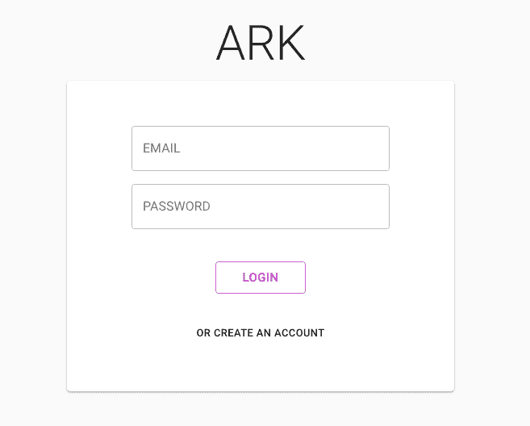
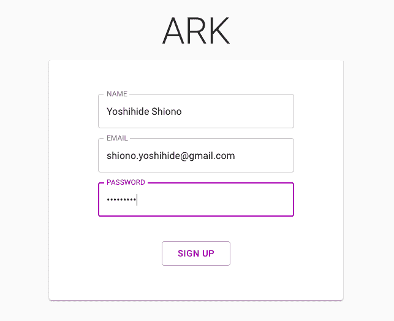
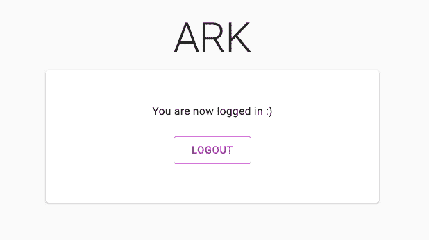

# Node.js 最简单的用户认证系统之路

> 原文：<https://dev.to/saltyshiomix/a-road-to-the-easiest-user-authentication-system-for-nodejs-138f>

JavaScript 很容易读写，但有时我们会面临像**用户认证**这样的困难。

在更深入的谈用户认证之前，我先介绍一下我这个周末做的:

##  [ saltyshiomix ](https://github.com/saltyshiomix) / [方舟](https://github.com/saltyshiomix/ark)

### 基于 NestJS、TypeORM、NEXT.js(v9.3)和 Material UI(v4)的最简单的认证系统。

<article class="markdown-body entry-content container-lg" itemprop="text">

[](https://camo.githubusercontent.com/c40117d247b2d8197223c4bd3a705d4d4a0a2670/68747470733a2f2f692e696d6775722e636f6d2f685458576f336b2e706e67)

在 [NestJS](https://nestjs.com) 、 [TypeORM](http://typeorm.io) 、 [NEXT.js (v9)](https://nextjs.org) 和 [Material UI (v4)](https://material-ui.com) 之上最简单的认证系统。

[](https://camo.githubusercontent.com/911b9e37ace505a303156215be30b7daf0109eb5/68747470733a2f2f696d672e736869656c64732e696f2f6769746875622f6c6963656e73652f73616c74797368696f6d69782f61726b2e737667)

## 特征

*   跨平台- Mac、Linux 和 Windows
*   与实体的数据库同步-由[类型表单](http://typeorm.io)提供支持
*   服务器端渲染-由 [NEXT.js](https://nextjs.org) 提供支持
*   API 服务器-由 [NestJS](https://nestjs.com) 提供支持
*   认证-由[护照](http://www.passportjs.org)支持
*   [材料 UI](https://material-ui.com) 设计

## 技术

*   面向开发者体验的热重装:)
    *   [ts-node-dev](https://github.com/whitecolor/ts-node-dev) -编译您的 ts 应用程序，并在文件被修改时重启
    *   [next . js](https://nextjs.org)-React 框架
*   朗格
    *   [TypeScript](https://www.typescriptlang.org) -可伸缩的 Javascript
*   数据库ˌ资料库
    *   [PostgreSQL](https://www.postgresql.org) -世界上最先进的开源关系数据库
*   对象关系映射
    *   [类型表单](http://typeorm.io) -用于类型脚本和 JavaScript 的表单(ES7，ES6，ES5)
*   计算机网络服务器
    *   一个渐进的 Node.js 框架，用于构建高效、可靠和可伸缩的服务器端应用程序
        *   在内部使用[Express](https://expressjs.com)——node . js 的快速、非个性化、极简的 web 框架
    *   [next . js](https://nextjs.org)-React 框架
*   环境变量
    *   [dotenv](https://github.com/motdotla/dotenv) -从。环境…

</article>

[View on GitHub](https://github.com/saltyshiomix/ark)

是的，这是一个超级简单的用户认证系统:)

另一方面，它使用这些技术:

*   面向开发者体验的热重装:)
    *   [nodemon](https://nodemon.io/)——监视 node.js 应用程序中的任何变化，并自动重启服务器
    *   [next . js](https://nextjs.org/)-React 框架
*   朗格
    *   [TypeScript](https://www.typescriptlang.org/) -可伸缩的 Javascript
*   数据库ˌ资料库
    *   [PostgreSQL](https://www.postgresql.org/) -世界上最先进的开源关系数据库
*   对象关系映射
    *   [类型表单](http://typeorm.io/) -用于类型脚本和 JavaScript 的表单(ES7，ES6，ES5)
*   计算机网络服务器
    *   nest——一个渐进的 Node.js 框架，用于构建高效、可靠和可伸缩的服务器端应用程序
        *   在内部使用[Express](https://expressjs.com/)——node . js 的快速、非个性化、极简的 web 框架
    *   [next . js](https://nextjs.org/)-React 框架
*   环境变量
    *   [dotenv](https://github.com/motdotla/dotenv/) -从。nodejs 项目环境
*   用户认证
    *   [Passport](http://www.passportjs.org/)——node . js 的简单、不引人注目的认证
*   UI 框架
    *   一个用于构建用户界面的 JavaScript 库
    *   [next . js](https://nextjs.org/)-React 框架
    *   [Material UI](https://material-ui.com/) - React 实现谷歌材质设计的组件。

这么多图书馆，对吧？最简单的认证？

是的。

让我们深入挖掘一下:

## 趣味数据库

感谢[类型的表单](http://typeorm.io/)，我们可以**同步数据库和实体**。

这里有一个`user.entity.ts` :

```
import {
  Entity,
  Column,
  PrimaryGeneratedColumn
} from 'typeorm';

@Entity()
export class User {
  @PrimaryGeneratedColumn()
  id: number;

  @Column('varchar')
  name: string;

  @Column('varchar', {
    unique: true
  })
  email: string;

  @Column('varchar')
  password: string;  
} 
```

TypeORM 从`@Entity()` decorator 信息中自动同步数据库。
换句话说，你一保存`user.entity.ts`，数据库就会自动改变。

## 趣味编码

有了 [nest](https://nestjs.com/) ，我们可以使用现代的 JavaScript(TypeScript)，有了 [VSCode](https://code.visualstudio.com/) 我们可以获得像代码智能一样的最大收益。

下面是一个例子`users.controller.ts` :

```
import {
  Controller,
  Get
} from '@nestjs/common';
import { User } from './user.entity';
import { UsersService } from './users.service';

@Controller('api/users')
export class UsersController {
  constructor(private readonly service: UsersService) {}

  @Get()
  async findAll(@Query() query): Promise<User[]> {
    return await this.service.findAll();
  }
} 
```

通过构造函数注入，`users.controller.ts`并不关心`findAll()`用户如何。

而`users.service.ts`是这样的:

```
import { Injectable } from '@nestjs/common';
import { InjectRepository } from '@nestjs/typeorm';
import { Repository } from 'typeorm';
import { User } from './user.entity';

@Injectable()
export class UsersService {
  constructor(@InjectRepository(User) private readonly repository: Repository<User>) {}

  async findAll(): Promise<User[]> {
    return await this.repository.find();
  }
} 
```

你能相信吗？

我们可以在不编写 SQL 脚本的情况下`findAll()`用户，因为[类型表单](http://typeorm.io/)和[嵌套](https://nestjs.com/)隐藏实现。(所谓的“存储库模式”)

## 趣味 SEO(服务器端渲染)

[Next.js](https://nextjs.org/) 使我们能够在不关心服务器端渲染的情况下编写`page/index.tsx`:

```
export default () => 'Hello SSR!'; // this is a React.Component :) 
```

## 如何尝试[方舟](https://github.com/saltyshiomix/ark)

首先，你需要安装 [PostgreSQL](https://www.postgresql.org/) 。

如果你使用 Mac 和[家酿](https://brew.sh/)，设置是如此简单:

```
# install database (postgresql)
$ brew install postgresql

# if you want to start postgresql in startup, try do this
$ brew services start postgresql

# create user "arkuser" with password "arkark"
$ createuser -P arkuser

# create database "arkdb" owened by "arkuser"
$ createdb arkdb -O arkuser 
```

就是这样！

并且像 [Next.js](https://nextjs.org/) :
一样使用

```
# clone repository
$ git clone https://github.com/saltyshiomix/ark.git

# install dependencies
$ cd ark
$ yarn

# development mode
# please make sure to create the `.env` file!
$ yarn dev

# production mode
# please make sure to create the `.next/.env` file!
$ yarn build
$ yarn start 
```

(`.env`文件是这样的:)

```
# DB
DB_TYPE=postgres
DB_HOST=localhost
DB_PORT=5432
DB_USERNAME=arkuser
DB_PASSWORD=arkark
DB_DATABASE=arkdb
DB_SYNCHRONIZE=true

# App
HOST=localhost
PORT=4000
SESSION_SECRET=ark 
```

你会看到`http://localhost:4000`:

[](https://res.cloudinary.com/practicaldev/image/fetch/s--x10D4Sj---/c_limit%2Cf_auto%2Cfl_progressive%2Cq_auto%2Cw_880/https://thepracticaldev.s3.amazonaws.com/i/1et6gurxpen3rayyemde.png)

并创建一个帐户:

[](https://res.cloudinary.com/practicaldev/image/fetch/s--UyC99wOl--/c_limit%2Cf_auto%2Cfl_progressive%2Cq_auto%2Cw_880/https://thepracticaldev.s3.amazonaws.com/i/wl7lu3mrp936h5efe3d0.png)

您现在已经登录！

[](https://res.cloudinary.com/practicaldev/image/fetch/s--ZCU0Hdla--/c_limit%2Cf_auto%2Cfl_progressive%2Cq_auto%2Cw_880/https://thepracticaldev.s3.amazonaws.com/i/6ctnbaspwed60ehdp8q1.png)

## 结论

我创建了 [ARK](https://github.com/saltyshiomix/ark) repository，目的是展示如何轻松实现用户认证系统。

所以公关是受欢迎的！
(像“实现社交登录”、“实现 JSON API”等等。)

希望对你有帮助:)