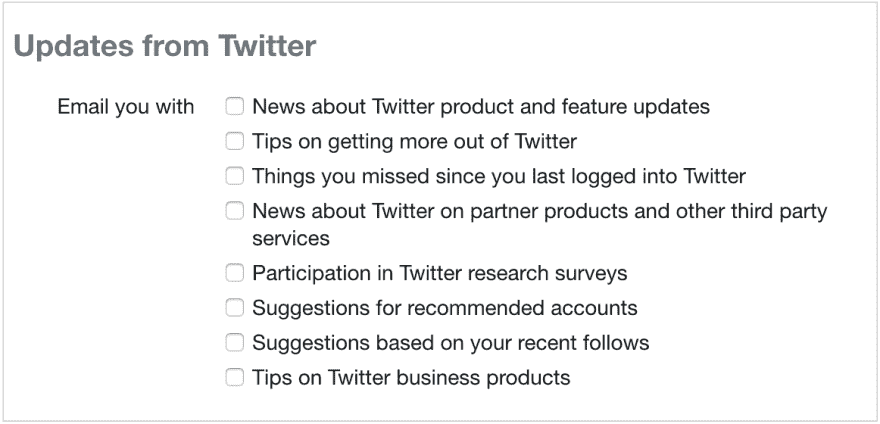
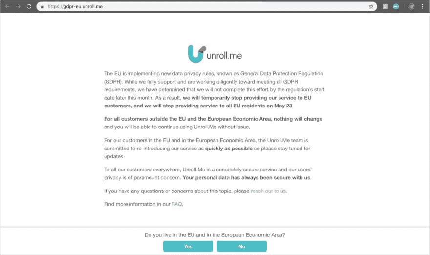

# 关注隐私的 Unroll.me 和退订的替代方案

> 原文：<https://dev.to/dinkydani21/a-privacy-focused-alternative-to-unrollme-and-unsubscriber-484o>

你知道吗，2018 年，垃圾短信仍占全球所有电子邮件流量的 **48.16%** ？[ [来源](https://www.statista.com/statistics/420391/spam-email-traffic-share/)

注册邮件列表很容易，但在你的收件箱里找到它们却困难得多，而且几乎不可能轻易取消订阅。

我们都经历过。每天都被电子邮件淹没，直到你和自己达成协议，在你收到的所有垃圾邮件和订阅列表中找到并点击“取消订阅”。但是，这很费时间，你需要专注于重要的电子邮件。所以你把它们扔到一边，下一周你又会遇到同样的问题。

> 2018 年，垃圾短信占全球所有电子邮件流量的 48.16%

当然，还有你从你注册的服务中收到的所有电子邮件，他们认为为你的帐户或个人资料的每一次可能的互动提供 **25 种不同类型的电子邮件通知**是个好主意。

<figure>

<figcaption>2018 年推特邮件通知设置</figcaption>

</figure>

并不是所有的邮件列表都是不好的——我有几个我喜欢接收和阅读的邮件列表。我需要一项服务，它能向我展示我订阅了什么，并允许我轻松地选择退出什么。

### 不道德的行为

找到一个取消不想要的邮件列表的服务是容易的部分，我很快找到了 [Unroll.me](https://unroll.me) 和 [Unsubscriber](https://getunsubscriber.com) 提供免费帮助(尽管 Unsubscriber 不支持 Gmail)。我很难找到一种服务，它不会出于营销目的**出售我所有的数据**。

Unroll.me 和 Unsubscriber 都能够免费提供服务，因为他们通过收集你的电子邮件的元数据和内容并出售来赚钱。如果你使用 Unroll.me，你就允许他们随心所欲地与他们选择的任何“伙伴”分享你的个人信息。稍微好一点的是，注册退订，他们会用你的数据来改进他们的产品、服务和广告——仍然相当模糊。

Unroll.me 去年甚至成为头条新闻，因为他们向优步出售用户数据。你可以在[纽约时报](https://www.nytimes.com/2017/04/24/technology/personal-data-firm-slice-unroll-me-backlash-uber.html)、[生活黑客](https://lifehacker.com/unroll-me-the-email-unsubscription-service-has-been-c-1794593445)、[连线](https://www.wired.com/2017/04/stop-services-like-unroll-snooping-gmail/)、[卫报](https://www.theguardian.com/technology/2017/apr/24/unrollme-mail-unsubscription-service-heartbroken-sells-user-inbox-data-slice)和 [CNET](https://www.cnet.com/how-to/how-to-remove-unroll-me-from-your-gmail-account) 上读到这些。

尽管如此，还是做了一些改变来保护消费者。自 2018 年 5 月引入 GDPR 以来，Unroll.me 不再为欧盟的客户提供支持，因为他们无法遵守 GDPR 法规。详见 [TechCrunch](https://techcrunch.com/2018/05/05/unroll-me-to-close-to-eu-users-saying-it-cant-comply-with-gdpr/) 、[福布斯](https://www.forbes.com/sites/wlf/2018/11/05/regulatory-and-legal-barriers-to-tech-company-market-entry-success-stubbornly-persist/#7498bad48e64)和 [BBC 新闻](https://www.bbc.com/news/technology-44239126)。

<figure> 

<figcaption>Unroll.me 检查用户是否在欧盟(2018 年 12 月)</figcaption>

</figure>

### 隧道的尽头有光

面对混乱的收件箱或我所有的数据被利用的困境，我决定建立一个**道德隐私优先的电子邮件选择退出服务**叫做[让我和我的搭档](https://leavemealone.xyz)[詹姆士](https://twitter.com/JamesIvings)独处。

让我一个人呆着让你可以在一个地方看到你所有的订阅邮件，并且只需点击一下就可以自动取消订阅。

<figure> 

<figcaption>一键退订垃圾邮件</figcaption>

</figure>

我们永远不会泄露你的隐私。当我们扫描您的收件箱进行订阅时，我们绝对不会以任何形式在我们的服务器**上存储您的任何电子邮件内容**，并且任何敏感数据在静止状态下都会被**加密**。

我们存储的唯一数据是收件人和发件人地址，以及一个时间戳，用于识别您过去是否退订过某个列表。你可以在这里看到我们的全部隐私政策[。](https://leavemealone.xyz/privacy)

我们承诺永远不会利用你或你的数据。我们只想帮助您重新控制您的收件箱，并消除不想要的垃圾邮件。

### 我们如何赚钱

这样我们就可以保证你的数据安全，让我一个人呆着是一项有偿服务。

根据你想扫描收件箱中的垃圾邮件列表的时间，价格是分等级的。

我们将免费扫描您收件箱中在过去**3 天内收到的任何订阅电子邮件**。要扫描上周、上个月或过去 6 个月在**收到的电子邮件订阅，您可以一次性购买其中一个按扫描付费的包。**

<figure> 

<figcaption>别管我定价</figcaption>

</figure>

### 清理你的收件箱

你现在就可以开始用别管我了。使用您的 Gmail 登录到 [https://leavemealone.xyz](https://leavemealone.xyz) 。

我们希望您发现我们的电子邮件选择退出服务是有用的，它可以帮助你。如果您有任何问题或反馈，请不要犹豫，通过 [Twitter](https://twitter.com/dinkydani21) 或发送电子邮件至[leavemealone @ squarecat . io](//mailto:leavemealone@squarecat.io)与我们联系。

享受干净的收件箱！

