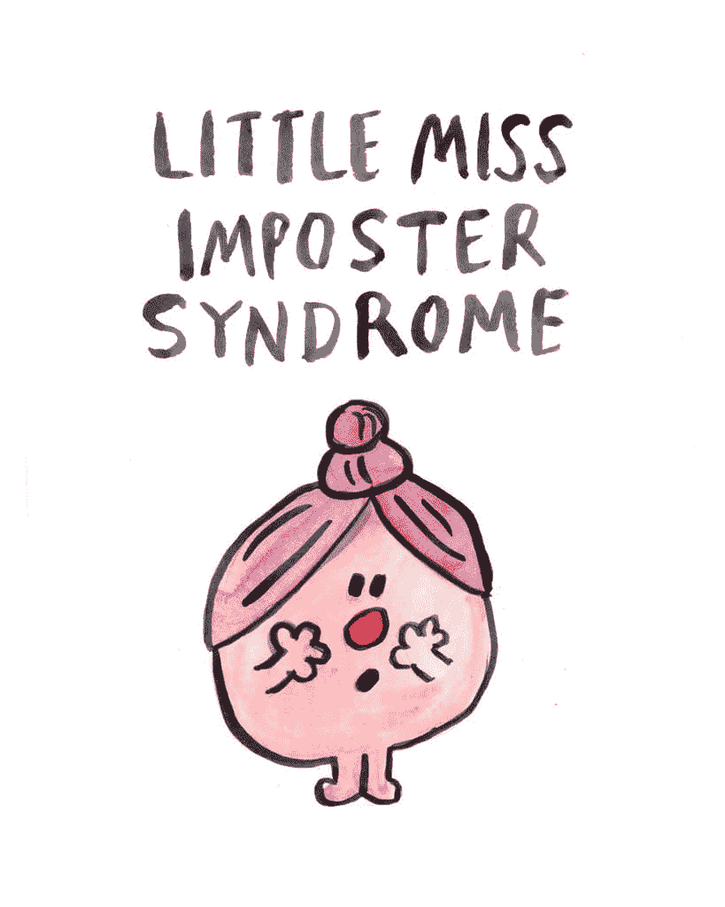
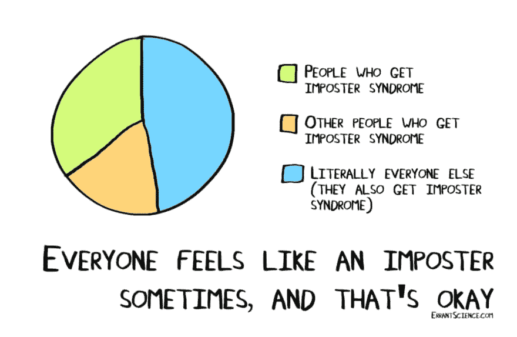

# 如何不让自己感觉像个冒名顶替者

> 原文：<https://dev.to/shubheksha/how-to-not-feel-like-an-imposter-1ooj>

这原本是我的时事通讯“[生命可靠性工程](https://tinyletter.com/ScribblingOn)”的一个问题，然而我认为它应该作为一篇博客文章拥有自己的空间。

 

<figcaption>[功劳](https://www.etsy.com/listing/539166512/funny-print-little-miss-imposter)</figcaption>

你有没有过这样的感觉，你不知道你在做什么，每个人都会发现你是一个彻头彻尾的骗子，你设法让每个人相信你很聪明，知道你在做什么？欢迎加入俱乐部，我的朋友！你患有冒名顶替综合症，你是我们中的一员！耶！🎉

我不认为说我们中最优秀的人患有冒名顶替综合症是夸张的。在这一点上，我开始相信这是人类条件的一部分，尤其是如果你在任何创造性的领域工作。如果有人声称他们没有患上冒名顶替综合症，他们可能太自负而不愿承认。你知道吗？**受点苦也没事。**

 

<figcaption>[功劳](https://astrobites.org/2018/03/02/overcoming-the-imposter-syndrome/)</figcaption>

多年来，我一直患有严重的冒名顶替综合症，所以我想谈谈我试图驯服它的一些方法，以及它如何帮助我成为一个更好的人和工程师。

#### **把你的成就写下来**

我甚至不能开始强调这对我有多大的帮助。当你觉得自己是个骗子时，有一份方便的有形职业成就清单可以参考，这能创造奇迹。写下你的成就——或大或小——你引以为豪的事情，你认为自己做不到但还是做了的事情等等。在会议上发言？拿到奖学金了？开始了新的工作？上班的时候运过东西？都写下来！

当你感觉糟透了的时候，回头看看它，试着提醒自己，如果你是个彻头彻尾的骗子，你一开始就不可能完成这一切。请记住，它仅仅在你的脑海中是不够的，因为当它处于冒名顶替模式时，你的大脑不会足够快地重新调用它，所以把它写下来很重要。

#### **接受并陶醉于自己不是世界上最聪明的人的事实**

(旁注:如何，如果有的话，你可以衡量这一点，它甚至意味着什么？？？？)我想每个人对此都有自己的时间表，但最终接受它，坦率地说，是如此令人宽慰。而且有积极的副作用！我几乎一直在努力和比我聪明的人一起工作，接受这一点让我学得更好(甚至更多！)从他们那里！不要成为那种总是试图通过贬低别人来证明自己是房间里最聪明的人的人。没人喜欢那个人。保持谦逊并准备向他人学习有助于你更好更快地成长，也能让你成为一个好同事。

#### **和认可你工作和价值的人在一起**

这是一个偶然的机会，因为在你真正做这件事之前，你不会真正意识到这件事的重要性。剧透预警:很神奇。周围的人(朋友/同事/社区)认可和/或奖励你的工作，并不时向你保证你带来的一切，这是你能为自己做的最好的事情之一。真的很难夸大这有多大的区别。在这方面投入时间。很难找到这些人，但是一旦你找到了，一定要和他们在一起。

#### **每个人擅长不同的事情，这不是零和游戏**

这一点与第二点有点不太相关，但仍然值得拥有自己的空间。不存在擅长所有事情的超人。那根本不可能。不同的人有不同的专业领域，这是一件非常好的事情！它让我们所有人都可以互相学习，平衡彼此。也许你的优点是某人的缺点，反之亦然。别人擅长你不擅长的领域并不会从你身上带走任何东西。如果有的话，这给了你一个从他们身上学习和提高的机会。承认并庆祝这一点。

#### **不要和比你经验丰富的人比较**

把自己和已经相处了很长时间的人比较，有点像把苹果和橙子比较。这是一个灾难的处方，不要这样做。这是个坏主意。如果你是一个刚刚起步的人，拿自己和已经有十年职业生涯的人比较，那么当然，他们会比你做得更好！仅仅因为他们存在的时间比你长得多！当然，他们比你付出了更多的努力，建立了坚实的网络，在重大会议上发言等等！(我并不是说每个人都这样做，而是简单地挑选人们倾向于衡量自己的最常见的参数)。这在你开始做之前就已经注定了。每当你开始这样做时，后退一步，停下来想一想:这是一个有效的比较吗？我需要和任何人比较吗？我对自己的现状满意吗？因为这才是最重要的，你知道。

#### **意识到这是浪费时间和精力**

我坚信健康的自省，但通常情况下，这并不健康。当该说的都说了，该做的都做了，纠结于此并不能给你带来什么。大多数情况下，没有具体的收获，你最终会感到痛苦和沮丧，感觉自己像个骗子，无论你做了多少，都永远不够。你不需要也不应该有这种感觉。遵循这种思路可能不是对你时间的一种很好的利用，因为它并不能真正帮助你解决任何问题。你的时间可以更好地用来做或思考一些更有意义和更可行的事情。承认这一点至少可以帮助你不陷入“思考的兔子洞”。

我可以没完没了地继续写这个话题，因为这些年来我一直在与很多事情做斗争，我知道这场斗争不会在任何时候结束(或者可能永远不会结束！).所以，现在，我一直在努力想办法解决这个问题，这样我就不会浪费时间在这上面，而是把我的精力投入到成为最好的软件工程师上。💪🏼到目前为止，效果还不错。这是一个很长的帖子，但我真诚地希望这也能帮助你处理随机发作的冒名顶替综合症。✨

* * *