# 如何搭建现场观众投票和投票 App

> 原文：<https://dev.to/coda/how-to-build-a-live-audience-polling-and-voting-app-42o4>

**情景**:你正在参加团队会议或全体会议，主要发言人结束了他们的发言。他们允许提问…还有蟋蟀。你想到了一个问题，但不想成为第一个举手的人，因为你不确定这个问题是否与房间里的每个人都相关(加上在一大群观众面前说话很伤脑筋)。有人终于举起了手，而这个人*显然*没有阅读上周的备忘录，这本来可以回答他们的问题。

这听起来像是你的团队会议、全体会议、市政厅会议或大会吗？

<figure>[](https://res.cloudinary.com/practicaldev/image/fetch/s--1tMwy7Xj--/c_limit%2Cf_auto%2Cfl_progressive%2Cq_66%2Cw_880/https://cdn-images-1.medium.com/max/466/1%2ACHw9J-q6VFXwCHUFYzpBPA.gif) 

<figcaption>*信用:期限*</figcaption>

</figure>

### 当前解决方案为 Q & A 和观众投票

<figure>[](https://res.cloudinary.com/practicaldev/image/fetch/s--0e9jUN-c--/c_limit%2Cf_auto%2Cfl_progressive%2Cq_auto%2Cw_880/https://cdn-images-1.medium.com/max/480/1%2AxbHMuJivTF7hmqMZLgODiQ.jpeg) 

<figcaption>信用:到处投票</figcaption>

</figure>

如果你发现自己处于上述情况(无论是作为演讲者还是作为观众)，你可能会对这个过程的低效感到沮丧。如果你有一个长达一小时的演示，并在最后留出 10 分钟用于问答，你不想最好地利用这段时间，首先回答最重要的问题吗？

一些公司已经为此开发了应用程序和解决方案。以下是该领域的一些公司:

*   [随处投票](https://www.polleverywhere.com/)(可能是观众投票软件的鼻祖)
*   [VoxVote](http://www.voxvote.com/)
*   [Slido](https://www.sli.do/)

这些应用程序提供的一些功能:

*   向您的团队或公司众包问题
*   在会议前或会议期间投票支持热门问题
*   发短信回答幻灯片上提出的问题(以便实时了解观众的想法)
*   在 PowerPoint 或网站中嵌入问题

如果您想要一个超级简单的应用程序，让您的团队编写问题并为对他们重要的问题投票，该怎么办？你不需要那些打包软件的花里胡哨，你可能一个月只使用一次(全员)，或者一年一次(年度销售会议)。在 Coda 内部，我们称这位医生为“多莉”,改编自《T2:海底总动员》中问了很多问题的角色多莉🐠 :).

下面我将带你了解如何在 Coda 中构建一个问答投票文档。

*如果你想直接跳到模板，这里是***的链接。你也可以观看下面的视频，了解如何构建 doc* 。*

 *[https://www.youtube.com/embed/u9YCRj2Nd4A](https://www.youtube.com/embed/u9YCRj2Nd4A)

### 只是一张桌子

说真的，整个 app 就是一个表。下面是最终输出的样子:

[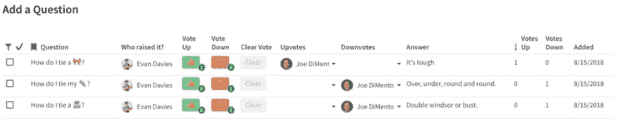](https://res.cloudinary.com/practicaldev/image/fetch/s--K6nIb5ph--/c_limit%2Cf_auto%2Cfl_progressive%2Cq_auto%2Cw_880/https://cdn-images-1.medium.com/max/1024/1%2A4UCGuY_Y0vEg3o6Y1FGiPA.png)

当您的团队向此表中添加问题时，其他团队成员可以在“向上投票”列中为他们喜欢的问题投票，并在“向下投票”列中为不相关的问题投票。让我们从这个表格的基本内容和典型的工作流程开始，你会在之前看到*，在*期间看到*，在*会议之后看到*。*

### 问答

让我们首先创建一个包含 3 列的表:

*   检验盒
*   问题
*   回答

[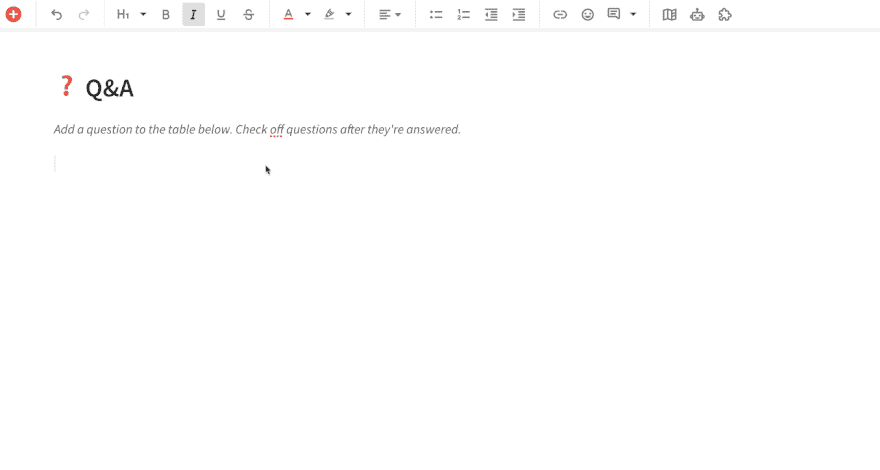](https://res.cloudinary.com/practicaldev/image/fetch/s--Ky2h6iAK--/c_limit%2Cf_auto%2Cfl_progressive%2Cq_66%2Cw_880/https://cdn-images-1.medium.com/max/1024/1%2A_s3j2TN6tizcLE5XYPTcWQ.gif)

您需要复选框[列类型](https://help.coda.io/organizing-your-doc/formatting-options-for-your-doc/overview-of-column-formats)的第一列的原因是，一旦问题在会议中得到回答，您就可以标记这些问题。在接下来的步骤中，我们将设置一个过滤器，从主表中删除所有已回答的问题，并将它们保存在文档的存档部分。

问答的*工作流程*是什么样子的？

**会前:**

也许在会议前一天或一小时，你可以发出文档，让人们通过点击表格底部的加号将问题添加到主表格中，并让他们在问题栏中写下他们的问题。如果问题可能已经在以前的会议中回答过(或者答案在电子邮件或时差消息中)，会议所有者可以提前在“答案”栏中插入答案，或者提供指向包含答案的资源的链接。

**会议期间:**

您的团队可以在会议期间继续提出问题。假设允许使用手机和笔记本电脑，演讲者可能会根据他或她的演讲引发听众的问题。投票也是实时进行的，因为人们可以看到表格中记录的问题。在我们的会议中，一旦问答时间开始，我们会给观众一分钟左右的时间，让他们就自己最喜欢的问题进行投票，然后让演讲者回答最热门的问题。

到目前为止一切顺利。你可能在想:*我可以在 Google Sheets 中完成这项工作，因为 Google Sheets 允许多个团队成员进行实时编辑*。请继续阅读。

### 使用公式和按钮实现自动化

在主问题表中，我们还为提出问题的人提供了一个列。如果你在谷歌表单中，你必须在单元格中手动输入你的名字，以表明你问了这个问题。通过对表中的这个列使用这个公式，这个列将预先填充向表中添加一行的用户:

```
=thisRow.CreatedBy() 
```

[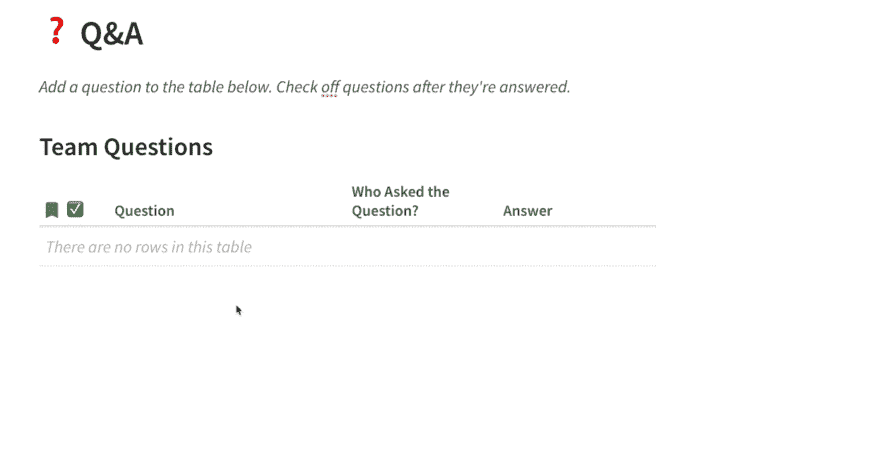](https://res.cloudinary.com/practicaldev/image/fetch/s--HAmrbghy--/c_limit%2Cf_auto%2Cfl_progressive%2Cq_66%2Cw_880/https://cdn-images-1.medium.com/max/1024/1%2Ao9tndEbCRFeWp13eowvsPQ.gif)

谁问的问题？column 是 People 列类型，显示您团队中人员的头像。现在，让我们再添加两列来记录对某个问题投赞成票或反对票的人:

[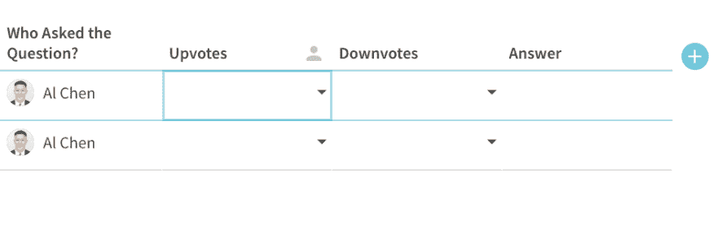](https://res.cloudinary.com/practicaldev/image/fetch/s--44wOqFXX--/c_limit%2Cf_auto%2Cfl_progressive%2Cq_66%2Cw_880/https://cdn-images-1.medium.com/max/949/1%2ACOiTudERaM9Av9v0dNpTKQ.gif)

Upvotes 和 Downvotes 也是 People 列类型，因为这些列将包含团队中投票赞成/投票反对的人。您还需要确保“允许多重选择”开关处于打开状态，以便多个人可以显示在“向上投票”或“向下投票”列中:

[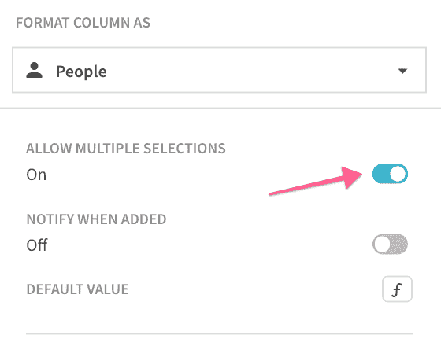](https://res.cloudinary.com/practicaldev/image/fetch/s--9x-gtqR1--/c_limit%2Cf_auto%2Cfl_progressive%2Cq_auto%2Cw_880/https://cdn-images-1.medium.com/max/560/1%2ALAjW0xGJnbXOSlpPW97ySg.png)

现在是有趣的部分，添加按钮！[按钮](https://help.coda.io/controls/creating-workflows-with-buttons)让你的桌子更具互动性，是把你的文档变成应用的核心构件。首先添加带有[按钮列格式](https://help.coda.io/controls/creating-workflows-with-buttons#the-button-column-format)的列:

[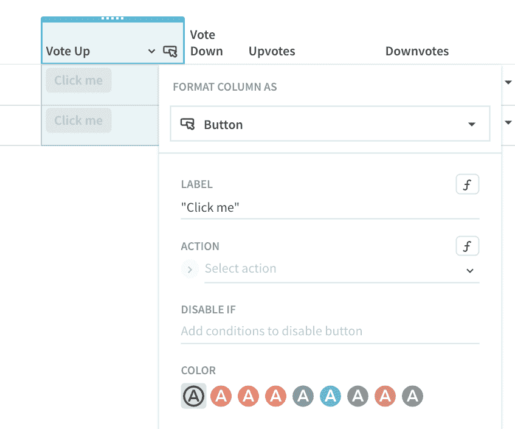](https://res.cloudinary.com/practicaldev/image/fetch/s--u7T_r8mZ--/c_limit%2Cf_auto%2Cfl_progressive%2Cq_auto%2Cw_880/https://cdn-images-1.medium.com/max/847/1%2AvcLqwwgML1xupSyJUVbhWw.png)

在我们编写按钮公式之前，让我们让我们的按钮看起来更加用户友好。我喜欢竖起大拇指👍向上投票按钮和拇指向下的表情符号👎否决按钮的表情符号。我分别为按钮使用绿色和红色背景:

[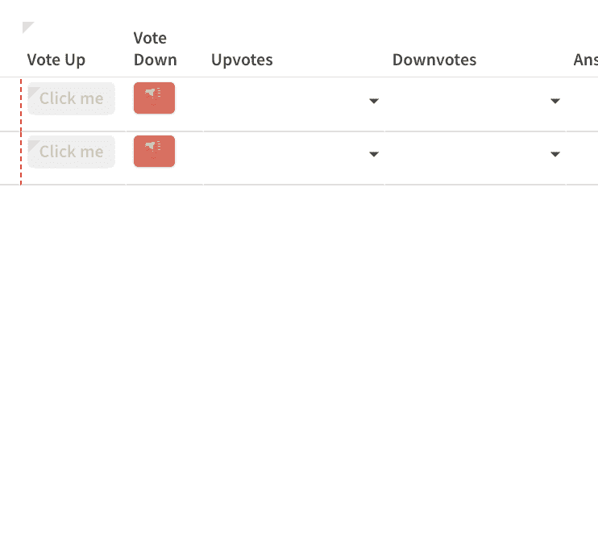](https://res.cloudinary.com/practicaldev/image/fetch/s--ybuBJgBy--/c_limit%2Cf_auto%2Cfl_progressive%2Cq_66%2Cw_880/https://cdn-images-1.medium.com/max/742/1%2A-mSTUSGdn75Q1XNB0qjeCg.gif)

现在我们需要用正确的公式来配置按钮，这样它们就能真正说明谁对一个问题投了赞成票和反对票。这可能是让您的文档正常运行所必须编写的最“复杂”的公式！

[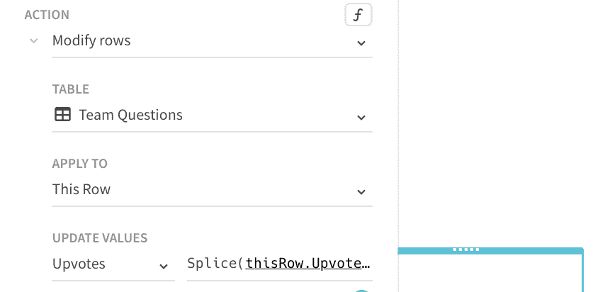](https://res.cloudinary.com/practicaldev/image/fetch/s--eJKSui3G--/c_limit%2Cf_auto%2Cfl_progressive%2Cq_66%2Cw_880/https://cdn-images-1.medium.com/max/837/1%2AlQNc-Jkk-_JyMTkB7wySAQ.gif)

在包含“向上投票”按钮的“向上投票”列中，当按钮被按下时，您将*修改当前行*。您可以通过编写以下公式来修改 Upvotes 列:

```
=Splice(thisRow.Upvotes,0,0,User()) 
```

[拼接](https://coda.io/formulas#Splice)公式通常用于当您想要将一些值插入到一个列表中，但也要替换该列表中的项目时。在此公式中:

*   这一排。Upvotes 是我们的价值观列表
*   第一个“0”是我们想要开始插入新值的地方
*   第二个“0”是我们想要用*替换*列表中的多少个值
*   User()是我们想要插入列表中的内容

当所有这些都完成后，这个公式所做的就是将当前用户(您的正在点击“向上投票”按钮的队友)添加到“向上投票”列，这样该列将有一个所有点击“向上投票”按钮的人的累积列表！使用此公式不会删除值。在下面的 gif 中，你会看到当我点击“向上投票”按钮时，我被添加到了“向上投票”列:

[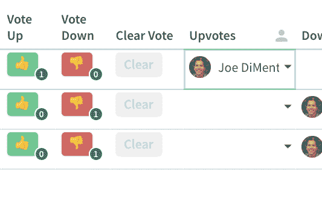](https://res.cloudinary.com/practicaldev/image/fetch/s--9gA1p1Jd--/c_limit%2Cf_auto%2Cfl_progressive%2Cq_66%2Cw_880/https://cdn-images-1.medium.com/max/533/1%2AVdL3fbx3HjyDOiU-kfa8zA.gif)

让这个投票文档更加用户友好的其他一些事情:

### **当有人投票或反对票时禁用按钮**

[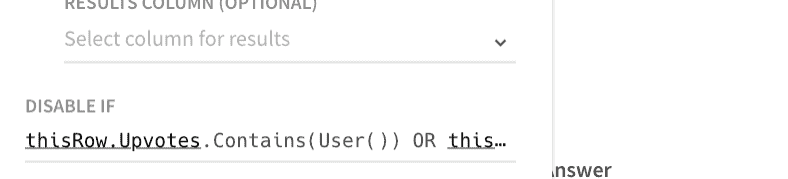](https://res.cloudinary.com/practicaldev/image/fetch/s--TXW4oC6a--/c_limit%2Cf_auto%2Cfl_progressive%2Cq_66%2Cw_880/https://cdn-images-1.medium.com/max/788/1%2ALwYqe0eQXOUg483R452iVw.gif)

该公式主要是查看当前用户是在 Upvotes 还是 Downvotes 列中。如果是，则禁用按钮:

```
=thisRow.Upvotes.Contains(User()) OR thisRow.Downvotes.Contains(User()) 
```

### **徽章上的按钮**

[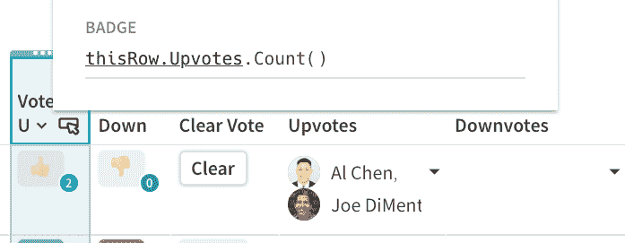](https://res.cloudinary.com/practicaldev/image/fetch/s--pFGBX0JK--/c_limit%2Cf_auto%2Cfl_progressive%2Cq_auto%2Cw_880/https://cdn-images-1.medium.com/max/697/1%2AY75C5iUL8XGXIXm6y6LxkQ.png)

在按钮的右上角，您可以显示对该问题投赞成票或反对票的人数。将以下公式放在按钮“
上的“徽章”表单中

```
=thisRow.Upvotes.Count() 
```

### **清除按钮**

在我们的投票文件中，我们只让这个人对一个问题投赞成票或反对票一次。如果那个人想“清除”他们的投票并改变他们的投票，有一个清除按钮可以很容易地删除他们当前的投票。

[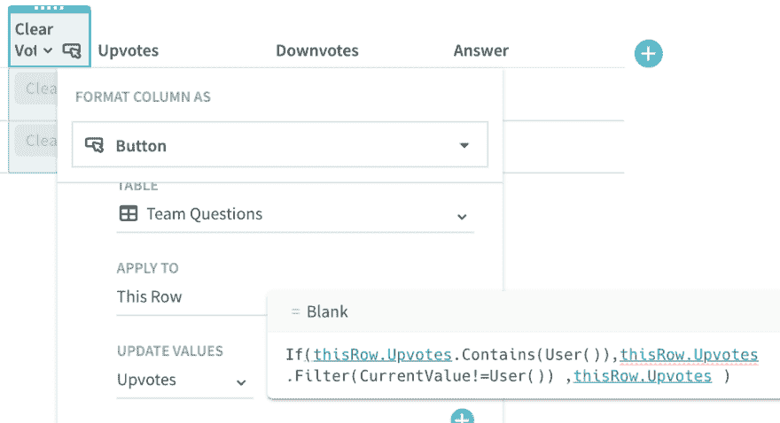](https://res.cloudinary.com/practicaldev/image/fetch/s--DuMhqVYy--/c_limit%2Cf_auto%2Cfl_progressive%2Cq_auto%2Cw_880/https://cdn-images-1.medium.com/max/986/1%2AmOzWycO6vcm_RRGhC7-K4Q.png)

这个按钮上的公式稍微复杂一点。您还在*修改当前行*，公式在 Upvotes 列中查找当前用户。如果找到当前用户，它将使用条件 CurrentValue！=用户()。

您也可以使用[而非](https://coda.io/formulas#Not)公式禁用清除按钮:

[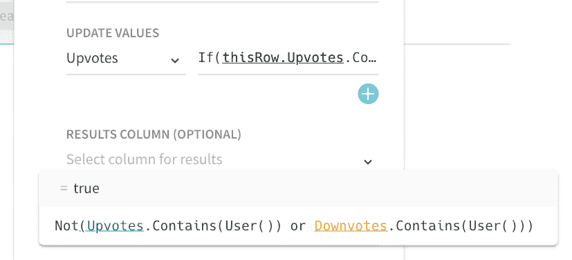](https://res.cloudinary.com/practicaldev/image/fetch/s--lzzs5qhq--/c_limit%2Cf_auto%2Cfl_progressive%2Cq_auto%2Cw_880/https://cdn-images-1.medium.com/max/827/1%2AUjF8iJLyByDqcN8ZDcmOhw.png)

我们只想在当前投票者是*而不是*时禁用 Clear 按钮，该投票者在 Upvotes 或 Downvotes 列中。如果你没有在第一时间投票，取消你的投票是没有意义的！

### 看到投票动作

假设您按照上面的步骤让“向上投票”按钮工作，对“向下投票”按钮做同样的事情，但是将“向上投票”列被提到的位置换成“向下投票”列。这是我们的小投票医生:

[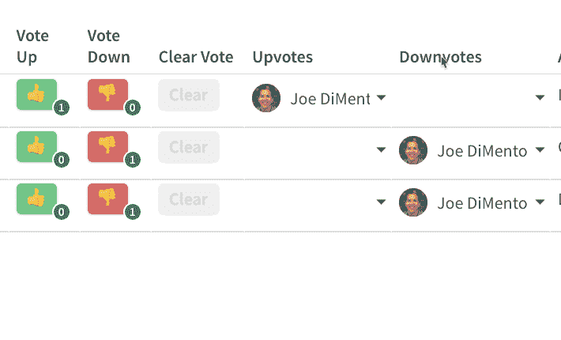](https://res.cloudinary.com/practicaldev/image/fetch/s--1uTQqg0O--/c_limit%2Cf_auto%2Cfl_progressive%2Cq_66%2Cw_880/https://cdn-images-1.medium.com/max/710/1%2ABDLnQKJ6wIM8RgQxsLZi3g.gif)

### 排序问题

这个投票文件最重要的部分之一是确保获得最多投票的问题排在列表的最前面。在表格中添加两列:向上投票和向下投票，分别计算向上投票和向下投票列中的人数:

[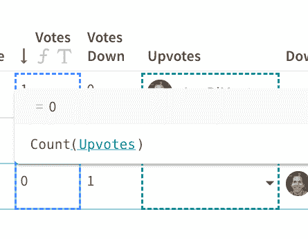](https://res.cloudinary.com/practicaldev/image/fetch/s--JkKaXMs6--/c_limit%2Cf_auto%2Cfl_progressive%2Cq_auto%2Cw_880/https://cdn-images-1.medium.com/max/445/1%2AYFDPt-IFwrq-26nOcKuMVQ.png)

[Count](https://coda.io/formulas#Count) 公式是 Coda 中最强大的公式之一，因为它可以计算列表中的项目数或表格中的行数。更重要的是，票数上升栏是按照*下降*的顺序排列的。这意味着，当人们对一个问题投赞成票时，表格会根据投票数栏实时自动排序。在 Google Sheets 中，每当有人对某个问题投票时，你都必须对列表进行重新排序。如果你有一个 100 人的团队，这会变得很麻烦。这是实时投票和排序的样子。埃文提出的第三个问题(“我怎样才能把 a👔?")目前为止只有一票。在我投票后，它会上升到表格中的第二个位置:

[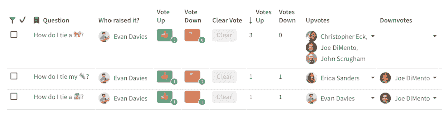](https://res.cloudinary.com/practicaldev/image/fetch/s--rf8RNcip--/c_limit%2Cf_auto%2Cfl_progressive%2Cq_66%2Cw_880/https://cdn-images-1.medium.com/max/1024/1%2Ae7uY0FxgZcNJV90Aclww3Q.gif)

### 按日期或完成时间过滤问题

您已经看到了这个小小的投票文档是如何基本上取代现场投票或投票应用程序的。虽然这对于单独的会议非常有用，但是如果需要，您可以向此文档添加更多功能。如果您一个月召开多个团队会议，您可能希望添加一个日期列。这类似于谁问的问题？专栏。我们不使用 CreatedBy()公式，而是使用 Created():

[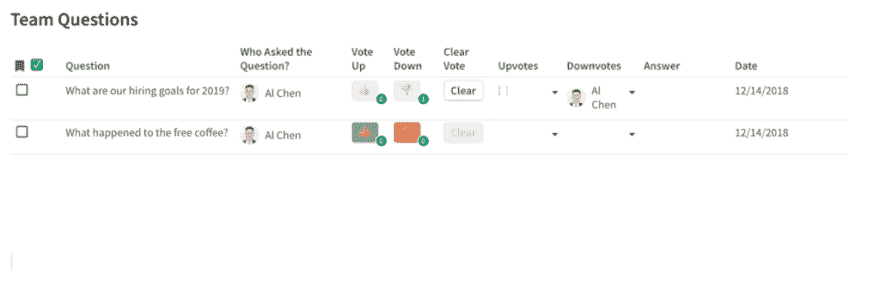](https://res.cloudinary.com/practicaldev/image/fetch/s--yitQfBub--/c_limit%2Cf_auto%2Cfl_progressive%2Cq_66%2Cw_880/https://cdn-images-1.medium.com/max/1024/1%2AeuEadOjEe5_S6Cpp6qw6Vw.gif)

您可能希望拥有此栏的原因是为了根据某个会议日期筛选问题列表。您不想看到以前会议的任何问题，因此这是一种快速筛选过去问题的方法。

我们还没有过多地谈到复选框列✅.

在问答过程中，当发言人回答文档中的问题时，会议所有者可以单击复选框来表示问题已经得到回答。该表可以有一个过滤器，只过滤掉表中已被选中的行:

[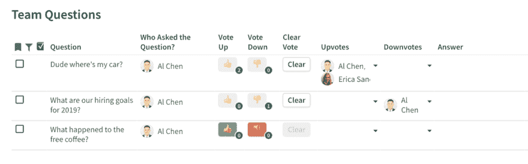](https://res.cloudinary.com/practicaldev/image/fetch/s--qcJ-QqEd--/c_limit%2Cf_auto%2Cfl_progressive%2Cq_66%2Cw_880/https://cdn-images-1.medium.com/max/1024/1%2A89VagEpkXB73qhwTAVKb6Q.gif)

我的表上的[过滤器](https://help.coda.io/formulas/filtering-your-tables)只是寻找复选标记列为假的行:

```
[✅]=false 
```

在[模板](https://coda.io/t/All-Hands-Meeting-Q-A-Tracker-aka-Dory_tRlEOimN6EU)中，有一个“所有过去的问题”部分，包含主问题表的*视图*。此视图显示所有复选标记列为真的问题，因此您可以查看所有已回答问题的存档。

### 在手机上为问题投票

我在文章开头提到的许多实时投票软件都让你的团队或观众在移动应用程序的帮助下轻松投票。就使观众“容易”而言，这可能意味着简单地浏览到允许观众成员投票的特定链接。在最糟糕的情况下，团队成员必须下载一个定制的应用程序，并输入一个代码来访问调查或投票。

有了这个投票文档，你的团队成员只需要分享这个文档，它就像一个应用程序一样呈现在你的手机上。在下面的 gif 图中，你可以在问题上滑动，进行向上投票、向下投票或访问其他选项，使体验更像应用程序:

[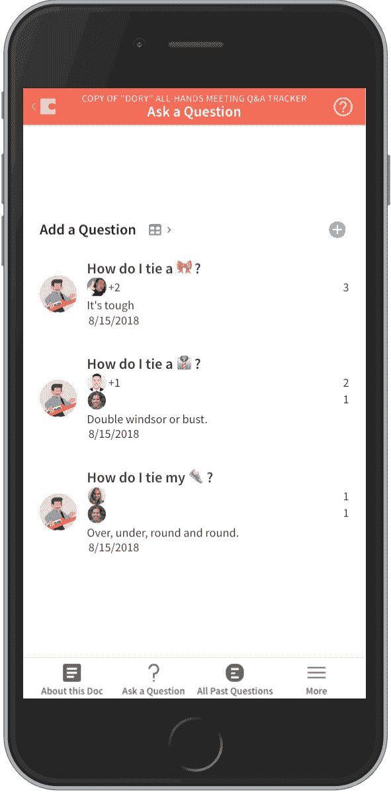](https://res.cloudinary.com/practicaldev/image/fetch/s--hSETeNvl--/c_limit%2Cf_auto%2Cfl_progressive%2Cq_66%2Cw_880/https://cdn-images-1.medium.com/max/591/1%2A6W0WnKwmSpwJzR5zQSlmEg.gif)

### 不再尴尬问&答

<figure>[](https://res.cloudinary.com/practicaldev/image/fetch/s--U6vWG15S--/c_limit%2Cf_auto%2Cfl_progressive%2Cq_66%2Cw_880/https://cdn-images-1.medium.com/max/244/1%2AlyTSpgpJ9LC51Pz2gjJSmQ.gif) 

<figcaption>贷方:期限</figcaption>

</figure>

不用再等着举手问你自上次全能以来一直想问的问题了。不再怀疑你的问题是否与观众相关。相同的问题以不同的方式提出，不会再有混淆。不再怀疑这个问题是否在之前的会议上被问过。

本教程向您展示了如何用一个简单的表格和几个公式构建自己的现场观众问答、投票和投票文档。一切都从一张空白的画布开始。

> 在画布上寻找自由。

* * **