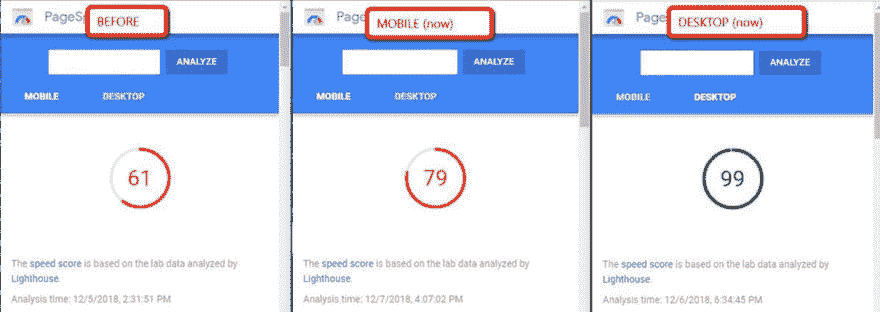

# 与 Google PageSpeed 战斗后我学到的三件事

> 原文：<https://dev.to/snowleo208/three-things-i-learn-after-fighting-with-google-pagespeed-3jk9>

最近，我有机会维护一个登陆页面，它有一个新的设计，但加载性能问题和转换相比旧页面下降了很多。

我学到的是这些:

1.  优化图像(压缩/延迟加载)
2.  优化 CSS/JS 加载([关键路径渲染](https://developers.google.com/web/fundamentals/performance/critical-rendering-path/)
3.  代码拆分

* * *

## 1。优化图像

图像是最容易修复的东西，也是加载速度的首要因素。重要的是使用像 [TinyJPG](https://tinyjpg.com/) 这样的图像压缩来压缩图像，最小化页面大小并将图像设置为渐进图像。

如果你的电脑上有 Imagemagick，你可以尝试将图像变成渐进图像

```
for i in ./*.jpg; do convert -strip -interlace Plane $i $i; done 
```

此外，有必要使用**惰性加载**来防止加载不需要的图像，这是在屏幕之外。

* * *

## 2。优化 CSS/JS 加载

### CSS

Pagespeed 有一个叫做[“优化 CSS 交付”](https://developers.google.com/speed/docs/insights/OptimizeCSSDelivery)的规则，这意味着任何不包括在第一次渲染中的东西(即在屏幕之外)，它会阻碍渲染速度。

为了推迟屏幕外 CSS 的加载，我们可以使用 Google 的[片段，并把它放在 body 标签的末尾:](https://developers.google.com/speed/docs/insights/OptimizeCSSDelivery) 

```
<noscript id="deferred-styles">
      <link rel="stylesheet" type="text/css" href="<your-css-file>.css"/>
    </noscript>
    <script>
      var loadDeferredStyles = function() {
        var addStylesNode = document.getElementById("deferred-styles");
        var replacement = document.createElement("div");
        replacement.innerHTML = addStylesNode.textContent;
        document.body.appendChild(replacement)
        addStylesNode.parentElement.removeChild(addStylesNode);
      };
      var raf = window.requestAnimationFrame || window.mozRequestAnimationFrame ||
          window.webkitRequestAnimationFrame || window.msRequestAnimationFrame;
      if (raf) raf(function() { window.setTimeout(loadDeferredStyles, 0); });
      else window.addEventListener('load', loadDeferredStyles);
</script> 
```

此外，我们需要将关键的 CSS(即在 viewport 中)内联到`<head>`中。比如:

```
<head>
    <style>
      .blue{color:blue;}
    </style>
</head> 
```

### JavaScript

对于 JS，你可以尝试把`defer`、`async`或者异步注入脚本到网页中，比如:

```
const script = document.createElement('script');
script.src = "//example.com/widget.js";
document.getElementsByTagName('head')[0].appendChild(script); 
```

对于屏幕外函数，您可以将该属性设置为“defer”并将**放在主体**的末尾，这意味着它将在整个页面呈现后加载。比如:

```
 <!--preload js for important func-->
<link rel="preload" href="script.js" as="script"> 

<!--load after rendered-->
<script src="script.js" defer></script>

<!--will load asynchronously-->
<script src="script.js" async></script> 
```

有一些工具可以帮助你自动添加内联 CSS，比如 gulp 的 [gulp-inline-source](https://www.npmjs.com/package/gulp-inline-source) 或者 webpack 的 [critters](https://github.com/GoogleChromeLabs/critters) 。

* * *

## 3。代码分割

如果脚本不是关键的，会损害你的屏幕功能(比如固定菜单)，你可以把它们分成几个文件，然后在需要的时候加载。对于 webpack 或 React，可以使用 [webpack](https://webpack.js.org/guides/code-splitting/) 中的“代码拆分”功能。

对于 React，使用新的 [lazy](https://reactjs.org/blog/2018/10/23/react-v-16-6.html) 或[React-loaded](https://github.com/jamiebuilds/react-loadable)更加容易。

记得删除或修剪页面中不必要的代码，并向用户提供最小化的版本！

### 结果

[](https://res.cloudinary.com/practicaldev/image/fetch/s--2MP6HnGo--/c_limit%2Cf_auto%2Cfl_progressive%2Cq_auto%2Cw_880/https://thepracticaldev.s3.amazonaws.com/i/j4iefssblocnoun2spxg.jpg)

该页面最终在手机上获得了近 80 分，在桌面版上也接近完美。它不是很完美，因为移动的分数肯定有提高的空间。

你对此有什么想法吗？欢迎让我知道你的见解！:)