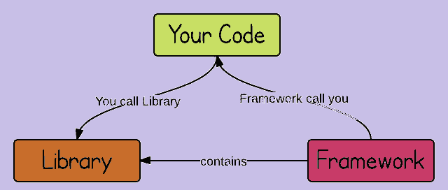

# 库 vs 框架

> 原文：<https://dev.to/lmolivera/library-vs-framework-3bgo>

前几天在办公室，一位同事找到我，问我对 Bootstrap 有什么看法。在过去的五个月里，我一直在学习现代 Web 开发，他想知道他应该说 Bootstrap 是一个框架还是一个库。这个问题让我措手不及，因为我知道我不理解库和框架之间的区别。

我是一个初级开发人员，所以我希望我能研究这个问题，以做出正确的回答。我非常确定 dev.to 中还有其他的低年级学生可能不知道答案。我会试着告诉你我从中学到了什么。

### 什么是库？

*   [Source](https://www.quora.com/What-does-library-mean-in-the-case-of-programming-languages) :库是一组以前编写的代码，在构建自己的代码时可以调用。这是以前由别人做的工作，你现在可以利用，而不必自己做。
*   [来源](https://www.webopedia.com/TERM/L/library.html):在编程中，库是一个程序可以使用的预编译例程的集合。例程，有时称为模块，以对象格式存储。库对于存储经常使用的例程特别有用，因为您不需要显式地将它们链接到每个使用它们的程序。
*   总而言之:库是你经常使用的代码的集合。需要的话可以直接调用代码。
*   [一些知名的 Javascript 库](https://en.wikipedia.org/wiki/Comparison_of_JavaScript_frameworks) : jQuery，D3.js，React。

### 什么是框架？

*   要理解框架，你首先需要理解库。库是一堆代码，通过实现你想要的功能，可以节省你的时间。您可以为适当的工作调用适当的库，库会为您完成工作。你不需要知道函数库内部的函数是如何工作的。你只需要知道如何打电话给他们。另一方面，框架在某种程度上就像库一样，它们使你的工作更容易，但是你不能像库一样调用框架。如果你想使用框架，你必须学习框架，因为在这种情况下，框架调用你的代码，而不是相反。所以你需要学习这个框架是如何工作的，以及其中的所有概念。简单来说，你可以调用库，而框架调用你的代码。
*   库提供了被其父代码调用的函数，而框架定义了整个应用程序设计。开发人员不调用框架；相反，是框架以某种特定的方式调用和使用代码。
*   软件框架是一个通用的、可重复使用的软件环境，它提供特定的功能作为一个更大的软件平台的一部分，以促进软件应用程序、产品和解决方案的开发。软件框架可以包括支持程序、编译器、代码库、工具集和应用编程接口(API ),它们将所有不同的组件集合在一起，以实现项目或系统的开发。
*   某种程度上来说:框架定义了你的应用程序将如何被构建，它决定何时调用代码，并且它可以包含库，如果需要的话可以使用这些库。
*   [一些知名的 Javascript 框架](https://en.wikipedia.org/wiki/Comparison_of_JavaScript_frameworks) : AngularJS，Backbone.js，Vue.js。

### 包装好一切

来源:如果我们使用架构的比喻，库就是砖块，框架就是框架。

### 那么 Bootstrap 是什么呢？

在 [FreeCodeCamp 课程](https://learn.freecodecamp.org)中，Bootstrap 出现在“前端库认证”部分。但是在[的官方文档中](https://getbootstrap.com/docs/4.0/getting-started/introduction/)说 Bootstrap 是一个框架。我显然不是专家，但是如果我必须选择的话，我会根据官方文档来指导我。Bootstrap 是一个 CSS 框架。

### 你怎么看？

我已经告诉你了，我是大三学生。这篇文章正确吗？还是它有不正确的信息？

*感谢您的阅读。别忘了在 dev.to 和 Twitter 上关注我！*