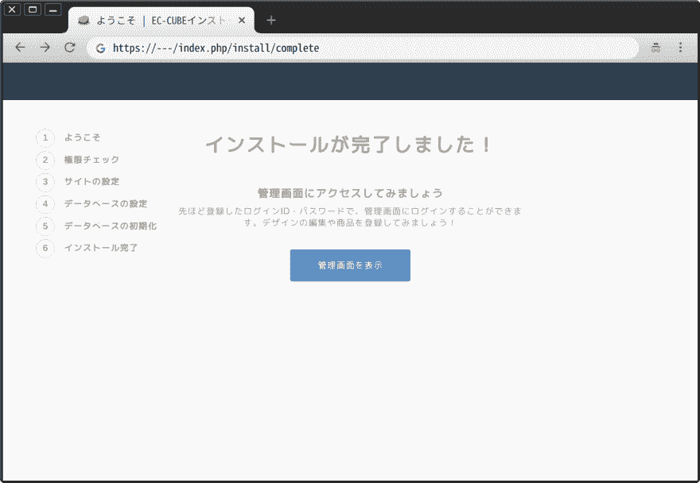

# EC-CUBE 4:“数据库设置”屏幕上出现“Malformed parameter "url " .”错误

> 原文：<https://dev.to/nabbisen/ec-cube-400-malformed-parameter-url-9l6>

[这是从](https://www.ec-cube.net/)[Web 安装程序安装](http://doc4.ec-cube.net/quickstart_install#web%E3%82%A4%E3%83%B3%E3%82%B9%E3%83%88%E3%83%BC%E3%83%A9%E3%83%BC%E3%82%92%E5%88%A9%E7%94%A8%E3%81%97%E3%81%9F%E3%82%A4%E3%83%B3%E3%82%B9%E3%83%88%E3%83%BC%E3%83%AB)EC-CUBE 4.0.0 时的情况。
在“数据库设置”画面中，遇到了令人费解的错误。

* EC-CUBE 团队应对，最新的 4.0.1 版中已经解决。 非常感谢。

也有这样的事情啊……因为印象很深，所以作为备忘录留下。

按下“下一步”时发生“**Malformed parameter "url".** ”(格式不正确的 URL 参数)错误。
很难从错误信息中推测原因。
对于主机名和其他项目，设定了正确的值，重试了几次，但无法消除错误。

原因是**数据库用户的密码中含有" # "**。
" % "或"！" 中所述情节，对概念设计中的量体执行面积分析。

github[symphony/骨架“](https://github.com/symfony/skeleton/issues/40)

> PHP 的 parse_url()函数不认为#符号是有效的，这个问题与 Symfony 无关，而是与 Doctrine DBAL 有关

这样的对话被保留了下来。

如果这里是正确的，则不是追溯到 EC-CUBE 的故障，而是追溯到
[EC-CUBE](https://github.com/EC-CUBE/ec-cube) - >[Symfony](https://github.com/symfony/symfony) - >[文档](https://github.com/doctrine/dbal)

* * *

[EC-CUBE 4.0.0 的](https://github.com/EC-CUBE/ec-cube/issues/3928)开票，进行了[对应](https://github.com/EC-CUBE/ec-cube/commit/bc47887833a631c95f6881a001b600f4a25d8bd7)。

在 4.0.1 中，使用包含" # "的密码现在也可以成功安装