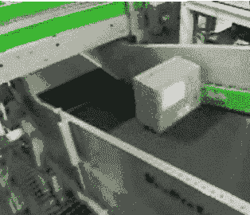

# 一些列表与其他列表不同

> 原文：<https://dev.to/krofdrakula/some-lists-are-not-like-the-others-3h8i>

到目前为止，在本系列中，我们一直将数组作为值的自然容器来处理，这使得我们可以将它们视为一个序列。但是什么是数组呢？是什么让它们滴答作响？让我们来了解一下！

## 冒名顶替，到处冒名顶替

在 JavaScript 中，数组是一种特殊类型的对象，它有一个称为`length`的神奇属性和以`0`开头的整数字符串。一种特殊的语法允许你通过在方括号中指定值的顺序来创建一个数组:

```
const realArray = ['a', 'b', 'c']; 
```

Enter fullscreen mode Exit fullscreen mode

如果您将数组视为 JavaScript 中的任何其他对象，您会注意到您将获得与以下对象大致相同的形状:

```
const fakeArray = {
  '0': 'a',
  '1': 'b',
  '2': 'c',
  length: 3
}; 
```

Enter fullscreen mode Exit fullscreen mode

如果我们遍历这个数组，它会工作得很好。🎵不相信我？求菜！🎵

`const printArray = (name, arr) => { const report = []; for (let i = 0; i < arr.length; i++) report.push(i + " => '" + arr[i] + "'"); console.log(name, '[' + report.join(', ') + ']'); }; const realArray = ['a', 'b', 'c']; const fakeArray = { '0': 'a', '1': 'b', '2': 'c', length: 3 }; printArray('real array', realArray); printArray('fake array', fakeArray);`

[](https://i.giphy.com/media/QiMwnrZNifT7G/giphy.gif)

说到鸭子，这叫做 [*鸭子打字*](https://en.wikipedia.org/wiki/Duck_typing) ，如果你曾经想知道这个术语从何而来或者是什么意思的话。语言使用接口支持各种形式的 duck 类型，这使得松散耦合成为可能，同时仍然强制实施对象形状。

一些 JavaScript 和 DOM 对象也像数组，但不是真正的数组，比如 [`arguments`](https://developer.mozilla.org/en-US/docs/Web/JavaScript/Reference/Functions/arguments) 或 [`NodeList`](https://developer.mozilla.org/en-US/docs/Web/API/NodeList) 。一些库甚至进一步利用了对象的动态特性，为了方便起见，直接将方法附加到数组上(hello， [jQuery](https://jquery.com/) ！).

只要它看起来像一个数组(也像数组一样嘎嘎叫)，任何使用它的代码都不会知道。嗯，至少是使用整数键和`length`来循环属性的代码。它不能与`for...of`、`Array.from()`或价差一起使用，这是我们接下来要解决的问题。

### 迭代器、可迭代对象和`Symbol.iterator`

[](https://i.giphy.com/media/TeinpBGRY5UOc/giphy.gif)

为了改进我们的伪装，我们将实现 JavaScript 所需的 API，以在我们的伪数组上提供迭代能力。为此，我们先来看看什么是**迭代器**。

迭代器是任何带有名为`next()`的方法的对象。当您想从迭代器中获取值时，您可以调用`next()`来获取一个具有两个属性的对象:

*   `value`:序列中的下一个值，
*   一个布尔值，告诉你是否有更多的值要给

考虑到这些需求，让我们构建一个函数来创建一个从 1 数到 5 的迭代器:

`const createIterator = max => { // take an upper bound to count to let count = 1; // set the initial value to 1 const iterator = { // create an object... next() { // ...that has a next() method if (count > max) // if the current value exceeds the upper bound... return { done: true }; // ...tell the caller that there are no more values const value = count; // if not, grab the current value... count += 1; // ...increment the counter... return { // ...and return an object value, // with the current value done: false // and tell the caller we're not done yet }; } }; return iterator; // oh yeah, and give the iterator to the caller. }; const iterator = createIterator(5); console.log(iterator.next()); // 1 console.log(iterator.next()); // 2 console.log(iterator.next()); // 3 console.log(iterator.next()); // 4 console.log(iterator.next()); // 5 console.log(iterator.next()); // no more values!`

好吧，直接使用看起来有点痛苦。您可以编写一个`while()`循环，但是很容易意外地导致一个无限循环或者出现一个错误。我们可以通过创建一个**可迭代的**对象来使它更容易使用。

一个可迭代对象可以在一个`for...of`循环中被`Array.from()`或 spread 操作符使用。

*迭代器*和*可迭代*的区别在于*可迭代*在调用名为`Symbol.iterator`的特殊命名属性时会返回一个*迭代器*。这个词很长，所以让我们一步一步写下来:

`const createIterator = max => { let count = 1; const iterator = { next: () => { if (count > max) return { done: true }; const value = count; count += 1; return { value, done: false }; } }; return iterator; }; const createIterable = max => { // start by taking the upper bound const iterable = { // create an object... [Symbol.iterator]: () => { // ...with a [Symbol.iterator] method... return createIterator(max); // ...that creates and returns an iterator } }; return iterable; // finally, return the iterable }; // create an iterable that can count to three const oneToThree = createIterable(3); // for...of? for (const n of oneToThree) console.log(n); // spreading? console.log([...oneToThree]);`

因此，为了让我们的伪数组变得可迭代，我们必须添加一个返回迭代器的方法:

`const fakeArray = { '0': 'abc', '1': 'def', '2': 'ghi', '3': 'jkl', length: 4, [Symbol.iterator]: () => { // implement the iterable interface let i = 0; // start counting at 0 return { // return an object... next() { // ...with a next() method (the iterator) const value = fakeArray[i]; // get the current value i += 1; // increment the counter return i <= fakeArray.length // if we're not out of bounds yet... ? { value, done: false } // ...give the value back... : { done: true }; // ...else, signal we're done. } }; } }; for (const element of fakeArray) console.log(element); const realArray = [...fakeArray]; console.log(realArray);`

为了让我们的伪数组尽可能地接近真实数组，还需要实现另外三个可迭代的方法:

*   `keys()`:返回数组关键字的 iterable，
*   `values()`:返回数组值的 iterable，
*   `entries()`:返回一个 iterable，该 iterable 返回键值对数组(`[key, value]`)。

我将把它作为一个练习留给读者去实现，连同其他的数组方法，像`map()`、`filter()`、`slice()`等等。

不过，还有最后一件需要注意的事情:你会发现很难欺骗使用`Array.isArray()`和`instanceof Array`来检查数组类型的代码。出于我们的目的，我们只想复制数组的行为，而不是欺骗 JavaScript，让它相信它是一个实际的数组，而实际上它并不是。

## 数组:快速简单的部分

由于数组的构造方式，在某些情况下，某些属性使数组优于其他数据结构。当你需要时，数组是很好的数据结构:

*   列表中已知数量的值，
*   为了保持值的顺序，
*   通过列表中的索引位置直接访问值，
*   一种在列表末尾追加或弹出元素的快速方法。

如果这些属性与您试图解决的问题的需求非常匹配，那么数组就是完美的选择。去使用它们吧！但是特别提到最后一个属性是因为这里有一个你可能没有意识到的基本权衡。让我们来看看为什么会出现这种情况。

## 数组:昂贵的零件

我们的伪数组看起来是这样的:

```
const a = {
  '0': 'first',
  '1': 'second',
  '2': 'third',
  length: 3
}; 
```

Enter fullscreen mode Exit fullscreen mode

向对象追加一个新值需要什么？

```
a['3'] = 'fourth';    // set index 3 to equal the 'fourth' value
a.length = 4;         // update length to 4 
```

Enter fullscreen mode Exit fullscreen mode

数组中有 4 个元素，我们如何弹出最后一个元素？

```
delete a['3'];        // remove index 3
a.length = 3;         // update length to 3 
```

Enter fullscreen mode Exit fullscreen mode

每个操作只需要做两个改变。那么，如果我们决定将第一个元素从数组的开头移开，会怎么样呢？好吧，我们试试:

```
const first = a['0'];  // we take the first element out
a['0'] = a['1'];       // we move the second element into first position ...
a['1'] = a['2'];       // ... the third element into second position...
delete a['3'];         // ... and delete the third element
a.length = 2;          // finally, we update the length to 2

// this is what the array looks like now:
{
  '0': 'second',
  '1': 'third',
  length: 2
} 
```

Enter fullscreen mode Exit fullscreen mode

现在，考虑一下当数组变大时，这在操作数量方面意味着什么。如果我们在数组中有`n`个元素，我们需要执行多少次操作来执行以下每个操作:

*   获取集合中值的数量，
*   从数组中按索引位置获取一个特定值，
*   追加一个值，
*   预先考虑一个值，
*   从数组末尾删除一个值，
*   从数组的开头删除一个值，
*   在数组中搜索值。

让我们一个一个地看。

### `length`

第一种很容易确定；该数组已经存储了一个值，用于保存值的计数:`length`。访问它的花费和访问一个对象属性的花费差不多:

```
a.length; 
```

Enter fullscreen mode Exit fullscreen mode

该操作与数组大小无关，因为我们不必在每次访问该属性时都计算集合的大小，所以让我们为其分配成本 **1** 。

### `[index]`

第二个和第一个差不多；访问 JavaScript 对象上的字符串属性会带来类似于`length`的固定成本，所以让我们指定相同的成本， **1** 。

### `push()`

追加一个值需要两次更新:给一个新的索引赋值和给`length`属性加 1。这使得成本等于 **2** 。

### `pop()`

从数组末尾删除一个值也需要两次更新(删除最后一个索引并从`length`中减去 1)，所以它得到的代价是 **2** 。

### `unshift()`

在数组前面加上一个值有点复杂。对于添加到长度为 **n** 的数组中的每个元素，我们必须:

*   增加现有值的所有索引位置( **n** 操作)
*   将新元素分配到`0`索引( **1** 操作)
*   将`length`增加 1 ( **1** 操作)

把所有的加起来，你得到的总成本是 **n + 2** 。

### `shift()`

从数组的开头删除一个值的开销是相似的。对于从数组 **n** 元素中移除的每个元素:

*   存储第一个元素( **1** 操作)
*   递减剩余值的所有索引位置( **n - 1** 操作)
*   将`length`减 1 ( **1** 操作)

因此，总成本归结为 **n + 1** 。

### `indexOf()`

估计搜索是一个更有趣的问题，因为它取决于三个因素:从哪里开始搜索，迭代索引的方式以及找到的值在哪里。如果我们能够对该值的可能位置进行合理的猜测，我们可能会提高我们的胜算，但假设该值在`n`个指数中具有均匀分布的概率。假设我们从数组的开头开始，我们必须:

*   在当前索引处取值(每个循环花费 **1** 个操作)
*   将引用与选定索引处的值进行比较
    *   如果找到，返回索引
    *   否则，选择下一个索引

在最好的情况下，第一个元素是我们正在寻找的值，所以我们总共有一个 **1** 循环。在最坏的情况下，我们将不得不到达最后一个索引来寻找值，因此成本将是 **n** 。如果我们平均所有可能的场景和它们的成本，我们得到平均 **n / 2** 个操作。

作为参考，如果我们必须一次遍历一个项目集合，而不跳过序列中的任何元素，以确保找到该元素，这被称为*线性搜索*。这一点以后会很重要。

### 期末成本表

那么，我们再来分解一下成本:

```
| Array method | Cost  |
|--------------|-------|
| length       |     1 |
| push()       |     2 |
| pop()        |     2 |
| shift()      | n + 2 |
| unshift()    | n + 1 |
| indexOf()    | n / 2 | 
```

Enter fullscreen mode Exit fullscreen mode

如果您想感受一下这些方法在您选择的 JavaScript 环境中是如何执行的，请尝试一下这个基准测试，它展示了 1000 个元素的数组的性能差异。

## 阿大(又吓人)的批注

当人们讨论算法的运行时性能时，你可能听说过 **Big O** 。这是一个数学表达式，允许您在给定输入大小的情况下，比较算法完成一项任务所需的时间， **n** 。

把它想象成一个*等级*，就像我们分配给国际象棋选手的等级一样。等级可以让你比较两个棋手，看看如果他们曾经比赛过，他们会有多匹配。一个高等级的棋手很可能会和一个低等级的棋手大打出手(假设他们玩了足够多的游戏以反映他们的真实水平)。

我们可以用大 O 作为算法的评级，有一个简单的规则:**越小越快**。

大 O 写成 **O(...)**其中 parens 包含一个涉及输入大小的表达式。为了推导这个表达式，你可以计算一个算法对于给定的大小 **n** 执行了多少步。让我们使用`Cost`列作为起点来更新我们的表:

```
| Array method | Cost  | Big-ish O |
|--------------|-------|-----------|
| length       |     1 | O(1)      |
| push()       |     2 | O(2)      |
| pop()        |     2 | O(2)      |
| shift()      | n + 2 | O(n + 2)  |
| unshift()    | n + 1 | O(n + 1)  |
| indexOf()    | n / 2 | O(n / 2)  | 
```

Enter fullscreen mode Exit fullscreen mode

大 O 有一个规则:我们不关心小投入，我们只想知道对于大投入如何比较性能。你知道，随着`n`接近荒谬，输入银行救助的规模。将表达式简化为大 O 时，需要执行三个步骤:

1.  展开所有表达式，
2.  任何时代 **n^x** 不过是**n^x**(**a * n^x**~**n^x**)
3.  划掉所有东西，除了最高权力的 **n**

> **注**:这是极限定理非常幼稚和简单化的还原。形式上，任务是简化`lim(n->Inf) f(n)`的表达式。上述步骤对你每天可能遇到的大多数算法都非常有用。

我们举个假设的例子。如果我们有一个`n`值的列表。我们必须将列表中的每个元素与其他元素进行比较，并且我们必须遍历整个列表两次。为此，我们需要:

1.  对于每个元素，我们执行 **n-1** 个比较(每个花费 **1** )，
2.  我们对 **n** 个元素重复这个过程( **n** 乘以步骤 1 的成本)，
3.  再次重复该过程(成本加倍-**2**)。

所以我们最终的成本是 **2 * (n * (n - 1))** 次操作。首先，我们通过将两个因子相乘来扩展这个表达式:

```
2 * (n * (n - 1)) = 2n * (n - 1) = 2n^2 - 2n 
```

Enter fullscreen mode Exit fullscreen mode

我们划掉 **n** :
的所有幂因子

```
2n^2 - 2n  ~~~  n^2 - n 
```

Enter fullscreen mode Exit fullscreen mode

最后，我们划掉了除了 n 的最高次幂之外的所有东西，我们只剩下大 O 符号:

```
n^2 - n   ~~~  O(n^2)
      ^ ignore 
```

Enter fullscreen mode Exit fullscreen mode

现在我们可以为我们的数组方法获得真正的大 O 值:

```
| Array method | Cost  | Big O |
|--------------|-------|-------|
| length       |     1 | O(1)  |
| push()       |     2 | O(1)  |
| pop()        |     2 | O(1)  |
| shift()      | n + 2 | O(n)  |
| unshift()    | n + 1 | O(n)  |
| indexOf()    | n / 2 | O(n)  | 
```

Enter fullscreen mode Exit fullscreen mode

### 预见问题

大 O 允许我们估计当输入变大时某件事需要多长时间。对于 **O(1)** ，无论输入增长到多大，都不会显著影响我们的性能(除非受到硬件或 JS 运行时的限制)。

它还允许我们估计当我们的输入数据增长时我们的程序会有多慢。比方说，对于 1000 名客户来说，生成一份报告目前需要 30 秒。如果我们的报告生成复杂度是 **O(n)** ，那么公司增长 100%也应该增加 100%的时间。这可能是可以接受的，也可能是不可以接受的，但至少你现在可以预见问题，并预测你多快会达到极限。

有时，算法可以被改变以利用其他类型的数据结构，这些数据结构在某些任务上比数组表现得更好，相比之下，使 **O(n)** 显得非常慢。

## 包装完毕

我们现在已经看到了 JavaScript 中数组的工作方式。通过仔细推理内置方法的作用，我们已经能够推导出大的 O 性能包络，当使用数组作为主要数据结构时，我们可以用它来估计程序的运行速度。

接下来，我们将看看其他一些内置的数据结构，看看我们如何改进数组的一些缺点，并尝试更有趣的问题。

下次见！

[](https://i.giphy.com/media/7DzlajZNY5D0I/giphy.gif)

*照片由[迈克·阿隆佐在 Unsplash](https://unsplash.com/photos/Xe7za0JtTeM?utm_source=unsplash&utm_medium=referral&utm_content=creditCopyText)T3 拍摄*