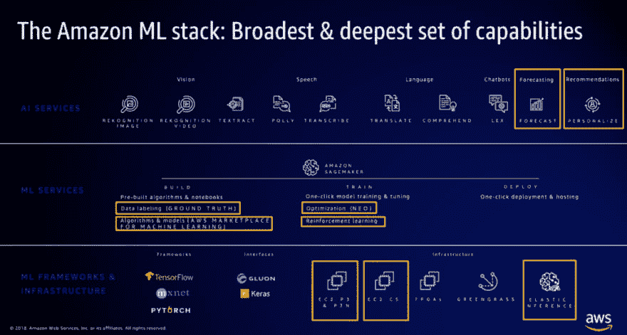

# 演讲:在 AWS re:Invent 2018 上宣布的新机器学习服务

> 原文：<https://dev.to/juliensimon/talk-new-machine-learning-services-announced-at-aws-reinvent-2018-2a24>

这是我刚刚在伦敦和都柏林的 AWS 建设者日做的一个演示。

乐意回答问题。请在 [Twitter](https://twitter.com/julsimon) 上关注我，了解更多内容。

#### 幻灯片

[https://medium . com/media/bfc 34 f 7 BAE 06 CB 8 f1 d 98 E5 c 99 FBE 27 f 4/href](https://medium.com/media/bfc34f7bae06cb8f1d98e5c99fbe27f4/href)

#### 视频

即将推出！