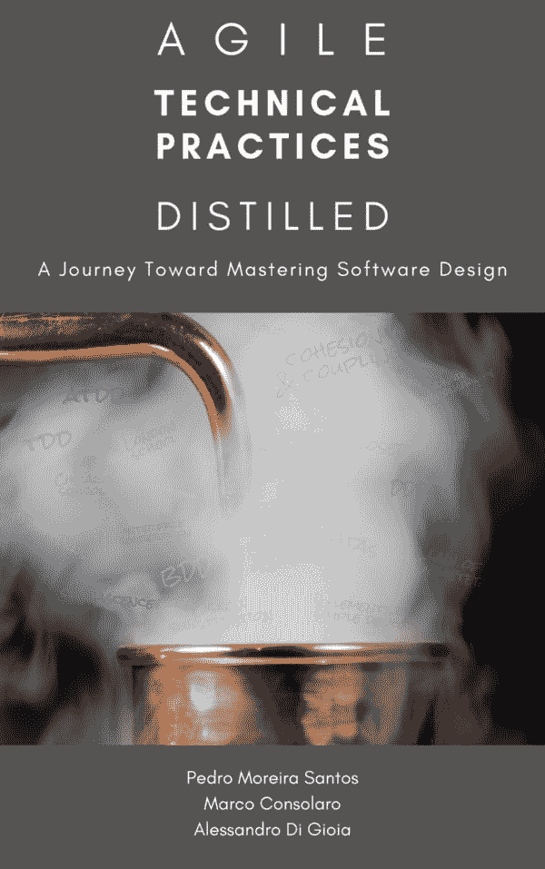

# 这本书是关于什么的？

> 原文：<https://dev.to/pedromsantos/what-is-this-book-about-4o2k>

本周，我们发布了本书的最新部分。被朋友和家人围绕着分享这一刻是如此的快乐。谢谢你和我们在一起。

这本书不包含任何新的信息，我们只是把分散在书籍、博客、文章和对话中的信息放在一起。如果你在寻找新的信息，这本书可能不适合你。那么这本书带来了什么？它提供了学习敏捷技术实践和面向对象设计的途径。

在过去的 5 年里，我们一直作为敏捷技术实践教练工作。我们辅导/指导/教授了数百名开发人员，在这个过程中，我们尝试了许多替代方案，学习和适应。什么有效，什么无效，学习这些实践的最佳顺序是什么，什么练习最有效，什么反馈最有帮助。在本书中，我们分享了我们的经验，并提出了一条其他人可以遵循的道路。

我们知道有时候学习就像冒险进入一片茂密的未知森林，害怕我们没有开辟出一条道路。用它来帮助你学习实践，比如 TDD、结对编程、外部 TDD、重构。面向对象设计背后的一些原则，如坚固、内聚、耦合、共生，简单设计的四个要素，代码味道。

我们的书可以在这里找到

## 超越书本

自学是可行的，但是你缺少了一个关键的部分。反馈！这就是我们创建社区的原因，这样你就可以学习并与他人分享。我们在社区，提供反馈建议和学习:)。加入我们[这里](https://discourse.agiletechpraxis.com/)