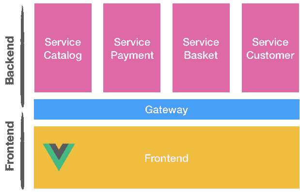
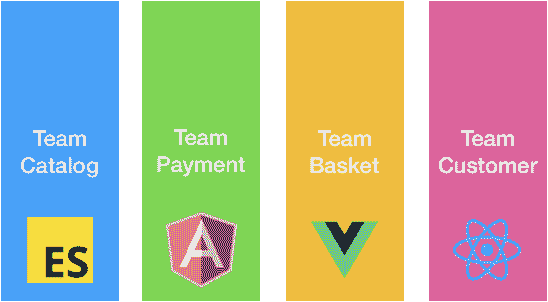
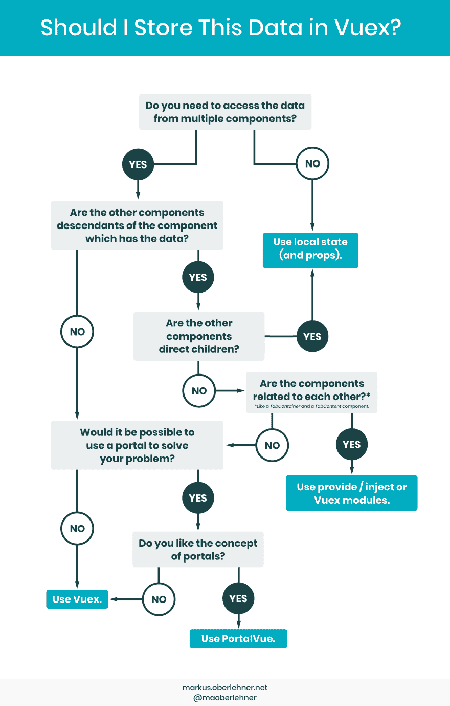

# 扩展大型 Vue.js 应用程序的 3 个技巧

> 原文：<https://dev.to/maxpou/3-tips-for-scaling-large-vuejs-application-2edi>

> TLDR；
> 
> *   将你的应用分成完全隔离的**模块**
> *   考虑**微前端**架构
> *   不要过度使用你的 **Vuex 商店**

## 提示#1:思考模块！

`vue-cli`给出的文件架构很棒。但是在 3-4 页之后，你的文件将开始变得过重。你可能想把你的组件放在多个文件夹中。但是，10 页之后，你会再次面对同样的问题。

这个想法是将你的应用程序按概念分开。坚持一个独特的词。
例如，在一个商店应用程序中，我们可以得到*目录*、*购物篮*和*付款*。现在

```
├─ src/
│  ├─ core/
│  ├─ modules/
│  │  ├─ Catalog/
│  │  │  ├─ Components/
│  │  │  ├─ Pages/
│  │  │  ├─ Routes/
│  │  │  ├─ Services/
│  │  │  │  ├─ catalog.api.js
│  │  │  │  └─ catalog.services.js
│  │  │  ├─ Store/
│  │  │  │  ├─ catalog.action.js
│  │  │  │  └─ catalog.getters.js
│  │  │  │  └─ catalog.mutationTypes.js
│  │  │  │  └─ catalog.state.js
│  │  │  │  └─ index.js
│  │  │  ├─ Tests/
│  │  │  ├─ Catalog.vue 
```

Enter fullscreen mode Exit fullscreen mode

这里有几件重要的事情:

**隔离**

为了保持良好的隔离，模块之间不应有间隙。我的意思是，`Module A`不应该和`Module B`共用一个组件。对于常见功能*(即用户登录、用户语言...)*，你有`core`的文件夹！

**智能与非智能组件**

将你的**智能组件** ( `Pages`文件夹)与**哑铃** ( `Components`文件夹)分开是很重要的。简而言之:

*   智能组件:可以访问商店、路由器、窗口对象...
*   dumbs 组件:获取道具，发射事件。就是这样！

这种方法的主要好处是可重用性，更好的关注点分离...

**劈，劈，劈！**

如果你的分量变得太大，不要害羞:拆分它！在 Vue.js 的指南中，[“紧耦合组件名”规则](https://vuejs.org/v2/style-guide/#Tightly-coupled-component-names-strongly-recommended)被认为是强烈推荐的。

```
// 👎 Bad
|- TodoList.vue
|- TodoItem.vue
|- TodoButton.vue

// 👍 Good
|- CatalogList.vue
|- CatalogListItem.vue
|- CatalogListItemButton.vue 
```

Enter fullscreen mode Exit fullscreen mode

**也隔离风格！**

记住:**全球 CSS 都是恶**。尽可能的避开他们！

*   `.vue` files:更简单的方法是在 style 标签中使用 scoped 属性:`<styles scoped>`
*   不太喜欢`.vue`档？(如果您想创建多个小组件而不创建几十个文件)。考虑像[这样的库💅vue 风格的组件](https://github.com/styled-components/vue-styled-components)。样式封装非常有效！

```
 import styled from 'vue-styled-components';

  const StyledTitle = styled.h1`
      font-size: 1.5em;
      text-align: center;
      color: palevioletred;
  `;

  <StyledTitle>Cool title</StyledTitle> 
```

Enter fullscreen mode Exit fullscreen mode

**测试**

测试应用程序是一个非常复杂的话题，值得写一整篇博文。为了简单起见，让我们以前面的文件体系结构为例，看看要测试什么以及如何测试。

*   组件:低优先级，容易做到。为每个组件编写单元测试。这应该很容易做到。
*   页数:高优先级，难做。你可能需要模仿 API/浏览器部分。
*   路线:通常虫子不在这里。留给 E2E 测试吧。
*   服务:
    *   api 接口:我个人不测试这部分(90%的代码都是嘲讽)。
    *   助手/数据格式器:高优先级，容易做。通常，在你的应用中最容易做的测试！
*   商店:最难测试的部分。你可以通过集成测试来测试它。分别测试动作、getter 和初始状态是没有用的。

**💡懒惰加载你的模块！**

为了减少 JavaScript 包，考虑[延迟加载你的模块](https://router.vuejs.org/guide/advanced/lazy-loading.html#grouping-components-in-the-same-chunk)！

```
export default new Router({
  routes: [
    {
      path: '/catalog',
      name: 'catalog',
      component: () => import(/* webpackChunkName: "catalog" */ './modules/Catalog/views/Catalog.vue')
    },
    // ...
  ]
}) 
```

Enter fullscreen mode Exit fullscreen mode

如果你已经这样做了，但你仍然认为你的应用程序太大，你可以考虑下一个技巧。

## 提示 2:考虑微前端

在过去的几年里，微服务架构变得非常流行。许多公司将其普通的老式整体后端拆分成许多后端小服务。

[](https://res.cloudinary.com/practicaldev/image/fetch/s--OqdTE472--/c_limit%2Cf_auto%2Cfl_progressive%2Cq_auto%2Cw_880/https://raw.githubusercontent.com/maxpou/maxpou.fr/master/content/posts/2018-12-13-scaling-vue-app/backfront.png)

今天，似乎一些公司已经将这种后端模式复制到前端世界。承诺与后端非常相似:将大块分割成多个应用程序，扩展并能够用不同的技术编写应用程序。是的。你正确地读了最后一句话。你可以在 Vue 里写支付应用，在 React 里写目录应用。

如果需要，不同的应用程序可以通过注册在窗口对象上的事件(观察者发布/订阅)进行对话。

[](https://res.cloudinary.com/practicaldev/image/fetch/s--YVTsCGca--/c_limit%2Cf_auto%2Cfl_progressive%2Cq_auto%2Cw_880/https://raw.githubusercontent.com/maxpou/maxpou.fr/master/content/posts/2018-12-13-scaling-vue-app/micro-frontend.png)

**⚠️但是我给你一个警告。没有灵丹妙药。当你把一个范例留给另一个范例时，你并没有摆脱问题。你代替他们。**

**👍优点:完全隔离**

如果后端也是面向微服务的，团队可以在筒仓中工作。他们端到端地控制着自己的领域。

**👍优点:能够使用不同的框架/一个框架的不同版本**

假设负责目录的团队想要更新到 Vue 的下一个版本。不幸的是，负责付款的团队还没有准备好。他们必须提供一个大功能之前，将在 3 个月内准备就绪。当应用程序被分成多个小应用程序时，它们是完全独立的。他们可以修改一个库或一个框架的版本，而不会影响任何其他团队。

此外，如果另一个团队想要开始一个新的子应用程序，他们可以使用他们想要的技术，而不会影响到每个人。

**👍优点:独立部署**

这大概是最大的优势。“团队目录”可以独立于“团队付费”工作和发布。

**🤔缺点:设计系统集成**

如果你有一个用 Vue 编写的设计系统，你可能不希望仅仅因为一个团队想要试验一些东西而在 React 中重写它。在这种情况下，您可能对 [Web 组件](https://developer.mozilla.org/en-US/docs/Web/Web_Components)感兴趣。从我的经验来看，很棒。但当你做了一些，那就是另一回事了。另外，IE11 不支持它(需要多填充)。

💡提示:您可以用`vue-cli`和这个命令
来[生成 Web 组件](https://cli.vuejs.org/guide/build-targets.html#web-component)

```
vue-cli-service build --target wc --name foo 'src/components/*.vue' 
```

Enter fullscreen mode Exit fullscreen mode

**🤔缺点:组建团队很难**

如果你还在一个普通的古老的巨石上工作，那将是一个非常漫长的旅程。另外，如果后端不在微服务架构中，你就不能在完全孤立的孤岛中工作。也许前端团队会独立，但后端不会。

**🤔缺点:性能**

当你模块化你的应用时，每个模块可以被分割成[个块(通过像 WebPack 4 这样的工具)](https://medium.com/webpack/webpack-4-code-splitting-chunk-graph-and-the-splitchunks-optimization-be739a861366)。您只需加载一次主要依赖项，然后当您加载支付页面时，就会加载代码。如果您将现有模块转换为分离/隔离的应用程序，那么每个应用程序上的主框架将加载到每个模块上。

**🤔缺点:路由**

要从模块 A 转到模块 B，模块 A 需要知道完整的路径。常见的是对 URI 进行硬编码。毕竟: *[“酷 URIs 不改”(W3C)](https://www.w3.org/Provider/Style/URI)*

> *⚠️避免炒作驱使 Development™️.你可能还不需要这个架构。只有当你认为你已经达到模块化的极限时，才考虑微前端架构！*

## 秘诀 3:善待你的商店(Vuex)

基于组件的应用程序的最大问题之一是存储。乍一看，很惊艳。我第一次看到 vue 工具时，它完全让我大吃一惊。我开始到处用！然后，问题开始出现。

*   页面加载时的 20 个突变(使时间旅行不可能)；
*   打开一页，做点什么，去另一页，然后回来。该状态未被重新初始化；
*   过分夸张的特征。你需要为一切创造突变。

这里有一些保持你的商店可维护性的小技巧。

**不要过度使用商店**

对这家商店有很多误解。不知道为什么，很多人都认为:“Vue 是管理 UI，Vuex 是管理应用状态”。对此我坚决不同意。根据我的经验，移动商店中的所有逻辑会导致开销和不必要的复杂功能。此外，代码越多，bug 就越多。

通常，当我们遇到这样的存在主义问题时，我们会求助于创造者。

> 这不是强制性的，也不建议将您的所有状态放在 Vuex 商店中。
> 
> ——[尤雨溪(Vue.js 的创建者)](https://github.com/vuejs/vuex/issues/236#issuecomment-231754241)

我还引用了丹·阿布拉莫夫的一句话，主要是因为 Vuex 的部分灵感来自 Redux。此外，面向组件应用程序有许多有趣的地方。

> 对短暂的状态使用 React，这种状态对应用程序没有全局影响，并且不会以复杂的方式变异。例如，某个 UI 元素中的切换、表单输入状态。对全局重要的或以复杂方式变化的状态使用 Redux。例如，缓存的用户或帖子草稿。
> 
> ——[丹·阿布拉莫夫(redux 的创造者，相当于 Vuex 但不是 React)](https://github.com/reduxjs/redux/issues/1287#issuecomment-175351978)

当我问自己:“我该不该用这个商店？”，我通常在脑子里做这样的事情:
[](https://res.cloudinary.com/practicaldev/image/fetch/s--8FLfEUjr--/c_limit%2Cf_auto%2Cfl_progressive%2Cq_auto%2Cw_880/https://raw.githubusercontent.com/maxpou/maxpou.fr/master/content/posts/2018-12-13-scaling-vue-app/vuex-or-not.png)

换句话说，以下是几个例子:

*   存储“当前用户，i18n 首选项”→是。
*   “通过 API 调用加载数据”→小丑！不要太尴尬。我通常把它保存在组件的状态中。我同意，有时候，与应用程序的其他部分共享这些数据是有意义的。
*   与编辑/创建表单相关的状态→否
*   “切换用户界面元素”→否
*   “管理一个`isLoading`状态”→否

我不是说你不应该使用商店。省吃俭用就好！

**使用命名空间商店(用于模块)**

```
const store = new Vuex.Store({
  modules: {
    catalog: {
      namespaced: true,
      state,
      getters: {
        getFeaturedProducts () { ... } // -> getters['catalog/getFeaturedProducts']
      },
    }
  }
}) 
```

Enter fullscreen mode Exit fullscreen mode

不要写简单的 getters。

为了相关，getter 必须包含一些逻辑。如果您想访问子属性，请选择`mapState`。

```
getters: {
  // 🤔 non useful getter
  getProducts: state => state.products,
  // 👍 useful getter
  getFeaturedProducts: state => state.products.filter(p => p.isFeatured),
} 
```

Enter fullscreen mode Exit fullscreen mode

最初发布于 [maxpou.fr](https://www.maxpou.fr/3-tips-scaling-vue-application) 。