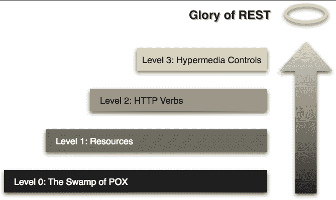

# 为什么没有理查森成熟度模型

> 原文：<https://dev.to/mikeralphson/why-there-is-no-such-thing-as-the-richardson-maturity-model-3b4>

一个用来衡量 API 设计的成熟度的通用标准是被称为 **Richardson 成熟度模型**(或 RMM)的标准。最初简单地称为**成熟度启发式**，Leonard Richardson 的等级定义了 API 设计的**成熟度**的以下级别:

*   零级:一个 URI，一个 HTTP 方法
*   第一级:许多 URIs，一个 HTTP 方法
*   第二层:许多 URIs，每个都支持许多 HTTP 方法
*   第三层:超媒体

我们可以把零级看作 RPC，或者 SOAP 风格的 API。

一级 API 有资源(或表示)的概念，但是所有请求都使用一个 HTTP 方法(比如`GET`或`POST`)。这没有充分利用 HTTP 协议，正如 Richardson 指出的，这使得意外破坏数据变得非常容易。

第二级可能是当今生产 API 中最常见的级别。它代表了除 HATEOAS 之外的所有 Fielding 的强制 REST 约束。

第三层是 REST，包括超媒体约束。尽管理查森在他最初的讨论([https://www.crummy.com/writing/speaking/2008-QCon/act3.html](https://www.crummy.com/writing/speaking/2008-QCon/act3.html))中指出:

> “许多人满足于第二级，因为超媒体很难理解，它在 web 服务领域的价值也不清楚。”

不幸的是，Richardson 成熟度模型被 Martin Fowler 以某种删节的形式推广开来。无益的是，他网站上的图片经常被复制，选择将上面的级别重命名为:

*   零级:痘的沼泽
*   第一层:资源
*   第二层:HTTP 动词
*   第三层:超媒体控件

即使我们认为成熟度模型在 API 设计中的应用有些偏颇，这意味着 REST APIs 比 RPC APIs 更“成熟”(实际上它们只是服务于不同的需求和目的)，也没有理由使用像“沼泽”这样的贬义词。“POX”听起来也令人不快，但在这里它的意思只是“普通的旧 XML”。

不管怎样，RMM 的普及版本没有区分资源和表示，只是增加了 HTTP“动词”和 HTTP 方法之间的混淆，而原始版本没有。

理查森本人在 2015 年 RESTFest 上发表了题为“我做了什么？”描述了整个事情“非常尴尬”,并澄清说，如果你想继续进行成熟启发式的步骤，你必须有一个技术原因或政治原因这样做。顶部也没有奖励或“荣耀”——抱歉让你失望了。([https://vimeo.com/147237932](https://vimeo.com/147237932)

关于这个模型的更多细节，请参考理查森的原著。

感谢 Darrel Miller 指出理查森的后讲。