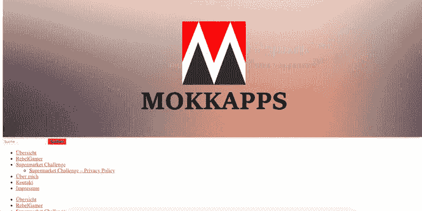
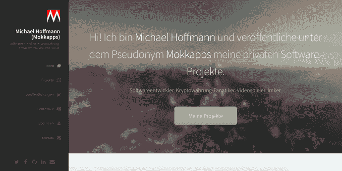
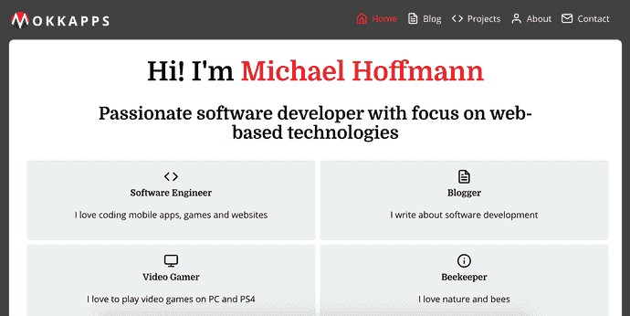
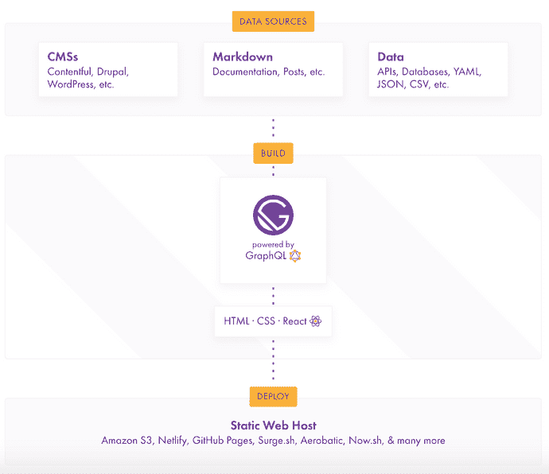
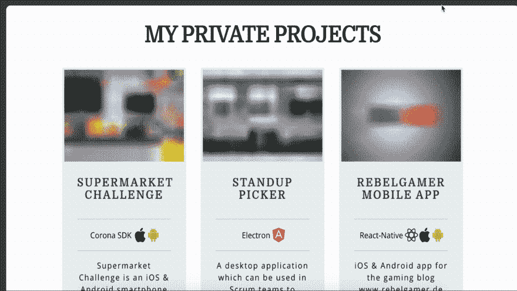
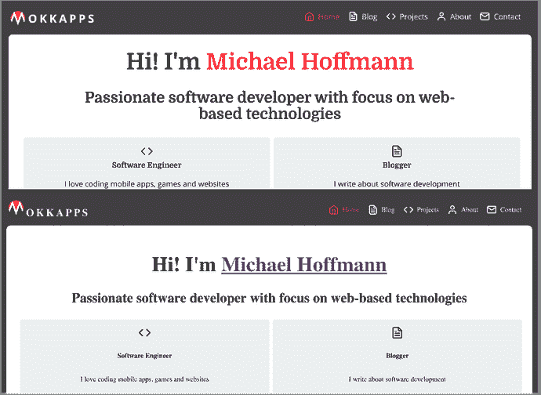
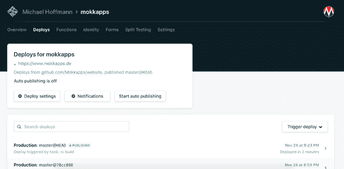
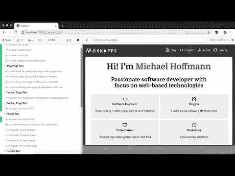
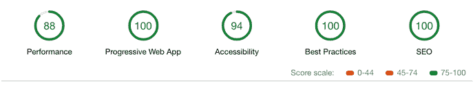

# 我的作品集网站背后的工程

> 原文：<https://dev.to/mokkapps/the-engineering-behind-my-portfolio-website-4dg4>

我在 2017 年创建了我的第一个个人网站，当时我推出了我的第一个智能手机游戏[。我在这个游戏中使用谷歌分析，因此](https://www.mokkapps.de/blog/lessons-learned-my-first-smartphone-game/)[有必要](https://privacypolicies.com/blog/privacy-policy-google-analytics/)从游戏内部提供一个隐私政策网站的链接。我使用了 [WordPress](https://wordpress.org/) 和一个免费的主题，因为当时我几乎没有前端知识:

[ ](https://res.cloudinary.com/practicaldev/image/fetch/s--trbYiqV7--/c_limit%2Cf_auto%2Cfl_progressive%2Cq_auto%2Cw_880/https://www.mokkapps.de/static/68a754b502b04e3691133dfd6f744baa/44d6a/website-v1.png) [参见网络存档](https://web.archive.org/web/20170701233843/http://mokkapps.de:80/)第一版

2017 年底，我发布了一个基于开源静态站点生成器 [Hugo](https://gohugo.io/) 的[新版本](https://dev.to/mokkapps/how-i-built-my-website-with-hugo-and-netlify-3n49)，使用了[html 5 Up prolog 主题](https://html5up.net/prologue)。我们的想法是拥有更独特的设计和更好的布局控制:

[ ](https://res.cloudinary.com/practicaldev/image/fetch/s--ARmJXTb8--/c_limit%2Cf_auto%2Cfl_progressive%2Cq_auto%2Cw_880/https://www.mokkapps.de/static/8eb32dc8a412575188ef3d7520a856c7/44d6a/website-v2.png) [参见第二版网络存档](https://web.archive.org/web/20180322183119/http://mokkapps.de/)

随着我作为前端开发人员越来越专业化，我想创建自己的具有自己风格的投资组合网站。灵感来自阿里·斯皮特尔的博客文章[“建立一个很棒的投资组合”](https://dev.to/aspittel/building-a-kickass-portfolio-28ph)。

鼓励我进行重构的一些主要原因是:

*   展示我的创造力，制作一个真实表达我自己的网站
*   尽可能自己设计，不使用预先设计的模板
*   使网站尽可能的快捷和易访问
*   提供一个基础，使网站易于扩展和调整
*   让网站完全响应

结果见 [www.mokkapps.de](https://www.mokkapps.de) :

[](///static/b769140de9b33d569d14848593822a69/fa8e7/website-v3.png)

基本实现需要大约 40 个小时的工作。我没有起草我的网站之前，移动到代码，但刚刚开始编码和实验不同的设计。

## 网站生成器

由于几个原因，我决定使用 [Gatsby.js](https://www.gatsbyjs.org/) :

*   我喜欢使用 [React](https://reactjs.org/) ，它有丰富的库、组件等生态系统。
*   它使用了我想获得更多实践经验的 GraphQL
*   非常好的[文档](https://www.gatsbyjs.org/docs/)，[插件](https://www.gatsbyjs.org/plugins/) & [首发](https://www.gatsbyjs.org/starters/)
*   可以很容易地与几个 API，CMS 等结合

下图来自官方网站，展示了盖茨比的工作方式:

[](///static/dea229e2c13d1f9f081832b1e1d98ba4/d49ff/gatsbyjs.png)

作为一个初学者，我使用了神奇的[盖茨比初学者工具包](https://greglobinski.github.io/gatsby-starter-kit-docs/)，它为我的网站提供了一个理想的基本应用程序。

## 托管

我使用 [Netlify](https://www.netlify.com/) 来托管我的网站，这是一个自动化现代网络项目的一体化平台。

如果你有一个公共的 GitHub 项目，它可以免费使用。我决定[在 GitHub](https://github.com/mokkapps/website) 上开源我的网站代码，因为我想向所有对此感兴趣的人展示我的技能。

## 样式组件

我真的很喜欢[风格组件](https://www.styled-components.com/)的想法，以及它如何很好地集成到 React 组件中。

样式化组件利用标记的模板文字来样式化组件。它移除了组件和样式之间的映射。这意味着当您定义您的样式时，您实际上是在创建一个普通的 React 组件，它附加了您的样式。

看看我的网站的以下组件:

```
import React from 'react';
import PropTypes from 'prop-types';
import styled from 'styled-components';

const StyledArticle = styled.article`
  max-width: 600px;
  margin: 0 auto 30px;

  background: white;
  border-radius: 10px;
  padding: 2rem;
  min-width: ${props => (props.narrow ? '50%' : '100%')};
`;

const Article = props => {
  const { children } = props;
  return <StyledArticle>{children}</StyledArticle>; };

Article.propTypes = {
  children: PropTypes.node.isRequired,
};

export default Article; 
```

Enter fullscreen mode Exit fullscreen mode

在这个例子中，我使用了`<article>` HTML 标签，但是把它作为`StyledArticle`来附加我的 CSS 样式。甚至可以根据传递给组件的属性来应用样式，正如您在下面这行代码中看到的:

```
min-width: ${props => (props.narrow ? '50%' : '100%')}; 
```

Enter fullscreen mode Exit fullscreen mode

## 反应灵敏的图像

对于一个好的网站来说，在合适的设备上以最佳的尺寸传送图像是非常重要的。当你在网站上使用很多图片时，它可以确保你的网站快速加载并且不会变慢。

“gatsby-image”插件是满足这一需求的绝佳解决方案。它会自动调整你的图片大小，这样你的网站就不会在移动设备上加载巨大的图片。此外，它延迟加载图像，并在加载图像时提供漂亮的模糊效果:

[](https://res.cloudinary.com/practicaldev/image/fetch/s--c6KWC_kR--/c_limit%2Cf_auto%2Cfl_progressive%2Cq_66%2Cw_880/https://www.mokkapps.de/blur-4a34faa84188fae8608a0f5a01f349bd.gif)

## 排版

我想有一个版式设计，并使用了 [Typography.js](https://kyleamathews.github.io/typography.js/) ，这也是盖茨比文档推荐的。

我的配置文件是这样的:

```
import Typography from 'typography';
import CodePlugin from 'typography-plugin-code';
import theme from 'typography-theme-alton';

theme.overrideThemeStyles = ({ rhythm }, options) => ({
  a: {
    color: '#FC1A20',
    textDecoration: 'none',
  },

  'a:hover': {
    color: '#FC1A20',
    textDecoration: 'underline',
  },

  html: {
    boxSizing: 'border-box',
    background: '#424242',
  },
});

theme.plugins = [new CodePlugin()];

const typography = new Typography(theme);

export default typography; 
```

Enter fullscreen mode Exit fullscreen mode

在下一张图中，您可以看到我的登录页面有(上图)和没有(下图)版式的区别。js:

[](///static/0c08bafca64722cd44f0c6106a228e1a/abd41/typography.png)

## 博客

我真的很喜欢在 [Markdown](https://en.wikipedia.org/wiki/Markdown) 中写文章，并且想用 Markdown 文件作为我博客的来源。

Gatsby Starter Kit 已经为这一需求提供了一些不错的特性:

*   文章页面是从降价文件中自动创建的
*   类别是为博客文章自动创建的
*   网页是从 markdown 页面文件自动创建的

代码中相关的文件夹结构是这样的:

```
root
  └── src
      ├── content
      │ ├── posts
      │ │ ├── 2018-05-11___my-first-vs-code-extension
      │ │ | ├── jasmine-test-selector.png
      │ │ │ └── index.md
      │ │ ├── 2018-05-12___my-first-npm-package
      │ │ | ├── github-traffic-cli.png
      │ │ │ └── index.md
      | |
      | | ... 
```

Enter fullscreen mode Exit fullscreen mode

使用我的 Gatsby 配置，它自动为每个文件夹创建一个博客文章页面，例如

`https://www.mokkapps.de/blog/my-first-vs-code-extension/`

## 持续整合

我使用 [Travis CI](https://travis-ci.org/) 来部署&测试我的网站，每次我推送到我的 git 主分支。

下面是我的`.travis.yml`文件的摘录:

```
script:
  - npm run lint
  - npm run test:e2e:ci
  - npm run build

deploy:
  provider: script
  script: "curl -X POST -d '' https://api.netlify.com/build_hooks/5ba3c8da1f12b70cbbcaa1a3"
  skip_cleanup: true
  on:
    branch: master 
```

Enter fullscreen mode Exit fullscreen mode

因此，在每次推送至 master 时，它都会运行 TS linter、E2E 测试并构建应用程序。如果所有脚本都成功，则通过 webhook 触发 Netlify 上的部署。

因此，我在 Netlify 中禁用了自动发布，这通常会在每次在已配置的分支上检测到 git 推送时触发部署。

在我的例子中，我只想在测试和构建成功的情况下触发部署。

[](///static/44be3c32aade8afcf9b3d0a31b89eb02/9e680/netlify.png)

Netlify 还会自动构建一个带有唯一 URL 的预览。就像每个公关或分支机构的舞台环境一样，预览是测试和协作的完美选择。所以我甚至可以在手动部署之前预览我的新构建。

## E2E 测试

在我的 E2E 测试中，我使用了 [Cypress.io](https://www.cypress.io/) ,因为我听到了很多关于它的好消息。

我创建了一组测试来测试我的应用程序的最重要的功能。

这是，例如，E2E 测试我的主页:

```
import config from '../../src/content/meta/config';

describe('Home Page Test', () => {
  beforeEach(() => {
    cy.visit('/');
  });

  it('includes a heading and a quote', () => {
    cy.get('[data-cy=hero-heading]');
    cy.get('[data-cy=hero-quote]');
  });

  it('shows characteristics section', () => {
    cy.get('[data-cy=hero-characteristics-section]')
      .children()
      .should('have.length', 4);

    cy.get('[data-cy=hero-characteristics-more-button]').click();
    cy.url().should('include', '/about');
  });

  it('shows featured projects', () => {
    const countFeaturedProjects = config.projects.filter(p => p.featured);
    cy.get('[data-cy=hero-projects-section]')
      .children()
      .should('have.length', countFeaturedProjects.length);

    cy.get('[data-cy=hero-projects-more-button]').click();
    cy.url().should('include', '/projects');
  });

  it('shows latest blog post', () => {
    cy.get('[data-cy=blog-post-0]');
    cy.get('[data-cy=hero-blog-more-button]').click();
    cy.url().should('include', '/blog');
  });
}); 
```

Enter fullscreen mode Exit fullscreen mode

这个视频展示了在我的网站上运行的 Cypress 测试:

[](https://youtu.be/HgbFzH5-YrQ)

## 灯塔

对我来说，有一个好的 [Google Lighthouse 评分](https://developers.google.com/web/tools/lighthouse/)是很重要的，有了 Gatsby.js，你几乎就能获得很好的结果:

[](///static/274b0787dad3274755e133ea39d452fe/f791b/lighthouse.png)

## 结论

我真的为我的网站感到骄傲，我喜欢设计它。这个网站代表了我在万维网上的形象，因此我对它的设计、质量、可访问性和页面浏览量非常感兴趣。

我用它在不同方面推销自己:

*   向雇主展示特定技能
*   告诉人们阅读我的博客
*   推广我的私人项目

在我看来，每个 web 开发者都应该有自己的定制网站。作品集网站是真实的自我表达。我们是程序员，这是一个创造性的过程，所以使用和展示你的创造力。

## 链接

*   [www.mokkapps.de](https://www.mokkapps.de)
*   [GitHub 上的网站代码](https://github.com/mokkapps/website)