# 薪水

> 原文：<https://dev.to/rhymes/salaries-4p4g>

这篇文章很长，但是有图片。

这次我做了个总结:

*   [我写这篇文章的想法来自哪里](#where-i-got-the-idea-to-write-this-post)
*   [薪水历史的故事](#a-tale-of-a-salary-history)
*   [黑客新闻上发生了什么](#what-happened-on-hacker-news)
    *   [美国经验丰富的安全架构师](#security-architect-in-the-us-with-lots-of-experience)
    *   [有几年经验的爱沙尼亚软件开发人员](#software-dev-in-estonia-with-a-few-years-of-experience)
    *   对于首席工程师来说，印度市场与西方市场有多大不同
    *   [荷兰的技术培训生和生活在欧洲的额外津贴](#technical-trainee-in-the-netherlands-and-the-perks-of-living-in-europe)
    *   [SRE 在多伦多](#sre-in-toronto)
    *   [意大利咨询行业的技术领先](#tech-lead-in-consulting-business-in-italy)
    *   [大型意大利公司项目经理](#project-manager-in-large-italian-company)
    *   [拥有 15 年经验的 AWS 安全工程师](#security-engineer-at-aws-with-15-years-of-experience)
    *   [从东欧到西欧](#from-eastern-to-western-europe)
    *   [从西班牙到德国](#from-spain-to-germany)
    *   [一些观点](#some-perspective)
*   [我的评论](#my-comments)
*   [结论](#conclusions)

## 我哪里来的心思写这个帖子

这一切都始于一篇名为[我作为软件工程师的(有点)完整的薪资历史](https://humanwhocodes.com/blog/2018/10/my-somewhat-complete-salary-history-software-engineer/)的文章，作者尼古拉斯·c·扎卡斯(Nicholas C. Zakas)决定公布他的薪资历史。原因如下:

> 做同样的工作，女人比男人挣得少。这是当今世界不应该发生的事情，这取决于我们(理解为:男人)站出来把事情做好。这就是我的尝试。

在帖子中，他还谈到了我认为大多数人不愿意与公众分享他们目前的工资或工资历史的原因之一:如果未来的雇主知道你挣多少钱，他们可能会试图给你比他们能给的更少的工资。

我认为，人们不分享工资的其他原因是害怕被评判、内疚、不想与同事比较、文化和教养。

薪资的价值还受到当地生活成本、生活质量、资历、不同税收、不同类型的公司、绩效、可能的股票期权以及其他可能因公司而异的因素的影响。所以说“我赚了这么多”可能不足以进行准确的比较。

这位作者因为健康问题暂时离开了这个行业，在某个时候，他说了一些超级超级真实的事情，让我笑了:

> 此外，作为一名白人，我知道当我再次开始工作时，我将能够在没有反弹的情况下谈判我的工资。

这句话反而让我想起了 Buffer 和他们在薪资问题上臭名昭著的透明度:

> 底线是，除非人们愿意分享信息，否则一切都不会变得更好。

Buffer 甚至在一个[公开的谷歌文档](https://docs.google.com/spreadsheets/d/1l3bXAv8JE5RB9siMq36-Ogngks2MT6yQ5gt8YXhUyAg/edit)中有员工的工资。

作者是 [ESLint](https://eslint.org/) 的创作者，顺便说一下:-)他也写了或合著了[很多书](https://humanwhocodes.com/books/)。

## 一个薪资历史的故事

Zakas 在一个表格中列出了多年的经验、公司、头衔和起薪(包括奖金、股票期权和其他东西):

[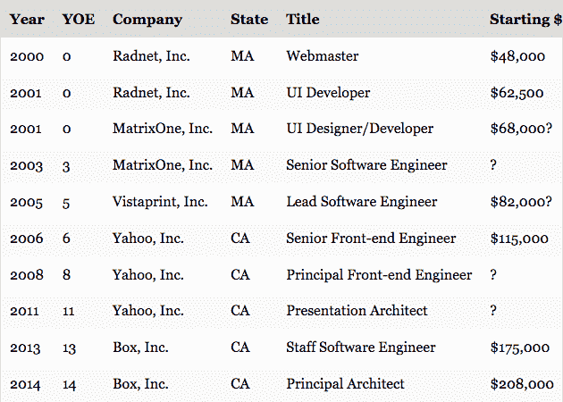](https://res.cloudinary.com/practicaldev/image/fetch/s--LOTutBko--/c_limit%2Cf_auto%2Cfl_progressive%2Cq_auto%2Cw_880/https://thepracticaldev.s3.amazonaws.com/i/7x5pydtqnqeu2uoe75mi.png)

他从 18 年前的 4.8 万英镑(经通胀调整后为 7 万英镑)涨到了上一份工作的 20.8 万英镑。

正如我们之前暗示的那样，原始数据不足以了解全貌，所以他继续列举了每项工作的细节。

其中一些细节:

*   他的第一份工作是通过关系(按 2018 年美元计算是 7 万英镑)
*   他的第二份工作是通过他第一份工作的一位经理找到另一家公司，并邀请他加入(2018 年的 96K 美元)
*   他得到的第三份工作仅仅是因为简历(10.5 万美元，2018 年美元)
*   第四份工作是他从马萨诸塞州搬到加利福尼亚州(14.3 万美元，2018 年)，他第一次谈判获得更高的工资，但遭到拒绝。他得到这份工作是因为他当时写过关于 JS 的书，并被邀请申请(雅虎)
*   第五份工作的起薪是 18.9 万美元(2018 年美元+2.5 万签约奖金)，与此同时，他开始了一家咨询公司。他得到这份工作是因为他的职业是演讲家。他以 220，000 英镑结束了他的职业生涯

有更多关于*工作是怎样的细节[你可能应该读一下](https://humanwhocodes.com/blog/2018/10/my-somewhat-complete-salary-history-software-engineer/)。*

 *把他最后的笔记留在这里:

> 分享这些信息，我有两个希望。首先，我希望这些信息能让女性更容易理解做同样的工作应该得到多少报酬，以及在她们的职业生涯中应该如何增加报酬。第二，希望其他处于类似独立地位的男性也分享一下自己的赔偿历史，以利他人。

## 黑客新闻上发生了什么

这篇帖子在 HN 传播开来，引发了一场超长的对话，许多人匿名分享(或多或少)自己的薪水或薪水历史。你会发现有些人认为他们的薪酬过低，有些人认为他们的薪酬合理，有些人在谈论医疗保险的成本，有些人提到成为一名远程工作者是多么具有变革性。

我在这里截屏了 HN 的一些评论，我觉得这些评论对我们的目的很有趣或有用(我试图避免这些无聊的话题和激烈的战争，但没有成功):

### 拥有丰富经验的美国安全架构师

[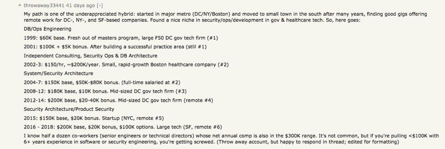](https://res.cloudinary.com/practicaldev/image/fetch/s--0ale9f-q--/c_limit%2Cf_auto%2Cfl_progressive%2Cq_auto%2Cw_880/https://thepracticaldev.s3.amazonaws.com/i/8iurkcx57ej7n7jqlf85.png)

这个人从一个大城市到一个偏远的小城市工作。我应该再发一篇帖子，谈谈我认为远程工作在软件开发中的未来:公司可以不受签证限制地利用国际人才，人们可以在他们想去的任何地方工作和生活，为当地经济做出贡献，他们可以告别通勤等等。是的，有缺点，但我觉得大多数公司出于原则或因为他们从未想过这个问题而拒绝。

每次我看到接受媒体采访的公司抱怨“我们有大量的空缺职位，但没有人愿意为我们工作”，我就会查看招聘页面，通常会发现零个远程职位，尤其是如果这类公司位于远离科技中心的地区。

### 在爱沙尼亚有几年经验的软件开发人员

[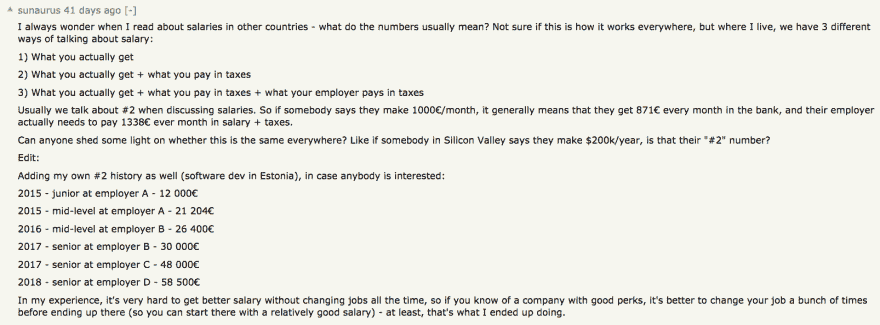](https://res.cloudinary.com/practicaldev/image/fetch/s--8G0IVsSy--/c_limit%2Cf_auto%2Cfl_progressive%2Cq_auto%2Cw_880/https://thepracticaldev.s3.amazonaws.com/i/bcefdzxakwggzudbs0db.png)

不知道为什么这个头衔在两年后变成了高级职位，这证明了头衔可能毫无意义。:D 在辩护中补充道，总共是 7 年的工作经验(有些人没有提到是自由职业者)，头衔是由雇主指定的。

另一个人甚至说:

> 大学毕业不到 6 个月，我就被提升为“高级”开发人员，因为我的雇主想提高他的咨询业务的可信度。

不管怎么说，这个例子中的数字更接近我在意大利和法国的经历。

### 对于首席工程师来说，印度市场与西方市场有多大不同

[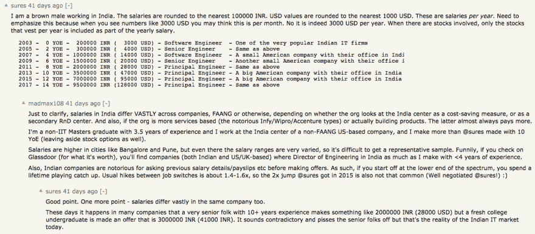](https://res.cloudinary.com/practicaldev/image/fetch/s--L9j_jO-3--/c_limit%2Cf_auto%2Cfl_progressive%2Cq_auto%2Cw_880/https://thepracticaldev.s3.amazonaws.com/i/jipdz3aqfai3qw0fbwym.png)

*(请记住，在阅读这些数字时，通货膨胀和印度的 GDP 增长都要考虑在内)*

在印度，询问以前的薪水似乎很常见(这在西方似乎越来越不常见)，这可能会使薪水上升轨迹变得复杂。

### 荷兰的技术见习生和生活在欧洲的额外津贴

[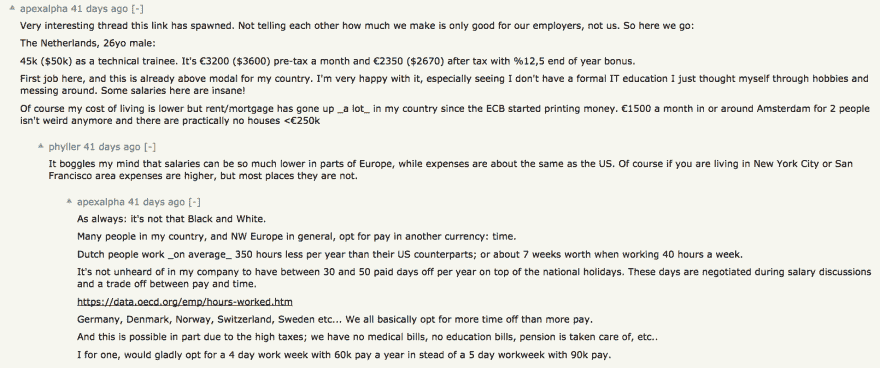](https://res.cloudinary.com/practicaldev/image/fetch/s--o7TM2jRy--/c_limit%2Cf_auto%2Cfl_progressive%2Cq_auto%2Cw_880/https://thepracticaldev.s3.amazonaws.com/i/sqwwmg7uorwbfm31apek.png)

> 德国、丹麦、挪威、瑞士、瑞典等...我们基本上都选择更多的休息时间而不是更多的薪水。这可能部分是由于高税收；我们没有医疗账单，没有教育账单，养老金得到了保障，等等。

所以，是的，你可能比在旧金山挣得少，但还有其他优势。

工作量的话题也上来了。欧洲人往往比美国人工作得少(我不知道关于“生产率”的数据)，通常享受更多的假期(通常是四到五周)。

### 多伦多 SRE

[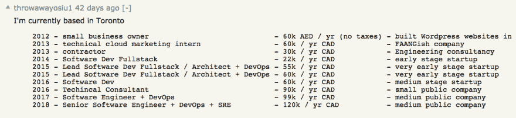](https://res.cloudinary.com/practicaldev/image/fetch/s--uXmrLPCQ--/c_limit%2Cf_auto%2Cfl_progressive%2Cq_auto%2Cw_880/https://thepracticaldev.s3.amazonaws.com/i/sucigb1fsomj48szvsbj.png)

### 意大利咨询行业的技术领导者

[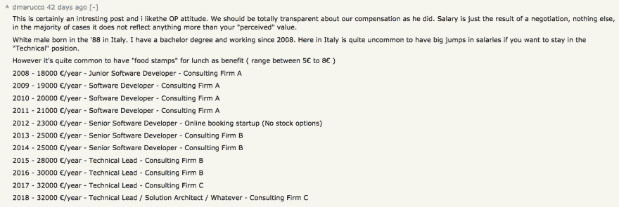](https://res.cloudinary.com/practicaldev/image/fetch/s--sNAiGtIo--/c_limit%2Cf_auto%2Cfl_progressive%2Cq_auto%2Cw_880/https://thepracticaldev.s3.amazonaws.com/i/cjr42s0hh6dr0vt7nlgw.png)

这个人住在意大利北部米兰郊外(这个国家最大的科技中心)。他的工资很低，但也不是完全没有听说过。100K 的工资通常是经理的工资。此外，意大利公司并不以允许技术人员有自己的职业发展道路而闻名，除了“好吧，现在你有很多经验，为什么不转行做管理呢？”。

意大利的平均工资是 30000 欧元，这就是为什么我认为有 10 年工作经验的人工资有点低。

### 大型意大利公司项目经理

[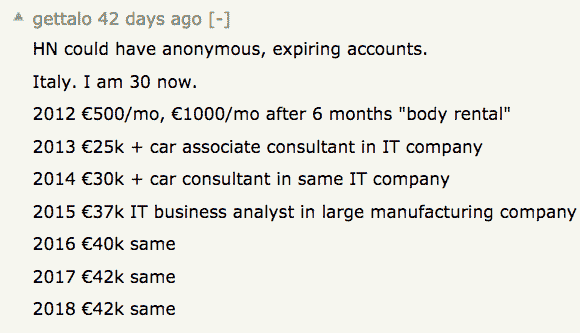](https://res.cloudinary.com/practicaldev/image/fetch/s--qApbN4uV--/c_limit%2Cf_auto%2Cfl_progressive%2Cq_auto%2Cw_880/https://thepracticaldev.s3.amazonaws.com/i/ci4m0gl6bybkuhhpo90i.png)

正如我之前提到的，我对这些数字一点也不惊讶。

### 拥有 15 年经验的 AWS 安全工程师

[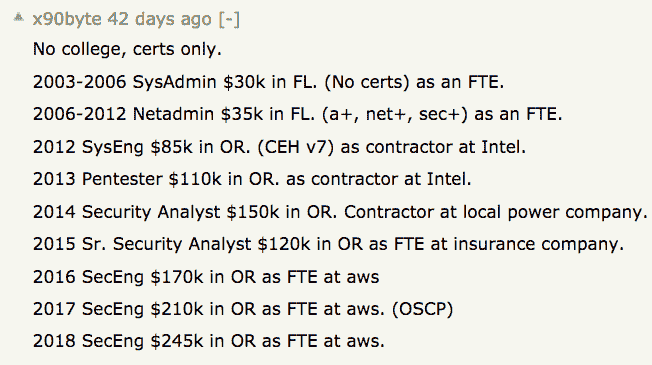](https://res.cloudinary.com/practicaldev/image/fetch/s--oAwdYh6w--/c_limit%2Cf_auto%2Cfl_progressive%2Cq_auto%2Cw_880/https://thepracticaldev.s3.amazonaws.com/i/2fs1aqolkvfex67ybhdb.png)

### 从东欧到西欧

[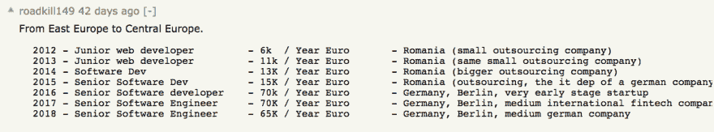](https://res.cloudinary.com/practicaldev/image/fetch/s--_YF7y5Ys--/c_limit%2Cf_auto%2Cfl_progressive%2Cq_auto%2Cw_880/https://thepracticaldev.s3.amazonaws.com/i/oeswjjjs5p278aiewxt0.png)

### 从西班牙到德国

[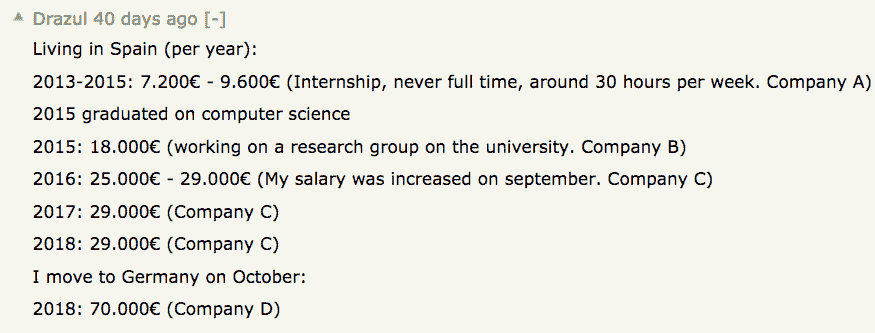](https://res.cloudinary.com/practicaldev/image/fetch/s--NEownhy9--/c_limit%2Cf_auto%2Cfl_progressive%2Cq_auto%2Cw_880/https://thepracticaldev.s3.amazonaws.com/i/9sfi7cpgu65ko9pxj6q2.png)

### 有些透视

[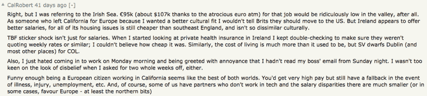](https://res.cloudinary.com/practicaldev/image/fetch/s--0uakLaN8--/c_limit%2Cf_auto%2Cfl_progressive%2Cq_auto%2Cw_880/https://thepracticaldev.s3.amazonaws.com/i/nz0mli3kbtn2d3p34v4h.png)

我笑了

> 有趣的是，作为一名欧洲公民在加州工作似乎是两全其美。你会得到很高的报酬，但在生病、受伤、失业等情况下仍有退路。

我已经不是第一次听说欧洲人回来接受疾病治疗了。

[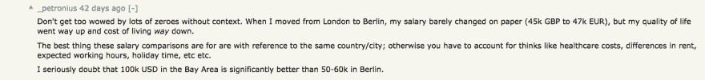](https://res.cloudinary.com/practicaldev/image/fetch/s--Tr0u8Q5c--/c_limit%2Cf_auto%2Cfl_progressive%2Cq_auto%2Cw_880/https://thepracticaldev.s3.amazonaws.com/i/l7jrc1k8ylribk9p28jd.png)

生活质量超过薪酬，100K 在 SF 不算超薪。

## 我的评论

HN 的帖子里还有很多很多，我没有全部读完。来自世界各地的人们已经公布了他们的工资历史。有些是全职员工，有些是顾问，有些是自由职业者。大多数人使用一次性账户的原因我们在一开始就列出来了。

值得注意的是，有多少人提到他们是通过换工作才得到加薪的，这也是我目前的经历。

没有生活费和税收的工资只是一个数字。

## 结论

没有我想添加的，我希望它给开发人员一些有用的信息，这是第一篇文章的要点。*