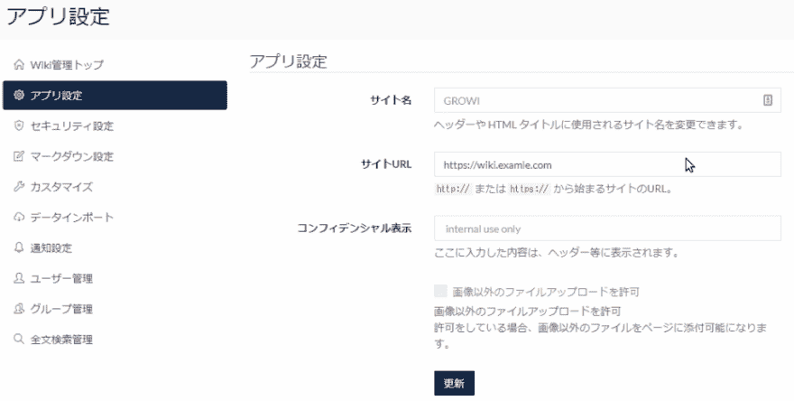
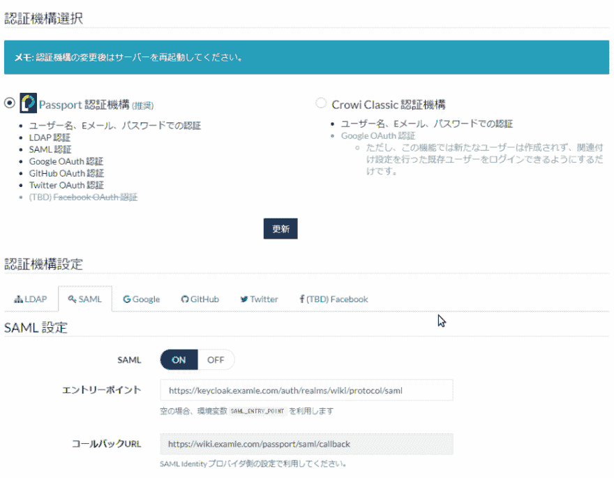

# 使用 keycloak - part1 尝试 Growi 的 SAML 身份验证。

> 原文：<https://dev.to/sahya/try-to-the-saml-authentication-of-growi-using-keycloak-4fkh>

# 简介

Growi Wiki 是被 Crowi Wiki 分叉的。

*   github:[https://github.com/weseek/growi/](https://github.com/weseek/growi/)
*   官方网站:[https://growi.org/](https://growi.org/)
    *   如果你想尝试使用，现场演示网站是在官方网站的链接。

Growi Wiki 是有用的，可移植的。

并且可以使用全文搜索(弹性搜索)和与 [CodiMD](https://hackmd.io) 的关系。

注意:现在，Growi Wiki 招募新成员，为 Slack 的英语本地化做出贡献。如果你有兴趣，让我们试着加入成长的行列。

最近，Growi Wiki 实现了 SAML 认证。所以我试着在 Growi 上设置 SAML 认证。

# 程序

## 版本定义

*   keycloak 4 . 0 . 0 最终版(注意:让它已经构造好了)
*   Growi ver.3.2.4(注意:使其已经构建)
*   码头工人见 03.1-ce
*   坞站-复合视图 1.21.2

## 设置流程

### [t1 在生长](#growi)

1.  在 Growi 上，开放式管理(管理)和管理员授权。
    *   APP 设置
    *   网站网址:[https://wiki.examle.com](https://wiki.examle.com)
        *   这是一个重要的设置，因为它也作为环境变量在 SAML 的安全设置中使用。
    *   安全设置
        *   护照认证(認証機構):启用(有効化)
        *   开着
2.  在 Growi 上，按[刷新(更新)].
3.  在格罗威，记下卡尔巴克·url(コールバックurl).

< contine to next part2 (Please wait 3 weeks until the next article release)>