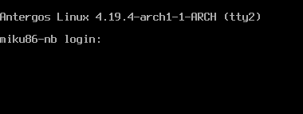
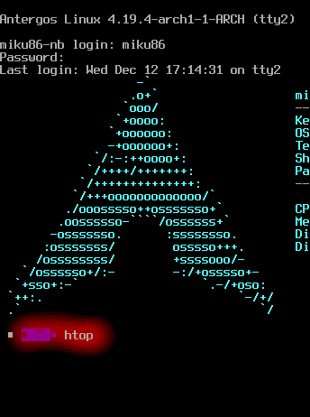
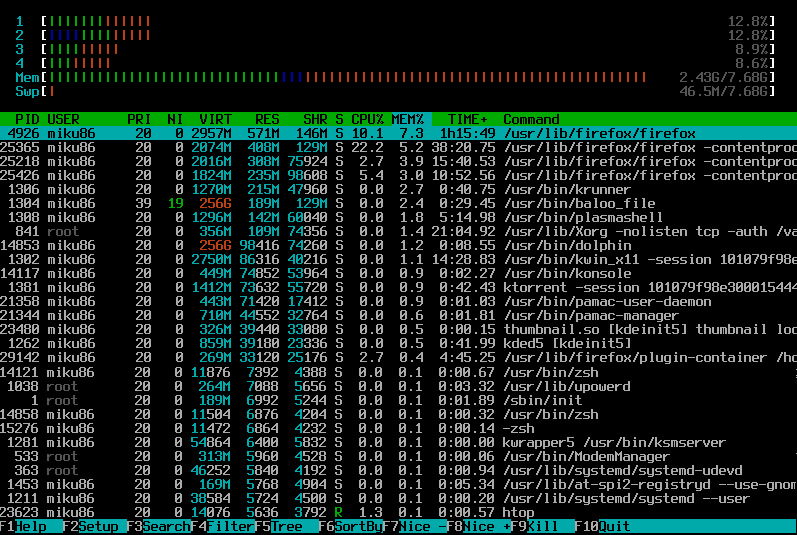
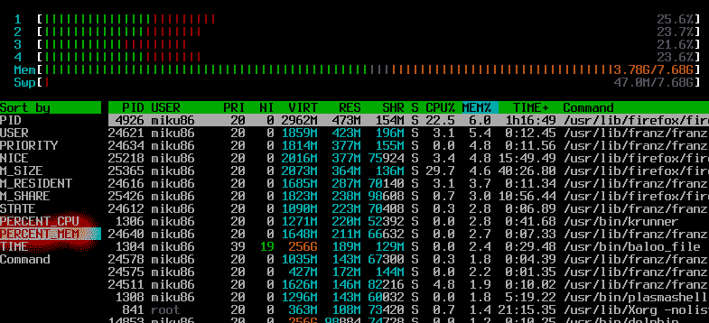
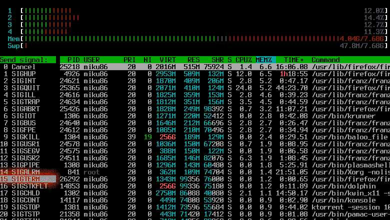

# 如何处理 Linux 系统上的简单冻结

> 原文：<https://dev.to/miku86/how-to-handle-a-simple-freeze-on-your-linux-system-35ba>

# 处理简单的 Linux 系统冻结

最近，我在火狐上按错了组合键，打开了大约 80 个标签...我的音乐播放器不停地播放。

## 解

首先，我猜你用的是桌面环境，比如 Gnome，KDE，Xfce。

试着打`Cmd + Alt + F2`。
这是一个没有链接到当前图形会话的终端。
如果按`Cmd + Alt + F2`、
打不开，试试按`Cmd + Alt + F3`。

您将看到这样一个屏幕:

现在输入你的用户名和密码。
如果成功，您将看到您的用户终端，例如 bash。
现在输入`htop`并回车。

如果你得到类似于`command not found: htop`的东西，安装`htop`，例如
`sudo apt-get install htop`或者`sudo pacman -S htop`，这取决于你正在使用的发行版。

`htop`会开起来。

在底部你可以看到一些命令。
按`F6`对列表进行排序，在左侧会打开一个菜单，
你应该导航到`PERCENT_MEM`并点击回车。

现在，列表按使用最多系统内存的进程排序。大多数时候过多使用内存会导致这种冻结。

现在导航到列表的顶部，选择可能导致冻结的应用程序，在我的情况下`/usr/lib/firefox/firefox`是一个很好的猜测。
现在按下`F9`会弹出另一个菜单。
选择`15 SIGTERM`并点击回车。

如果幸运的话，它会终止所选的应用程序。
如果不行，选择`9 SIGKILL`。

有时你必须关闭应用程序的多个实例，
你也可以在列表中找到它们。

您可以通过按`Cmd + Alt + F1`返回桌面环境。