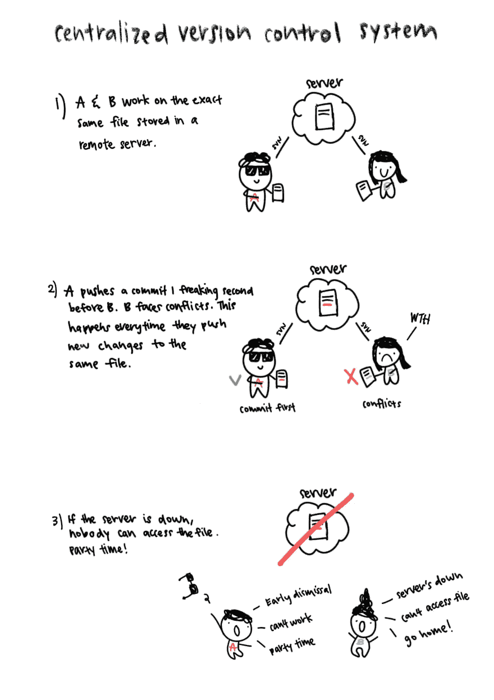
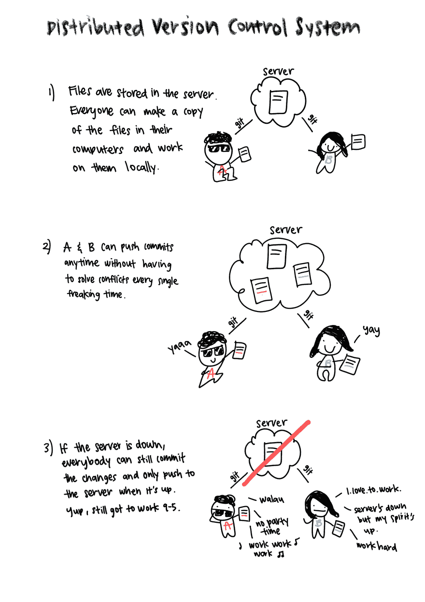

# 去吧 Github Gitflow

> 原文：<https://dev.to/annlin/git-github-gitflow-4c6n>

## 什么是 Git

Git 是 Linus Torvalds 在 2005 年创建的分布式版本控制系统。创造了 linux 的同一个人。天才。

### 集中式 vs 分布式

在 Git 之前，Apache Subversion (SVN)是流行的版本控制系统之一。SVN 是一个集中的版本控制系统，它将所有文件存储在一个中央服务器中。如果两个开发人员正在处理同一个文件，他们将不得不一直解决冲突。与 Git 不同，如果开发人员离线，他们就不能提交更改。

[](https://res.cloudinary.com/practicaldev/image/fetch/s--d4gVsILe--/c_limit%2Cf_auto%2Cfl_progressive%2Cq_auto%2Cw_880/https://thepracticaldev.s3.amazonaws.com/i/9bjayivv1qh3fnpbh4ce.jpg)

反之，
[](https://res.cloudinary.com/practicaldev/image/fetch/s--7l0BFZkb--/c_limit%2Cf_auto%2Cfl_progressive%2Cq_auto%2Cw_880/https://thepracticaldev.s3.amazonaws.com/i/btuq6stx62g369i09riu.jpg)

### Git 命令

下面是一些基本的命令，可以保存你的修改，并使用终端将它们上传到服务器(Github)。我是个终端人。没有图形用户界面。我知道 VSCode 内置了 git 的用户界面。也存在现有的 [Git 客户端](https://git-scm.com/download/gui/windows)。

```
git checkout develop # Go to develop branch
git add . # add all the files you have edited
git commit -m "Add changes to the files" # add commit message to the files you've added
git push origin master # Push the commits to master branch in the server 
```

[看看这张 git cheatsheet](https://services.github.com/on-demand/downloads/github-git-cheat-sheet.pdf)

## Github

使用 Git 的托管服务。Git 也有其他的托管服务。比如 Bitbucket 和 Gitlab。然而，我最喜欢 Github，因为 UX 是平滑的自动对焦。仅供参考，微软收购了 Github，我觉得这条推文很搞笑。

> Shanewas Niloy@ shanewasniloyGitHub 入门版
> GitHub 家庭基础版
> GitHub 家庭高级版
> GitHub 专业版
> GitHub 企业版
> GitHub 商务版
> GitHub 终极版
> Github 2018 R2
> 
> btw，等不及 Github Vista)
> 
> [#微软](https://twitter.com/hashtag/Microsoft)[# GitHub](https://twitter.com/hashtag/GitHub)2018 年 6 月 04 日 14:11 点[](https://twitter.com/intent/tweet?in_reply_to=1003640405705887744)[](https://twitter.com/intent/retweet?tweet_id=1003640405705887744)17[](https://twitter.com/intent/like?tweet_id=1003640405705887744)38

## Gitflow

文森特·德里森创立的一种流行的分支策略。我在 HOOQ 的团队正在使用它。我们将它与 [Git Hubflow](https://datasift.github.io/gitflow/) 一起使用，我们正在吐彩虹。分支策略没有对错之分，你只需要找到最适合你的团队的模式。

### 基于主干的开发工作流

每个人都只在 master branch 工作。这有助于避免导致合并冲突累积的长期分支。

#### 树枝

1.  主分支

#### 优点

*   迫使开发人员频繁地进行小的提交和更改
*   容易理解
*   快速迭代，更快出货

#### 弊

*   如果没有使用特征标志，不完整的特征可能被释放
*   容易引入 bug
*   如果开发人员处理相同的文件，经常会发生合并冲突

### Gitflow 工作流

主分支是稳定分支。没人能碰它。每个人都处理自己的特性分支，然后打开一个拉请求，将特性分支合并到开发分支。发布分支从开发分支中分支出来，然后合并回主分支和开发分支。这鼓励了持续的交付。

#### 树枝

1.  主分支
2.  开发分支
3.  特征分支
4.  发布分支
5.  修补程序分支

#### 亲

*   易于并行工作
*   发布分支对于跟踪可发布的特性很有用

#### 弊

*   第一次使用有点复杂

我会带你去一个真实的 Gitflow 解释，它是由创作者自己写的。

## Git Hubflow

通过 Github 使用 Gitflow 的一行命令。这个神奇的工具是由 [DataSift](https://datasift.github.io/gitflow/TheHubFlowTools.html) 创造的，你们是最有价值球员。

### 普通 Git 命令

```
git checkout develop
git pull origin develop
git checkout -b release/production-1.0.0
git add .
git commit -m "Add new release"
git push origin release/production-1.0.0
git checkout master
git pull origin master
git merge release/production-1.0.0
git tag production-1.0.0
git push --tags origin production-1.0.0
git checkout develop
git pull origin develop
git merge master
git push --delete release/production-1.0.0 
```

### 惊人的 Git Hubflow 命令

```
git hf release start production-1.0.0
git add .
git commit -m "Add new release"
git hf release finish production-1.0.0 
```

### 什么是最好的工作流程？

在为您的团队决定什么是最佳分支策略时，有许多因素需要考虑。你的团队需要持续交付吗？与调整现有工作流以满足他们的需求相比，您的团队成员对采用全新的工作流有多满意？

就我个人而言，我喜欢 gitflow，因为它分离了对不同特性的关注，并且易于创建具有可发布特性的版本。但是我相信没有单一的最佳工作流程。

这里的和[这里的](https://docs.microsoft.com/en-us/azure/devops/repos/git/git-branching-guidance?view=vsts)有更多文章比较不同的工作流程及其优势。

### 免责声明

我没去过 SVN。不完全正确，我试着和 SVN 一起玩，但是对我来说太复杂了。我被 git 宠坏了。插图可能有部分不准确，请指正！

也可以在 [Twitter @linxea_](https://twitter.com/linxea_) 跟我说话。我在那边很无聊。

另外，我为明天在 https://linxea.github.io/git-github-gitflow 举行的研讨会制作了一张幻灯片。用 reveal.js 感觉很花哨。

### 参考文献

[https://docs . Microsoft . com/en-us/azure/devo PS/repos/git/git-branching-guidance？view = vsts](https://docs.microsoft.com/en-us/azure/devops/repos/git/git-branching-guidance?view=vsts)
[https://datasift.github.io/gitflow/IntroducingGitFlow.html](https://datasift.github.io/gitflow/IntroducingGitFlow.html)
[https://www . endoflineblog . com/oneflow-a-git-branching-model-and-workflow](https://www.endoflineblog.com/oneflow-a-git-branching-model-and-workflow)