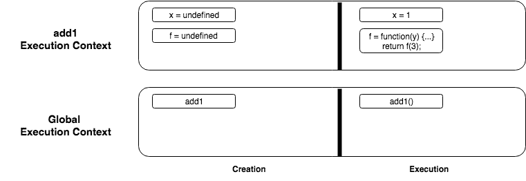
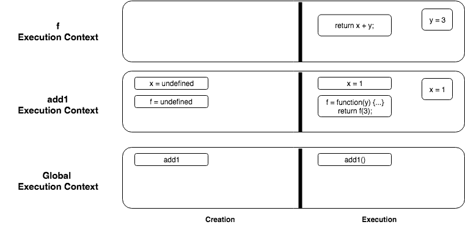
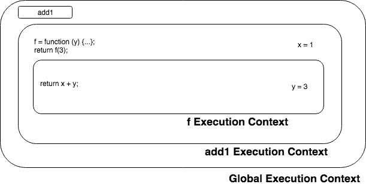
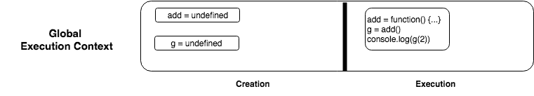
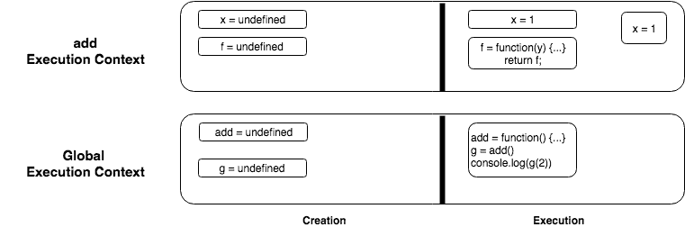
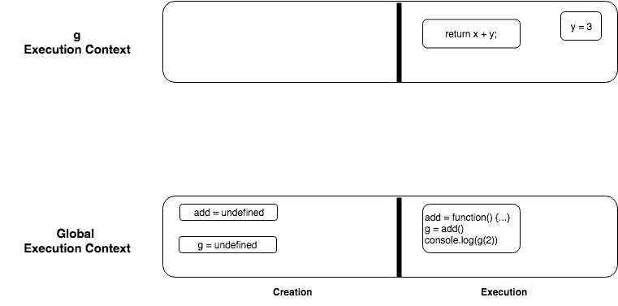
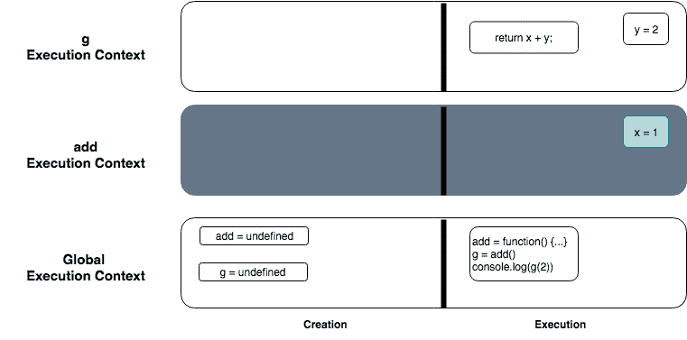
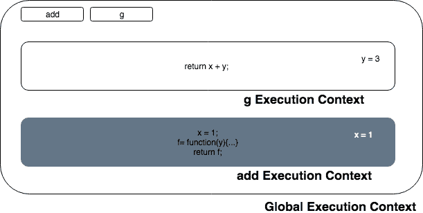

# 理解 Javascript 闭包

> 原文：<https://dev.to/yaminmhd/understanding-javascript-closures-1fk7>

[](https://res.cloudinary.com/practicaldev/image/fetch/s--OPKOGbii--/c_limit%2Cf_auto%2Cfl_progressive%2Cq_auto%2Cw_880/https://thepracticaldev.s3.amazonaws.com/i/nz2s77281zecs8fnu9in.jpeg)

这确实是一个很难理解的概念，我花了一段时间才理解什么是闭包。这是我对图表和代码片段的理解，以便更好地可视化

为了让我的大脑活跃起来，我将从一个不涉及闭包的例子开始，慢慢地把我的例子改成在最后涉及闭包

```
function add1(){
  var x = 1;
  var f = function(y){
    return x + y;
  }
  return f(3);
}

console.log(add1()); 
```

这里我们有一个简单的函数叫做`add1`。

*   它有一个值为`1`的局部变量`x`
*   被赋予函数的另一个变量`f`
*   这个`add1`函数返回函数`f`

因此，如果我们运行这段代码，它将返回`4`，其中`x` = 1，`y` = 3

因为我们有一个函数声明，并且该函数是在 console.log 中调用的。执行上下文如下:

[](https://res.cloudinary.com/practicaldev/image/fetch/s--H9ZEBkpZ--/c_limit%2Cf_auto%2Cfl_progressive%2Cq_auto%2Cw_880/https://thepracticaldev.s3.amazonaws.com/i/4t547f2ef0i1s1rz72e6.png)

因此，首先，我们将创建`global execution context`。我们将有`creation`和`execution`阶段。在`creation`阶段，我们将把`add1`功能提升到范围的顶部，在`execution`阶段，我们将执行`add1`功能

调用`add1`函数将创建`add1`执行上下文，如下:
[](https://res.cloudinary.com/practicaldev/image/fetch/s--DS1pXX6A--/c_limit%2Cf_auto%2Cfl_progressive%2Cq_auto%2Cw_880/https://thepracticaldev.s3.amazonaws.com/i/jjseosysl1f21lcx0yf5.png)

在这个执行上下文中，我们将在`creation`阶段提升变量`x`和`f`，这两个变量在`creation`阶段都是未定义的。在`execution`阶段，`x`被赋予`1`的值，而`f`被赋予接受参数`y`的函数。赋值后，返回函数调用`f(3)`；

[](https://res.cloudinary.com/practicaldev/image/fetch/s--_zXPPc7b--/c_limit%2Cf_auto%2Cfl_progressive%2Cq_auto%2Cw_880/https://thepracticaldev.s3.amazonaws.com/i/312s23b87nfi7v68nsba.png)

这创建了另一个执行上下文，称为 f。在`f`执行上下文中，我们在创建阶段没有提升任何东西，因为没有声明变量或函数。在执行阶段，它返回`x+y`，其中`x`的值是从`add1`执行上下文中的范围链中检索的，而`y`的值是由`f(3)`传入的

所以总的来说`x`是`1`，`y`是`3`。返回`4`。在每个 EC 被执行后，它会被一个接一个地弹出堆栈。

让我们看看范围链
[](https://res.cloudinary.com/practicaldev/image/fetch/s--HO3rXinA--/c_limit%2Cf_auto%2Cfl_progressive%2Cq_auto%2Cw_880/https://thepracticaldev.s3.amazonaws.com/i/zj3uhvufbk0zhln7g7vh.png)

在`f`执行上下文中，它返回`x+y`。在这个上下文中，`y`的值是容易得到的，因为它是`3`的值，但是`x`的值不是。因此，它引用外部执行上下文并检索`x`的值，即`1`。

* * *

咳..太多了。希望您能够掌握执行上下文和范围。所以，现在我们准备开始做一些与闭包相关的更复杂的事情。下面是代码片段

```
var add = function() {
  var x = 1;
  var f = function(y) {
    return x + y;
  };
  return f;
};

var g = add();
console.log(g(3)); 
```

这个例子不同于第一个例子，在第一个例子中，我们现在返回的是对函数的引用，而不是值。那么当调用`g(3)`时，我们正在调用函数`add`范围之外的函数。这部分可能很难理解。

因此，让我们再看一遍执行上下文，看看这是怎么回事。首先是全局执行上下文

[](https://res.cloudinary.com/practicaldev/image/fetch/s--sq0K4snL--/c_limit%2Cf_auto%2Cfl_progressive%2Cq_auto%2Cw_880/https://thepracticaldev.s3.amazonaws.com/i/stkt5plsu7dhrka35l3v.png)

后跟`add`执行上下文

[](https://res.cloudinary.com/practicaldev/image/fetch/s--5h1_Sre3--/c_limit%2Cf_auto%2Cfl_progressive%2Cq_auto%2Cw_880/https://thepracticaldev.s3.amazonaws.com/i/iwkgp70xlmq323nupl3m.png)

现在有趣的部分来了。一旦`add`执行上下文执行完毕，它将被弹出堆栈

[](https://res.cloudinary.com/practicaldev/image/fetch/s--sq0K4snL--/c_limit%2Cf_auto%2Cfl_progressive%2Cq_auto%2Cw_880/https://thepracticaldev.s3.amazonaws.com/i/stkt5plsu7dhrka35l3v.png)

接下来将是 g(3)执行上下文。记住变量`g`包含函数`f`,因为这是在`add`函数中返回的函数。

[](https://res.cloudinary.com/practicaldev/image/fetch/s--Aw4mXZ4F--/c_limit%2Cf_auto%2Cfl_progressive%2Cq_auto%2Cw_880/https://thepracticaldev.s3.amazonaws.com/i/9nn04jp2s8mjpso394cv.png)

所以`g`会返回`x + y`。我们正在运行`g(3)`，因此`y`的值将是 3。
`x`的价值呢？

如果我们四处看看，我们将找不到`x`。但是我们记得在另一个被创建、执行和弹出的执行上下文中，`x`被设置为`1`。

所以在`Javascript`中，如果一个函数是在另一个类似`g`的函数内部创建的。因此`g`将保留对变量的引用，这些变量在我们的例子`add`中是在封闭函数的范围内。所以意味着`g`仍然可以访问`add`的执行上下文的内存，这包括变量`x`。

[](https://res.cloudinary.com/practicaldev/image/fetch/s--V9kjWulQ--/c_limit%2Cf_auto%2Cfl_progressive%2Cq_auto%2Cw_880/https://thepracticaldev.s3.amazonaws.com/i/jrojqnwwdsp38od8gjoi.png)

基本上，`add`执行上下文已经结束，但是`g`仍然被允许访问执行上下文的变量，这些变量仍然在`add`的执行上下文的内存中。

我们的函数`g`仍然可以沿着作用域链向上查找`x`,尽管它已经不在执行堆栈中了。

`g's`执行上下文有`closed in` `x`，即使`x's`执行上下文没有了，它也是一个外部变量。所以我们的函数`g`是一个`closure`。

像`g`函数这样的闭包在内部存储对外部变量的引用。

让我们来看看这个
[](https://res.cloudinary.com/practicaldev/image/fetch/s--Y11GVP2t--/c_limit%2Cf_auto%2Cfl_progressive%2Cq_auto%2Cw_880/https://thepracticaldev.s3.amazonaws.com/i/jgk1tbm2jcls74ekuqlc.png) 的作用域链

我们有全局执行上下文范围。我们将拥有`add`和`g`变量以及它们的执行上下文。

在第`var g = add();`行结束后，添加执行上下文从堆栈中弹出。(由于这个原因，它被加了阴影)

然后，我们创建并执行`g`执行上下文。即使在`x's`执行上下文不再在堆栈上之后，它仍然能够引用`x`外部变量

* * *

希望您能够从这篇文章中了解到什么是闭包。如果你仍然困惑，请阅读以下参考。

以下是我用来加深对这个主题的理解的主要参考资料
[执行上下文的最终指南](https://tylermcginnis.com/ultimate-guide-to-execution-contexts-hoisting-scopes-and-closures-in-javascript/)