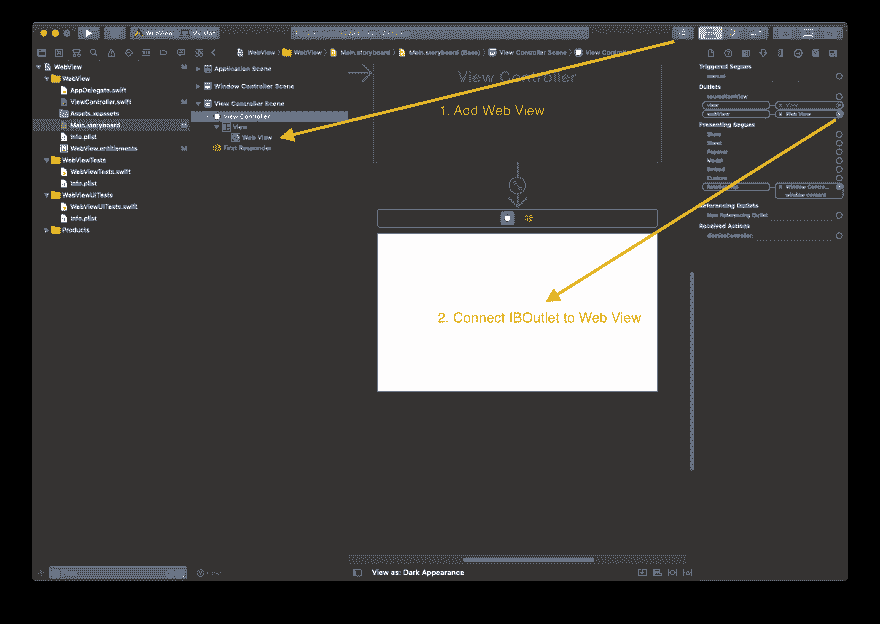
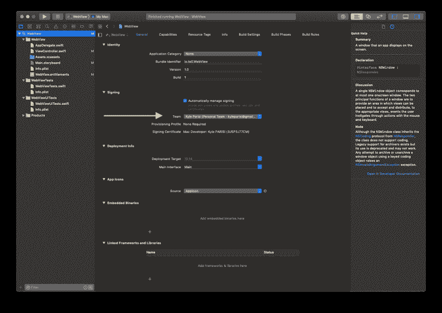
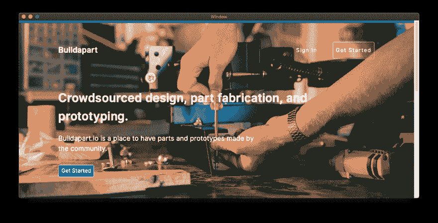

# OSX 最简单的 WebView 应用程序

> 原文：<https://dev.to/kyleparisi/the-most-simple-webview-app-for-osx-57l3>

# 鲜为人知的事实

我曾经是一名 3D 打印机技术员。在那里工作时，iphone 应用程序在软件世界风靡一时。我想学习。我问我的老板，如果我利用我的休息时间为他们开发一个 iOS 应用程序，他们会不会同意，尽管我不知道该怎么做。他们说去吧。

## 它做了什么

我记得它有 4 个屏幕。一个是单位转换计算器(英寸到毫米等)。另一个屏幕是我雇主的主页。另外两个只是关于应用程序本身和什么是 3d 打印的信息。我用“3D 打印”这个惊艳的名字放在 app store 上。

## 你也可以

我总是忘记如何制作一个应用程序来显示一个网页，所以希望这将有助于我在未来。所以下面是用 xcode 做了一个基础可可 app 之后需要的东西:

```
//  ViewController.swift

import Cocoa
import WebKit

class ViewController: NSViewController {

    @IBOutlet weak var webView: WKWebView!
    let url = "https://buildapart.io"

    override func viewDidLoad() {
        super.viewDidLoad()

        // Do any additional setup after loading the view.
        let request = URLRequest(url: URL(string: url)!)
        webView.load(request)
    }
} 
```

<figure>

[](https://res.cloudinary.com/practicaldev/image/fetch/s--OzE_GPFA--/c_limit%2Cf_auto%2Cfl_progressive%2Cq_auto%2Cw_880/https://thepracticaldev.s3.amazonaws.com/i/q4kt6ms10xwr69ltmagc.png)

<figcaption>Link IBOutlet webView to the Web View in your storyboard</figcaption>

</figure>

<figure>

[](https://res.cloudinary.com/practicaldev/image/fetch/s---zQPHQpw--/c_limit%2Cf_auto%2Cfl_progressive%2Cq_auto%2Cw_880/https://thepracticaldev.s3.amazonaws.com/i/63dkby676je7me0h7u4j.png)

<figcaption>Sign your app</figcaption>

</figure>

<figure>

[](https://res.cloudinary.com/practicaldev/image/fetch/s--ASOBExUD--/c_limit%2Cf_auto%2Cfl_progressive%2Cq_auto%2Cw_880/https://thepracticaldev.s3.amazonaws.com/i/5q1ffakqk7k8ygb9an9i.png)

<figcaption>Allow your app to have outgoing connections</figcaption>

</figure>

现在`CMD+R`运行应用程序。

<figure>

[](https://res.cloudinary.com/practicaldev/image/fetch/s--1Y9d-RXb--/c_limit%2Cf_auto%2Cfl_progressive%2Cq_auto%2Cw_880/https://thepracticaldev.s3.amazonaws.com/i/zwfx2gxt8t12owk358r5.png)

<figcaption>What I made!</figcaption>

</figure>

### 我不能保证你不会有问题

Xcode 是一个非常挑剔的工具。我第一次在我的工作笔记本电脑上尝试这个教程，但是应用程序无法启动。这可能是因为第一次运行应用程序签名时未能访问 keychain。我公司关于笔记本电脑的公司政策可能会阻止某些活动。如果 xcode 没有显示错误，请尝试查看`Applications > Utilities`文件夹中不太为人所知的`Console.app`。祝你好运！

[源代码](https://github.com/kyleparisi/WebView)