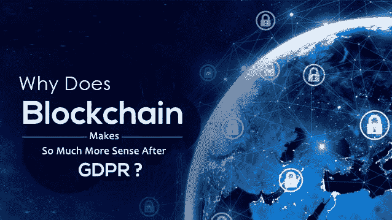

# 为什么区块链在 GDPR 之后变得更有意义？

> 原文：<https://dev.to/wenso_smith/why-does-blockchain-makes-so-much-more-sense-after-gdpr-327c>

区块链基本上是信息记录和分发的一种创新，它避免了第三方的采购，以促进数字关系。它是以全新方式应用的成熟技术的结果。

这项技术是由 [**中本聪**](https://en.wikipedia.org/wiki/Satoshi_Nakamoto) 创造的，他将三项技术协调在一起，这三项技术是互联网、私钥加密和将激励机制纳入安排的协议。这个**区块链技术**关于 [**比特币**](http://www.wenso.co.uk/news/what-is-bitcoin-why-is-bitcoins-price-so-high/) 等加密货币被频繁使用；事实上，如果没有区块链技术，这些数字货币永远不会存在。

在数字世界中，基于区块链的平台以匿名方式存储数据，并且允许数据集被销毁，甚至不公开其细节。这些数据集完全可以按照 GDPR 要求销毁。这就是区块链技术将被频繁用于 GDPR 的 [**实现的原因。**](http://www.wenso.co.uk/gdpr-consulting-services/gdpr-compliance-implementation/)

GDPR 完全是关于数据处理的，在它的存在下，区块链技术很有意义。

数据控制器和处理器在 GDPR 下发挥着关键作用，它们在 GDPR 的指导下工作。根据 GDPR 要求，无论一方是控制者还是处理者，仔细评估区块链网络中涉及的各方的隐私角色仍然很重要。然而，考虑到涉及多方和处理类别，这是一项具有挑战性的任务。

区块链可以分为两大类:私有(这种类型由有限的一群人控制)和公共(这种类型不受任何人控制)。

GDPR 的主要目标是集中控制用户数据访问权限的服务，这与区块链流程相反。需要注意的是，并非所有技术都能与 GDPR 兼容，除非它们提供了行使数据的权利；这在区块链技术的一般情况下是真实的，区块链技术不完全必须适应 GDPR 规范。这仅仅意味着数据不能用于处理个人目标。

区块链技术可以与云计算系统相比较，在云计算系统中，云系统的操作者是数据处理器本身，将数据上传到云的用户是数据处理器本身。然而，并不是所有的区块链系统都必须有一个中央操作员或管理员。这意味着在区块链技术下运行的系统可以由对等网络中的所有用户操作，区块链系统中的每个参与者都可以充当自己的数据控制器和他人的数据处理器。

区块链技术涉及基于不同位置的多台计算机。因此，需要时间来理解应根据哪一项管辖权规则进行汇编。而 GDPR 在更广的地域范围内适用于数据控制器或数据处理器。欧洲数据保护规则最有可能适用于大多数基于区块链的活动，即使它与欧洲几乎没有联系。

*最初发表于*[*【www.wenso.co.uk】*](http://www.wenso.co.uk/news/blockchain-makes-much-sense-after-gdpr/)*。*