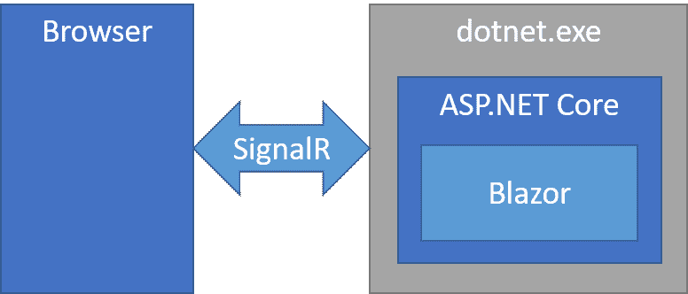
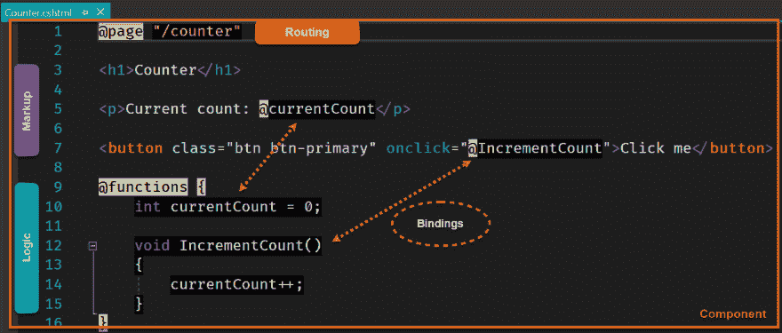
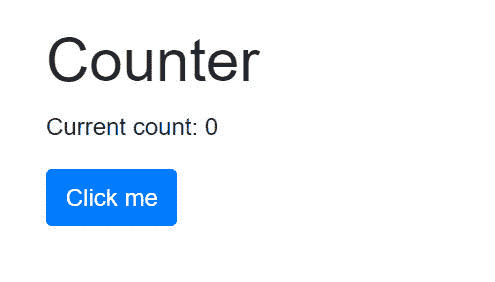

# 2019 年面向无 JavaScript 前端的 Razor 组件

> 原文：<https://dev.to/progresstelerik/razor-components-for-a-javascript-free-frontend-in-2019-1f6o>

承诺提供 JavaScript 替代品的服务器应用程序架构会成为。2019 年网文开发者？在本文中，我们将讨论 Razor Components，这是一个新的框架，承诺由。NET 技术，如 C#。NET 标准和 SignalR。

承诺提供 JavaScript 替代品的服务器应用程序架构会成为。2019 年网文开发者？在本文中，我们将讨论 Razor Components，这是一个新的框架，承诺由。NET 技术，如 C#。NET 标准和 SignalR。这项新技术正处于发展的路线图上。NET Core 3.0 显示出了巨大的潜力。

Razor 组件，是最初在 2018 年初作为 [**Blazor** 服务器端](https://dev.to/progresstelerik/a-breakdown-of-blazor-project-types-2b4g-temp-slug-848040)开始的。Blazor 是一个. NET 单页面 web 应用程序框架，通常与[相关联。NET 运行在 Web 组件上](https://dev.to/progresstelerik/goodbye-javascript-hello-webassembly-6oc-temp-slug-9525238)。然而，Blazor 能够在多种场景下运行，包括作为. NET 标准应用程序的服务器端**，也称为 Razor 组件**。Blazor 和 Razor 组件本质上是一样的，除了它们执行的地方。Blazor 使用 web assembly 运行在浏览器上，而 Razor Components 运行在服务器上。Razor Components 将浏览器视为“瘦客户端”,其中 web 浏览器只处理用户界面(UI ),服务器接收事件并远程响应 UI 更新。对于用户来说，该应用程序与其他任何 web 应用程序都没有区别。

> 作者注:在我看来，目前“剃须刀组件”的名称选择导致混乱。澄清我们正在讨论的内容:
> 
> *   Razor 是一个模板标记语法。网
> *   **Blazor** 是一个基于. NET 的 web 框架，*可以*使用 WebAssembly 或 as 在客户端上运行:
> *   **Razor 组件** -服务器上运行的 Blazor 框架

从表面上看，Razor 组件的概念带来了它所要回答的更多问题，所以让我们更深入地挖掘架构。

## 服务器-客户端架构

Razor Components 有一个独特的体系结构，它允许. NET 应用程序在服务器端运行，而用户界面在远程浏览器的进程外运行。的组合。NET Core 和 SignalR 允许我们不用 JavaScript 就能编写 web 应用程序。

### 直指“核心”

剃须刀组件是几个的组合。NET 核心技术。首先，剃须刀组件应用程序利用了[。网标 2.0](https://docs.microsoft.com/en-us/dotnet/standard/net-standard) 。建筑用。净标准意味着剃须刀组件有一个大的。NET API 接口，因为它与其他接口兼容。NET 标准库。此外，Razor Components 是一个. NET 核心应用程序，因此可以使用任何操作系统来构建和部署它。快速看一下剃须刀的内部组件`.csproj`显示出我们很熟悉。净领域。应用程序类型甚至是一个`EXE`，这告诉我们这是一个可执行文件。>在。NET Core 实际输出是一个可执行文件。dll，而不是文字. exe.

```
<PropertyGroup>
  <TargetFramework>netstandard2.0</TargetFramework>
  <OutputType>Exe</OutputType>
  <LangVersion>7.3</LangVersion>
  <!-- ... -->
</PropertyGroup> 
```

那么，我们该如何处理这个可执行文件，以及如何将它转化为一个神奇的瘦客户端 web 应用程序呢？为了理解这一点，我们需要看看服务器和客户机的关系。

### 现供应剃须刀组件

在服务器上，应用程序由 ASP.NET 核心托管。这又是一个典型的 ASP.NET 核心应用程序，是托管其他 ASP.NET 核心应用程序的基础，包括:MVC、WebAPI 和 Razor Pages。在 Razor 组件应用程序中，主机使用服务和中间件在 HTTP 管道中注册应用程序。查看服务器应用程序的`Startup.cs`,我们可以看到服务和中间件配置。

> 在撰写本文时，Razor 组件在相关的 API 中仍被称为`ServerSideBlazor`。

```
public void ConfigureServices(IServiceCollection services)
{
  // ...

  // adds the Server-Side Blazor services, and those registered
  // by the app project's startup
  services.AddServerSideBlazor<App.Startup>();

  // ...
}

// This method gets called by the runtime. Use this method to
// configure the HTTP request pipeline.
public void Configure(IApplicationBuilder app,
                      IHostingEnvironment env)
{
  // ...

  // Use component registrations and static files from the
  // app project.
  app.UseServerSideBlazor<App.Startup>();

  // ...
} 
```

一旦服务器应用程序准备好了，我们就可以发出一个初始的 web 请求，这将引导我们将浏览器设置为“瘦客户机”。

### 瘦客户机信号

在向服务器发出请求时，我们接收回应用程序的静态文件。与大多数典型的 web 应用程序一样，我们接收 HTML。使用 Razor 组件，客户端收到的第一个文件是启动客户端应用程序的`Index.html`文件。客户端应用程序是框架中包含的一个 JavaScript 文件，`blazor.server.js`。这个应用程序是一个特殊的 SignalR 客户端，负责接收/处理来自服务器的 DOM 更改，向服务器发送事件，最重要的是建立与服务器的 WebSocket 连接。

客户端和服务器之间的通信是通过 SignalR 以二进制数据的形式完成的。数据包只包含必要的 DOM 更改，而不是整个呈现的 DOM。Razor 组件不需要担心 ASP.NET web forms 的视图状态。

[](https://res.cloudinary.com/practicaldev/image/fetch/s--dLZdYxSz--/c_limit%2Cf_auto%2Cfl_progressive%2Cq_auto%2Cw_880/https://i.imgur.com/yk919v4.png)

理解了客户机-服务器关系之后，现在我们可以把注意力集中在框架的 UI 部分。

## 编写 Web UIs 剃刀和 C

因为 Razor Components 作为. NET 标准应用程序运行服务器端，所以逻辑是用。NET 技术。这是可能的，因为 Blazor 框架使用了`RenderTree`、**一个 DOM 抽象**，类似于 Angular 和 React 等流行 JavaScript 框架中使用的虚拟 DOM。让我们从框架的 UI 方面来理解组件是如何编写的。

### 组件基础知识

Razor 是 ASP.NET MVC 3.0 中引入的流行的模板标记语法。Razor 因其简单性而广受欢迎，因为它需要一个`@`符号来开始一个没有明确结束标记的代码块。与使用 Razor 显式编写 HTML 的 MVC 框架不同，Razor 组件发出一个 RenderTree。在 Razor 组件中，每一个`.cshtml`文件都是一个可以作为元素使用的组件，例如:`Widget.cs`变成了`<Widget>`。从下图中可以看出继承了简单的传统，因为组件的大部分概念可以从一些基本的注释中理解。

[](https://res.cloudinary.com/practicaldev/image/fetch/s--Lr3QLwt_--/c_limit%2Cf_auto%2Cfl_progressive%2Cq_auto%2Cw_880/https://i.imgur.com/SenMDDw.jpg)

组件的头部定义了组件的特殊特性或特征，例如:路由、布局和依赖注入。在图像中，我们可以看到这个组件有一条由`@page "/counter"`指定的路线。该组件在访问路线`/component`时充当页面，另外该组件可以作为元素`<Counter>`在其他组件中使用。

组件内的所有标记都成为 RenderTree 的一部分。这与 React 中使用`.jsx`的方式有些相似。给定示例`<h1>Counter</h1>`，当构建渲染树`builder.AddMarkupContent(0, "<h1>Counter</h1>\n\n");`时，框架将在幕后创建以下代码。抽象出 RenderTree 后，开发人员可以专注于用 Razor 和 HTML 编写组件。

组件逻辑在`@funcitons`块中被写成 C#。使用 Razor 语法绑定字段、属性和事件。从组件标记中的代码块引用事件或值就像使用`@propertyName`一样简单。

[](https://res.cloudinary.com/practicaldev/image/fetch/s--4_chLqtq--/c_limit%2Cf_auto%2Cfl_progressive%2Cq_auto%2Cw_880/https://i.imgur.com/62W7nkD.jpg)

### 组件参数

组件的概念不仅仅是封装标记。为了创建可重用的组件，我们需要能够与组件通信。组件支持使用参数来绑定数据和事件。在组件中使用`[Parameter]`属性公开属性以供使用。在下面的计数器组件中，添加了`[Parameter]`属性，以允许使用者指定计数的增量。

```
<p>Current count: @currentCount</p>
<button class="btn btn-primary" onclick="@IncrementCount">
  Click me
</button>

@functions {
  int currentCount = 0;

  [Parameter] protected int CountBy { get; set; } = 1;

  void IncrementCount()
  {
    currentCount += CountBy;
  }
} 
```

在另一个文件中，我们现在可以设置组件元素的`CountBy`值。

```
<Counter CountBy="5"></Counter> 
```

参数`CountBy`也可以绑定到页面上的其他组件，允许用户动态设置值。例如，我们可以在页面上放置一个输入，并将其值绑定到`CountBy`属性。现在，通过改变输入的值，计数器的行为可以在运行时改变。

```
<Counter CountBy="@countBy"></Counter>
<input bind="@countBy" type="number" />

@functions {
  int countBy = 5;
} 
```

组件模型易于学习，但为构建复杂的 ui 提供了一个健壮的基础。额外的库也可以用来支持应用程序逻辑和 UI 体验。

## 广泛的选项:包括 JavaScript

因为剃刀部件利用了。NET 和浏览器，该架构允许一些有趣的集成点。

### [T1。NET 标准及以上](#net-standard-and-beyond)

由于 Razor Components 是一个. NET 核心应用程序，它可以与。NET 标准库，这意味着现有的 NuGet 包和 SDK 可以兼容。这包括大部分。NET 标准库，前提是它们不与平台紧密相关的技术交互，也不依赖于这些技术。例如，像 **[MarkDig](https://github.com/lunet-io/markdig)** 这样用于将 Markdown 解析成 HTML 的库是兼容的，因为它除此之外没有依赖关系。NET 标准 2.0。在写作的时候，即使是先进的。基于. NET 的机器学习 SDK-[ML.NET 在用作剃须刀组件应用](https://github.com/EdCharbeneau/BlazorShcMLDotnet)中的服务时是兼容的。

### JavaScript 互操作性

此外，Razor Components 应用程序可以使用 JavaScript 生态系统的依赖关系，并且通过互操作层，应用程序可以与二者双向通信。NET 和 JavaScript 依赖关系。这对于 Razor 组件不支持必要的浏览器/DOM API 或者现有的 JavaScript 库有用的情况很有帮助。

虽然 Razor 组件中的组件模型可以解决大多数 UI 需求，但是仍然需要一些 DOM APIs。例如，Razor 组件不支持直接获取用户的地理位置信息。为了以 DOM API 的形式访问这个特性，Razor 组件可以通过 JavaScript 互操作层调用浏览器中的 JavaScript 实现。

下面的例子展示了如何编写 C#抽象来与浏览器的地理位置 API 接口，特别是 [`getCurrentPosition`方法](https://developer.mozilla.org/en-US/docs/Web/API/Geolocation/getCurrentPosition)。从。NET 中，`JSRuntime.Current.InvokeAsync`方法用于**调用一个 JavaScript 模块** `interopGeolocation.js`。

```
// GeoLocation.cs (.NET)
public class Geolocation
{
  // ...

  public async Task GetCurrentPosition(
    Action<Position> onSuccess,
    Action<PositionError> onError,
    PositionOptions options = null)
  {
    OnGetPosition = onSuccess;
    OnGetPositionError = onError;
    await JSRuntime.Current.InvokeAsync<bool>(
      "interopGeolocation.getCurrentPosition",
      new DotNetObjectRef(this),
      options);
  }

  // ...
} 
```

通过`invokeMethodAsync`, JavaScript 模块能够回调。NET 返回结果。

```
// interopGeolocation.js (Browser)

window.interopGeolocation = {
  getCurrentPosition: function (geolocationRef, options) {
    const success = (result) => {
      geolocationRef.invokeMethodAsync(
        'RaiseOnGetPosition',
        interopGeolocation.toSerializeable(result));
    };
    const error = (er) =>
    geolocationRef.invokeMethodAsync(
      'RaiseOnGetPositionError',
      er.code);
    navigator.geolocation.getCurrentPosition(
      success,
      error,
      options);
},

// ... 
```

然后，该抽象在应用程序中作为普通的 C#代码使用。这个互操作可以写成一个. NET 库，可以在许多项目之间共享。

```
// Index.cshtml (Application usage)

// Component initialized
protected override async Task OnInitAsync()
{
  var g = new Geolocation();
  await g.WatchPosition(Handler, HandleError);
}

void Handler(Position p)
{
  Lat = p.Coords.Latitude;
  Long = p.Coords.Longitude;
} 
```

理想情况下，一旦为 API 创建了一个互操作，就不应该再创建它了。

## ASP.NET 核心 3.0 时间轴

Razor Components 在 DotNET Conf 期间首次发布。预计剃须刀组件将于 2019 年年中与 ASP.NET 核心 3.0 一起发货。以下[引自 Daniel Roth 的话解释了 Blazor 和剃须刀组件](https://blogs.msdn.microsoft.com/webdev/2018/10/02/blazor-0-6-0-experimental-release-now-available/)的近期目标。

> 我们的主要目标仍然是支持在浏览器中运行 Blazor 客户端。在 WebAssembly 上运行 Blazor 客户端的工作将继续与 Razor 组件的工作并行进行，尽管在我们解决运行问题的同时，它仍将保持一段时间的实验性。NET 上的 WebAssembly。然而，我们将保持组件模型不变，不管您是运行在服务器上还是客户端上。您可以通过更改一行代码来切换您的 Blazor 应用程序在客户端或服务器上运行。去看布拉索。NET Conf talk 来看看这是怎么回事，并了解更多关于我们 Razor 组件的计划:

### 入门

如果你是那种喜欢早期测试的开发人员，你现在就可以尝试 Blazor 组件。在撰写本文时，Razor Components 仍被冠以服务器端 Blazor 的品牌，可以在[Blazor.NET](https://blazor.net/docs/get-started.html)找到。遵循 get 下的说明，并确保选择“Blazor(ASP.NET 核心中的服务器端)”项目类型。

[](https://res.cloudinary.com/practicaldev/image/fetch/s---gyQQu1P--/c_limit%2Cf_auto%2Cfl_progressive%2Cq_auto%2Cw_880/https://bn1301files.storage.live.com/y4mphzF6py3QC-lwBagwptDg7GFqzQZ2HZ_G9zhKh1DfDD9Taa2rXpQfcBghlKOs1KhIr66bkMAUWTTVvNuLelibXtkE5kOd9BMJ1oHW_W5tBravx0oAnp3Ds2QsnrP1kkai8a0uqvBW0GwPZLOiOyMamRqfAay9I1F3HMaEkMCmXqFzOir0V7mFdEbZRICVUl2f62OhMdWck1VOgCkkVIEKg/razor-components.jpg%3Fpsid%3D1%26width%3D170%26height%3D188)

### 优点&缺点

因为只需要少量的 JavaScript 来引导客户端，所以不需要。NET 程序集被传输到客户端。即使在运行期间，网络流量也很小，因为浏览器“瘦客户机”和服务器之间的通信是一个很小的二进制数据包。但是，因为使用了 web 套接字，所以客户端和服务器必须始终保持连接。这意味着 Razor 组件应用程序不能在离线模式下工作。如果脱机模式是您的应用程序必须的，那么 WebAssembly 等价的 Blazor 应用程序可能是一个更好的选择。尽管如此，Blazor 尚未收到官方发布日期或微软的支持承诺。

#### 用天蓝色刻度

一些人关心的最后一点可能是“剃须刀组件如何扩展”的问题由于 Razor Components 是用 SignalR 构建的，所以它具有 Azure 的优势。Azure SignalR 服务是一个完全托管的服务基础架构，可与 ASP.NET 核心 SignalR 无缝协作。集成 SignalR 服务只需很少的代码修改，即可添加自动容量供应、扩展或持久连接。

## 包装完毕

Blazor 框架的服务器端实现 Razor Components 是 web 开发的一个新尝试。通过将 web 浏览器用作瘦客户机，Razor 组件为 JavaScript 框架提供了一种新的替代方案。它的组件模型足够简单，可以保持很短的学习曲线，但是足够健壮，可以非常高效地工作。即使剃须刀组件是新的，它的能力使用现有的。NET 库、工具和可选的 JavaScript 生态系统使其成为前端 web 开发的有力候选。