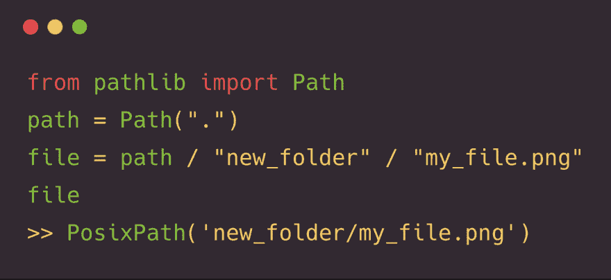

# 发现 pathlib 模块

> 原文：<https://dev.to/barrachri/discovering-the-pathlib-module-44g>

> 克里斯蒂安巴拉@克里斯蒂安巴拉我越用 [#Python](https://twitter.com/hashtag/Python) pathlib，我就越喜欢它。[# europpython](https://twitter.com/hashtag/EuroPython)2018 年 7 月 26 日上午 11:00[](https://twitter.com/intent/tweet?in_reply_to=1022436417887248384)[](https://twitter.com/intent/retweet?tweet_id=1022436417887248384)57[](https://twitter.com/intent/like?tweet_id=1022436417887248384)172

[Python 标准库](https://docs.python.org/3/library/index.html)就像一座金矿， [pathlib](https://docs.python.org/3/library/pathlib.html#module-pathlib) 模块真的是一块宝石。

在不同的文件系统(posix 和 Windows)之上提供了一个有用的抽象。

但这只是你能拥有的非常友好的用户体验的一小部分。

```
# files in my folder
README.md  example.py subfolder/README.md 
```

我们可以从`pathlib`
导入`Path`

```
from pathlib import Path

path = Path(".")
# PosixPath('.') 
files = [file for file in path.iterdir()]
# [PosixPath('subfolder'), PosixPath('README.md'), PosixPath('example.py')] 
```

`Path()`返回(在本例中)一个带有非常方便的`iterdir`的`pathlib.PosixPath`对象，当你的文件夹中有很多文件时，这是一个非常有用的生成器。

```
path.iterdir()
<generator object Path.iterdir at 0x10aca2cf0> 
```

您想只获取特定格式的文件吗？

```
md_files = [
    file for file in path.iterdir() if file.suffix == '.md'
    ]
# [PosixPath('README.md')] 
```

使用`glob`
可以得到类似的结果

```
md_files = [file for file in path.glob("*.md")]
# [PosixPath('README.md')] 
```

`glob`非常强大，使用`**`模式你可以递归搜索

```
md_files = [file for file in path.glob("**/*.md")]
# [PosixPath('README.md'), PosixPath('subfolder/README.md')] 
```

如果你想了解更多关于`pathlib`模块的知识，那么 [PEP 428](https://www.python.org/dev/peps/pep-0428/) 和[官方文档](https://docs.python.org/3/library/pathlib.html#module-pathlib)是开始的正确地方。