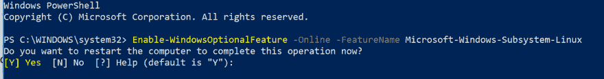
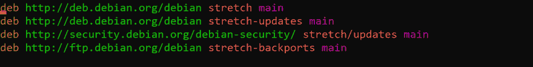
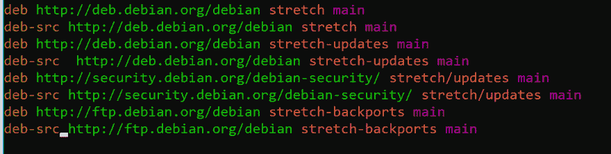
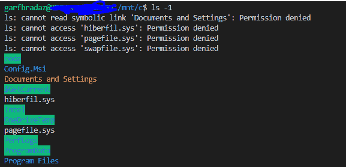
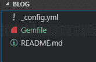

# 设置 Github Pages Jekyll 并使用 Linux 的 Windows 子系统

> 原文：<https://dev.to/garfbradaz/setting-up-github-pages-jekyll-and-using-windows-subsystem-for-linux-470h>

## 设置 Github Pages、Jekyll 和使用 Linux 的 Windows 子系统

第一个*如何*建立博客和编辑博客所需的工具。我是一个 Windows 粉丝(我喜欢我的 Surface 设备)，但我也开始欣赏 Linux，所以这是一个设置我的 Surface Book 使用 Linux 的 [Windows 子系统的绝佳机会，它允许你通过命令行访问 Linux。我确信这不是虚拟机，而是 Windows 和 Linux 本身之间的](https://docs.microsoft.com/en-us/windows/wsl/faq)[系统调用映射](https://blogs.msdn.microsoft.com/wsl/2016/04/22/windows-subsystem-for-linux-overview/)，到实际的 Linux 二进制文件本身。

我将提供如何设置我的 Surface Book 的说明。您可能需要根据自己的需要进行调整。

注:我最初在 2018 年 12 月发布了这篇博文**，所以如果有任何变化或不起作用，请让我知道。**

## WSL 设置

需要安装 linux 的 Windows 子系统。如果您之前已经这样做了，那么跳到代码指令

1.  使用 Powershell Windows Subsystem for Linux(WSL)，确保以管理员身份运行:

    `Enable-WindowsOptionalFeature -Online -FeatureName Microsoft-Windows-Subsystem-Linux`

2.  该提示会要求您重启机器，因此请确保在按下 **Y** 键之前保存了所有内容:

    [](https://res.cloudinary.com/practicaldev/image/fetch/s--jeasXrD1--/c_limit%2Cf_auto%2Cfl_progressive%2Cq_auto%2Cw_880/https://garfbradaz.github.io/assets/img/posts/release-notes_powershell.png)

3.  使用 Windows Store 安装您最喜欢的 Linux 发行版。我选择了 *Debian* 。更多信息[此处](https://docs.microsoft.com/en-us/windows/wsl/install-win10#windows-10-fall-creators-update-and-later-install-from-the-microsoft-store)

## Visual Studio 代码

再次，如果你已经安装了这个，然后跳转到 Jekyll。

我是一个伟大的 VSCode 倡导者，主要从使用。NET Core 和 C#。但是我现在使用 TypeScript 的次数越来越多。当我意识到我现在需要使用 Visual Studio Enterprise 做任何事情时，我实际上有点难过(通常是因为 Razor 支持在代码中不是最好的，但正在改进)。

1.  我将使用 Visual Studio 代码来编写和编辑 markdown。它是完美的编辑器，因为:

*   IDE 是跨平台的，所以你可以在任何平台的 IDE 中管理你的博客。
*   它已经从盒子里出来了。
*   各种用于扩展体验的降价扩展。
*   Markdown 预览，这样您就可以查看您的帖子的外观。-我将单独发布我的视觉代码扩展设置。

1.  在这里下载并安装代码[。](https://code.visualstudio.com/download)

## 在 WSL 上安装 Jekyll

正如我之前提到的，我安装了 Debian，所以我给出的说明是针对 Debian 的。更多信息见[此处](https://jekyllrb.com/docs/installation/)。

1.  首先打开一个 bash 窗口。我启动了刚刚安装的 Debian 应用程序。

2.  为 Ruby 安装依赖项:

    `sudo apt-get install ruby-full build-essential`

3.  现在，当我在 Debian 上运行时，我得到了以下错误:

    > 读取状态信息…完成
    > E:找不到软件包 ruby-full
    > E:找不到软件包 build-essential

4.  实际上, *sources.lst* 缺少到存储库的 *deb-src* 链接。

    [](https://res.cloudinary.com/practicaldev/image/fetch/s--oN52Lfu_--/c_limit%2Cf_auto%2Cfl_progressive%2Cq_auto%2Cw_880/https://garfbradaz.github.io/assets/img/posts/deb-src.png)

5.  使用`sudo nano /etc/apt/sources.list`编辑文件并添加缺失的条目。这是我的文件

    [](https://res.cloudinary.com/practicaldev/image/fetch/s--B8XlBImd--/c_limit%2Cf_auto%2Cfl_progressive%2Cq_auto%2Cw_880/https://garfbradaz.github.io/assets/img/posts/deb-src-added.png)

6.  运行`sudo apt update`。

7.  重新运行步骤 2。如果成功了，继续前进。

8.  当 bash 以交互方式运行时，为 gems 添加环境变量:

    `echo '# Install Ruby Gems to ~/gems' >> ~/.bashrc`
    `echo 'export GEM_HOME=$HOME/gems' >> ~/.bashrc`
    `echo 'export PATH=$HOME/gems/bin:$PATH' >> ~/.bashrc`

9.  使用`gem install jekyll bundler`安装 Jekyll 和 bundler。

10.  确认你已经准备好 *GCC* 和*使*可用；

```
 gcc -v
        g++ -v
        make -v
    ```


## Install Git on WSL

You may already have _Git for Windows_ set up on your Windows instance, but you will need to make sure Git is on WSL as well. Follow these instructions.

1\. Install git:

    `sudo apt install git`

2\. To validate it has worked, run `git version`.

3\. Set up standard email and username details:

 
```

```
 git config --global user.email "your@email.com"
     git config --global user.name "your username"
``` 
```

1.  如这里描述的，需要正确设置你的行尾。

    `git config --global core.autocrlf input`

## 创建 Github 资源库

1.  创建存储库时，需要采取不同的步骤。首先，存储库名称需要采用特定的格式:

    > your-github-username.github.io

点击你的*头像- >你的个人资料*就可以找到你的用户名我的导航(右上角)。我的例子是 garfbradaz:

```
 
```

所以我的是 *garfbradaz.github.io* 。

1.  你也可以选择一个哲基尔主题。这将保存到存储库中的`_config.yml`文件中。这可以在以后更改。

    [](https://res.cloudinary.com/practicaldev/image/fetch/s--hUASP-6---/c_limit%2Cf_auto%2Cfl_progressive%2Cq_auto%2Cw_880/https://garfbradaz.github.io/assets/img/posts/theme-%2520%2520%2520%2520github.png)

2.  站点发布后，您的存储库名称就是您的新站点的 URL:

    [我的网站](https://garfbradaz.github.io)

## 使用 WSL 用生成的 SSH 更新 Github

1.  在 WSL bash 终端中运行以下代码来生成一个密钥，将您的电子邮件替换为您用于 Github 的电子邮件:

    `ssh-keygen -t rsa -b 4096 -C <your@githubemail.com>`

按**键输入**接受默认目录，并添加密码短语。

1.  将 SSH 私有密钥添加到 *ssh-agent* 中，这样您就不需要在每次 git 提交时都编写密码短语:

    `ssh-add ~/.ssh/id_rsa`

**注意:**这里使用的是 **~** ，这很好，因为我们是在 Linux bash 终端中。

1.  运行以下命令将 RSA 密钥打印到屏幕上。然后用鼠标复制到剪贴板:

    `cat ~/.ssh/id_rsa.pub`

2.  在您选择的浏览器中导航到 github。

3.  点击**您的个人资料**。

4.  点击 **SSH 和 GPG 键**。

5.  点击按钮**新建 SSH 密钥**。

6.  给密钥起一个有意义的标题。

7.  粘贴 RSA 密钥。

8.  点击**添加 RSA 密钥**。

## 将站点克隆到 WSL

1.  首先运行 *Visual Studio 代码*。

2.  在 Visual Studio 代码中打开终端。这样做的一个选项是**菜单- >终端- >新终端**。

3.  然后运行 bash。

4.  需要注意的重要事项。运行 bash 后，会看到一个前缀为`/mnt/c`的目录。这意味着驱动器已安装并映射到`C:\`。你可以做一个`ls`来证明这一点。看看那些熟悉的 Windows 文件:

    [](https://res.cloudinary.com/practicaldev/image/fetch/s--oHDdYTEd--/c_limit%2Cf_auto%2Cfl_progressive%2Cq_auto%2Cw_880/https://garfbradaz.github.io/assets/img/posts/windows-files-bash.png)

**注意:** `cd ~ && pwd`不是你传统的主目录，所以不要在这里放任何你想让 Windows 访问的文件。这个**没有**映射到你的 Windows 主目录。如果您编辑这个 Linux Only Windows 文件，您将损坏您的 Linux 安装。

基本上使用`/mnt/c`是安全的。

1.  记住这一点，导航到您希望克隆您的 Jekyll 存储库的文件夹，这里是我的一个示例(您在 Visual Studio 代码中创建的同一 bash 终端中完成此操作):

    `cd /mnt/c/code/blog`

这是以下 Windows 目录:

```
> C:\code\blog 
```

1.  Git 克隆到这个目录:

    `git clone <your-repository-url> .`

因为您在 Visual Studio 代码中，所以这些文件会立即出现:

```
 
```

1.  现在创建一个名为 *Gemfile* 的文件，并添加以下内容(目录的根目录):

    > source '[https://ruby gems . org '](https://rubygems.org%E2%80%99)gem ' github-pages '，group: :jekyll_plugins

    [](https://res.cloudinary.com/practicaldev/image/fetch/s--c5wPGmDu--/c_limit%2Cf_auto%2Cfl_progressive%2Cq_auto%2Cw_880/https://garfbradaz.github.io/assets/img/posts/gem-in-vscode.png)

如你所见，VSCode 识别出它是一个 Gemfile，并使用了一个漂亮的红宝石图标。

1.  现在创建依赖项。在 Visual Studio 代码运行中的 bash 终端内:

    `bundle install`

**注意:**在 Debian 的这个阶段，我发现安装 **nokogirl-1.8.5** 依赖项时有一个错误。

我通过运行下面的代码解决了这个问题，然后重新运行`bundle install`。

```
`sudo apt-get install libpng-dev`
`sudo apt-get install --reinstall zlibc zlib1g zlib1g-dev` 
```

## (可选)修改主题布局

如果你想修改布局；添加你自己的风格或导航，然后你需要检查你的主题库，以获得如何更新的指导(每个可能有不同的指导)。

存储库的 URL 方案是:

```
> https://github.com/pages-themes/<your-selected-theme></your-selected-theme> 
```

所以我的是:

```
[https://github.com/pages-themes/minimal](https://github.com/pages-themes/minimal) 
```

## 
  
更新 _ 配置. yml

更新您博客的标题和描述。

```
> title: Gareth Bradleys Blog

> description: garfbradaz new blog, hosted on github 
```

## 
  
释放，释放，释放...

在你有证据之后，阅读它并且明显地检查。Jekyll 的美妙之处在于您可以**发布**您的博客，您只需使用您(可能)已经拥有的 git 技能，因此在 bash 中运行以下代码，同时在您的存储库中，您的`.git`文件夹在那里:

```
`git add .`

`git commit -m "Start of life for my awesome blog - Arise!"`

`git push origin` 
```

## 
  
下次……

我将谈论如何添加谷歌分析(Google analytics)和如何用 Visual Studio 代码发布你的第一篇文章(T2)。

我没有在没有帮助的情况下写过这篇博文。我想对以下帮助我的博客和文档大声疾呼:

戴夫·鲁伯特

github pages

[Github 文档- SSH](https://help.github.com/articles/generating-a-new-ssh-key-and-adding-it-to-the-ssh-agent/)

[微软 WSL 博客](https://blogs.msdn.microsoft.com/commandline/2016/11/17/do-not-change-linux-files-using-windows-apps-and-tools/)

[Jekyll Docs - Ubuntu](https://jekyllrb.com/docs/installation/ubuntu/)

[杰基尔文件](https://jekyllrb.com/docs/)