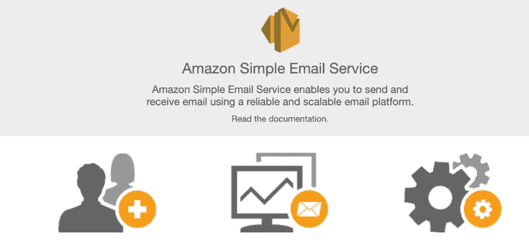
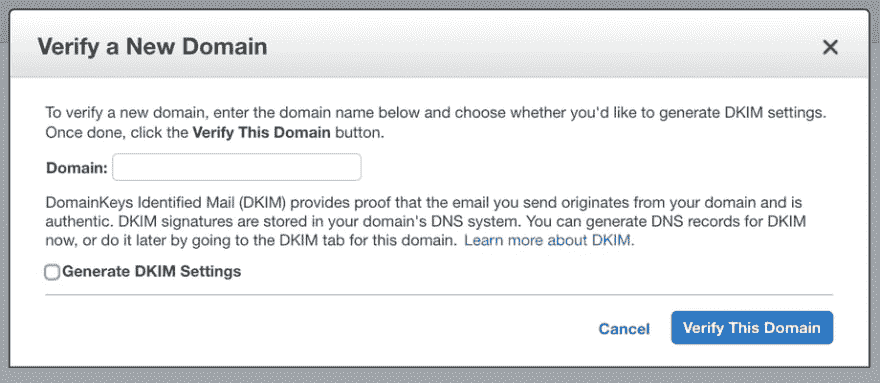
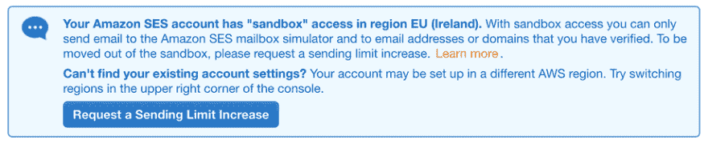
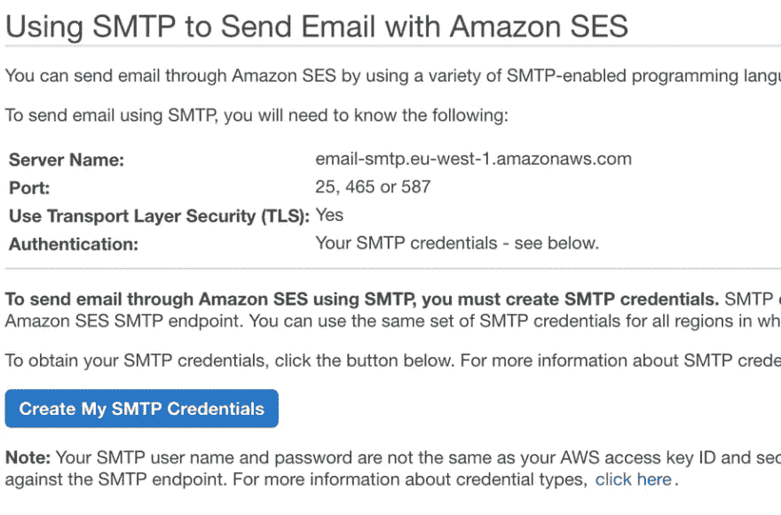

# 通过亚马逊简单电子邮件服务发送申请电子邮件

> 原文：<https://dev.to/alexhyettdev/application-emails-with-amazon-simple-email-service-4l5o>

大多数 web 应用程序在某种程度上都需要一种发送电子邮件的方式。无论是欢迎电子邮件、密码重置电子邮件还是例外电子邮件。有很多电子邮件提供商可以让你发送交易邮件。

当我设置 [GrowRecruit](https://www.growrecruit.com) 时，我最初使用的是 [SendGrid](https://sendgrid.com) 。SendGrid 每月收费 9.95 美元，最多可发送 4 万封电子邮件。然而，他们最近给我发了一封电子邮件，说从 1 月 1 日起，价格将上涨到每月 14.95 美元。

鉴于我只使用这个发送密码重置电子邮件和例外，我每月发送不到 20 封电子邮件。

我已经计划切换到亚马逊简单电子邮件服务(SES)有一段时间了，这正是我需要的推动力。

## 亚马逊的简单邮件服务是什么？

Amazon SES 是一个基于云的电子邮件发送服务，面向数字营销人员和开发人员，用于发送营销、通知和交易电子邮件。对于低容量的电子邮件，即使不能免费使用，也非常便宜。

## 亚马逊 SES 要多少钱？

Amazon SES 没有月费，如果您使用 Amazon EC2 托管您的应用程序，费用甚至可以是免费的。

对于 EC2 托管的应用程序，你每月可以免费收到 62，000 封电子邮件，此后每 1，000 封电子邮件的费用仅为 0.10 美元。如果您用电子邮件发送附件，每发送一 GB 将额外收取 0.12 美元的费用。

对于非 EC2 托管的应用程序，每发送 1000 封电子邮件只需支付 0.10 美元，附件费用也一样。

我不是用它来接收电子邮件，但如果你这样做，你将每月免费收到前 1000 封电子邮件。

## 如何设置亚马逊 SES

你显然需要一个 AWS 账户来开始。我不打算在这里详述。登录后，您需要在搜索栏中搜索简单电子邮件服务。

[](///static/970a3a5e781be92c47cc9e165466f842/e7aec/amazon-ses.png)

### 验证您的域名

要开始，您需要添加您计划发送电子邮件的域。从菜单中单击身份管理下的域，然后单击验证新域。

[](///static/f1190aa2bffbe3bacca41d8111cae1fc/c655d/verify-domain.png)

输入您的域并勾选生成 DKIM 设置复选框。DKIM 签名是电子邮件服务器验证电子邮件来自您的域并避免其被标记为垃圾邮件的一种方式。

在下一个屏幕上，它将列出您需要应用的所有 DKIM 和 TXT 验证设置。如果你使用 53 号路由作为你的域名，在底部有一个按钮，你可以点击为你设置。让 MX 记录保持未选中状态，除非您也计划使用 SES 接收邮件。

### 添加发件人电子邮件地址

一旦亚马逊验证了你的域名，你需要验证你计划发送邮件的所有电子邮件地址。你需要正确设置你的 MX 记录，因为亚马逊会给你发送一个链接，你需要点击它来验证地址。

如果您以后想使用不同的电子邮件地址，您需要再次经历这一过程/

### 走出沙盒

默认情况下，当你第一次注册账户时，亚马逊会将你置于沙盒模式。如果您在沙盒中尝试发送电子邮件，您的应用程序可能会出现以下错误:

> 邮件被拒绝:电子邮件地址未经验证。以下身份未通过登记区域区域:收件人电子邮件地址

这是因为在沙盒中，你也必须验证所有收件人的电子邮件地址。所以基本上你只能给自己发邮件，不能过度有用。

如果你进入发送统计页面，你可能会看到类似这样的内容: [](///static/1f7795f95d9c2674005cf447a7a9a7a2/d3d45/amazon-ses-sandbox.png)

由于该消息建议您需要向支持部门发送请求，以提高您的发送限额。亚马逊有一个[支持页面](https://docs.aws.amazon.com/ses/latest/DeveloperGuide/request-production-access.html)，它概述了你需要在支持请求中包含的内容。

这花了大约 24 个小时，但亚马逊确实批准了我的账户，并把我的发送限制在每天 5 万封。这将是一个很长的时间之前，我去了！

### 连接方式

一旦你脱离了沙盒，有两种主要的方法来使用 SES，API 和 SMTP。

如果你来自另一个电子邮件提供商，那么你很可能使用 SMTP 发送电子邮件。您需要为您的应用程序创建一些凭据来使用 SMTP。

要设置凭据，请转到电子邮件发送> SMTP 设置，然后单击创建我的 SMTP 凭据按钮。

[](///static/78357100c8e2e64dd10c847cf1b75098/636d3/amazon-ses-smtp.png)

创建后，您将获得一个用户名和密码，可以用来发送电子邮件。将它插入您的应用程序，您就可以开始工作了。

## 在. NET 核心应用程序中发送电子邮件

我确信有一百万种不同的发送电子邮件的方式。网芯。我发现一个最简单的方法是使用 [MailKit](https://www.nuget.org/packages/MailKit/) 和 [MimeKit](https://www.nuget.org/packages/MimeKit/) 。

有了这些导入，你可以发送这样一封电子邮件:

```
var message = new MimeMessage();
message.From.Add(new MailboxAddress("The Name of the Sender", _settings.SenderEmailAddress));
message.To.Add(new MailboxAddress(to));
message.Subject = subject;
message.Body = new TextPart(TextFormat.Text)
{
    Text = body
};

using(var client = new SmtpClient())
{
    client.Connect(_settings.SmtpServer, _settings.Port, _settings.Port == 465);
    client.AuthenticationMechanisms.Remove("XOAUTH2");
    await client.AuthenticateAsync(_settings.Username, _settings.Password);
    await client.SendAsync(message);
    await client.DisconnectAsync(true);
} 
```

Enter fullscreen mode Exit fullscreen mode

在上面的例子中，我将电子邮件服务器设置存储在 appsettings.json 中，这些设置在生产中会被 Docker 环境变量覆盖。

如果你需要一个邮件服务器用于开发，你可以在本地运行或者使用类似于 [MailTrap](https://mailtrap.io/) 的东西。