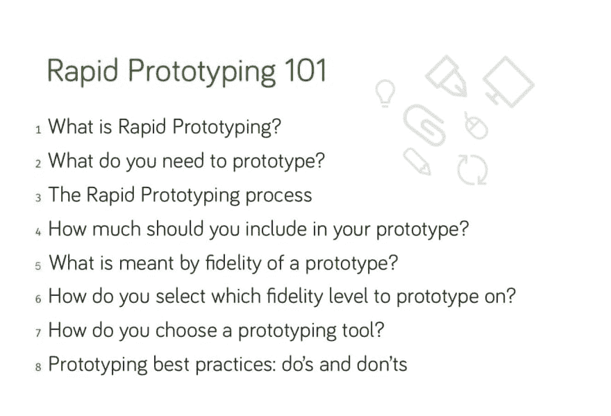
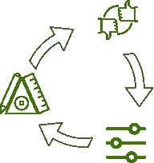
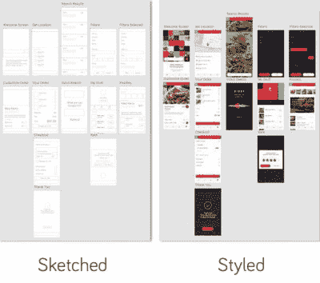
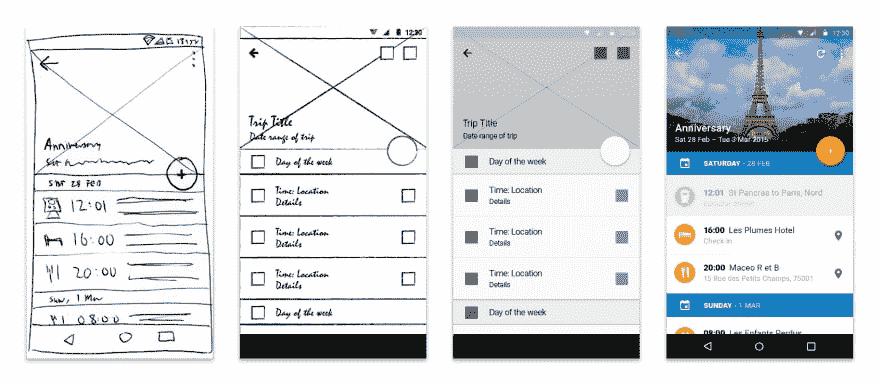

# 快速原型制作初学者指南

> 原文：<https://dev.to/anant/a-beginners-guide-to-rapid-prototyping-7j9>

从一个想法到一个产品的过程是混乱的。学习如何将你的想法**原型化**，获得**反馈**，以及**对其进行迭代**，这是任何有志于打造自己产品的人都应该具备的最关键技能。这也是 UX 设计师工作中最重要的部分之一。

原型有多种形式，从纸上的草图到看起来像最终产品的交互式模拟。本指南是为想了解原型是什么的完全初学者准备的。

我们将介绍与快速原型制作相关的几个术语的含义，以及以下内容:

# 什么是快速成型？

**快速原型制作**是一个迭代的过程，用于可视化网站或应用程序的外观，以便从用户、利益相关者、开发者和设计者那里获得反馈和验证。

如果使用得当，快速原型法将通过加强各方之间的沟通和减少构建没人想要的东西的风险来提高你的设计质量。

# 需要什么原型？

原型并不被设计成一个系统的全功能版本，而仅仅是为了帮助可视化最终产品的用户体验。正如谷歌风投的设计合伙人丹尼尔·布尔卡所说:

> 理想的原型应该是“金发女孩质量”如果质量太低，人们不会相信原型是真正的产品。如果质量太高，你会通宵工作，而且你不会完成。你需要金发女孩的品质。不太高也不太低，但恰到好处。

你不仅可以制作屏幕、应用或网站的原型，还可以制作几乎任何东西的原型。原型是测试以下内容的绝佳方法(提供了示例):

*   **新功能**:Instagram 应用程序中的原型 insta gram 故事(发布前)工作流程的变化:引入付费会员后原型媒体的新发布流程
*   **新技术**:原型自动驾驶汽车之旅！
*   **新界面**:原型 Apple Watch 界面(刚推出时)

所以，现在你明白快速原型是干什么的了。但是你是怎么做到的呢？我们将在接下来讨论这个问题。

# 快速成型过程

快速原型制作包括三个步骤，根据需要重复多次:

1.  原型:为你的解决方案或界面创建一个视觉模型。
2.  **评审:**与用户分享原型，并评估它是否满足他们的需求和期望。
3.  **提炼:**根据反馈，确定需要改进或澄清的地方。

一个原型通常会从一个非常简单的关键领域的模型开始，随着你从用户反馈中收集更多的数据，它会随着每次迭代而变得更加复杂。

# 原型中应该包含多少？

关注最常使用的关键功能。快速原型制作的要点是展示一个功能是如何工作的，或者设计是什么样子的，而不需要详细地制作整个产品的原型。记住，我们的目标是金发女孩的质量！

一次原型化一个用户流。不要一个屏幕接一个屏幕，让你的原型建立在一个故事的基础上，这个故事将带领用户穿越你想要原型化的领域。这样，您将获得更准确的反馈，因为您的原型将反映真实的生活场景。例如，一起原型化“注册/登录/重置密码”流。

此外，记得在头脑中有一个**迭代计划**。当计划迭代时，一个好的经验法则是从广泛的开始，然后朝着更详细的解决方案版本前进。随着你的迭代，你的原型的保真度，以及你在其中包含了多少，将会增加。

但是，等等，这种忠诚是什么？

# 什么叫原型的逼真度？

保真度是指原型与最终产品或解决方案的匹配程度。根据过程的阶段和原型的目标，您可以从许多不同的选项和精度级别中进行选择。

## 视觉(草图与样式)

布局和设计是原型保真度最显著的方面。如果一个原型从一开始就具有高水平的视觉保真度，用户将倾向于关注视觉而不是功能细节，这将偏离原型早期阶段的主要目标。

## 功能性(静态与交互)

原型应该是静态的，还是必须看起来功能齐全(交互)？这两个版本各有利弊:静态原型实现起来更简单更快，而交互式原型可以在以后用于可用性测试和用户培训。

## 内容(Lorem ipsum vs. real content)

在原型开发的早期阶段，标准的“lorem ipsum”内容有助于避免分散用户的注意力，这样他们就可以专注于提供功能性反馈，而不是评论文本中的更改。

然而，随着原型制作过程的继续，评估用真实内容替换虚拟文本的需要，这样用户就能感受到它对整体设计的影响。

使用真正的标签也是一个极好的机会来测试你的“副本”是否工作良好。“复制”只是你在屏幕上看到的文本标签和信息的一个花哨术语，就像把“发布”按钮称为“发布”、“张贴”、“发送”、“完成”或其他什么。

## 存在哪些保真级别？

*   **低保真度:**像**纸笔草图**这样的低保真度方法产生的静态原型视觉和内容保真度较低，允许快速、轻松地进行更改。这迫使用户**关注功能**和他们将如何使用系统，而不是看起来像什么。
*   中等保真度:像 Visio 这样的基于计算机的工具以**线框和工作流程的形式产生我们称之为中等保真度的原型。**这个级别的保真度用于演示系统的行为，确定用户需求是否得到满足，以及评估用户体验。

*   高保真:高保真原型有时会非常逼真**，以至于经常被误认为是真正的产品。它们的生产也更加**耗时**。像 InVision、Sketch、Figma、Adobe XD、Framer 等工具允许非技术用户创建高保真原型。尽管这些不能被转换成可用的代码，但是它们在以后的可用性测试或者用户培训中会非常有用。**

 **

# 如何选择原型的保真度？

大多数情况下，设计的最佳评估方式是从一个粗略的草图开始，然后根据系统的复杂性和要求，向更高的保真度水平发展。

有时，您的选择可能受客户需求或关注领域的指导。例如，如果你想评估一个界面变化的视觉效果，你可能会想要一个风格化的设计，而不是一个粗略的草图。或者，如果您的解决方案以消息为中心，您可能会决定使用真实内容，而不是标准的“lorem ipsum”占位符文本。

# 如何选择原型制作工具？

根据您的需求和方法，有各种各样的工具可用于原型开发。在选择工具之前，有几个问题要问:

*   学习如何使用该工具需要多长时间？
*   它是否支持我的产品需求的原型(网络、软件应用、移动应用、一些新技术等等)？
*   该工具允许我**与他人分享**我的原型并收集他们的反馈吗？
*   对原型进行修改有多容易？
*   我能用这个工具使用预定义的**模板**和模版吗？

# 原型最佳实践:该做的和不该做的

## 做的事:

*   与用户和利益相关者合作，获得最多的反馈，并让他们参与到最终产品的所有权中
*   尽早设定期望，确保用户和利益相关者知道原型是获得特定问题答案的一种方式，并不代表最终产品。
*   让你的高保真逼真(包括响应延迟)，让用户和利益相关者在与最终产品比较时不会失望。
*   保存模板和模具，以便在将来的项目中重复使用。

## 不要 ts:

*   不要将不会出现在最终产品中的功能原型化
*   不要做一个完美主义者。够好就是你的朋友。快速原型的目标是给每个人一个共同点。
*   不要什么都原型化！

* * *

感谢您阅读本快速指南。这最初是作为 [Commonlounge](https://www.commonlounge.com/) 上的 [UX 设计课程](https://www.commonlounge.com/path/bdc9fa8ceb064c89b1914c98ac81250f)的一部分发布的，Commonlounge 是一个平台，它有类似这些小课程的课程，主题从 [Web 开发](https://www.commonlounge.com/path/1f88878c337a43d799322d0cc1444bda)到[机器学习](https://www.commonlounge.com/path/5e2e9bb80c7f4b8e943460f682d2c602)到[数据科学](https://www.commonlounge.com/path/be59f08e4adc4640aa1a84b08cc7e8a1)我们编写指南，为您投资阅读❤️提供最大价值**