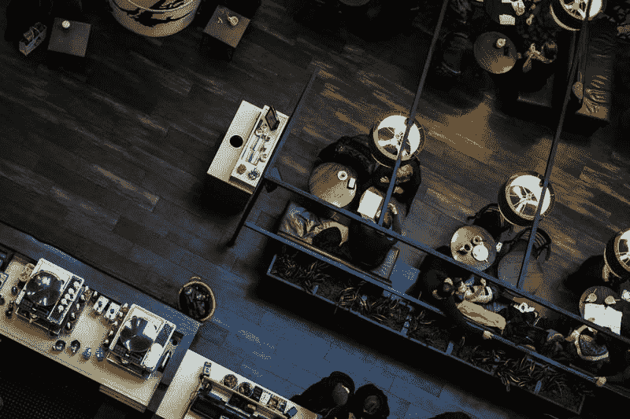
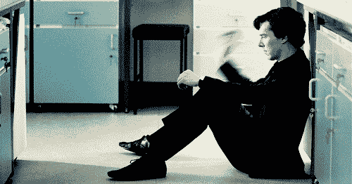
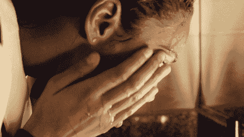
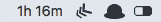
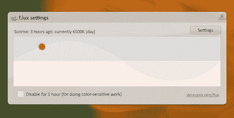

# 开发者保护眼睛的权威指南👀

> 原文：<https://dev.to/sarthology/the-definitive-guide-to-protecting-your-eyes-for-developers-22jm>

大约两年前的这个时候，我正和我的团队夜以继日地工作，发布一个产品。我们过去常常在屏幕前坐 12 个小时以上。整件事对我们来说相当令人兴奋。但是当你年轻的时候，你经常为了寻求刺激而忽略了你的健康。参加黑客马拉松肯定是一件令人兴奋的事情，但是我们忘记了一件事:长时间盯着显示器工作会伤害我们的眼睛，事实也的确如此。我们中的两个人在几周内就拿到了处方眼镜。🤓

这是一个惨痛的教训。

当我第一次发现我的视力下降时，我开始害怕了。我立即开始寻找有助于我保持眼睛健康的信息。我对我的生活做了一些改变，瞧！我的视力实际上提高了，现在我甚至不需要经常戴眼镜了。

这对我来说是一次大开眼界的经历，有点双关的意思。所以让我和你们分享一下我学到的东西。🏃🏻‍♂️

### 改变你的工作空间👨🏻‍💻

这通常是最容易被忽视的因素，这也是我首先讨论这个问题的原因。我们都知道如何根据我们的眼睛来调整我们的屏幕，所以我要跳过这一点，但如果你还想了解更多，请阅读这里的。第二也是最重要的是照明。试着把你屏幕放在一个窗口在你右边或左边的位置，以避免屏幕上的眩光。如果你在工作场所使用人工光源，最好使用头顶照明。不要使用额外的强光，这会给你的眼睛带来压力。我个人更喜欢暖光而不是白光。

### 做一个快速练习🏋🏻‍♂️

你可能听说过黄金 20-20-20 法则。事情是这样的。

> "每隔 20 分钟，看至少 20 英尺远的东西，至少 20 秒钟。"

这是你的医生可能会告诉你这样做。是的，它工作…有点像。如果你知道 20 英尺实际上有多远，而且你不觉得太无聊。但老实说，我确定这对我和其他很多人都没用。我试过，结果惨败。所以这里有一些我个人遵循和推荐的简单有趣的练习，它们同样会有帮助。

**在墙上拍球**🎾

听起来很简单。拿一个海绵球(这样你就不会破坏你的周围)去撞墙。做的时候尽量把注意力集中在球上。这将有助于你的眼睛四处移动，并在球行进时聚焦于不同的距离。这也非常放松，几乎是沉思。你也可以玩飞镖🎯如果你愿意的话。那也有帮助。

**水中按摩💦**

每当你去厕所的时候，试着用冷水清洗你的眼睛，往脸上泼水，并给你的眼睛一点按摩。这将放松你的眼睛，消除任何可能已经开始的干涩。不要试图在没有用水冲洗眼睛的情况下按摩眼睛，因为这样会伤害眼睛。试试看，你会感谢我的。🙃

### 使用这些应用程序📱

我们技术人员忍不住谈论一些应用程序。这些应用程序将直接或间接地帮助您挽救您的眼睛。

*意识到/意识到⏱*

[Aware](https://awaremac.com/) 是一个用于 mac 的小菜单栏工具，它会显示你在笔记本电脑上花了多少时间而没有休息。这样你就能觉察，顾名思义，给你的眼睛(还有你的身体！)偶尔休息一下。

感知功能做了或多或少相同的事情，但它也适用于 Windows。

*火红色🌅*

f.lux 是一款非常受欢迎的软件，可以减少来自屏幕的蓝色光线。它会根据一天中的时间自动调整屏幕的颜色。日落后过多的蓝光会改变你的睡眠周期(通过欺骗你的大脑认为现在还是白天),也会增加眼睛问题。flux 会为您解决这个问题。如果你是一个设计师，想要在任何时候都准确地再现色彩，这对你来说可能是一个问题。但除此之外，它是一个很好的工具。

这是一个向其他开发者大声疾呼的好时机。如果你们有任何帮助眼睛的应用程序的想法，我愿意合作。DM 我[@ Twitter](https://twitter.com/Sarthology)T3】

### 饮食超级重要👩🏻‍🍳

我妈妈说你吃什么就会成为什么样的人。这种情况下也是如此。你也需要做一些饮食上的改变。

最重要的是水。如果你长时间脱水，会导致眼睛干涩，进而导致眼睛疲劳。每天至少喝 2-3 升水，这不仅有助于你的眼睛，还有助于你的全身。在你的饮食中包含以下食物也可以改善你的视力，你也可以像我一样摘掉眼镜。

*   菠菜
*   羽衣甘蓝
*   葡萄柚
*   草莓
*   球芽甘蓝
*   橙
*   杏仁
*   葵花籽

除此之外，试着在你的饮食中加入大量绿色蔬菜和富含蛋白质的食物。这是一个屡试不爽的建议，对我来说也非常有效。

### 别老是用那该死的电话📲

工作很重要，我明白。但是智能手机正在毁坏我们的眼睛，在大多数情况下比电脑屏幕要严重得多。在床上呆几个小时盯着那些小屏幕，必须停止。就像我已经提到的，手机发出的蓝光会让你的大脑误以为现在还是白天，扰乱你的睡眠周期。所以只在必要的时候使用你的手机，尤其是在晚上，当你这样做的时候，打开某种蓝光过滤器。大多数新手机都有这方面的内置功能。

### 结论

最后，如果可以的话，试着每月做一次眼部检查。这会让你知道你对生活方式所做的这些调整是否有效。如有必要，更换眼镜；使用错误的力量会进一步伤害你的视力。即使你的眼睛完全康复了，也要养成戴蓝切眼镜的习惯。你的眼睛可以说是你最重要的资产，相信我，你不能失去它们。预防总是比治疗好，这些调整不会花费你太多的时间，但从长远来看会对你有很大的帮助。

如果我错过了什么，欢迎在评论区分享。如果你喜欢我的帖子，把它分享给你的朋友，帮助他们保护他们的眼睛。

顺便说一句，我也在中号上。点击查看[。](https://medium.com/@Sarthaksharma0)