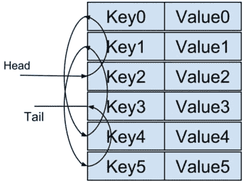
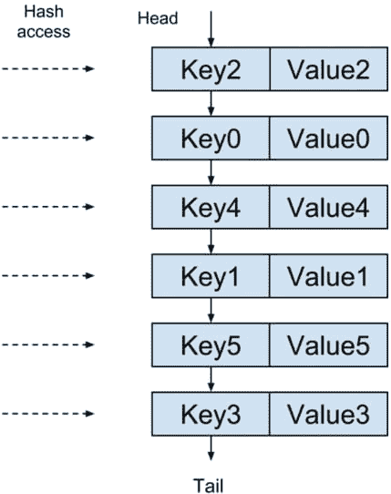
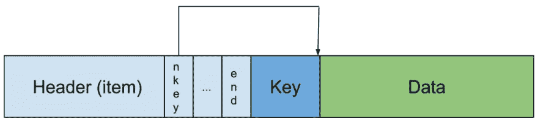

# 理解 Memcached 源代码- LRU I

> 原文：<https://dev.to/holmeshe/understanding-the-memcached-source-code---lru-i-2pdm>

[ slab 分配器(I，](https://dev.to/holmeshe/understanding-the-memcached-source-code---slab-i-165h) [ II，](https://dev.to/holmeshe/understanding-the-memcached-source-code---slab-ii-2kc3) [III)](https://dev.to/holmeshe/understanding-the-memcached-source-code---slab-iii-3h8l) 是缓存系统的核心模块，很大程度上决定了瓶颈资源——内存的利用效率。其他 3 个部分，即:

[](https://res.cloudinary.com/practicaldev/image/fetch/s--OovZ3pIz--/c_limit%2Cf_auto%2Cfl_progressive%2Cq_auto%2Cw_880/v1/../gallery/heart.svg)【LRU 算法】(I -本条[、II)](https://holmeshe.me/understanding-memcached-source-code-V/) 为条目到期；和一个

[](https://res.cloudinary.com/practicaldev/image/fetch/s--tzc6mlU3--/c_limit%2Cf_auto%2Cfl_progressive%2Cq_auto%2Cw_880/v1/../gallery/club.svg) 基于 libevent 的事件驱动模型(不完整)；和

[](https://res.cloudinary.com/practicaldev/image/fetch/s--g3N4Oenm--/c_limit%2Cf_auto%2Cfl_progressive%2Cq_auto%2Cw_880/v1/../gallery/diamond.svg) 对数据分布一致苛刻(不完整)、

都是围绕着它建立的。

通常情况下， **LRU** 算法与**散列图**结合在一起，被称为

# LRU 缓存

在 **LRU 缓存**中，**哈希映射**实现了对*缓存的*对象的快速访问；并且 **LRU** 通过标记过期的或者所谓的**最近最少使用的**对象来避免*缓存*无限增长。接下来，我们从高层次的角度来看 LRU 是如何工作的。

## 链表

从技术上来说， **LRU** 算法作用于一个*链表*，每当一个链表条目被使用(访问或更新)时，它就被从链表中移除并附加到链表头。这样，一个元素离列表尾部越近，最近使用的**就越少。因此，基于特定的配置，很容易从尾部移除不相关的或“过期的”元素。**

## 严酷的地图

*链表*在访问元素时速度较慢，因此采用了另一种数据结构。我们已经看到了**链表**【字符串】*块*在**片**中如何使*空闲 list_s。在 **LRU 缓存**中，机制是相似的，但是，这次是**散列映射**条目而不是**片**中的 _chunks* 被连接，如下所示:

[](https://res.cloudinary.com/practicaldev/image/fetch/s--cUUTp45j--/c_limit%2Cf_auto%2Cfl_progressive%2Cq_auto%2Cw_880/https://thepracticaldev.s3.amazonaws.com/i/9ssuslvuvvajxr1jo901.png)

我们也可以将链表扁平化，让结构更清晰一点，

[](https://res.cloudinary.com/practicaldev/image/fetch/s--uY8M55fT--/c_limit%2Cf_auto%2Cfl_progressive%2Cq_auto%2Cw_880/https://thepracticaldev.s3.amazonaws.com/i/tsphpdbjw9u2wgumquha.png)

# 核心数据结构-项

```
typedef struct _stritem {
    /* Protected by LRU locks */
    struct _stritem *next;
    struct _stritem *prev;
    /* Rest are protected by an item lock */
    struct _stritem *h_next;    /* hash chain next */
    rel_time_t      time;       /* least recent access */
    rel_time_t      exptime;    /* expire time */
    int             nbytes;     /* size of data */
    unsigned short  refcount;
    uint8_t         nsuffix;    /* length of flags-and-length string */
    uint8_t         it_flags;   /* ITEM_* above */
    uint8_t         slabs_clsid;/* which slab class we're in */
    uint8_t         nkey;       /* key length, w/terminating null and padding */
    /* this odd type prevents type-punning issues when we do
     * the little shuffle to save space when not using CAS. */
    union {
... // scr: cas
        char end; // scr: flexible array member indicating the item header "end"
    } data[];
    /* if it_flags & ITEM_CAS we have 8 bytes CAS */
    /* then null-terminated key */
    /* then " flags length\r\n" (no terminating null) */
    /* then data with terminating \r\n (no terminating null; it's binary!) */
} item; 
```

<center>[do_item_unlink@item.c](mailto:do_item_unlink@item.c)</center>

## 属性在使用中

`next`、`prev`、`slabs_clsid` - item_link_q、item_unlink_q

`it_flags` - do_item_link，do_item_unlink

`time`，`refcount` -待办事项链接

`h_next` -关联 _ 插入，关联 _ 删除

`nkey` -关联 _ 删除

## 一个条目组块的内存布局

我们在 [do_slabs_free](https://holmeshe.me/understanding-memcached-source-code-II/#do-slabs-free) 中提到过*项组块*。在这个数据结构的帮助下，我们现在可以更仔细地检查数据块。

[](https://res.cloudinary.com/practicaldev/image/fetch/s--2h8qpEgZ--/c_limit%2Cf_auto%2Cfl_progressive%2Cq_auto%2Cw_880/https://thepracticaldev.s3.amazonaws.com/i/wh44s95ketp608gg67e7.png)

接下来，我们阅读执行上述 LRU 运算的相关代码。

# do_item_link

```
int do_item_link(item *it, const uint32_t hv) { // scr: -------------------> 1)
...
    it->it_flags |= ITEM_LINKED;                // scr: -------------------> 2)
    it->time = current_time;

... // scr: stat

    /* Allocate a new CAS ID on link. */
... // scr: cas
    assoc_insert(it, hv);                       // scr: -------------------> 3)
    item_link_q(it);                            // scr: -------------------> 4)
    refcount_incr(&it->refcount);               // scr: -------------------> 5)
... // scr: stat

    return 1;
} 
```

<center>[do_item_link@item.c](mailto:do_item_link@item.c)</center>

1) `hv`应该是简称“哈希值”。

2)在`it->it_flags`中设置`ITEM_LINKED`，将当前时间设置为`it->time`。

字段`it_flags`用于[do _ slab _ free](https://holmeshe.me/understanding-memcached-source-code-II/#do-slabs-free)和[do _ slab _ alloc](https://holmeshe.me/understanding-memcached-source-code-III/#do-slabs-alloc)

3)将**项**插入哈希映射。

4)将**项**插入链表。

5)增加*参考计数*。

该字段在 [do_slabs_alloc](https://holmeshe.me/understanding-memcached-source-code-III/#do-slabs-alloc) 中被初始化为`1`

这里值得注意的是，*引用计数*指示有多少子模块正在使用同一资源，以便确定何时实际解除分配该资源(在这种特定情况下，**项**被**片**和 **LRU** 引用)。我写了[这篇文章](https://holmeshe.me/cpp-pointers/)解释了 C++的一个类似机制。

## item_link_q -添加到链表

item_link_q 是主要方法`do_item_link_q`的线程安全包装器。

```
static void item_link_q(item *it) {
    pthread_mutex_lock(&lru_locks[it->slabs_clsid]);
    do_item_link_q(it);
    pthread_mutex_unlock(&lru_locks[it->slabs_clsid]);
} 
```

<center>[item_link_q@item.c](mailto:item_link_q@item.c)</center>

```
static void do_item_link_q(item *it) { /* item is the new head */
    item **head, **tail;
    assert((it->it_flags & ITEM_SLABBED) == 0);

    head = &heads[it->slabs_clsid];           // scr: -------------------> 1)
    tail = &tails[it->slabs_clsid];
    assert(it != *head);
    assert((*head && *tail) || (*head == 0 && *tail == 0));
    it->prev = 0;                             // scr: -------------------> 2)
    it->next = *head;
    if (it->next) it->next->prev = it;
    *head = it;
    if (*tail == 0) *tail = it;
    sizes[it->slabs_clsid]++;                 // scr: -------------------> 3)
    return;
} 
```

<center>[do_item_link_q@item.c](mailto:do_item_link_q@item.c)</center>

1)获取`slabs_clsid`指示的各个 **LRU 链表**的头尾。请注意，`slabs_clsid`是用队列类型的*加盐的*，因此每个**板坯组**可以登记多个*列表*。

2)“前面加一个元素”的标准操作。

3)增加全局数组的大小。

```
static item *heads[LARGEST_ID];
static item *tails[LARGEST_ID];
...
static unsigned int sizes[LARGEST_ID]; 
```

<center>[item.c:59](https://play.google.com/store/apps/details?id=me.holmeshe.sc)</center>

## 关联 _ 插入-添加到哈希映射

```
int assoc_insert(item *it, const uint32_t hv) { // scr: again, hv -> hash value
    unsigned int oldbucket;

... // scr: expanding related operations
    } else {
        it->h_next = primary_hashtable[hv & hashmask(hashpower)]; // scr:  1)
        primary_hashtable[hv & hashmask(hashpower)] = it;         // scr:  2)
    }

... // scr: expanding related operations
} 
```

<center>[assoc_insert@assoc.c](mailto:assoc_insert@assoc.c)</center>

1)处理潜在的冲突。如果没有，则`h_next`将被设置为`null`。

2)将项目设置为 primary_hashtable 中的桶。

```
...
static item** primary_hashtable = 0;
... 
```

<center>[assoc.c:42](https://play.google.com/store/apps/details?id=me.holmeshe.sc)</center>

这里省略的扩展逻辑将在后面的文章中讨论。

# do_item_unlink

```
void do_item_unlink(item *it, const uint32_t hv) {
    MEMCACHED_ITEM_UNLINK(ITEM_key(it), it->nkey, it->nbytes);
    if ((it->it_flags & ITEM_LINKED) != 0) {
        it->it_flags &= ~ITEM_LINKED;         // scr: -------------------> 1)
... // scr: stat
        assoc_delete(ITEM_key(it), it->nkey, hv); // scr: ---------------> 2)
        item_unlink_q(it);                    // scr: -------------------> 3)
        do_item_remove(it);                   // scr: -------------------> *)
    }
} 
```

<center>[do_item_unlink@item.c](mailto:do_item_unlink@item.c)</center>

1)清除`it->it_flags`中的`ITEM_LINKED`。

2)从散列图中删除**项**。

3)从链表中删除**项**。

*)项目的实际发布将在下一篇文章中介绍。

## item_unlink_q -从链表中删除

同样，item_unlink_q 是一个重要方法`do_item_unlink_q`的线程安全包装器。

```
static void item_link_q(item *it) {
    pthread_mutex_lock(&lru_locks[it->slabs_clsid]);
    do_item_link_q(it);
    pthread_mutex_unlock(&lru_locks[it->slabs_clsid]);
} 
```

<center>[item_unlink_q@item.c](mailto:item_unlink_q@item.c)</center>

```
static void do_item_unlink_q(item *it) {
    item **head, **tail;
    head = &heads[it->slabs_clsid];           // scr: -------------------> 1)
    tail = &tails[it->slabs_clsid];

    if (*head == it) {                        // scr: -------------------> 2)
        assert(it->prev == 0);
        *head = it->next;
    }
    if (*tail == it) {
        assert(it->next == 0);
        *tail = it->prev;
    }
    assert(it->next != it);
    assert(it->prev != it);

    if (it->next) it->next->prev = it->prev;
    if (it->prev) it->prev->next = it->next;
    sizes[it->slabs_clsid]--;                 // scr: -------------------> 3)
    return;
} 
```

<center>[do_item_unlink_q@item.c](mailto:do_item_unlink_q@item.c)</center>

1)同样，得到由`slabs_clsid`指示的各自的 **LRU 链表**的头尾。

2)“从链表中移除元素”的标准操作。

3)减小全局数组的大小。

```
static item *heads[LARGEST_ID];
static item *tails[LARGEST_ID];
...
static unsigned int sizes[LARGEST_ID]; 
```

<center>[item.c:59](https://play.google.com/store/apps/details?id=me.holmeshe.sc)</center>

## 关联 _ 删除-从哈希映射中删除

```
static item** _hashitem_before (const char *key, const size_t nkey, const uint32_t hv) {
    item **pos;
    unsigned int oldbucket;

... // scr: expanding related operations
    } else {
        pos = &primary_hashtable[hv & hashmask(hashpower)]; // scr: -----> 1)
    }

    while (*pos && ((nkey != (*pos)->nkey) || memcmp(key, ITEM_key(*pos), nkey))) {
        pos = &(*pos)->h_next; // scr: ----------------------------------> 2)
    }
    return pos;
}

...

void assoc_delete(const char *key, const size_t nkey, const uint32_t hv) {
    item **before = _hashitem_before(key, nkey, hv);

    if (*before) {
        item *nxt;
...
        nxt = (*before)->h_next; // scr: --------------------------------> 3)
        (*before)->h_next = 0;   /* probably pointless, but whatever. */
        *before = nxt; // scr: ------------------------------------------> 4)
        return;
    }
    /* Note:  we never actually get here.  the callers don't delete things
       they can't find. */
    assert(*before != 0);
} 
```

<center>[assoc_delete@assoc.c](mailto:assoc_delete@assoc.c)</center>

1)使用`hv`获取哈希桶。

2)浏览冲突链并比较`key`。注意，结果值是找到的元素`before`的`next`成员的**地址。当没有冲突时，地址就是桶本身。**

3)将找到的元素后的下一个元素设置为临时变量`nxt`。

4)更新元素`before`的**成员，找到一个**。

# 带回家

试试这个[。](https://leetcode.com/problems/lru-cache/)