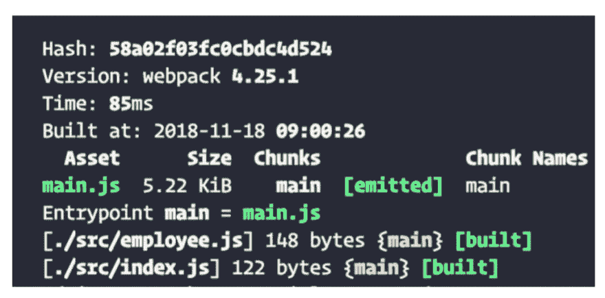
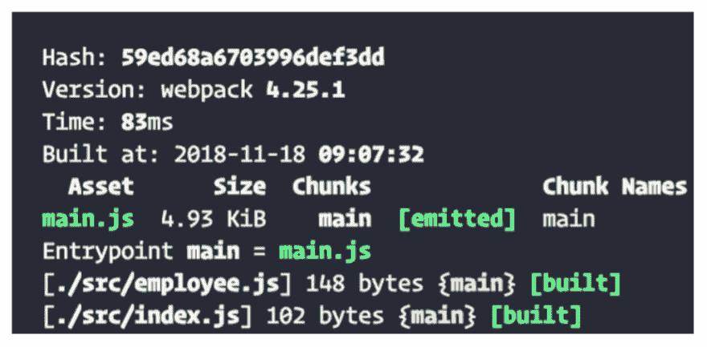
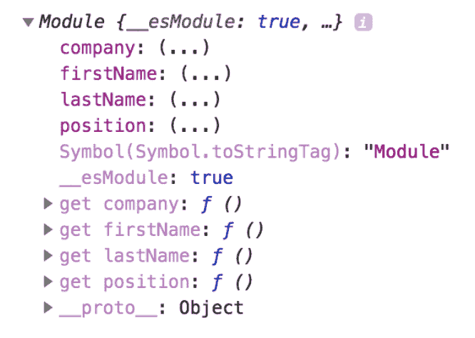

# Webpack 模块

> 原文：<https://dev.to/apium_hub/webpack-modules-4m43>

尽管 Webpack 现在被广泛使用，但对于许多开发人员来说，它仍然是一个黑匣子，他们只是简单地使用现有的配置，而不知道它实际上是如何工作的。

因此，今天我们将介绍 Webpack 的一些关键部分，以帮助您了解其操作，并能够根据我们的需求优化我们的 Webpack 配置。

为此，我们将开始解释一些 Webpack 模块，看看它们能如何帮助我们。

## Webpack 模块

### 模块

使用 [Webpack 模块](https://webpack.js.org/concepts/modules/)我们可以将我们的代码分成不同的文件，这样每个文件都有一个单独的职责，这将使我们的代码更容易理解和测试。

为了实现它，我们将使用 [ES6 导入](https://developer.mozilla.org/es/docs/Web/JavaScript/Referencia/Sentencias/import)，因为它们允许我们导入和导出我们的依赖项，以便在其他模块中使用它们。尽管非常有用，但是当导入非常重的模块或者导入在用户与应用程序的某些部分交互之前并不真正需要的模块时，使用没有控制的导入会产生性能问题，所以这意味着我们不应该从一开始就调用它们。为了解决这两个问题，我们将讨论[树摇动](https://webpack.js.org/guides/tree-shaking/)和[动态导入](https://webpack.js.org/guides/code-splitting/#dynamic-imports)。

### 树摇晃

树摇的概念很好理解。Webpack 分析我们的模块以搜索导入和导出，当它发现一个导入或导出内容的模块并且它没有被使用时，它会丢弃它以避免出现死代码。

这里我们可以看到一个例子:

```
employee.js
export const firstName = 'Arnau';
export const lastName = 'Silvestre Dulcet';
export const position = 'Frontend';
export const company = 'Apiumhub';

Index.js
import { firstName, lastName, company, position } from './employee';

console.log(firstName, lastName, company, position); 
```

[](https://apiumhub.com/wp-content/uploads/2018/12/Screenshot-2018-12-04-at-14.56.39.png)

当使用我们从*雇员*导入的所有常量执行下面的代码时，我们看到对于 index.js 文件(我们在这里进行导入),它生成了一个 122 字节的包。在这种情况下，*摇树*并不是在演戏，因为我们用掉了所有的进口商品，没有什么可以丢弃的。

但是，在以下情况下:

```
import { firstName, lastName, company, position } from './employee';

console.log(firstName, company); 
```

[](https://apiumhub.com/wp-content/uploads/2018/12/Screenshot-2018-12-04-at-15.00.08-1.png)

我们只使用*名字*和公司，虽然我们也导入了*姓氏*和*职位*，但是我们在代码中没有使用它们，所以 Webpack 丢弃了它们。

由于这一点，我们可以减少我们的包的大小。虽然在我们的例子中，它只导致 20 个字节的差异，但让我强调这是一个非常简单的例子，但在一个项目中，它可以导致巨大的差异。

为了激活这个功能，我们将在 package.json 的第一层添加*副作用* : false，表明我们的项目不包含副作用，从而允许*树摇动*。

```
{
  "name": "projectName",
  "version": "0.0.0",
  "license": "MIT",
  "sideEffects": false
} 
```

正如 Webpack 自己的文档所说的:副作用被定义为在导入时执行一些特殊动作的代码，除了定义它的导出。

### 动态导入

使用*动态* *导入*允许我们在文件中的任何地方导入一个模块，允许我们在特定情况下导入内容，从而减少我们页面的加载时间。如果我们处理非常重的模块，并且我们只需要其中一个模块来导航，这就特别有用。

从 v2 开始，为了使用*动态导入*，我们不需要任何特定的 Webpack 配置。

举个例子，

```
setTimeout(importModule(), 3000);

function importModule() {
    import('./employee').then(myModule => {
        console.log(myModule);
    });        
} 
```

在前面的例子中，变量 myModule 包含我们模块的信息(变量、方法……)

[](https://apiumhub.com/wp-content/uploads/2018/12/Screenshot-2018-12-04-at-15.05.25.png)

动态导入通常用于根据我们的导航状态加载页面的不同内容。如果我只显示*家*，为什么我要上传我页面的*关于*或*联系人*部分的内容？

### 树摇动并动态导入

给你们两个介绍完之后，我们再来谈谈一起使用时的兼容性问题。

```
if(admin == true) { import('./admin').then(myModule => { console.log(myModule); }); } 
```

和静态导入:

```
import {person} from ‘./person.js’; 
```

Webpack 无法提前知道动态导入是否会在某个时候被使用，因此在这些情况下，您不能应用树抖动，也不能确定*动态导入*将永远不会被使用。

在准备我们的 Webpack 配置时记住这一点，我们必须考虑我们想要实现什么，以及我们是否想要使用其中一个或另一个，或者两个都使用。我们必须思考我们将要遵循的战略，以便一起使用它们，并使两种功能相辅相成，而不是相互冲突。

如果你对 Webpack 模块或者软件开发感兴趣，我强烈推荐你订阅我们的每月简讯！

## 如果您觉得这篇关于 Webpack 模块的文章很有趣，您可能会喜欢…

[Scala 泛型 I: Scala 类型界限](https://dev.to/apium_hub/scala-generics-i--scala-type-bounds-38)

[Scala generics II:协方差和逆变](https://dev.to/apium_hub/scala-generics-ii-covariance-and-contravariance-in-generics-5dib)

[Scala Generics III:通用类型约束](https://dev.to/apium_hub/scala-generics-iii-generalized-type-constraints-58km)

BDD:用户界面测试

[Scala 中泛型类型的 F-bound](https://apiumhub.com/tech-blog-barcelona/f-bound-scala-generics/)

[微服务 vs 整体架构](https://apiumhub.com/tech-blog-barcelona/microservices-vs-monolithic-architecture/)

[“几乎无限”的可扩展性](https://apiumhub.com/tech-blog-barcelona/almost-infinite-scalability/)

帖子 [Webpack 模块](https://apiumhub.com/tech-blog-barcelona/webpack-modules/)首先出现在 [Apiumhub](https://apiumhub.com) 上。