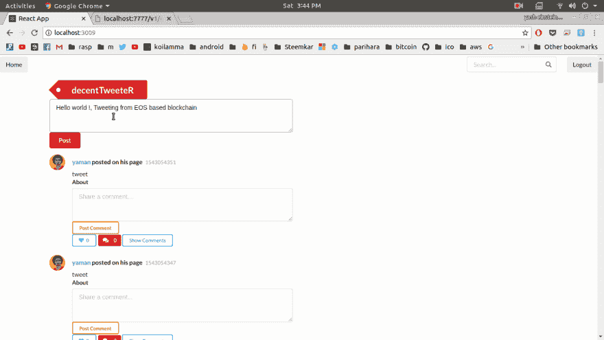

# EOS 上的去中心化 Twitter

> 原文：<https://dev.to/yashwanth2804/decentralized-twitter-on-eos-4eac>

嗨 Devs，
请检查我的项目建立在 EOS 区块链使用 React-Redux 作为前端。

## [yashwanth 2804](https://github.com/yashwanth2804)/[decentwt](https://github.com/yashwanth2804/decenttwt)

### 使用#EOS 区块链分散化推特

<article class="markdown-body entry-content container-lg" itemprop="text">

### 去中心化的推特，会让你发推特到区块链，EOS。你发的每条微博都在开放区块链上。

[](https://github.com/yashwanth2804/eosio-project-demux-example/blob/mastimg/EosHOme.png?raw=true)

**先决条件**

*   首先安装 docker
*   安装 Eos docker 映像
*   安装 mongodb 映像

**Eos docker**

> 码头工人拉运

```
docker pull eosio/eos:v1.4.2` 
```

```
docker run --name eosio \
  --publish 7777:7777 \
  --publish 127.0.0.1:5555:5555 \
  --volume CONTRACTS_DIR:CONTRACTS_DIR \
  --detach \
  eosio/eos:v1.4.2 \
  /bin/bash -c \
  "keosd --http-server-address=0.0.0.0:5555 & exec nodeos -e -p eosio --plugin eosio::producer_plugin --plugin eosio::chain_api_plugin --plugin eosio::history_plugin --plugin eosio::history_api_plugin --plugin eosio::http_plugin -d /mnt/dev/data --config-dir /mnt/dev/config --http-server-address=0.0.0.0:7777 --access-control-allow-origin=* --contracts-console --http-validate-host=false --filter-on='*'" 
```

> 检查是否正在运行

```
docker logs --tail 10 eosio 
```

> 让 alias 将其添加到 bash.rc 文件的末尾

```
alias cleos='docker exec -it eosio /opt/eosio/bin/cleos --url http://127.0.0.1:7777 --wallet-url http://127.0.0.1:5555' 
```

> 启动和停止坞站

```
docker start eosio
docker stop eosio 
```

Docker mongo

> 码头工人拉运

```
docker pull mongo:4.0 
```

```
docker run --rm --name mongo_blog_container -d -p 127.0.0.1:27017:27017 mongo:4.0 
```

> 检查是否正在运行

```
docker logs mongo_blog_container --follow 
```

**设置一个** …

</article>

[View on GitHub](https://github.com/yashwanth2804/decenttwt)

[https://www.youtube.com/embed/PWVDlGKYahs](https://www.youtube.com/embed/PWVDlGKYahs)