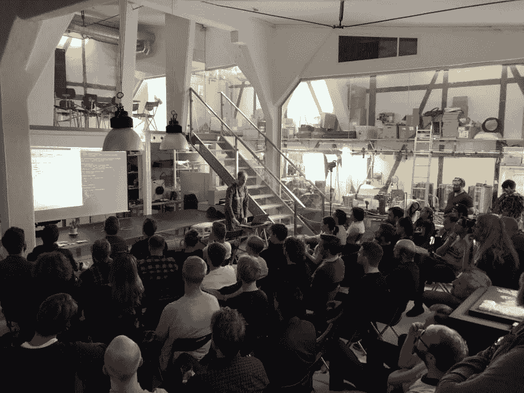

# 为什么我喜欢在神智清醒公司工作

> 原文：<https://dev.to/kmelve/why-i-love-working-at-sanityio-4ob7>

四年前，我是一名研究生，获得了宗教研究的博士学位，那么我怎么会最终为一家科技初创公司工作呢？这是一篇关于我，Knut Melvæ，如何在 [Sanity.io](https://www.sanity.io) 开始管理开发者关系的帖子——这也是对遵循不太明显的道路的庆祝。

(*封面图片:我在 [Slush](https://www.slush.com) 的谷歌舞台上展示 Sanity.io，与[bjorge](https://twitter.com/bjoerge)*)

2015 年，我变得疲惫不堪。学院的招聘程序很苛刻。从一份临时大学教学合同转到下一份合同的前景也不是很吸引人。我的研究接近尾声，虽然我既发表了同行评审的研究，也做了大量的教学和传播工作——但在一个对此类事情经验非常非常少的领域使用数字方法写论文是一项挑战。此外，我患上了严重的抑郁症——在很长一段时间后，我寻求帮助来控制它，从今天起我基本上没事了(一定要去帮助别人！).

在我的津贴用完的几个月前，我得到了一份交互设计师的工作(很快成为“技术战略家”)，在 UX 的设计机构 [Netlife](https://www.netlife.com) 。除了技术导向的人文背景，我还是一名经验丰富的网络开发自由职业者。但我非常幸运地得到了这份工作，因为这不仅意味着我不必经常担心谋生和如何获得下一份合同，而且我受到了欢迎，人们互相支持，为你加油。在学院里没有那么多。不是说我苦。或者等等。

我在 Netlife 工作了三年，享受其中的每一分钟——尽管多个并发客户有很高的要求，有时预算紧张，面临很大的风险，也确实造成了损失。

因此，当我得到 Sanity.io 的邀请，成为一名开发者倡导者时，我感觉这是一个特殊的机会。我会和一些非常有才华的人一起研究一种特殊的技术。感觉是时候继续前进了，这是一个不容错过的机会。

在建设 Netlife 的新网站时，我已经有幸作为技术负责人与 Sanity 一起工作，将它用作内容后端，以 [Next.js](https://nextjs.org) 作为前端，并在 Heroku 上提供多个 Node.js 微服务。我们也为 [U4 反腐败资源中心](https://www.u4.no)运行了相同的设置。这些经历激发了我写博文“[无头恋上理智](https://hackernoon.com/headless-in-love-with-sanity-689960571dc)”，虽然我当时没有收到，但这最终成了我的求职申请。尽管如此，我的动机是真正的感激，在这里工作，你会感觉到作为一名开发人员，我的生活变得更加容易，坦率地说，更加有趣。

既然我已经在 Sanity 工作了半年，我想是时候记下一些关于为什么它如此火爆的想法了。对于那些正在考虑申请职位或者被邀请加入的人来说，这也是一个不太微妙的推介。也就是说，我写这篇文章的动机非常纯粹，也是一个反思是什么让我的工作变得有意义和令人兴奋的机会。

## 人民

我和许多在挪威从事技术工作的人一样，多年来一直钦佩理智背后的人。他们曾经是一家名为 [Bengler](http://bengler.no) 的技术和设计机构，有着做怪异/具有挑战性/最先进工作的记录，比如制作一个与当地出版相关的[社交网络，与脸书同时推出的](http://bengler.no/origo)[3d 打印机控制器软件](http://bengler.no/grbl)，[和弦文本输入设备](http://bengler.no/chorder)，或者[颠覆即服务工具包](http://bengler.no/panda)。

坦率地说，与这些人一起工作会很可怕，如果不是他们都令人难以置信地令人愉快，脚踏实地，思想开放。当你还没有想清楚你的建议的含义时，他们会向你挑战，但当你出货时，他们也会为你加油。作为新公司的第一批“局外人”之一，我从未感到被排斥或不是团队的一员。当然，这可能来自选择偏见，但如果这不能解释新的、比我更多样化的雇佣(一个 30 多岁的挪威白人男性)，我会感到惊讶。这是一家有成年人的创业公司，有家庭、义务、爱好和工作之外的事情。

## 产品

在工作中，我们几乎所有的注意力都集中在我们正在制造的东西上:理智。我已经做了 CMS 相关的开发工作，无论是 Wordpress、Craft CMS、Statamic、Contentful 还是其他。虽然将理智归类为“仅仅是另一个 CMS”是不公平的，但毫无疑问，它是最有趣的一个(Craft CMS 非常有趣)。我相信这是因为 Sanity.io 为你打开了如此多的可能性。当你处理实时后端时，有很多机会可以打开，有一个面向图形的查询语言的关系文档存储，有[一个开源的 React 内容编辑应用](https://github.com/sanity-io/sanity)。这使得 Sanity.io 变得非常独特和令人敬畏——他们花了数年时间来构建它。

然而，所有的小事情都同样重要:CLI 中的一些次要功能，一些可以调整文档列表的可用方法，或者 GROQ 中的一个特性。我数不清有多少次我问你是否能做这个或那个，在等待答案的时候，我发现，是的，你能做到。当你需要的时候，偶然发现你到底需要什么是很好的。使用 Sanity.io 是一系列这样的经历。

理智本身就已经很了不起了，但是看看那些非常秘密的积压工作，有那么多很酷的东西我们可以在这个堆栈上构建，而我甚至不能。毫无疑问，2019 年将是激动人心的一年。

## 社区

自从我开始保持理智以来，我已经犯了很多次错误——对我来说，这是吸引力的一部分(这意味着我正在学习)。有一件事我犯了很大的错误，那就是我对推出社区平台的担忧。我已经做好了准备，必须缓和并处理我们社区中的巨魔和敌对者。我大错特错了。

了解我们的社区，回答令人惊讶的挑战性问题(因为人们正在用理智来解决挑战性的事情)，接受非常有建设性的反馈，以及——这是我最喜欢的事情——看到人们正在构建的东西，这是一种快乐。这个社区发展得非常快，但还没有一个骚扰或不良行为的例子(据我所知)。随着我们的不断发展，一个关键问题是让每个人都感到受欢迎和被包容。

## 办公空间

我去最冷的办公室工作(尽管地板是加热的)。几乎每天(作为一名通勤者，我偶尔会犒劳一下自己)，我都会进入位于奥斯陆市中心(挪威首都)一个充满活力的街区 grünerl kka 的一个改造过的有轨电车站。这是一个开放的空间，但它并没有给人一种开放式办公室的感觉。在我倾向于坐的地方后面，有一个工作台，在那里 [Polarworks](http://polarworks.no/) (也是从 Bengler 发展而来)正在开发超级酷的运动控制软件。这非常像一个创客空间。因此，尽管我对啤酒没那么感兴趣，也意识到它让我们听起来像是来自波特兰的外卖，但拥有一个能酿造美味啤酒的微型酿酒厂确实很不错。明年，我们将在旧金山开设办事处，那也将是令人兴奋的！

 
*来自我们一次聚会*

## 挑战

对我个人来说，每天让我去工作的主要动机是在像 Sanity 这样的产品上工作的许多挑战，这两个产品都有许多功能，但都具有超级易用的特质。我们真诚地相信，对于需要结构化内容后端的开发人员来说，无论是周末项目还是企业需求，Sanity 都有一席之地。将一个产品推向世界是一项艰苦的工作。让你的组织为雇佣更多的人做好准备总是一个挑战。理解什么对人们真正有用，以及如何与他们交流，并不容易。当疯狂的事情每周都在发生时，抽出时间来恢复并获得足够的大脑空气来保持创造力可能是很困难的。被允许犯错，被允许去尝试，被信任去尝试我以前没有真正做过的事情，有时是很可怕的，因为其中包含着巨大的责任。

然而，这些也是驱动我的东西，也是为什么我，坦率地说，喜欢为理智而工作。io。我希望有一天我能与你分享这种快乐。

* * *

我还应该提一下我们的办公室狗，我自己的捷瑞，还有埃斯彭的 T2 科科。📸[连韦斯特旺](https://twitter.com/even)

 
捷瑞

[t1](https://res.cloudinary.com/practicaldev/image/fetch/s--K0M-6PCX--/c_limit%2Cf_auto%2Cfl_progressive%2Cq_auto%2Cw_880/https://thepracticaldev.s3.amazonaws.com/i/jrup74vp5dfd8ycme4hx.png)的尺寸