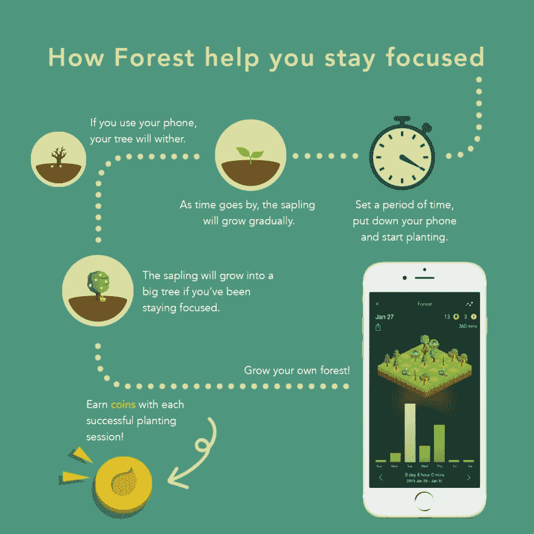
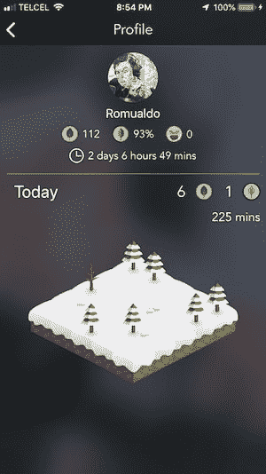
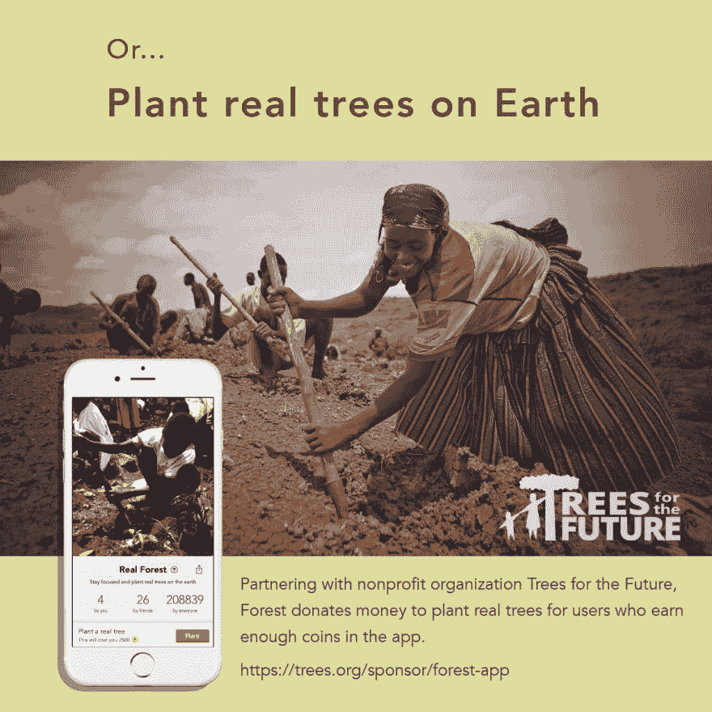

# 我有一根生产力魔杖，它的名字叫森林。

> 原文：<https://dev.to/osuka42/i-have-a-productivity-magic-wand-its-name-is-forest-b54>

[研究表明](https://thriveglobal.com/stories/in-an-8-hour-day-the-average-worker-is-productive-for-this-many-hours/)**在每天 8 小时的工作中，我们大约有 3 小时是高效的**。这可能令人难以置信的震惊，但这个应用程序让我意识到这确实是真的；我终于有了一个工具，基本上可以跟踪我的工作时间，结果就像一桶冰。每当我觉得我确实工作很多的时候，福里斯特告诉我，我只有 2 到 3 次专注的时间。
**现在我试着完成我设定的至少 4 小时专注时间的目标。**

Forest 不是]另一个设置 10 到 120 分钟超时的工具。如果你在没有退出应用程序的情况下完成会话，你将获得一棵虚拟树，如果会话失败，它将死去。然后你可以看到你所有的森林和所有你得到的树，并按天、周、月或年显示！

### 这有什么神奇的？

可能是为了最大限度地缓解我们的焦虑，没有人愿意停下一节课，看着树死去。它会死在你的森林里。

看看你每天有多少分钟是真正有效率的。如果你设定了一个每日目标，你将收获所有的森林之汁。

### 但是我可以在笔记本电脑上使用 facebook 和 reddit！有什么意义？

是的，你可以；在我看来这是个人荣誉的问题。对于朋友，我们已经定义了一些内部规则，所以我们用相同的标准来衡量。

*   当我们在开会时，我们真的会全力以赴；除了我们的主要焦点之外，我们不做任何其他活动。
*   如果中断时间超过 1 分钟，我们会停止计时器。是啊！哪怕亚马逊只是给你送新书:)
*   *专注时间*只有当我们真的需要专注时才会考虑，比如编码、3D 建模或阅读。它不适用于运动、清洁、看视频。当然，这是我们的规则，你可以使用最适合你的！

### 番茄工作法🍅

或许你对番茄工作法很熟悉，你承诺连续工作 25 分钟，每次休息 5 分钟。

我开始使用 Forest 和这种技术，我推荐把它作为一个起点。现在我可以轻松地坚持 45 分钟。

### 守好你的森林；追踪你的进度

 
你的森林是你表现的图形指示器。此外，在应用程序中有一些部分，您可以在不同的时间间隔显示您的森林。

你可以看到你朋友的森林，并炫耀你的森林！

其中最酷的一个功能就是，你可以花 2500 游戏内币去种一棵真树！

### 整体主要关键特征

*   **追踪你的生产力专注时间**，可以是编码时间，也可以是阅读时段。
*   社交游戏化让它变得更有趣，你可以感觉到和你朋友的比赛更有成效。我们甚至和一个朋友打赌 [nano](https://nano.org/en) 每天能达到一定的专注时间！
*   通过种一棵真正的树来做贡献。去过那里，但一旦我赚够了硬币，这将是我的第一次购买🌲

### 它只需 2 美元，而且物有所值。

*   [iOS 应用商店](https://itunes.apple.com/us/app/forest-stay-focused/id866450515)
*   [安卓 Playstore](https://play.google.com/store/apps/details?id=cc.forestapp&hl=en)
*   [镀铬扩展](https://chrome.google.com/webstore/detail/forest-stay-focused-be-pr/kjacjjdnoddnpbbcjilcajfhhbdhkpgk?hl=en)
*   [网站](https://www.forestapp.cc/en/)

如果你愿意，**加我为好友吧！** `osuka42@gmail.com`，我以我的艺术 id `Romualdo`出现。

如果你已经在使用这个应用，分享一下对你有用的东西。

免责声明:我不为这些人工作，也与他们没有任何关系。我只是分享一个神奇的工具，它一直在为我工作。

🍻