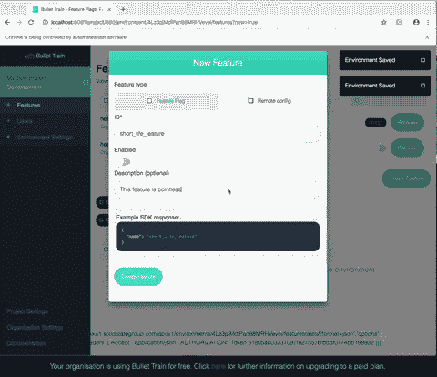
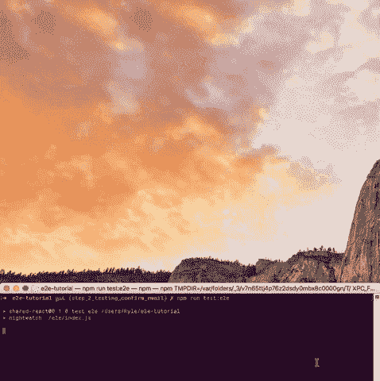

# 循序渐进——为您的 web 项目编写端到端测试

> 原文：<https://dev.to/kylessg/step-by-step---writing-e2e-tests-for-your-web-project-4mde>

(移至[此处](https://bullet-train.io/blog/writing-end-to-end-tests-web)

根据我之前的帖子[黑掉我们的 e2e 测试，使它们更有用](https://dev.to/kylessg/hacking-our-e2e-tests-to-make-them-more-useful-2gaj)，似乎没有什么资源可用于编写 e2e 测试。自从帮助写了《T2》的《子弹头列车》之后，这就是我强烈支持的东西。

[](https://i.giphy.com/media/1AIR5b2wYTtNUVuSlw/giphy.gif)

该指南从一个简单的项目开始，一步一步地添加 e2e 测试，每一步都链接到一个 git diff，所以你可以看到我到底做了什么。

如果你觉得这很有用，或者可能更喜欢我做一个视频，请告诉我。

# 项目

端到端测试对于回归测试耗时的工作流非常有用，本例将介绍这方面的主要用例，即用户注册和确认用户的电子邮件地址。

该项目是一个简单的 react web 应用程序，带有一个节点后端，使用它你可以登录，注册和接收一封确认电子邮件地址的电子邮件。我们的测试将会经历所有的工作流程，所以我们不需要在将来一直手动测试它。

本教程的范围不是介绍应用程序是如何构建的，而是作为一个简要的概述:

*   有一个[节点 API](https://github.com/kyle-ssg/e2e-tutorial/blob/master/server/api/user.js) ，有端点登录，注册，确认邮件。
*   然后在前端，我们用 React 写了几页[来承载我们的登录/注册/确认电子邮件地址字段和功能。](https://github.com/kyle-ssg/e2e-tutorial/tree/master/web/pages)

# 1。项目设置

*项目:[https://github.com/kyle-ssg/e2e-tutorial/](https://github.com/kyle-ssg/e2e-tutorial/tree/master)T3】*

## 1.1。安装 nightwatch、selenium 和 chromedriver

```
npm i nightwatch selenium-server chromedriver --save 
```

Enter fullscreen mode Exit fullscreen mode

我们需要安装 3 样东西来开始:

1.  night watch——一个很好的与 web 驱动和 selenium 交互的 API。
2.  为了运行我们的网络驱动程序，需要 selenium-server。
3.  chrome driver——通过 WebDriver 的有线协议与 selenium 服务器通信。

将 selenium-server 和 chrome 驱动程序安装为 npm 模块意味着您不需要担心运行测试的全局依赖性。您可以在任何具有不同操作系统的机器上运行它，更重要的是，它可以作为 CI 管道的一部分运行，而不必担心这些二进制文件是否以及在哪里预装。

## 1.2。编写 nightwatch.conf.js 文件

Nightwatch 附带了很多[配置选项](http://nightwatchjs.org/gettingstarted#settings-file)，可能有点让人不知所措。

根据我的经验，这里是你需要的最低配置。这里与默认配置的两个关键区别是:

1.  我们允许 chromedriver 和 selenium-server 节点模块定义二进制文件的位置。
2.  我们将 end_session_on_fail 设置为 false，允许我们在出现错误时与浏览器进行交互。[这里有更多关于这如何有用的信息](https://dev.to/kylessg/hacking-our-e2e-tests-to-make-them-more-useful-2gaj)

```
const chromedriver = require('chromedriver');
const seleniumServer = require('selenium-server');
const os = require('os');

const browserSize = 'window-size=1024,768'; // define how big to make the browser screen

module.exports = {

    'selenium': {
        'start_process': true, // tells nightwatch to start/stop the selenium process
        'server_path': seleniumServer.path,
        'cli_args': {
            'webdriver.chrome.driver': chromedriver.path, // chromedriver from our npm module
        },
    },

    'test_settings': {
        'end_session_on_fail': false, // don't close the browser straight away on fail in case we want to check the state
        'default': {
            'desiredCapabilities': {
                'browserName': 'chrome', // Run the e2e test in chrome
                'chromeOptions': {
                    // In linux we pass a few more arguments
                    'args': os.platform() === 'linux' ? ['headless', 'no-sandbox', browserSize] : [browserSize],
                },
            },
            'globals': {
                'waitForConditionTimeout': 5000, // global default time to wait for element to exist.
            },
        },
    },
}; 
```

Enter fullscreen mode Exit fullscreen mode

与其进行冗长的解释，不如看看上面关于每个属性具体用途的评论。

## 1.3。在 package.json 中添加脚本以运行测试

在我们的 package.json 中，我们只需要编写一个 npm 脚本来运行 nightwatch。

```
 "test:e2e": "nightwatch ./e2e/index.js" 
```

Enter fullscreen mode Exit fullscreen mode

## 1.4。编写我们的测试入口文件

入口文件导出一个包含我们的测试和一个前后挂钩的对象:

```
module.exports = Object.assign(
    {
        before: (browser, done) => { // Runs before tests start
            // runs before all of the tests run
            done();  // tell nightwatch we're done after we have done all of our bootstrapping
        },
        after: (browser, done) => { // Runs after the tests have finished
            // runs after all of the tests run
            browser.end(); // kill the browser
            done(); // tell nightwatch we're done
        },
    },
    // the main tests
    require('./register.test')(),
    require('./login.test')(),
); 
```

Enter fullscreen mode Exit fullscreen mode

## 1.5。我们的骨骼测试

在我们开始编写我们的 e2e 测试之前，下面是一些关于我们的测试是如何构造的示例语法:

```
module.exports = () => ({
    'Registration - test page loads': function (browser) {
        browser.url('https://google.com')
            .waitForElementVisible('body') // page load
    },
}); 
```

Enter fullscreen mode Exit fullscreen mode

我们给每个断言一个标题，然后使用 browser 对象执行函数。这可能是

*   等待元素可见
*   单击按钮
*   设置输入值
*   切换到 iframe

这些函数被一个接一个地调用，并等待前一个函数完成，它们可以被链接起来，这样你就可以编写整个工作流，同时保持测试规模较小，例如:

```
browser.url('http://localhost:8080')
    .waitForElementVisible("#my-input")
    .setValue("#my-input", "test")
    .click("#my-button")
    .waitForElementVisible("#confirmation-button")
    .click("#confirmation-button");
    .waitForElementVisible(...) 
```

Enter fullscreen mode Exit fullscreen mode

此时，我们已经准备好开始将 Nightwatch 集成到我们的代码中。我们现在可以运行 **npm run test:e2e** *启动 Chrome，导航到 Google 并验证 body 标签是否可见。

# 2。编写我们的第一个测试

*[为本节代码](https://github.com/kyle-ssg/e2e-tutorial/compare/step_1_adding_our_first_test)*

## 2.1 使用 Nightwatch 在本地运行我们的应用程序

现在我们已经配置了 Nightwatch，并且可以在外部页面上运行测试，我们现在想要在 localhost 上做同样的事情，就像我们在本地运行应用程序一样。唯一棘手的是，在我们继续测试之前，我们需要知道我们的服务器准备好了。通过一点小技巧，我们可以用 Node 的 [child_process.fork()](https://nodejs.org/api/child_process.html#child_process_child_process_fork_modulepath_args_options) 实现这一点，它产生了一个可以通过 IPC 通信的子进程。

```
 const fork = require('child_process').fork;

const server = fork('./server'); // start our server 
```

Enter fullscreen mode Exit fullscreen mode

一旦我们用 ***process.fork()*** 启动服务器，我们就监听它告诉我们的父进程它已经用***[process . send({ done:true })完成了；](https://github.com/kyle-ssg/e2e-tutorial/blob/master/server/middleware/webpack-middleware.js#L19)*T9。重新查看挂钩前的夜间监视可以让我们在开始测试之前等待这个确认消息。类似地，当测试结束时，我们想要终止服务器。** 

```
 before: (browser, done) => {
            // runs before all of the tests run, call done() when you're finished
            server.on('message', () => { // boot up the server which sends process.send({ done: true }); when ready
                done();
            });
        },
 after: (browser, done) => {
            // runs before all of the tests run, call done() when you're finished
            browser.end(); // kill the browser
            done(); // tell nightwatch we're done
            server.kill('SIGINT'); // kill the server
        }, 
```

Enter fullscreen mode Exit fullscreen mode

## 2.2 明智地瞄准 DOM 元素

虽然我们可以通过类名或 id 来定位我们的元素，但我个人认为通过数据测试属性来定位更好。这样，你就能更好地了解你是否会影响你的测试。为了增加一点语法上的乐趣，我创建了下面的 util:

```
byTestID: id => `[data-test="${id}"]`, 
```

Enter fullscreen mode Exit fullscreen mode

通过这个设置，我们将 data-test="your_id "添加到关键元素中，并编写我们的测试。

```
const { byTestID } = require('./util');

module.exports = (email, password) => ({
    'Registration - test page loads': function (browser) {
        browser.url('http://localhost:8080')
            .waitForElementVisible(byTestID('login-page')) // page load
            .click(byTestID('toggle-login')) // click toggle login
            .waitForElementVisible(byTestID('registration-email')) // wait for registration form
            .setValue(byTestID('registration-email'), email) // set fields
            .setValue(byTestID('registration-password'), password)
            .click(byTestID('registration-submit')) // submit form
            .waitForElementVisible(byTestID('check-email-page')); // wait for confirm email page
    },
}); 
```

Enter fullscreen mode Exit fullscreen mode

## 3。用 mailinator 完成我们的确认邮件测试

*[为本节代码](https://github.com/kyle-ssg/e2e-tutorial/compare/step_1_adding_our_first_test...step_2_testing_confirm_email)*

从现在开始，大多数测试通常都很容易编写。唯一棘手的部分是编写一些处理 mailinator 的实用函数。这种东西你想从主测试中提取出来，因为你可能想从一个地方重用使用/维护它们。

```
 gotoMailinator(browser, email) {
        const target = email.replace('@mailinator.com', ''); // get the mailinator username
        // goto the inbox and wait for the content to be ready
        return browser.url(`https://www.mailinator.com/v3/index.jsp?zone=public&query=${target}#/#inboxpane`)
            .waitForElementVisible('#inboxpane');
    },
    clickFirstMailinatorMessage(browser) {
        // click the latest message in the inbox pane
        browser.waitForElementVisible('#inboxpane table tr td:nth-child(3n)')
            .click('#inboxpane table tr td:nth-child(3n)');
    },
    getMailinatorMessage(browser) {
        return browser.waitForElementVisible('#msg_body') // wait for the content to be ready
            .frame('msg_body') // switch to the message content's iframe
            .pause(1000); // the most reliable way I've found to ensure the content has loaded
    }, 
```

Enter fullscreen mode Exit fullscreen mode

使用这一点，并编写一些与我们的第一个非常相似的测试，我们以上面的代码和用户注册、确认电子邮件地址和登录的端到端工作流结束。

[](https://i.giphy.com/media/28evywxMTHbvLdLakP/giphy.gif)

在此基础上，我们将开始编写测试，检查验证所有检查无效数据，并为任何新的主要工作流添加测试。

您可以随意查看 GitHub 上的示例，添加一个带有 SENDGRID_API_KEY="YOUR_KEY "的. env 文件会给您提供运行测试所需的一切！

黑客快乐！