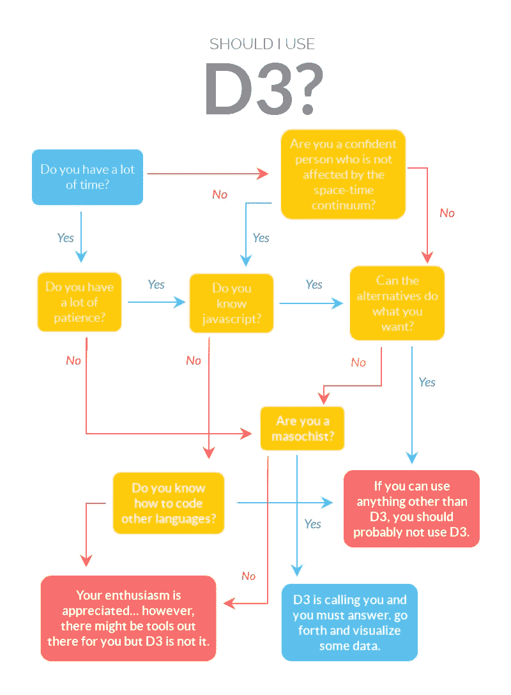

# 一头扎进 D3.js

> 原文：<https://dev.to/genevievecurry/diving-headfirst-into-d3js-45gc>

本文不是教程。这篇文章是写给像我这样的人的，他们认为他们需要使用 D3 来可视化他们的数据，但却完全不知道他们正在做什么。

> “有[已知的已知。](https://en.wikipedia.org/wiki/There_are_known_knowns)有些事情我们知道自己知道。有已知的未知。也就是说，有些事情我们现在知道我们不知道。但也有不为人知的未知。有些事情我们不知道我们不知道。”唐纳德·拉姆斯菲尔德

## 已知的已知

在你开始开车之前有一张路线图是很好的，即使你没有明确指出所有的路标。数据可视化真的很容易[做不好](http://viz.wtf/)。在开始之前，请将以下内容视为您绝对应该了解的内容。

### 有哪些基础？

除非你已经是一个数据向导，否则考虑阅读 Data + Design，[这是一个优秀的指南](http://orm-atlas2-prod.s3.amazonaws.com/pdf/13a07b19e01a397d8855c0463d52f454.pdf)，它将数据概念提炼为我们其他人更容易接受的东西，从应该如何收集原始数据开始，通过理解结果和清理数据，并讨论数据可视化的一些基础知识。

### 有数据吗？

如果答案是否定的，那就不理想，但也不是完全的阻碍。除非您使用的是公共 API，或者在开始构建可视化之前数据收集阶段已经完成，否则您很可能会使用测试集。使用测试数据会带来一些挑战，在开始之前需要解决这些挑战:

*   您能控制数据的结构吗，或者您需要解析它吗？
*   您的数据最终将来自哪里？
*   您是否需要编写一个函数来提供随机测试集，以确保您的图表能够在可能的阈值内处理边缘情况？

### 你想传达什么？

你的数据在讲述一个故事。无论是仪表板上传达服务器统计数据的一系列图表，还是说明地区趋势的 choropleth 图，您的可视化都应该承担数据解释的重任。

对数字创造性解释的限制似乎是无穷无尽的，尤其是使用像 D3 这样强大的工具。您可能受到了以下因素的启发:

*   [r/dataisbeautiful](https://www.reddit.com/r/dataisbeautiful/)
*   [D3.js 图库](https://github.com/d3/d3/wiki/Gallery)
*   [布丁](https://pudding.cool/)

尽管这些可视化效果非常惊人，但简单的线条图、饼图或条形图可能会为您需要做的事情提供迷人的效果。想想你的受众，以及你想让他们了解这些数据的什么。许多人知道，折线图通常用于显示一段时间内的趋势，饼图代表整体的百分比，条形图比较分类数据。

复杂的可视化可能需要额外的解释。如果你的听众是一个漫不经心的读者，向他们介绍他们的第一个和弦图可能没有意义，除非你花时间[带他们看一遍](https://www.visualcinnamon.com/2014/12/using-data-storytelling-with-chord.html)。

### 人为什么要用 D3？

D3 就像进入了一个充满令人印象深刻的危险机器的工业车间。这是最灵活的选择；你有最大的控制权，你可以把它变得像你想要的那样复杂。每个 D3 模块都有一套复杂的助手方法，可以:

*   获取并分析您的数据。
*   通过清理和格式化来处理数据。
*   处理复杂的动画、交互性和动态数据。

为了正确地做事，你不仅需要学习如何使用工具，你还需要在确定它是否是完成手头任务的工具之前，自学工具的功能。这导致了一个相当陡峭的学习曲线。关于人们应该如何看待 D3 的有趣观点，请阅读 [D3 不是数据可视化库](https://medium.com/@Elijah_Meeks/d3-is-not-a-data-visualization-library-67ba549e8520)。如果那篇文章的标题看起来有点混乱，那真的只是 D3 冰山的一角。

如果你只是没有时间或兴趣在开始你的项目之前学习 D3 是如何工作的，那当然是一个选择。这可能不是个好主意。

### D3 不做什么？

D3 不做很多手握，不适合新手。你可能认为其他数据可视化选项更类似于购买和建造宜家家具。D3 不提供预切割和钻孔可视化解决方案。

在 D3 中有很多可视化的例子，但是它们不是带有指导手册的模板，而且它们大多是使用 D3 的过时版本构建的。

### 该不该用 D3？

有很多数据可视化库。[可视化数据](https://datavizcatalogue.com/)的方法有很多。研究各种选择。当您这样做时，考虑您的一般技能水平，查看代码的实际示例，并考虑它将如何在您想要使用的环境中工作。在这上面花几个小时有望避免您有这样的经历，比如发现您选择的库在您的环境中不工作。

很有可能 D3 是你的最佳选择。出于尽职调查的兴趣，先问自己一些问题:

## 已知未知

如果你直接进入 [D3 的文档](https://github.com/d3/d3/wiki)，你可能会发现自己被相当详尽的可用模块列表所淹没。在花了几分钟时间研究了 D3 的各种功能之后，您可能会思考是哪些选择让您走到了这一步。

不要害怕！D3 的大部分存在于已知的未知领域。棘手的部分是确定哪些未知值得知道，让那些未知为人所知，并原谅你自己不愿意知道的事情。如果你真的想坚持使用 D3，并且你需要昨天完成的可视化，有一些事情可能会帮助你度过难关。

### 不要多此一举。

只需在 D3 的上下文中搜索您想要的功能，就会出现许多可用的代码示例。很多人在 github 上分享他们的 d3 项目，你可以在[bl.ocks.org](https://bl.ocks.org/-/about)上看到。

根据我的浏览器历史，显然我花了一千多次谷歌搜索来避免通过在线课程学习 D3。为了完成我的动态、交互式图表和可视化，我基本上是从各种来源拼凑了一堆特性。

### 回收代码不起作用的时候？

关于回收代码的警告:注意版本号。D3 已经存在一段时间了，您应该能够识别大多数代码示例中的版本。如果你想坚持使用 D3 的最新版本，但是你想要的美味的代码片段是两个过期的版本，如果不做一些修改，它很可能不适合你。D3 在版本 3 和版本 4 之间有一个相当大的结构调整。

我从两个方面着手:或者通过浏览 [D3 变更日志](https://github.com/d3/d3/blob/master/CHANGES.md)，或者简单地通过筛选当前文档。许多修复都涉及到一些小的调整，比如将 d3.scale.linear 改为 d3.scaleLinear。

### 将一些示例代码放到您的环境中。

这似乎是显而易见的，但这是我忽略的事情，结果导致了一些头痛。让 D3 在您的环境中运行可能比您预期的更具挑战性。可能您一直都在计划这样做，因为您还能在哪里构建您的数据可视化呢？

对我来说，我决定用 CodePen 构建我的可视化，以避免等待我的 javascript 编译。没有可供我使用的 API 端点，当我将 D3 缝合成我想要的形状时，CodePen 给我的反馈要快得多。我在 React 中遇到了渲染问题，通过使用 fetch，Internet Explorer 11 出现了一些问题。在某种程度上，这就是使用 WebPack、React 和 Babel 的生活，后知后觉是 20/20，但我可以在游戏早期发现这些问题，这可能会导致更多关于 D3 是否是正确的库的审查。

## 未知的未知数

在一个像我们当前的 web 开发生态圈这样变化多端的环境中工作，意味着你可能会遇到一些问题，而这些问题的解决方案并不是通过快速的 google 搜索就能得到的。像学习和使用任何技术一样，有一些东西是很好的，尤其是当它涉及到预测你的盲点时。

### 你并不孤单

没有人是一座孤岛！其他开发人员是一个非常有价值的资源，他们中的一些人甚至可能非常喜欢 D3，喜欢和你谈论它。如果我在全速投入项目之前花时间联系我的开发人员社区，他们可能会警告我前面的一些陷阱。我非常天真地对此一无所知(这也许可以解释为什么在查询中有超过 1000 个带有 D3 的谷歌搜索)。询问他们的经历是怎样的，他们面临的挑战是什么，以及当事情变得不可收拾时，他们去哪里寻找答案。

### 考虑失败

不能保证成功。我们中的很多人都被训练成相信，如果我们足够努力，工作足够长的时间，我们就能以优雅的解决方案克服所有的挑战。如果你在游戏的早期就开始思考失败是什么样子的，你可能会发现你的策略中的一些弱点。如果数据不好会怎么样？如果你想用你的数据讲述的故事不能通过你的可视化有效地传达，那该怎么办？如果你有一个难以满足的截止日期怎么办？

如果你能搁置一些假设，你会发现自己对更灵活的解决方案持开放态度。也许 D3 并不是你心目中的项目的合适工具，但是你的研究让你更接近于理解什么时候它对其他事情是完美的。也许 D3 正是你所需要的，这项研究将帮助你避免原地打转。

在 D3 中学习和工作对我来说是一次极好的经历，可能是我需要做的工作的正确工具，但是如果我能回到过去做更多的初步研究，我的搜索历史可能只有 500 次 Google 搜索。