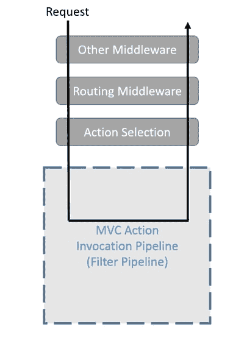
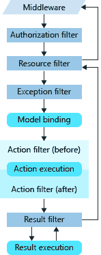

# 第 009 集- MVC 过滤器-ASP.NET 核心:从 0 到过度杀伤

> 原文：<https://dev.to/joaofbantunes/episode-009---mvc-filters---aspnet-core-from-0-to-overkill-277k>

继上一集 ASP.NET 核心中间件之后，这一集我们来看看 MVC 的过滤器，这是一种 MVC 特有的向请求处理管道添加行为的方式，以及我们如何使用它们在 web 应用程序中实现横切关注点。对于演练，您可以查看下一个视频，但如果您喜欢快速阅读，请跳到书面综合。

[https://www.youtube.com/embed/Dms0HcPAEcY](https://www.youtube.com/embed/Dms0HcPAEcY)

整个系列的播放列表是[这里是](https://www.youtube.com/playlist?list=PLN0oN9Azm_MMAjk3nhRnmHdr1l0160Dhs)。
T3】

## [T1】简介](#intro)

与前面介绍的一样，鉴于上一集关注的是 ASP.NET 核心的中间件，在它之后看一看 MVC 过滤器对我来说是有意义的，因为它提供了一些不同的选项来将行为添加到请求处理管道中，即使在这种情况下更具体地针对 MVC 特性。

回到[文档](https://docs.microsoft.com/en-us/aspnet/core/mvc/controllers/filters?view=aspnetcore-2.1)中的图片，说明滤镜如何适应整体画面。

[](https://res.cloudinary.com/practicaldev/image/fetch/s--oLq_ehqJ--/c_limit%2Cf_auto%2Cfl_progressive%2Cq_auto%2Cw_880/https://thepracticaldev.s3.amazonaws.com/i/jzi49zdeb50fsjy81ocj.png)

有 5 种类型的过滤器，如[文档](https://docs.microsoft.com/en-us/aspnet/core/mvc/controllers/filters?view=aspnetcore-2.1)所示:

> *   The authorization filter runs first to determine whether the current user has the right to process the current request. If the request is unauthorized, they can short-circuit the pipeline.
> *   The resource filter first processes the authorized request. They can run the code before the rest of the filter pipeline and after the rest of the pipeline is finished. For performance reasons, they are very useful for implementing caching or shortening the filter pipeline. They run before the model binding, so they can affect the model binding.
> *   The action filter can run the code immediately before and after a single action method is called. They can be used to manipulate the parameters passed to the operation and the results returned by the operation.
> *   Exception filters are used to apply global policies to unhandled exceptions that occur before anything is written to the response body.
> *   The result filter can run the code immediately before and after executing a single action result. They only run when the operation method is successfully executed. They are useful for logic that must be executed around a view or formatter.

下图(又是来自[文档](https://docs.microsoft.com/en-us/aspnet/core/mvc/controllers/filters?view=aspnetcore-2.1)的)显示了过滤器如何一起工作的更多细节。

[](https://res.cloudinary.com/practicaldev/image/fetch/s--jJy6n0jC--/c_limit%2Cf_auto%2Cfl_progressive%2Cq_auto%2Cw_880/https://thepracticaldev.s3.amazonaws.com/i/fhspjw4wb6n1hcv3qigd.png)

在这篇文章中，我们将只使用动作和异常过滤器，以及如何实现和使用它们的选项。其他过滤器在实现和使用方面应该是相似的，当然有不同的原因。

## 应用广泛的过滤器

让我们从简单的开始，注册一个动作过滤器来拦截所有到达 MVC 动作的请求。

为此，我们首先创建一个实现`IActionFilter`(或者`IAsyncActionFilter`，如果我们需要在那里做一些异步工作)的类。

`DemoActionFilter.cs`

```
public class DemoActionFilter : IActionFilter
{
    private readonly ILogger<DemoActionFilter> _logger;

    public DemoActionFilter(ILogger<DemoActionFilter> logger)
    {
        _logger = logger;
    }

    public void OnActionExecuting(ActionExecutingContext context)
    {
        _logger.LogInformation("Before executing action {action} with arguments \"{@arguments}\" and model state \"{@modelState}\"",
            context.ActionDescriptor.DisplayName,
            context.ActionArguments,
            context.ModelState);
    }

    public void OnActionExecuted(ActionExecutedContext context)
    {
        _logger.LogInformation("After executing action {action}.", context.ActionDescriptor.DisplayName);
    }
} 
```

Enter fullscreen mode Exit fullscreen mode

相当简单的东西。我们实现接口方法`OnActionExecuting`和`OnActionExecuted`(分别在动作执行之前和之后运行)。

像往常一样，在我的帖子例子中，我正在记录东西🤣我认为内容并不重要，它只是作为我们在过滤器上下文中可以访问的一些信息的示例。

我们还可以看到，我们可以注入依赖项，因为我们在构造函数中获得了一个日志记录器。

为了注册过滤器，以便它拦截所有的动作，我们直接使用`Startup`类`ConfigureServices`方法，并在 MVC 选项中注册过滤器，如下所示:

`Startup.cs`

```
public void ConfigureServices(IServiceCollection services)
{
    services.AddMvc(options =>
    {
        options.Filters.Add<DemoActionFilter>();
    });

    //...
} 
```

Enter fullscreen mode Exit fullscreen mode

另一种选择(可能是更好的想法)是使用`options.Filters.AddService<DemoActionFilter>()`注册过滤器，但是如果我们这样做，我们还必须在 DI 容器中注册过滤器。

该过滤器的日志输出示例如下:

```
19:05:24 CodingMilitia.PlayBall.GroupManagement.Web.Demo.Filters.DemoActionFilter Info Before executing action "CodingMilitia.PlayBall.GroupManagement.Web.Controllers.GroupsController.CreateReally (CodingMilitia.PlayBall.GroupManagement.Web)" with arguments "{"model":{"Id":0, "Name":"Some Group"}}" and model state "[{"Key":"Name", "Value":{"Key":"Name", "SubKey":{"Buffer":"Name", "Offset":0, "Length":4, "Value":"Name", "HasValue":true}, "IsContainerNode":false, "RawValue":"Some Group", "AttemptedValue":"Some Group", "Errors":[], "ValidationState":"Valid"}}]"
19:05:24 CodingMilitia.PlayBall.GroupManagement.Web.Demo.Filters.DemoActionFilter Info After executing action CodingMilitia.PlayBall.GroupManagement.Web.Controllers.GroupsController.CreateReally (CodingMilitia.PlayBall.GroupManagement.Web). 
```

Enter fullscreen mode Exit fullscreen mode

## 用过滤器属性修饰控制器或动作

在全局范围内应用一个过滤器是很好的，对于很多情况来说可能已经足够了，但是有时候我们真的需要更多的控制来决定过滤器应该在什么时候执行。实现这一点的一个好方法是使用属性，用它我们可以修饰一个控制器或一个动作，在那里我们希望使用过滤器。

让我们制作另一个愚蠢的示例动作过滤器来验证这一点🙂

`DemoActionFilterAttribute.cs`

```
public class DemoActionFilterAttribute : ActionFilterAttribute
{
    public override void OnActionExecuting(ActionExecutingContext context)
    {
        if (context.ActionArguments.TryGetValue("model", out var model)
            && model is GroupViewModel group
            && group.Id == 1)
        {
            group.Name += $" (Added on {nameof(DemoActionFilterAttribute)})";
        }
    }
} 
```

Enter fullscreen mode Exit fullscreen mode

在这个例子中，我们检查是否有一个名为`model`的动作参数，然后检查它是否属于 id 为`1`的类型`GroupViewModel`。如果匹配，我们改变对象的内容，只是为了证明我们可以🙂

您可能会注意到，我们没有注入任何依赖项，这是因为通过像这样滚动属性，我们不能拥有它们，因为我们需要在应用属性时传递它们，这实际上是不可行的(但我们稍后将看到如何使用能够注入依赖项的属性来应用过滤器)。

要应用该属性，我们可以进入我们的`GroupsController`并将其直接应用于类，或者应用于任何方法——但是要看到它工作，我们需要将其应用于`Edit`方法，其他人不会使用它。

`GroupsController.cs`

```
[DemoActionFilter]
[HttpPost]
[Route("{id}")]
[ValidateAntiForgeryToken]
public IActionResult Edit(long id, GroupViewModel model)
{
    var group = _groupsService.Update(model.ToServiceModel());

    if (group == null)
    {
        return NotFound();
    }

    return RedirectToAction("Index");
} 
```

Enter fullscreen mode Exit fullscreen mode

要查看最终结果，我们可以创建一个组，然后编辑它，我们将看到添加的文本。

## 过滤具有依赖关系的属性

使用一个属性来应用一个过滤器是很好的，但是正如前面提到的，像上一节那样做并不允许我们做太多事情，因为我们不能在过滤器类中获得任何依赖。

让我们来看一些既有蛋糕又能吃掉它的选择。让我们从创建一个示例异常过滤器开始。

`DemoExceptionFilter.cs`

```
public class DemoExceptionFilter : IExceptionFilter
{
    private readonly ILogger<DemoExceptionFilter> _logger;

    public DemoExceptionFilter(ILogger<DemoExceptionFilter> logger)
    {
        _logger = logger;
    }

    public void OnException(ExceptionContext context)
    {
        if (context.Exception is ArgumentException)
        {
            _logger.LogError("Transforming ArgumentException in 400");
            context.Result = new BadRequestResult();
        }
    }
} 
```

Enter fullscreen mode Exit fullscreen mode

简单的东西，任何时候一个异常在一个动作中被抛出(并且没有被捕获)，它将在`DemoExceptionFilter`中结束，如果它是一个`ArgumentException`我们用一个 400 来响应。现在让我们使用过滤器。

### 使用 ServiceFilterAttribute

我们的第一个选择是使用`ServiceFilterAttribute`。我们没有直接使用过滤器作为属性，而是使用我们想要的过滤器类型作为参数来使用`ServiceFilterAttribute`。

`GroupsController.cs`

```
[ServiceFilter(typeof(DemoExceptionFilter))]
[Route("groups")]
public class GroupsController : Controller
{
    //...
} 
```

Enter fullscreen mode Exit fullscreen mode

除了添加属性，我们还需要在 DI 中注册`DemoExceptionFilter`，这样`ServiceFilterAttribute`就可以获取它。

`Startup.cs`

```
public void ConfigureServices(IServiceCollection services)
{
    //...

    services.AddTransient<DemoExceptionFilter>();

    //...
} 
```

Enter fullscreen mode Exit fullscreen mode

### 使用定制过滤器工厂

如果我们需要对事物进行更多的控制，那么`ServiceFilterAttribute`的另一种选择是创建一个实现`IFilterFactory`的属性。

`DemoExceptionFilterFactoryAttribute.cs`

```
public class DemoExceptionFilterFactoryAttribute : Attribute, IFilterFactory
{
    public IFilterMetadata CreateInstance(IServiceProvider serviceProvider)
    {
        var filter = serviceProvider.GetRequiredService<DemoExceptionFilter>();
        return filter;
    }

    public bool IsReusable { get; } = false;
} 
```

Enter fullscreen mode Exit fullscreen mode

当实现`IFilterFactory.CreateInstance`时，我们得到一个`IServiceProvider`实例作为参数，因此我们可以从依赖注入容器中获取任何我们需要的东西。在这种情况下，我们只是从 DI 获取一个过滤器实例，但是如果需要的话，我们也可以将事情复杂化。

`IsReusable`属性是 usd，告诉运行时工厂返回的过滤器实例是否可以跨请求重用。如果是单一过滤器，当然可以，但如果不是这样，`IsReusable`应该是`false`。

要使用它，我们可以简单地进入`GroupsController`并用这个替换`ServiceFilterAttribute`。

`GroupsController.cs`

```
[DemoExceptionFilterFactory]
[Route("groups")]
public class GroupsController : Controller
{
    //...
} 
```

Enter fullscreen mode Exit fullscreen mode

## 其他

正如我在开始时所说的，这只是对我们可以做的一些事情 MVC 过滤器的快速浏览，只是为了让我们在开发应用程序时意识到我们的选择，也许我们认识到一些模式将完美地映射到 MVC 过滤器(或者可能是像我们在以前的帖子中看到的中间件)。

和往常一样，[文档](https://docs.microsoft.com/en-us/aspnet/core/fundamentals/middleware/?view=aspnetcore-2.1)是了解所有这些主题的好地方，有很多信息我不能塞进这些快速的帖子里。

这个帖子的源码是[这里](https://github.com/AspNetCoreFromZeroToOverkill/GroupManagement/tree/episode009)。

请发送任何反馈，以便我可以改进和调整下一集。

谢谢你的来访，西阿兹！