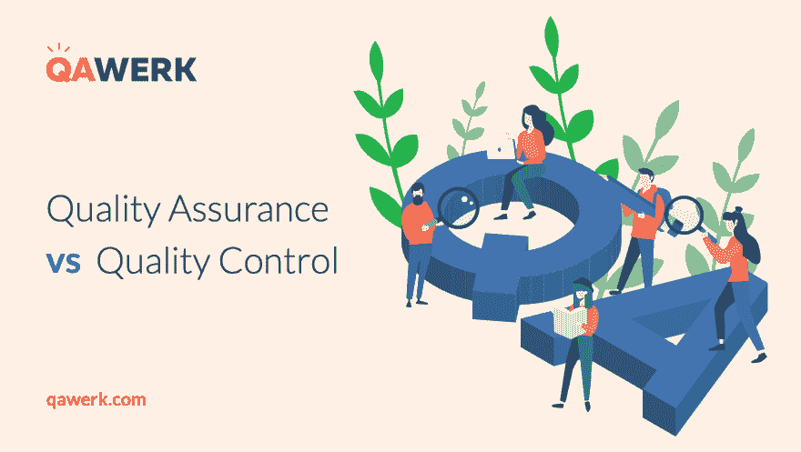

# 质量保证与质量控制:谁是谁？

> 原文：<https://dev.to/qawerk/quality-assurance-vs-quality-control-who-is-who--hal>

 
世界各个角落每天都有新思想诞生。尽管我们生活在数字时代，但这些想法大多被转化为软件应用。多种服务，从送披萨到租朋友(！)，网店和绝对不可思议的游戏。它们的数量不计其数，而且还在不断增长。但是软件产品的创建并不是一个简单的过程。每个应用程序的开发都是一个复杂的项目，包括几个强制性的里程碑。其中之一是关于确保软件产品的正确工作和功能。理论上，可以省略审查过程，并希望发布的产品能够正常工作，但事实是，几乎不可能找到一个能够在整个项目中编写完美代码的开发人员，尤其是大型项目。这就是为什么提供测试服务的[质量保证公司](https://qawerk.com)开发了一套全面的程序。通常，这种验证服务被称为质量保证(QA)。但事实上，QA 是整个测试过程的一部分。另外两个是质量控制(QC ),实际上是测试本身。测试代表什么是很清楚的，但是 QA 和 QC 之间的区别是什么？让我们弄清楚。

根据定义，QA 是一种防止制造产品中的错误和缺陷以及在向客户提供解决方案或服务时避免问题的方法。

所以，QA 负责整个开发过程，这就是为什么它应该被整合到所有阶段:从项目描述开始到测试阶段，发布，甚至发布后的支持。QA 专家创建并发布各种策略来提高所有开发层级的质量:标准的准备和调整、质量分析、工具的选择、错误发生的预防以及持续的过程改进。QA 是一套安排，包括产品开发、交付和调试软件系统所有阶段的所有技术方面，以确保必要的产品质量水平。在很大程度上，它侧重于过程和方法，而不是直接的系统测试。它具有面向过程的方法和预防性质。换句话说，质量保证提供了正确和可预测的过程。

质量控制是一个过程，通过这个过程，实体审查生产中涉及的所有因素的质量。

质量控制的目的是检测错误并解决它们。QC 的核心任务是在给定的时间支持产品质量；它面向产品的审查，本身包含许多过程，如代码审查、技术观察、设计分析等。质量控制的重点是程序的成功运行，并在批准的流程和方法的帮助下检测缺陷。它意味着以产品为导向的方法，并执行纠正功能。简而言之，质量控制旨在对批准的程序要求的符合性进行管理。

测试是一个旨在发现最终产品是否符合利益相关者要求的程序。

测试代表测试用例的执行，错误的检测和定位。它包括面向产品的方法和预防性质。

为了更好理解，让我们用自行车的构造来打个比方。在质量保证阶段，从规划和创建蓝图到组装现成的自行车，所有零件都必须符合规定的质量标准。因此，在这一点上，对对象质量的关注甚至是在它被创建之前。

同时，QC 正在检查已经构建的细节的质量，例如，自行车齿轮是否正确换档，或者刹车是否提供可控减速功能，直到完全停止。

最后，测试旨在提供统计数据的集合，并将其输入到在 QC 过程中形成的文档中。在测试的帮助下，可以确定所有细节和整个自行车本身是否如预期那样工作。在这里，我们验证是否使用了正确的材料(哪种金属或合金)，是否应用了正确的方法和工具。

正如我们所看到的，所有这些概念就其目的而言是有区别的。它们中的每一个都在产品开发生命周期的不同阶段发挥作用。尽管所有的行动都有一个共同的终点——发布一个高质量的产品；尽管如此，他们达成目标的方式还是有些不同。