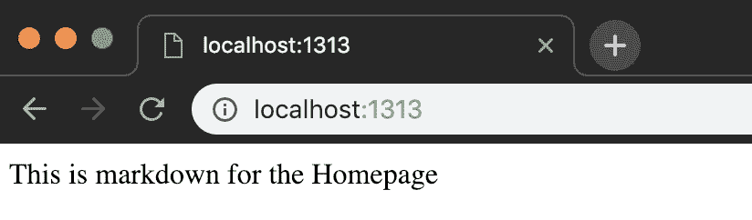
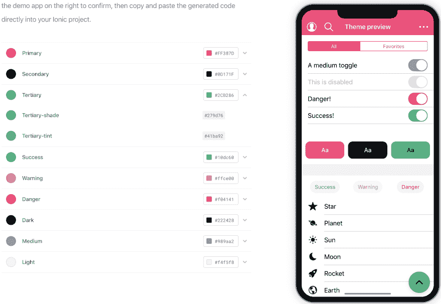

# AJonP Hugo 离子模板

> 原文：<https://dev.to/codingcatdev/ajonp-hugo-ionic-template-2kcc>

> 原帖:[https://ajonp.com/lessons/ajonp-hugo-ionic-template/](https://ajonp.com/lessons/ajonp-hugo-ionic-template/)

[https://www.youtube.com/embed/CZmEZ62yMFA](https://www.youtube.com/embed/CZmEZ62yMFA)

# 雨果入门

在 [gohugo.io](https://gohugo.io/getting-started/installing/) 查看指南。我的指南会一直在 Mac 上，但我会一直尝试提供其他操作系统的链接。

## 上课步骤

1.  安装 Hugo
2.  创建新的 Hugo 网站
3.  开始使用 AJonP 模板

### 第二课(阿尔戈利亚必修)

请查看下一组功能

1.  维克多·雨果
2.  部署

## 安装雨果

### 酿造

如果你像我一样，刚买了一台新的 Mac，你可能会认为 brew 是理所当然的，并认为它就在那里😀！嗯，首先你可以前往 [brew.sh](https://brew.sh/) 他们会告诉你运行

```
/usr/bin/ruby -e "$(curl -fsSL https://raw.githubusercontent.com/Homebrew/install/master/install)" 
```

Enter fullscreen mode Exit fullscreen mode

### 雨果

```
brew install hugo 
```

Enter fullscreen mode Exit fullscreen mode

# 创建新的 Hugo 站点

```
hugo new site 4-hugo-ionic
cd 4-hugo-ionic 
```

Enter fullscreen mode Exit fullscreen mode

在这一点上，你会注意到这个项目在一个通用的框架中仍然是空的。

[](https://res.cloudinary.com/practicaldev/image/fetch/s--9MeHqO5g--/c_limit%2Cf_auto%2Cfl_progressive%2Cq_auto%2Cw_880/https://res.cloudinary.com/ajonp/image/upload/f_auto%2Cfl_lossy%2Cq_auto/v1544487496/ajonp-ajonp-com/4-lesson-hugo-ionic/hugo_init.jpg)

它只有两个文件 config.toml 和原型/default.md

> 如果你现在运行`hugo serve`，你会看到一个空白的屏幕，因为没有内容可以显示。

## Index.html

将它添加到我们网站的底部将用于设置[主页](https://gohugo.io/templates/homepage/)。这是你建立一个基于 Hugo 的网站唯一需要的页面。请记住，这仍然是一个

layouts/Index.html

```
You could make an entire site here if you wanted. 
```

Enter fullscreen mode Exit fullscreen mode

> 同样，如果您现在运行`hugo serve`，您将看到一个空白屏幕，因为没有内容可显示。

## [T1】_ index . MD](#indexmd)

content/_index.md

```
This is markdown for the Homepage 
```

Enter fullscreen mode Exit fullscreen mode

> 我知道这有点令人沮丧！同样，如果您现在运行`hugo serve`，您将看到一个空白屏幕，因为没有内容可显示。

## 更新 Index.html

这将是在浏览器中显示任何内容的第**个**页面！

layouts/index.html

```
 {{ .Content }} 
```

Enter fullscreen mode Exit fullscreen mode

现在运行命令`hugo serve`，您将看到一个页面

[](https://res.cloudinary.com/practicaldev/image/fetch/s--PXgjv-j9--/c_limit%2Cf_auto%2Cfl_progressive%2Cq_auto%2Cw_880/https://res.cloudinary.com/ajonp/image/upload/f_auto%2Cfl_lossy%2Cq_auto/v1544489438/ajonp-ajonp-com/4-lesson-hugo-ionic/orjghz4mteborfyrmdbr.jpg)

## 制造一个点

现在我想向你们展示这一切

1.  制作 Hugo 网站的必要步骤
2.  证明从头开始设计网站是非常耗时的

# 开始使用 AJonP 模板

## 主题下载位置

*   你可以在雨果的主题网站[https://themes.gohugo.io/ajonp-hugo-ionic/](https://themes.gohugo.io/ajonp-hugo-ionic/)上找到链接

*   直接来自 [github](https://github.com/AJONPLLC/ajonp-hugo-ionic)

## Git 积分

### 克隆(简单，不更新)

```
git clone https://github.com/AJONPLLC/ajonp-hugo-ionic themes/ajonp-hugo-ionic 
```

Enter fullscreen mode Exit fullscreen mode

### 子模块(更好，更新)

```
git submodule add https://github.com/AJONPLLC/ajonp-hugo-ionic themes/ajonp-hugo-ionic 
```

Enter fullscreen mode Exit fullscreen mode

添加子模块将允许您接收您想要的所有更新，或者锁定一个特定的提交来运行您的站点。然后你就可以运行

```
git submodule update --remote --merge 
```

Enter fullscreen mode Exit fullscreen mode

## 主题福利

现在你应该在 themes/ajonp-hugo-ionic 中有了一个新的文件夹。这有完整的主题，包括一个在 themes/ajonp-Hugo-ionic/example site 中找到的示例站点

特征

*   [Layouts](https://gohugo.io/templates/)
*   [短码](https://gohugo.io/content-management/shortcodes/)
*   网站地图
*   [字体牛逼](https://fontawesome.com/)
*   [离子型](https://ionicframework.com/)
*   [谷歌广告](https://ads.google.com/home/)
*   [谷歌分析](https://marketingplatform.google.com/about/analytics/)
*   [缺陷](https://disqus.com/)
*   [AddThis](https://www.addthis.com/)
*   [OpenGraph](https://developers.facebook.com/docs/sharing/opengraph/)
*   [推特卡片](https://developer.twitter.com/en/docs/tweets/optimize-with-cards/overview/abouts-cards)

下一课功能

*   []

# 离子主题化

更进一步，你可以使用 Ionic 的[颜色生成器](https://beta.ionicframework.com/docs/theming/color-generator)来改变网站上的任何颜色。

这是一个受雨果启发的造型。
[T3】](https://res.cloudinary.com/practicaldev/image/fetch/s--geepOzDI--/c_limit%2Cf_auto%2Cfl_progressive%2Cq_auto%2Cw_880/https://res.cloudinary.com/ajonp/image/upload/f_auto%2Cfl_lossy%2Cq_auto/v1544493969/ajonp-ajonp-com/4-lesson-hugo-ionic/dys1lqsodaxwaf8qbmo6.jpg)

只需将其产生的 CSS 变量复制到
static/css/custom.css
中

```
:root {
  --ion-color-primary: #FF387D;
  --ion-color-primary-rgb: 255,56,125;
  --ion-color-primary-contrast: #ffffff;
  --ion-color-primary-contrast-rgb: 255,255,255;
  --ion-color-primary-shade: #e0316e;
  --ion-color-primary-tint: #ff4c8a;

  --ion-color-secondary: #0D171F;
  --ion-color-secondary-rgb: 13,23,31;
  --ion-color-secondary-contrast: #ffffff;
  --ion-color-secondary-contrast-rgb: 255,255,255;
  --ion-color-secondary-shade: #0b141b;
  --ion-color-secondary-tint: #252e35;

  --ion-color-tertiary: #2CB286;
  --ion-color-tertiary-rgb: 44,178,134;
  --ion-color-tertiary-contrast: #000000;
  --ion-color-tertiary-contrast-rgb: 0,0,0;
  --ion-color-tertiary-shade: #279d76;
  --ion-color-tertiary-tint: #41ba92;

  --ion-color-success: #10dc60;
  --ion-color-success-rgb: 16,220,96;
  --ion-color-success-contrast: #ffffff;
  --ion-color-success-contrast-rgb: 255,255,255;
  --ion-color-success-shade: #0ec254;
  --ion-color-success-tint: #28e070;

  --ion-color-warning: #ffce00;
  --ion-color-warning-rgb: 255,206,0;
  --ion-color-warning-contrast: #ffffff;
  --ion-color-warning-contrast-rgb: 255,255,255;
  --ion-color-warning-shade: #e0b500;
  --ion-color-warning-tint: #ffd31a;

  --ion-color-danger: #f04141;
  --ion-color-danger-rgb: 245,61,61;
  --ion-color-danger-contrast: #ffffff;
  --ion-color-danger-contrast-rgb: 255,255,255;
  --ion-color-danger-shade: #d33939;
  --ion-color-danger-tint: #f25454;

  --ion-color-dark: #222428;
  --ion-color-dark-rgb: 34,34,34;
  --ion-color-dark-contrast: #ffffff;
  --ion-color-dark-contrast-rgb: 255,255,255;
  --ion-color-dark-shade: #1e2023;
  --ion-color-dark-tint: #383a3e;

  --ion-color-medium: #989aa2;
  --ion-color-medium-rgb: 152,154,162;
  --ion-color-medium-contrast: #ffffff;
  --ion-color-medium-contrast-rgb: 255,255,255;
  --ion-color-medium-shade: #86888f;
  --ion-color-medium-tint: #a2a4ab;

  --ion-color-light: #f4f5f8;
  --ion-color-light-rgb: 244,244,244;
  --ion-color-light-contrast: #000000;
  --ion-color-light-contrast-rgb: 0,0,0;
  --ion-color-light-shade: #d7d8da;
  --ion-color-light-tint: #f5f6f9;
} 
```

Enter fullscreen mode Exit fullscreen mode

# 主题更新

我使用了 [AJonP](https://ajonp.com) 的主题，所以它可能会改变(你可以一直保持提交状态)，但是请通过 [Slack](https://ajonp-com.slack.com/join/shared_invite/enQtNDk4NjMyNDUxMzM0LWQwMThkZDE3MDAzNzVmNWE3N2M1NzkwMzg1YWQ5NzIxZmIyYTM3ZjEyOGU3YjQ0NTFkYzRmZjMyYzExNDNlNTg) 联系我，或者通过 [Github](https://github.com/AJONPLLC/ajonp-hugo-ionic/pulls) 拉取请求。