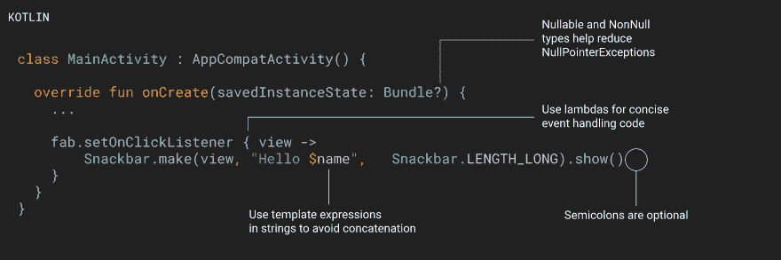
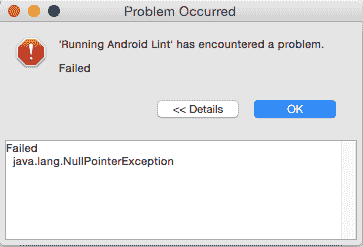

# So, Kotlin, ha?

> [https://dev . to/代课老师/so-hoon-ha-3957】我不知道你在说什么](https://dev.to/viksaaskool/so-kotlin-ha-3957)

这篇博文(最初的标题是《科特林派对的迟到》)从春天开始就一直放在档案柜里，“看到光缆的光”的时刻被推迟了，因为，原因。到现在为止，原来的标题已经过时了，但我保留了大部分原来的结构，我认为帖子中的建议和注释对新人来说会很有用，所以就这样吧。

你是一名 Android 开发人员，你一直在学习 Kotlin，呆在舒适区，维护 Java 代码项目，最近开始使用 Android，Java 势不可挡，或者不管是什么原因——现在你发现自己有点晚了？我想我也是。这篇博客是我在 Kotlin 学习中的苦恼的结果，我以“Kotlin 笔记”/“点板”的形式组织了这篇博客。
事情就是这样，如果你想保持相关性，你必须这样做，即使你目前的职位可能不需要你这样做，事情可能会改变，你可能会在这个职位上结束。系好安全带，我已经完成了紧急过渡程序。这有很多层次，但它会让你开始。

让我们从资源开始，资源太多了，我会尽量保持整洁:

1.  我知道在这个“搜索一切”的时代，这不是一个好建议，但是试着尽可能多的记忆——就像你在为考试而学习一样，很多东西都是新的，它们可能没有上下文，但是通过尝试一些东西和看一些例子，这些东西会变得完整。你不可能记住所有的东西，你需要时不时地回来，但我发现这种方法非常有帮助，让那些“啊哈，这就是他们的意思/这就是我如何使用这个和这个东西”的时刻被记录下来，还有:[官方 Android 文档](https://developer.android.com/kotlin/)——当它涉及到对你很重要的例子时。当麻烦出现时，你会来这里，只是为了让现实检查你没有那么聪明，你认为是直觉的组件，你知道它是如何工作的，并不完全像现实。
2.  博客——来自业内爱好者的 dev.to/medium 帖子可能是你学习新东西的最佳来源——它们通常是有针对性的，并且是一些困难的结果，这些困难由足够耐心的人克服，从而将努力衍生为教程/github 项目/“复制-粘贴代码”。

    *   [Jlelse](https://android.jlelse.eu/)
    *   [Proandroiddev](https://proandroiddev.com/)
3.  书籍——有几本书，但我认为最重要的一本是 Antonio Leiva 的《[kot Lin for Android Developers——在开发 Android 应用程序时以简单的方式学习 kot Lin》](https://wp.me/P30RI3-bm),如果你有办法，我建议你去看看。取决于你的水平，你会发现它有多有用(理想情况下，你会在阅读的同时创建应用程序，或者只是阅读它，并尝试将一些代码和概念复制到你自己的想法中)，仍然保持开放的态度，总有机会学习新的东西。

4.  [r/androiddev/](https://www.reddit.com/r/androiddev)——保持包括 Kotlin 在内的最新信息——每周阅读一两次。或者每天用咖啡杯喝。这个伟大的社区也可以帮助解决一些问题，并为您指出其他学习资源。

5.  当你浏览资源并获得一些相关知识时，你会想看看例子和专业人士是如何做的。[这篇文章](https://www.netguru.co/blog/10-android-apps-written-in-kotlin)指出了 10 个用 Kotlin 编写并在 Github 上开源的 Android 应用程序，我建议你稍后再去看看，当你开始用 Kotlin 编码并陷入困境或寻找解决问题的想法时。

当 Kotlin witness 敲你的门时，你听到的第一件事是 NullPointerException 不再存在，你的生活会变得更容易。是的，你还需要学习很多新东西，而且有很多新东西。我知道，我知道，就像每一个好的编程故事开始一样，这个故事也开始于一个谎言——它只需要你几天时间。嗯，不。它不同于 Java，无论他们说什么，都需要时间(努力)来熟悉新的术语、范式，然后知道何时应用它们(不用说，这是双关语)。是的，即使你从未写过一行代码，你也能读懂 Kotlin 代码。

一切从[开始任何](https://is.gd/qhtNxY)。以下是基本情况: