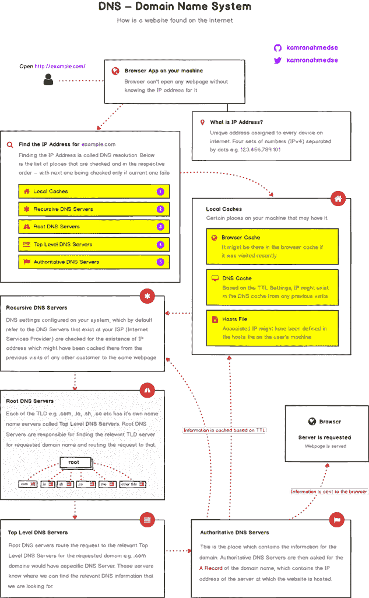

# 域名系统(DNS)工作原理的简短概述

> 原文：<https://dev.to/fatosmorina/a-short-summary-of-how-the-domain-name-system-dns-works-509b>

T3】图片来源:keycdn.com

域名系统(DNS)是我们非常依赖的东西。你甚至在一个帮助你在网上找到这篇文章的 DNS 的帮助下读到了这篇文章。知道它是什么以及它找到浏览器中显示的页面的方式可以被认为是非常神秘的事情，但事实并非如此。许多伟大的开源项目的作者 Kamran Ahmed 最近发表了一篇关于 DNS 基础的简短而有用的介绍。

他将 DNS 的工作方式与我们的手机进行了比较:我们知道了某人的号码后，就用手机给他打电话。同样，我们只有在浏览器地址栏中键入域名或 IP 地址后才能访问一个网站。

这是[卡姆兰](http://twitter.com/kamranahmedse)在最近的[文章](https://medium.com/@kamranahmedse)中发布的真实图像。我希望你会发现它在更新你的知识或学习你过去可能没有学到的东西方面是有用的。

关于域名系统(DNS)如何工作的简短摘要首先出现在[的 Fatos Morina](https://www.fatosmorina.com) 上。