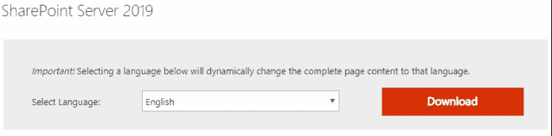
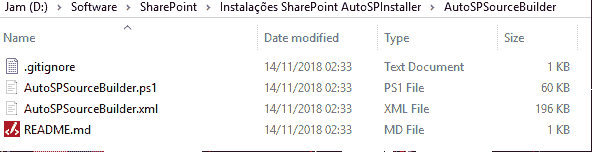
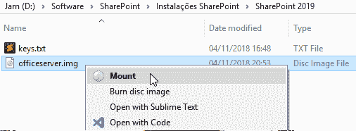
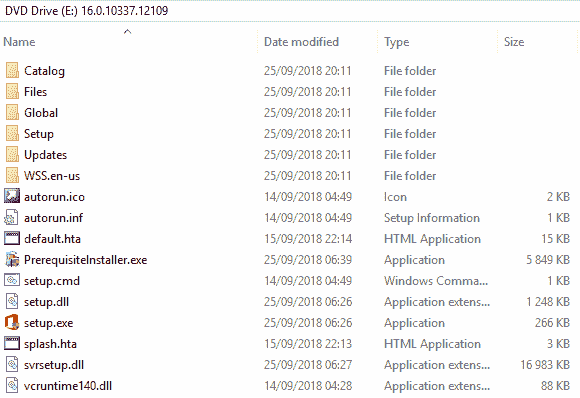
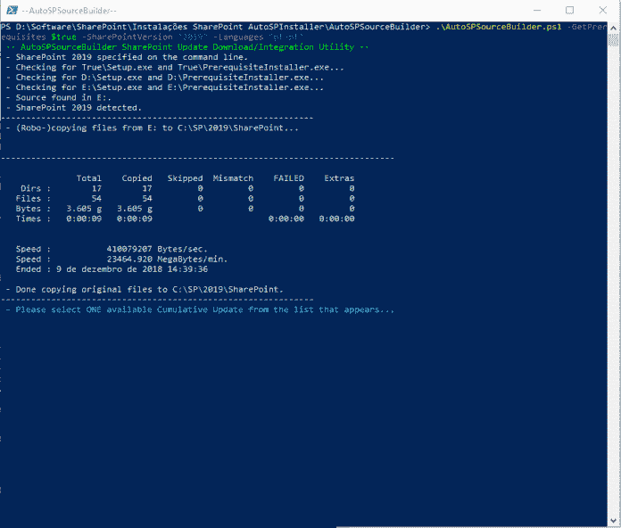
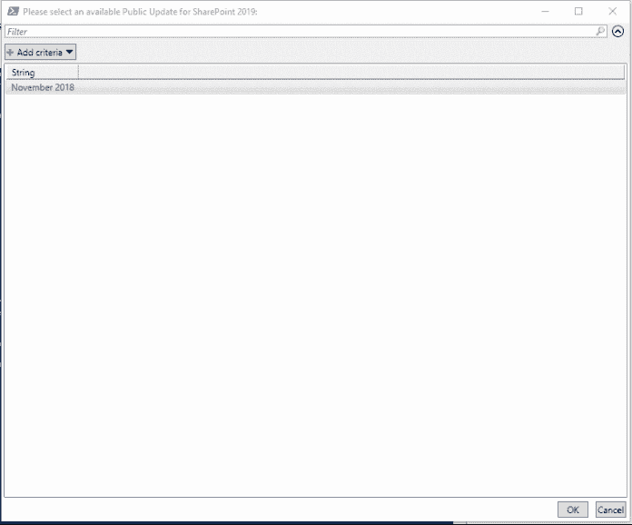

# 如何使用 PowerShell 和 AutoSPInstaller 安装 SharePoint 2019 服务器场(第 1 部分)

> 原文：<https://dev.to/mlisidoro/how-to-install-a-sharepoint-2019-farm-using-powershell-and-autospinstaller-part-1-5bjp>

帖子[如何使用 PowerShell 和 AutoSPInstaller 安装 SharePoint 2019 服务器场(第一部分)](https://blogit.create.pt/miguelisidoro/2018/12/09/how-to-install-a-sharepoint-2019-farm-using-powershell-and-autospinstaller-part-1/)首先出现在[博客 IT](https://blogit.create.pt) 上。

随着 SharePoint Online 和 Office 365 的推出，SharePoint 世界正在迅速向云转变，但微软最近发布了新的 SharePoint Server 版本，改进了混合支持。要了解 SharePoint 2019 中所有新功能的更多信息，请单击[此处。](https://dev.to/mlisidoro/meet-the-new-modern-sharepoint-server-sharepoint-2019-rtm-is-here-2oak)

这篇文章是两部分系列的第一部分，在这两部分中，我将讨论一种使用 PowerShell 以全自动方式安装 SharePoint 2019 的好方法。7

阅读第二部分，点击[这里](https://blogit.create.pt/miguelisidoro/2018/12/09/how-to-install-a-sharepoint-2019-farm-using-powershell-and-autospinstaller-part-2/)。

# 简介

安装 SharePoint 场可能是一项复杂的任务，安装过程由一系列步骤组成:

*   下载和安装 SharePoint 必备组件
*   下载并安装 SharePoint 二进制文件
*   下载并安装最新的 SharePoint 更新
*   下载并安装所需的语言包(可选，如果您希望 SharePoint 界面以英语以外的语言显示，这是必需的)
*   使用 SharePoint 产品和配置向导配置 SharePoint 场

所有上述步骤都很耗时，而且很容易出错，例如，如果您没有下载任何先决条件。

幸运的是，通过使用名为 [AutoSPInstaller](https://autospinstaller.com/) 的脚本，使用 PowerShell 完全自动化 SharePoint 场安装是可能的。安装过程可以分为两个主要步骤:

*   下载 SharePoint 安装包
*   安装 SharePoint 并配置 SharePoint 场

此过程可用于以下版本的 SharePoint:

*   SharePoint 2010
*   SharePoint 2013
*   SharePoint 2016
*   SharePoint 2019(要了解 SharePoint 2019 中所有新功能的更多信息，请单击[此处)](https://dev.to/mlisidoro/meet-the-new-modern-sharepoint-server-sharepoint-2019-rtm-is-here-2oak)

在这篇文章中，我将谈论这个过程的第一部分:下载 SharePoint 安装包，我将以 SharePoint 2019 为例。

# 下载 SharePoint 安装包

下载过程将由一个名为[autopssourcebuilder](https://github.com/brianlala/AutoSPSourceBuilder)的脚本管理，该脚本将下载 SharePoint 安装包及其所有依赖项，并将创建一个文件夹结构，准备在 [AutoSPInstaller](https://autospinstaller.com/) 中使用。[autopssourcebuilder](https://github.com/brianlala/AutoSPSourceBuilder)脚本将下载:

*   所有 SharePoint 先决条件
*   最新的 SharePoint 更新
*   如果指定的话。所需的语言包

要下载 SharePoint 2019 安装包，请按照以下步骤操作:

1 -下载 [SharePoint 2019](https://www.microsoft.com/en-us/download/details.aspx?id=57462) 。

2 -下载[autopssourcebuilder](https://github.com/brianlala/AutoSPSourceBuilder)。下载后，该文件夹应该包含以下结构。

3 -装载 SharePoint 2019。iso 图像。

装载后，装载的驱动器将具有 SharePoint 安装文件。

4 -在 PowerShell 窗口中运行以下脚本(以管理员身份运行)。

**。\ autospsourcebuilder . PS1-get prerequisites $ true-SharePoint version " 2019 "-Languages " pt-pt "**

此脚本将下载 SharePoint 2019 以及所有先决条件和葡萄牙语语言包(如果可用)。将“Languages”参数更改为您希望安装的语言包。

该脚本将从检测以前下载的 SharePoint 映像开始。如果成功检测到，它会将 SharePoint 安装文件从装载的映像提取到 C:\SP\2019 文件夹。

5-SharePoint 安装文件提取完成后，将要求您选择要包含在安装包中的 SharePoint 更新。选择最新的可用包(所有 SharePoint 2019 更新都是累积的，包括以前更新中包含的所有更新)。目前，只有一个更新可用。

6 -选择更新后，脚本将恢复并开始下载 SharePoint 必备组件。选定的语言包和选定的 SharePoint 更新。

要了解生成 SharePoint 2019 安装包的所有过程，请单击[此处](https://blogit.create.pt/miguelisidoro/2018/12/09/how-to-install-a-sharepoint-2019-farm-using-powershell-and-autospinstaller-part-1/)。

分享快乐！

帖子[如何使用 PowerShell 和 AutoSPInstaller 安装 SharePoint 2019 服务器场(第一部分)](https://blogit.create.pt/miguelisidoro/2018/12/09/how-to-install-a-sharepoint-2019-farm-using-powershell-and-autospinstaller-part-1/)首先出现在[博客 IT](https://blogit.create.pt) 上。