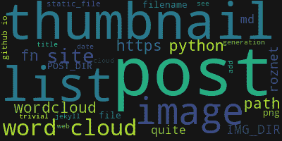

# jekyll 的单词云缩略图

> 原文：<https://dev.to/roznet/word-cloud-thumbnails-for-jekyll-4elj>

我爱字云。由于我刚刚用 jekyll 创建了一个网站，我想知道将单词云缩略图作为缩略图添加到帖子列表中会是什么样子，会有多难？

## 建筑一字云图像

我的第一反应是看看是否有 python 包来构建 wordcloud。我非常了解 python，自动生成图像肯定很容易。当然，python 通常拥有你能想到的任何类型的模块，所以这是一个好的开始。

一个快速的网络搜索之后，当然，已经有一个非常好用的[包](http://amueller.github.io/word_cloud/)。用`conda install -c conda-forge wordcloud`安装到我的 anaconda 设置中很简单。

那么图片的生成是琐碎的，取一行:

```
wordcloud = WordCloud(max_words=30,background_color=(21,21,21)).generate(text) 
```

要为此帖子生成以下内容:

[](https://res.cloudinary.com/practicaldev/image/fetch/s--viH4sevq--/c_limit%2Cf_auto%2Cfl_progressive%2Cq_auto%2Cw_880/https://roznet.github.io/assets/clouds/2018-12-09-wordcloud-jekyll-thumbnail.png)

然后，遍历 posts 文件并为每个
生成相应的单词云图像就变得很简单了

```
for fn in allposts:
    if fn.endswith(".md") and os.path.isfile(fn):
        fp = open( post_dir + fn,'r')
        text = fp.read()
        wordcloud = WordCloud(max_words=30,background_color=(21,21,21)).generate(text)
        outname = img_dir + fn[:-len('md')] + 'png'
        wordcloud.to_file(outname) 
```

我只是选择了背景色来匹配我在 jekyll 站点主题中设置的背景。

我将`img_dir`设置为边上的子文件夹`/assets/clouds`，瞧，缩略图准备好了。

## 给帖子列表添加缩略图

下一步是弄清楚如何自动将图像添加到 post 列表中。为此，我必须找到更多关于哪些液体标签和过滤器可用的信息。

生成缩略图文件名实际上非常简单，用图像路径替换前缀，用 png
替换后缀

```
 
```

我还想确保如果 png 不存在，这一代人会跳过图像。我发现有一个`site.static_files`变量会有所帮助，我只需遍历它，看看是否找到了所需的图像。这在我的`home.html`模板中产生了下面的代码:

```
 <li>
        {%- assign date_format = site.minima.date_format | default: "%b %-d, %Y" -%}
    
    
    
    <a href="{{ post.url | relative_url }}"></a>
    
    

        <span class="post-meta">{{ post.date | date: date_format }}</span>
        <h3>
          <a class="post-link" href="{{ post.url | relative_url }}">
            {{ post.title | escape }}
          </a>
        </h3> 
```

最后一步是解决如何将缩略图正确地放在列表的左边

## 定位缩略图

在快速的网络搜索之后，这被证明是很容易做到的。正如所料，带有缩略图的列表是一种常见的方式。只需要对 post-list 类中的`_layout.scss`文件进行几行编辑，指定将`img`浮动到`li`下，并添加一个边距

```
.post-list {
  li img {
      float: left;
      margin: 0 15px 0 0;
  }
} 
```

## 自动化生成

最后一部分是自动化生成单词云图像的过程。最简单的方法是创建一个小的 python 脚本和一个 make 文件来实现。
我在我的[网站 repo](https://github.com/roznet/roznet.github.io) 中创建了一个新目录`_bld`，以及简单的 makefile

```
POST_FILES=$(shell find $(POST_DIR) -type f -name *.md)
IMG_FILES=$(patsubst $(POST_DIR)/%,$(IMG_DIR)/%,$(POST_FILES:.md=.png))

all: $(IMG_FILES)

$(IMG_DIR)/%.png: $(POST_DIR)/%.md
    ./gencloud.py -o $(IMG_DIR) $< 
```

你可以在我的[网站回购](https://github.com/roznet/roznet.github.io)中看到最终代码，以及列表的样子[这里](https://roznet.github.io)