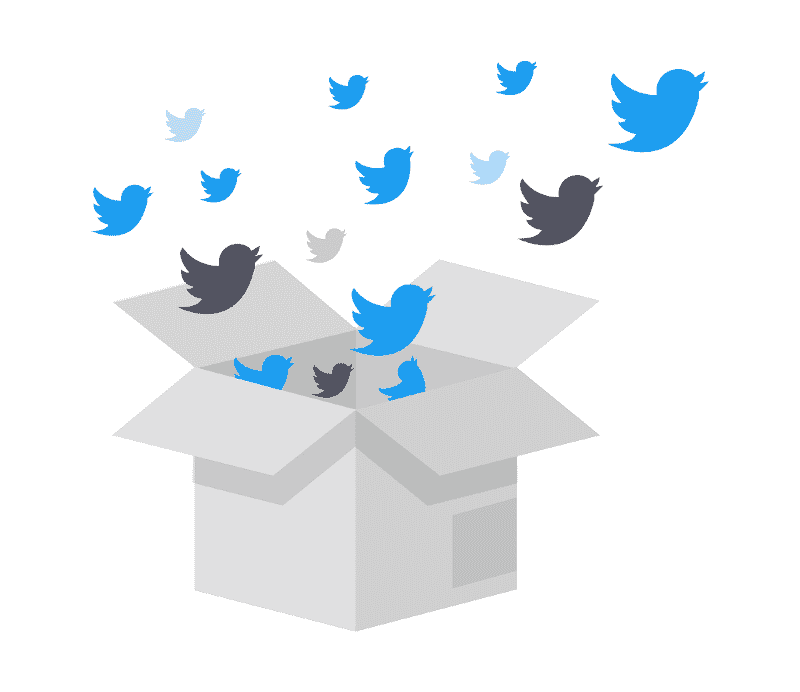

# 经历一次安全事故是什么感觉

> 原文：<https://dev.to/chrislewisdev/what-its-like-to-work-through-a-security-incident-5d6o>

今年早些时候，我所在的软件开发公司遭遇了一次安全事故。接下来的几个月是非常独特的几个月，我将在我的职业生涯中铭记在心。

在事故发生之前，如果真的发生了，我真的不知道会发生什么。网上发布的那种情况下的第一手描述似乎很少。我想分享一下我在这段时间的经历，这样如果你的公司也有同样的经历，你至少会有一些想法。

***免责声明**:以下是我作为开发人员处理安全事件的亲身经历。安全不是我的专长；我没有在事件的“前线”，我不会在这里泄露任何技术细节。根据你的角色和你工作的公司，环境对你来说可能是完全不同的，但我仍然希望你能从中找到价值！*

# 最初的发现

大约在 5 月下旬，我在家工作，看到一封公司电子邮件，称在系统的一个区域发现了一些可疑活动，在调查进行期间，该区域已被隔离。我很好奇到底发生了什么，所以第二天在办公室，我四处打听。我得到的印象是一个相当小的违规；一些在有潜在危害之前就已经被处理过的事情。听起来一切都结束了，所以聊了一会儿之后，我像往常一样直接回去工作了。

仅仅一两个小时后，我被我们的一个领导拍了一下肩膀，并被要求加入一个正在进行的会议。我不知道他想要什么，但我很高兴加入。当我这样做时，我走进一个房间，里面有其他几个领导、几个开发人员和我们整个安全团队。我很快被告知，正在讨论的一切都是“需要知道”的性质，不能在办公室随便传播。最终，据说该事件的潜在影响比最初想象的更广泛。虽然不再有活跃的威胁，但我们不得不审查我们系统的大部分，以发现任何异常或入侵迹象。此外，鉴于这一事件，我们必须重新评估当前的任何安全风险，并制定解决方案，以确保这种情况不会再次发生。

我被告知的事情吓了一跳——就在不久前，我还以为没什么可担心的——但我必须承认，参与一些机密的事情感觉也不错，因为我的技能会很有用。特别是，我自愿成为执行审计任务的一组人的一部分，因为我过去的项目让我对我们将要检查的软件基础设施有了很好的理解。

会议一结束，我基本上放下了所有其他任务，加入了我们刚刚成立的特别审计团队。

# 处于鼎盛时期

接下来的一两周是一段有趣、令人困惑和有些沮丧的时间，原因有几个。

虽然我们的审计工作非常重要，但并不是最吸引人的。审计如此大量的基础设施对我们来说是一项新任务，尽管我们在寻找工具来帮助我们，但我们手动完成了大量工作。本质上，我们会一次花几个小时点击资源，寻找任何可疑的东西，并确认没有任何问题。一无所获是好事，但也会变得非常无聊，消耗得相当快。当做这些没有多少结果的重复性工作时，也很难感觉到自己在增加价值。也许只是我，但当我们完成这个任务时，团队的士气有点低落。

注意办公室里的口碑也有点尴尬。当我在审计团队工作时，我们对事件的响应所产生的工作量持续增长。随着工作的增长，需要更多的开发人员参与进来，因此“需要知道”的信息慢慢地越来越多。最终，公司里几乎每个开发人员都在从事与该事件相关的工作。在这一点上，很难知道任何一个人对正在发生的事情了解多少。如果我从开发人员 A 那里听到一些新信息，我应该告诉开发人员 B 吗？我所知道的信息还像我第一次发现时一样保密吗？虽然我完全信任我的同事，但是当不清楚谁应该知道什么的时候，处理机密信息还是有点不舒服。

此外，与审计团队一起工作意味着我与正常的开发团队隔离开来。事实上，就在事件发生前一周，我加入了一个新团队，其他成员都在国外工作。这使得情况变得更加困难，因为出于数据主权和合同原因，我们的国际团队没有同等级别的系统访问权限，这意味着他们无法参与响应工作，因此无法了解正在发生的事情的所有细节。这意味着他们可以继续他们计划中的工作，而不利的一面是他们在我们的回应中被蒙在鼓里。让我参与一些我不能谈论太多的、需要我全部注意力的项目，对我新团队的形成非常不利。作为该团队中唯一的本地成员，我实际上感到有些内疚，因为我没有做更多的努力来让他们了解正在发生的事情。

# 稳定操作

在最初的几个星期后，我们的开发团队已经解决了大部分的直接风险和问题，围绕这种情况的紧迫性正在慢慢降低。在这一点上，我们明确地从“救火”模式中转移出来，开始着手一些新规划的项目，这些项目在事故发生后被分配了高优先级。我所在的审计团队已经没有事情可做了，所以它的成员开始转移到其他团队去做这些新项目。

我加入的项目团队有机会替换我们系统中一个相当旧但稳定的部分——那种在正常业务环境下你可能永远也不会碰的部分，因为它“工作正常”。我们的任务是通过用我们选择的全新实现替换它来提高系统的安全性。与我以前做的审计工作相比，这完全是新鲜空气。我们能够快速试验新技术，将其缩小到我们认为最好的解决方案，然后将其完善到生产交付中——我们看到的结果非常非常令人满意。

老实说，在这个新项目上的工作让我思考了我们公司所经历的一些“正面”的东西。突然之间，由于缺乏紧迫感，通常不会被优先考虑的项目开始在各地进行。作为一名开发人员，有机会从事这些工作是非常令人兴奋的，即使它们背后的环境并不幸运。

在这一点上，该公司还希望完成第三方验证，以确保我们的系统内不再有任何活跃的威胁。直到这一切完成，你对你的软件基础设施和资源的观点会发生微妙的变化。当您看到一些您不认识的东西，或者一些没有明确目的的明确命名的东西时，您开始怀疑它是否不是一些无伤大雅的资源，而是一种安全风险。有一两次，我看到一群同事在他们之间匆忙谈论发现了一个潜在的可疑资源，只是在紧张的一两个小时后才发现这是完全无害的东西。这样，遭受一次安全事故真的会让你开始跳梁小丑，用偏执狂的心态对待你的系统。

# 新闻&社交媒体

这一事件公开宣布后，没过多久，新闻媒体就开始对此进行报道。公司里有几个人建议不要阅读任何报道，但我——我敢打赌我的许多同事——还是读了。

新闻报道和我预料的一模一样:耸人听闻的标题从我们的公开声明中精选出令人担忧的引语是常态。尽管我对它们的内容并不感到惊讶，但我还是忍不住对这些故事的写作方式产生了某种程度的人身攻击。每天我都能看到情况在慢慢改善，因为我的同事们尽了最大努力让事情恢复正常；与此同时，文章会试图说明该公司的厄运或夸大事件本身的影响。在读了一些这样的文章后，我开始读得越来越少，因为我读煽动性的文章已经没有什么意义了。

社交媒体是一个类似的故事。出于某种病态的好奇，我会在 Twitter 上搜索对该公司的提及，看看人们在说些什么。当你在一家通常不为公众所知的公司工作时，看到人们谈论它会感觉很奇怪。有相当多的关于这一事件的愤怒和不安的推文，当我看到人们兜售不准确的信息时，很容易附和并纠正他们。显然，那样做是一个糟糕的主意——在公共论坛上为自己辩护可能会招致各种不必要的关注，对我自己或公司都没有任何好处。此外，我完全能够理解为什么人们会对所发生的事情感到愤怒，特别是在人们真正了解该事件可能对他们产生什么影响的信息有限的时候。

# 业内同行

媒体的反应让我有点担心当地业界的其他开发商会如何看待这一事件。如果我参加一个聚会或在会上发言，并告诉别人我在哪里工作，我会得到什么样的回应？其他人对我的看法会因为他们对我工作的公司的了解而受到影响吗？

我不想让这太困扰我，所以我继续像平常一样介绍我自己和我工作的公司——这有一些有趣的结果！我很快意识到，每当我告诉别人我在哪里工作时，只需一会儿就能知道他们是否听说了这件事。那些听过的人会表现出一种睁大眼睛的表情(只是一小会儿)，因为他们会把公司的名字与他们读过的关于我们的任何事情联系起来。老实说，这很有趣！每当我注意到这一点，我都会忍不住笑着承认。

然而更重要的是，接下来的对话总是令人鼓舞。我立即得到的印象是，我在业内的同行非常理解我们所处的情况，并且经常意识到，如果运气足够差，这种情况也可能很容易发生在他们身上。我认为我们的事件对许多公司来说是一个警示，提醒他们需要非常认真地对待他们的安全，看到每个人都如此支持我们正在经历的事情，这非常令人振奋。有时，我的一些职业关系网会联系我，询问事情进展如何，并祝愿我们一切顺利，这非常令人感激。

# 持续影响

总的来说，花了几个月的时间，事情才真正开始感觉到它们正在回归正常。事件发生几个月后，感觉我们又回到了“一切照旧”的正常节奏，但你仍然可以在我们做的几乎所有事情中看到它的影响。

由于所发生的事情，仍然有许多项目(无论大小)需要进行，这对开发路线图有着巨大的影响。事故发生时停止的项目可能无法恢复，或者只有在对其范围和优先级进行重大修改后才能恢复。仍然有许多令人兴奋的工作要做，但是看到一个你认为进行得很好的项目因为优先级的改变而被打乱，这可能有点令人难过。

还必须考虑对公司的财务影响。虽然我不知道任何确切的细节，但很明显，像这样的活动的前期和持续成本都令人难以置信。尽管如此，从财务角度来看，我自己实际上并没有注意到公司有什么不同，这令人欣慰——尽管我确实同情那些负责处理数字和组织可预见未来预算的人。

# 最终反射

亲身经历一次安全事故，压力、困惑和兴奋是同等的。虽然这对公司的每个人来说都很艰难，但这也让我们展示了一些我在工作场所引以为豪的品质:

*   无责备文化。在任何时候，甚至都不存在谁应对这一事件或导致这一事件的事件“负责”的问题。每一个开发人员都感觉到问题的共同所有权，以及解决问题需要什么。
*   团队敏捷性。处理安全事件需要打破正常的沟通渠道，围绕要解决的问题迅速形成新的团队，来自各个领域的开发人员加入进来，在最需要他们的技能的地方提供帮助。虽然有时会很忙，但每个人都能从容应对，合作愉快。

对我来说，这充分体现了我们对所有开发人员的高度信任。这听起来有点自私，但在某种程度上，我很高兴这一切都发生在我可以亲眼看到它的发展，并见证我们在如此艰难的情况下如何合作。

在写这篇文章之前，我在网上找不到很多类似的关于开发者经历的故事，大概是因为任何关于安全事件的信息通常都是非常机密的，很难分享。我希望在前进的道路上，作为一个群体，我们可以更加开放地对待这些经历，因为安全事故将继续发生在更多的公司，它们都将对其员工产生相当大的影响。

最后，希望看了我的经历，能对你的职业生涯有所帮助。虽然我不希望这样的事件发生在任何人身上，但作为一名开发人员，它仍然可以为你带来很多积极的东西，并且本身就是一次很好的学习经历。

非常感谢 unDraw 在这篇文章中使用了令人敬畏的免费图片。