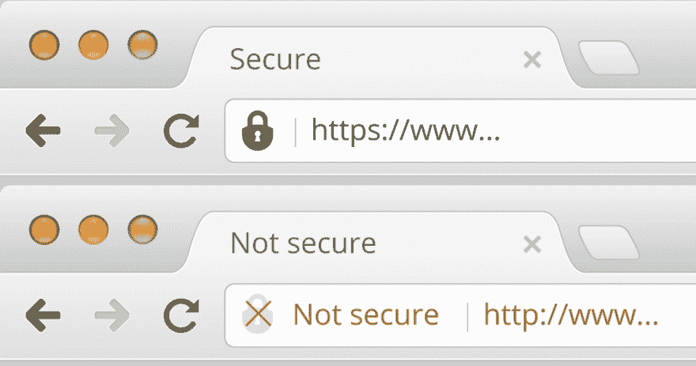
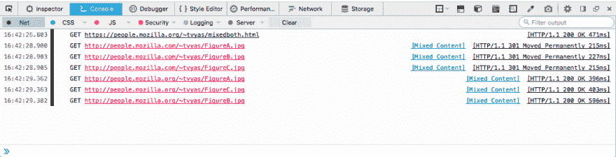
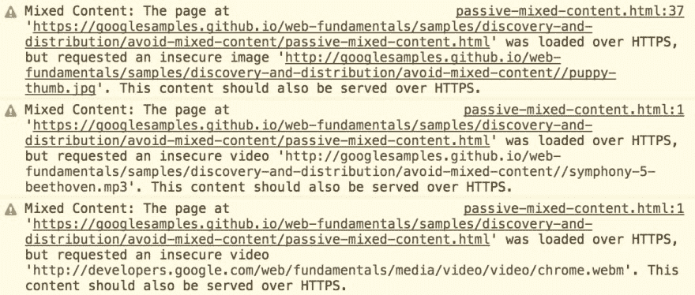

# 混合内容:从 HTTPS 和 HTTP 获取数据

> 原文：<https://dev.to/mittalyashu/mixed-content-fetching-data-from-https-and-http-3n31>

当用户访问通过安全连接(HTTPS)提供的页面时，他们与 web 服务器的连接用 TLS 加密，因此可以防止攻击者的攻击。

由于其他资源*(比如图像、视频、样式表、脚本)*是通过一个保险的 HTTP 连接加载的，在同一个页面上显示内容，并且最初的请求通过 HTTPS 是安全的。像这样的页面只是部分加密，使得攻击者可以访问未加密的内容。这使得页面不安全。

浏览网页时，您偶尔会遇到这些警告，但是它们到底是什么意思呢？

这都归结于 HTTP *(超文本传输协议)*和 HTTPS *(超文本传输协议安全)*之间的区别。HTTP 是最常用的连接类型，当您使用 HTTP 协议访问页面时，您与网站的连接是不安全的。任何窃听流量的人都可以看到你来回发送的页面和任何数据。

这就是为什么我们有 HTTP 它代表“HTTP 安全”,并在您和 web 服务器之间创建一个安全的连接。HTTPS 代表 HTTP 安全，超文本传输协议安全。这里的**安全**部分来自添加到浏览器发送和接收的请求中的加密。目前，大多数浏览器使用 TLS 协议来提供加密； **TLS** 有时也被称为 SSL。

混合内容警告表示您通过 HTTPS 访问的网页有问题。因为 HTTPS 连接是安全的，而且网页的源代码是通过不安全的 HTTP 协议(而不是 HTTPS)引入其他资源的。你的网页浏览器的地址栏会显示你已经连接到 HTTPS，但是这个页面也在后台加载不安全的 HTTP 协议的资源。为了确保你知道你正在使用的网页不是完全安全的，浏览器会显示一个警告，说**页面既有 HTTPS 内容又有 HTTP 内容**——换句话说，是混合内容。

## 混合内容削弱 HTTPS

使用不安全的 HTTP 协议请求子资源会削弱整个页面的安全性，因为这些请求容易受到攻击者的攻击，攻击者会窃听网络连接并查看或修改双方之间的通信。利用这些资源，攻击者通常可以完全控制页面，而不仅仅是被破坏的资源。

尽管许多浏览器向用户报告混合内容警告，但当这种情况发生时，已经太晚了:不安全的请求已经被执行，页面的安全性受到了威胁。不幸的是，这种情况在网络上很常见，这就是为什么浏览器不能在不限制许多网站功能的情况下阻止所有混合请求。

#### Mozilla

#### 铬

开发人员有责任修复应用程序中的混合内容问题。

## 为什么这是危险的？

这是一件很严重的事情，假设你在一个支付页面上，你将要输入你的信用卡信息。付款页面显示这是一个加密的 HTTPS 连接，但你看到一个混合内容的警告。

您输入的支付细节可能会被不安全的内容捕获，并通过不安全的连接发送，从而失去 HTTPS 安全性的优势——有人可能会偷听并看到您的敏感数据。

因为 HTTP 不像 HTTPS 那样对 web 服务器进行身份验证，所以从 HTTP 站点获取脚本的安全 HTTPS 站点也有可能被诱骗获取攻击者的脚本并在其他安全站点上运行。当使用 HTTPS 时，您可以更加确信内容没有被篡改并且是合法的。

在这两种情况下，这消除了拥有安全 HTTPS 连接的好处。一个网站可能会有不安全的内容警告，但仍然可以适当地保护您的个人数据，但我们真的不能确定，也不应该冒这个风险——这就是为什么当您遇到一个没有正确编码的网站时，web 浏览器会警告您。

## 混合内容的浏览器行为

由于各种各样的威胁，浏览器屏蔽所有混合内容将是理想的。然而，这会破坏数百万用户每天依赖的大量网站。当前的折衷方案是阻止最危险的混合内容类型，并允许仍然请求不太危险的类型。

从规范来看，“当允许其作为混合内容使用的风险超过了破坏网站重要部分的风险”时，资源就有资格作为可选的可屏蔽内容；这是上述被动混合内容类别的子集。在撰写本文时，图像、视频和音频资源以及预取的链接是可选可阻止内容中包含的唯一资源类型。随着时间的推移，这个类别可能会变得越来越小。

所有不可选择阻止的内容都被认为是可阻止的，并被浏览器阻止。

#### 浏览器版本

重要的是要记住，并不是每个网站的访问者都使用最新的浏览器。不同浏览器厂商的不同版本在混合内容上的表现各不相同。在最坏的情况下，一些浏览器和版本根本不阻止任何混合内容，这对用户来说非常不安全。

每个浏览器的确切行为都在不断变化，所以我们在这里不包括细节。如果您对特定浏览器的行为感兴趣，请直接查找供应商发布的信息。

* * *

## 两类混合内容

有两种类型的混合内容——混合被动/显示内容和混合主动内容或混合脚本。区别在于威胁级别，最坏的情况下，一个比另一个更糟，但都不好。

在被动内容的情况下，威胁较低*(页面可能包含误导内容，或者用户的 cookies 可能被盗)*。对于活动内容，威胁可能导致网络钓鱼、敏感数据泄露、重定向到恶意网站等。

### 混合被动/显示内容

被动混合内容会对您的网站和用户造成安全威胁。这种情况发生在 HTTPS 网站加载了像图片或音频文件这样的东西，这些文件是通过包含在 HTTPS 网页中的 HTTP 提供的，这种类型的内容不能改变网页的其他部分。然而，这仍然是一种可能导致问题的糟糕的安全实践。

例如，攻击者可以用给用户的不合适的图像或消息替换通过 HTTP 提供的图像，篡改理论上安全的页面。即使攻击者没有改变您站点的内容，您仍然有一个很大的隐私问题，攻击者也可以通过观察哪些图像提供给用户来推断有关用户活动的信息；通常图片只出现在网站的特定页面上。如果攻击者观察到对某些图像的 HTTP 请求，他们可以确定用户正在访问哪个网页，篡改理论上安全的页面。

#### 被动内容列表

本节列出了被视为被动内容的所有类型的 HTTP 请求:

*   `` *( `src`属性)*
*   `<audio>` *( `src`属性)*
*   `<video>` *( `src`属性)*
*   `<object>`子资源*(当一个`<object>`执行 HTTP 请求时)*

### 混合活动内容或混合脚本

混合的主动内容比被动内容构成更大的威胁。当 HTTPS 站点通过 HTTP 加载脚本文件时，会出现这种情况。脚本文件可以在页面上运行任何代码，因此通过不安全的连接加载脚本会完全破坏当前页面的安全性。Web 浏览器通常会完全阻止这种类型的混合内容。

攻击者可以访问 HTTPS 页面的全部或部分文档对象模型。这使得攻击者可以更改页面的任何内容，包括显示完全不同的内容、窃取用户密码或其他登录凭据、窃取用户会话 cookies 或将用户完全重定向到不同的站点，甚至重写响应以包含恶意 JavaScript 代码。动态混合内容包括脚本、样式表、iframes、flash 资源以及浏览器可以下载和执行的其他代码。

混合内容所涉及的风险确实取决于用户正在访问的网站的类型，以及暴露给该网站的数据的敏感程度。网页可能包含对全世界可见的公共数据或仅在经过认证时可见的私有数据。如果网页是公开的并且没有关于用户的敏感数据，使用混合的活动内容仍然为攻击者提供了将用户重定向到其他 HTTP 页面并从这些站点窃取 HTTP cookies 的机会。

由于这种威胁的严重性，许多浏览器在默认情况下会阻止这种类型的内容以保护用户，但功能因浏览器供应商和版本而异。

#### 活动内容示例

本节列出了一些被视为活动内容的 HTTP 请求类型:

*   `<script>` *( `src`属性)*
*   `<link>` *( `href`属性)* *(这包括 CSS 样式表)*
*   `<iframe>` *( `src`属性)*
*   `XMLHttpRequest requests`
*   `fetch()`请求
*   CSS 中使用`<url>`值的所有情况 *( `@font-face`、`cursor`、`background-image`等等)*。
*   `<object>` *( `data`属性)*

## 引用

*   [谷歌开发者](https://developers.google.com/web/fundamentals/security/prevent-mixed-content/what-is-mixed-content)
*   [Mozilla 开发者网络](https://developer.mozilla.org/en-US/docs/Web/Security/Mixed_content)

觉得这篇文章有趣？考虑给我买杯咖啡。
[T3】](https://www.buymeacoffee.com/mittalyashu)