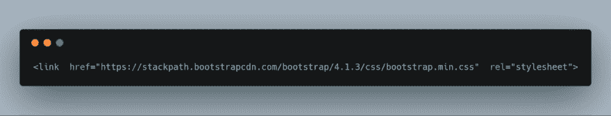
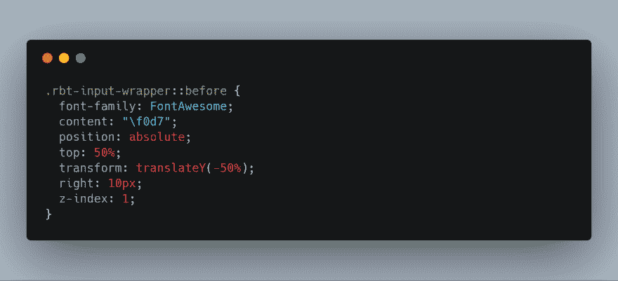
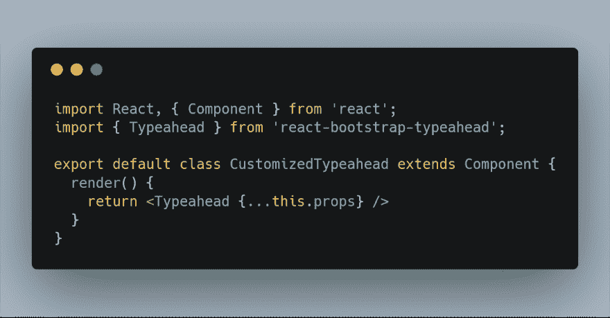
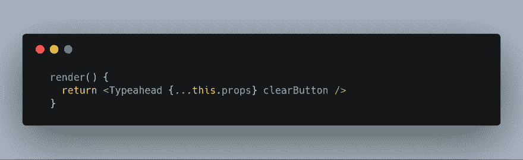
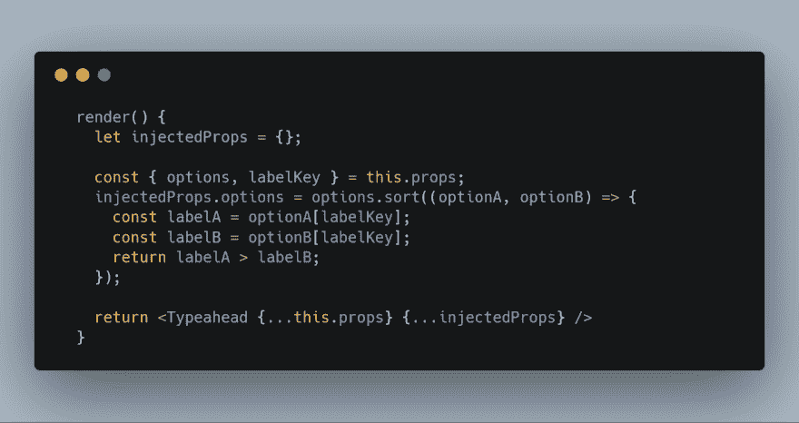
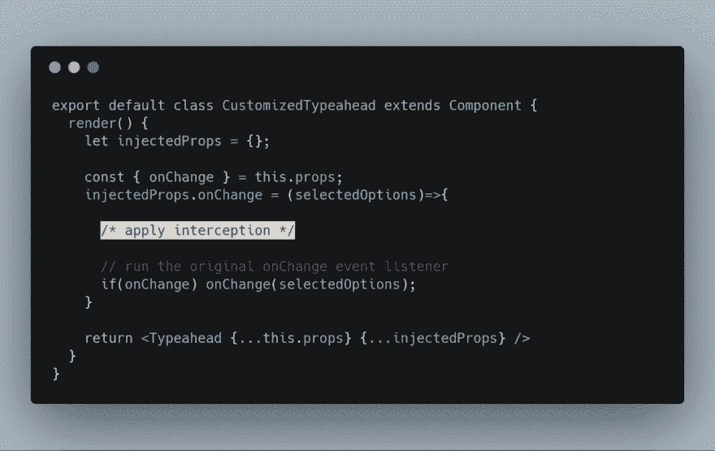
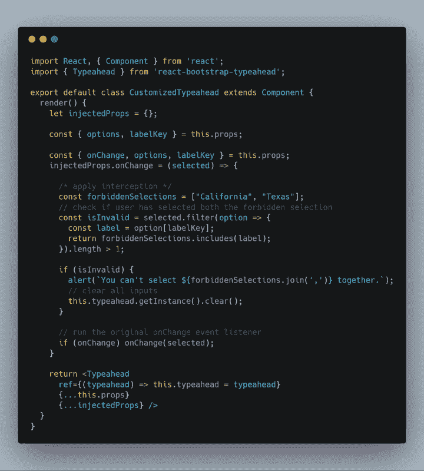

# 定制第三方 React 组件的 3 种方式

> 原文：<https://dev.to/jacobgoh101/3-ways-you-could-customize-3rd-party-react-component-3dpl>

# 简介

组件库让我们的生活变得更加轻松。

但是作为开发人员，您经常会发现自己处于第三方组件无法提供项目所需的功能或定制能力的情况。

我们只有两个选择:

1.  自己从头开始编写组件
2.  定制第三方组件

选择什么取决于组件和您所处的情况。

显然，有些组件是不可定制的，有些功能需求是不可行的。但是大多数情况下，定制第三方组件是一个更省时的选择。以下是方法。

## 出发前

例如，我们将定制[react-bootstrap-type ahead](https://github.com/ericgio/react-bootstrap-typeahead)组件。

如果你想了解 https://stackblitz.com/edit/react-hznpca，这是第一步

# 1。覆盖 CSS

这相当简单。

只要找出组件的 CSS 类并用新的 CSS 覆盖它们。

## 举例

**目标:**在输入框中添加一个下拉图标，让它看起来像下拉。

给`index.html`加上字体牛逼就行了

[](https://res.cloudinary.com/practicaldev/image/fetch/s--Hz9uViLe--/c_limit%2Cf_auto%2Cfl_progressive%2Cq_auto%2Cw_880/https://i.postimg.cc/zDSsKct3/carbon-2.png)

并将这些 CSS 添加到`style.css`
[](https://postimg.cc/xNP15njW)

演示:[https://stackblitz.com/edit/react-wdjptx](https://stackblitz.com/edit/react-wdjptx)

# 2。包装组件

您可以在这里更改第三方组件的默认行为。

首先创建一个包装组件`CustomizedTypeahead`，并用它替换`Typeahead`。

[](https://res.cloudinary.com/practicaldev/image/fetch/s--QEK-UPuu--/c_limit%2Cf_auto%2Cfl_progressive%2Cq_auto%2Cw_880/https://i.postimg.cc/NFYxQbmz/carbon-1.png)[https://stackblitz.com/edit/react-rwyjmm](https://stackblitz.com/edit/react-rwyjmm)

这个包装组件现在没有任何作用。它只是将`props`向下传递给 Typeahead 组件。

我们将通过修改`props`来自定义组件行为。

## 举例:设置默认道具

**目标:**添加默认道具

让我们从最简单的定制开始。

假设我们希望所有的`CustomizedTypeahead`都默认启用`clearButton`道具。

我们可以通过 [](https://res.cloudinary.com/practicaldev/image/fetch/s--iQcPqGvr--/c_limit%2Cf_auto%2Cfl_progressive%2Cq_auto%2Cw_880/https://i.postimg.cc/90x5TLPD/carbon-5.png) 这样做

这相当于 [](https://res.cloudinary.com/practicaldev/image/fetch/s--n6gAgAdg--/c_limit%2Cf_auto%2Cfl_progressive%2Cq_auto%2Cw_880/https://i.postimg.cc/9XkLR3ZG/carbon-6.png)

我们创建了`injectedProps`，并将所有的`props`修改放入其中，以使代码易于管理。

演示:[https://stackblitz.com/edit/react-tk9pau](https://stackblitz.com/edit/react-tk9pau)

## 示例:修改道具

**目标:**按字母顺序对所有选项进行排序

我们正在接收`options`，它是一个对象数组，以及`labelKey`，它告诉我们选项的标签应该是`optionObject[labelKey]`。我们的目标是按照字母顺序对`optionObject[labelKey]`进行排序。

我们可以使用 [Array.prototype.sort()](https://developer.mozilla.org/en-US/docs/Web/JavaScript/Reference/Global_Objects/Array/sort) 对`options`数组进行排序。 [](https://res.cloudinary.com/practicaldev/image/fetch/s--_50dNHLC--/c_limit%2Cf_auto%2Cfl_progressive%2Cq_auto%2Cw_880/https://i.postimg.cc/59h11R7t/carbon-7.png) 
这样，`injectedProps`中的`options`会覆盖`props`中原来的`options`。默认情况下，我们就是这样按照字母顺序对所有选项进行排序的。

演示:[https://stackblitz.com/edit/react-cqv5vz](https://stackblitz.com/edit/react-cqv5vz)

## 示例:拦截事件监听器

**目标:**当用户选择一个选项时，如果用户同时选择了“California”和“Texas ”,则提醒用户并清除选择(除了演示之外没有任何特殊原因)。

这是有趣的部分，您可以进行大量的定制。

基本上，事情是这样的，
[](https://res.cloudinary.com/practicaldev/image/fetch/s--HJmGkVu9--/c_limit%2Cf_auto%2Cfl_progressive%2Cq_auto%2Cw_880/https://i.postimg.cc/Hn99PfnV/carbon-3.png) 注意了`if(onChange) onChange(selectedOptions);`。这确保了原始的 onChange 事件侦听器在我们拦截它之后继续运行。

[](https://res.cloudinary.com/practicaldev/image/fetch/s--Dc1b-8Sw--/c_limit%2Cf_auto%2Cfl_progressive%2Cq_auto%2Cw_880/https://i.postimg.cc/mr4sg8Kx/carbon-5.png) 
下面是我们在上面的代码中所做的，

1.  我们创建一个与默认的`onChange`函数结构相同的`onChange`函数。这是一个接收一组选定选项的函数。
2.  我们浏览选择的选项并检查它是否有效。
3.  如果无效，
    *   显示警告
    *   清除输入
4.  运行原始的`onChange`事件监听器

演示:[https://stackblitz.com/edit/react-ravwmw](https://stackblitz.com/edit/react-ravwmw)

# 3。修改源代码

*注意:不要过度使用这个！这是你最后的手段。只有在别无选择的情况下，你才应该这样做。*

如果以上都不适合你，你现在的选择仅限于:

*   找到另一个组件库
*   从头开始编写自己的组件
*   **修改组件源代码**

实际上，不得不修改包的源代码以适应项目需求的情况并不少见。尤其是当你在一个包中发现了一个 bug，并且迫切需要修复的时候。

但是有一些缺点:

*   一些软件包使用不同的语言，如 CoffeeScript，Typescript。如果你不懂语言，你不知道如何编辑它。
*   研究源代码并找出修改的确切位置可能很费时间。
*   您可能会无意中打破包装的某个部分。
*   当软件包更新时，您需要手动应用更新。

如果您决定继续对源代码进行一些修改，下面是方法。

### 1。分叉 Github 存储库

在我们的例子中，去[https://github.com/ericgio/react-bootstrap-typeahead](https://github.com/ericgio/react-bootstrap-typeahead)把回购转到你自己的 GitHub 账户。

### 2。将回购克隆到您的机器上

### 3。进行修改

### 4。将回购推送到你的 GitHub 账户

### 5。将您的 repo 安装为依赖项

在您分叉 repo 之后，您的 GitHub repo 的 URL 应该是`https://github.com/<your GitHub username>/react-bootstrap-typeahead`。

您可以通过执行这个命令
将这个 git repo 安装为一个依赖项

```
npm i https://github.com/<your GitHub username>/react-bootstrap-typeahead 
```

安装后，您应该在 package.json
中看到这个

```
 "dependencies":  {  "react-bootstrap-typeahead":  "git+https://github.com/<your github username>/react-bootstrap-typeahead.git"  } 
```

# 结论

我们讨论了定制第三方 React 组件的 3 种方法。

1.  覆盖 CSS
2.  使用包装组件
3.  修改源代码

希望这将使您作为 React 开发人员的生活更加轻松。

与此同时，让我们都花点时间，感谢所有的开源创造者/贡献者。如果没有这些开源包，我们将无法像今天这样快速前进。

您对第三方组件库有什么体验？你还会用什么方法来定制它们？留言评论！T3】