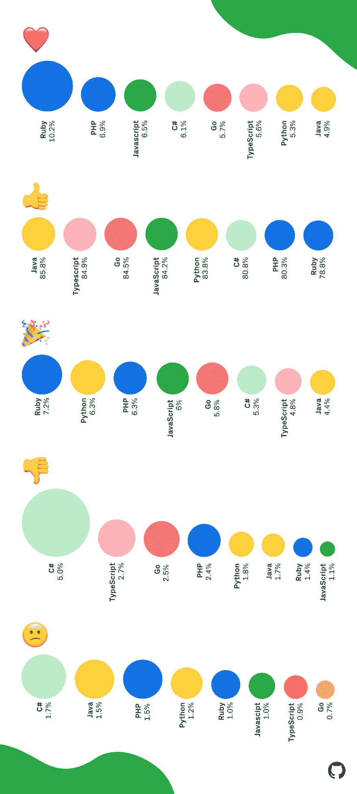

# Ruby 拥有最友好的编程社区，我有数据可以证明这一点

> 原文：<https://dev.to/ben/ruby-has-the-kindest-programming-community-and-i-have-the-data-to-prove-it-4f60>

GitHub 刚刚发布了[这篇关于平台](https://blog.github.com/2018-12-07-octoverse-emoji-on-github/)上表情符号使用的博文。

请看帖子中的这张图片:

Rubyists 只是爱❤️，包括我自己。

我的第一个想法是，红色是为什么 Rubyists 爱红心。但是当我看到 Ruby 在🎉，我被说服了。卢布主义者是最善良的。对于这个发现，我一点也不惊讶。我喜欢 Ruby 社区。

继续牛逼吧露比。但不要对这个消息幸灾乐祸太多，你有一个善良的名声要维护。😄

很抱歉 c-sharpers。😕