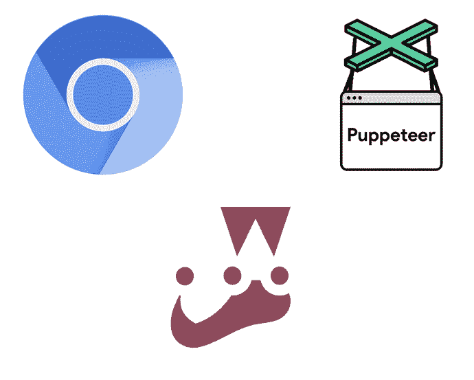
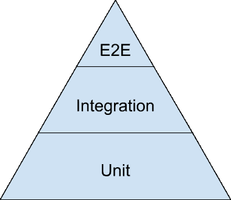
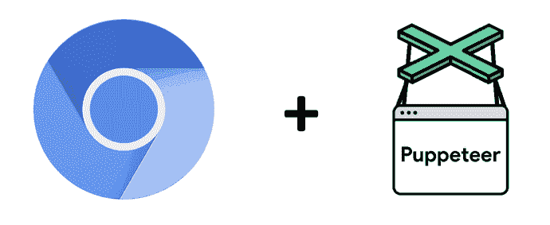

# 开始使用 Puppeteer & Headless Chrome 进行端到端测试

> 原文：<https://dev.to/paigen11/getting-started-with-puppeteer-headless-chrome-for-end-to-end-testing-56mh>

[](///static/7aef5b887a00d094c4600ce0a2937ea6/2cefc/chrome-puppeteer-jest-hero.png)

## 此贴的灵感来源

这篇博文的灵感来自于我在 [Connect 上看到的一个演讲。今年在亚特兰大召开的技术会议](http://connect.tech/)，题目是:“使用 Puppeteer 编写在浏览器上运行的端到端测试。”

演讲者 Taylor Krusen 做了一个关于木偶师和 headless Chrome 的精彩演讲，并结合使用它们将端到端测试提升到了一个新的水平。我过去曾简要地研究过木偶戏，但由于我找不到任何关于如何开始使用它的好例子，我选择使用 [**Cypress.io**](https://www.cypress.io/) 来代替我的测试需求。

在那次演讲之后，我受到启发，给了 puppet er 另一次机会，我更进一步，弄清楚如何运行 puppet er 以及如何在 Jest 中使用它，Jest 是最常与 React 相关联的测试框架。

今天我想分享一下，希望能帮助其他人开始使用他们自己的应用测试套件。

* * *

## 什么是端到端测试&它为什么重要？

[](///static/6bff6632974c7df8b1815dc455635d1e/2add2/testing-pyramid.png)

根据谷歌的定义，端到端测试构成了测试金字塔中最小的一部分，但它们仍然是其中至关重要的一部分。

在我深入*如何*使用 Puppeteer 进行端到端测试之前，我认为有必要简要解释一下它是什么以及为什么它对当今的 web 开发如此重要。

[Techopedia](https://www.techopedia.com/definition/7035/end-to-end-test) 给出了端到端测试的良好定义:

> 端到端测试是一种用于测试应用程序的流程是否从头到尾都按照设计执行的方法。执行端到端测试的目的是识别系统依赖性，并确保正确的信息在各种系统组件和系统之间传递。

本质上，端到端测试以自动化的方式复制了用户在与应用程序或浏览器交互时可以做的事情。这样做是为了确保应用程序按预期正常工作。

随着 web 应用程序变得越来越复杂，功能越来越全面，每当应用程序准备部署新功能时，人工 QA 团队就越来越难以跟上测试每一项功能。创建端到端测试框架是为了将检查功能的负担(和重复的任务)从人的手中拿走，并让机器(它可以比实际用户移动得更快，并且每次都精确地复制测试)承担更多的负载。

最终，作为开发人员，我们仍然要确保我们的应用程序按照我们期望的方式工作，但是测试帮助我们更好地确保我们没有在代码中引入新的错误或损害现有的功能，这就是为什么它如此重要。

### 什么是无头铬&木偶师？

[](///static/7dff7f7309adaaa71cc4b3587128b85d/2cefc/chrome-puppeteer.png)

接下来要讲的是 [**无头铬**](https://developer.chrome.com/blog/headless-chrome/) 和 [**木偶师**](https://pptr.dev/) 到底是什么，为什么总是捆绑在一起？

木偶师的 [GitHub](https://github.com/GoogleChrome/puppeteer) 和 [npm](https://www.npmjs.com/package/puppeteer) 页面很好地解释了木偶师是什么:

> Puppeteer 是一个节点库，它提供了一个高级 API 来控制 Chrome 或通过 [DevTools 协议](https://chromedevtools.github.io/devtools-protocol/)的 Chrome。

它接着说，Puppeteer 默认运行 headless Chrome 或 Chrome 实例，这就是为什么它们总是被一前一后地提到。

> 大多数你可以在浏览器中手动完成的事情都可以使用木偶师来完成！

木偶师是由谷歌 Chrome DevTools 团队为 Chrome 开发的，以帮助进一步自动化/无头浏览器测试，并让我们其他人不那么痛苦。

最大的缺点是，木偶师只能与铬。我有幸在用户只使用 Chrome 的应用程序上工作过，这使得 Puppeteer 成为端到端测试的一个非常好的选择，但如果用户群在其浏览器偏好上更加多样化，那么看看其他测试框架可能是明智的，如 [Cypress.io](https://www.cypress.io/) 、 [TestCafe](https://testcafe.devexpress.com/) 或 [Selenium Web Driver](https://www.seleniumhq.org/projects/webdriver/) 。

但今天，至少，我可以谈谈木偶师。

### 木偶师的例子

现在是时候着手让木偶师运行起来了。

开始使用木偶戏实际上非常简单——只需键入`npm i puppeteer`,您就可以开始了。是的，就是这么简单。之所以这么简单，是因为 Chrome DevTools 团队方便地将每个版本的 Puppeteer 与一个版本的 Chromium(无头 Chrome 部分)打包在一起，保证可以一起运行。

> **注意:**puppeter 至少需要版本 6.4.0 的节点，但下面的示例使用的是仅版本 7.6.0 或更高版本支持的 async/await。如你所知。

让我们来看看木偶师可以自动化什么。

如果你想自己玩这些例子，你可以在这里下载我的 GitHub repo。

> 您也可以点击下面每个代码示例的文件名，查看 GitHub 中的实际代码。

**截图一个页面: [`saveFileExample.js`](https://github.com/paigen11/puppeteer-and-jest-example/blob/master/saveFileExample.js)**

```
const puppeteer = require('puppeteer');

(async () => {
  const browser = await puppeteer.launch();
  const page = await browser.newPage();
  await page.goto('https://www.google.com');
  await page.screenshot({ path: 'google.png' });

  await browser.close();
})(); 
```

Enter fullscreen mode Exit fullscreen mode

正如你在所有这些脚本中看到的，只要将`puppeteer`导入到文件的顶部，就可以开始运行了，所有打包的方法，如`newPage()`和`browser`都可以立即供你使用。

第一个示例脚本转到 Google 主页，拍摄页面照片，并将其保存到名为“google.png”的 repo 中的. png 文件中。

代码非常简单明了。首先，启动一个无头 Chrome 浏览器，打开一个新页面，该页面的 URL 设置为 Google，为子孙后代拍摄一个屏幕截图，然后关闭浏览器。整个事情是干净的、优雅的、异步的，并且包装在一个 life([立即调用函数表达式](https://developer.mozilla.org/en-US/docs/Glossary/IIFE))中，所以一旦脚本被调用，函数就运行。

**创建 PDF: [`createPDF.js`](https://github.com/paigen11/puppeteer-and-jest-example/blob/master/createPDF.js)**

```
const puppeteer = require('puppeteer');

(async () => {
  const browser = await puppeteer.launch();
  const page = await browser.newPage();
  await page.goto('https://www.thinkgeek.com/', { waitUntil: 'networkidle2' });
  await page.pdf({ path: 'thinkGeek.pdf', format: 'A4' });

  await browser.close();
})(); 
```

Enter fullscreen mode Exit fullscreen mode

第二个木偶师示例访问一个网站(有趣的零售网站，在本例中是 ThinkGeek ),并将它访问的网站页面制作成 PDF。

与第一个脚本类似，这个脚本设置了木偶师，创建了一个新的浏览器页面，访问 ThinkGeek 的网站，然后使用`page.pdf()`方法制作整个页面的 PDF。该 PDF 再次以“thinkGeek.pdf”的名称保存到项目文件夹中。很简单。

**Google something:[`searchGoogle.js`](https://github.com/paigen11/puppeteer-and-jest-example/blob/master/searchGoogle.js)**

```
const puppeteer = require('puppeteer');

(async () => {
  const browser = await puppeteer.launch();
  const page = await browser.newPage();
  await page.goto('https://www.google.com');

  const searchBox = await page.$('input[type=text]');
  await searchBox.type('cookies');
  const inputElement = await page.$(
    'input[type=submit][value="Google Search"]',
  );
  await inputElement.click();
  const [response] = await Promise.all([
    page.waitForNavigation(),
    page.once('load', () => console.log('Cookies loaded!')),
  ]);

  await page.screenshot({ path: 'cookies.png' });
  await browser.close();
})(); 
```

Enter fullscreen mode Exit fullscreen mode

第三个例子可能更像是在端到端测试中测试的东西——它自动化了谷歌搜索(并在无头模式下截图以确认搜索成功)。

在这个脚本中，Puppeteer 启动一个新的浏览器页面，它转到 Google，等待搜索框和搜索按钮可见，并在输入中键入“cookies ”,然后等待页面导航到 cookies 搜索结果，并在最后关闭浏览器之前截图。

这就是全部了。要了解更多关于木偶师的功能，我建议查看他们非常全面的[文档](https://github.com/GoogleChrome/puppeteer/blob/master/docs/api.md)——那里有大量的信息和功能可以发现。

### 调试木偶师

现在，Puppeteer 正在运行，我想调用一些内置于其中的很棒的工具来减少调试的痛苦。这是您需要的代码片段，接下来我将对其进行分解。

```
const browser = await puppeteer.launch({
  headless: false,
  slowMo: 500,
  devtools: true
}) 
```

Enter fullscreen mode Exit fullscreen mode

**关闭无头模式**

第一个(也是最明显的一个)是如何关闭 Chrome 的无头模式；这意味着您可以看到自动浏览器打开，并尝试完成为其设置的步骤。

这不在话下。在启动 Puppeteer 的脚本中(差不多是脚本运行时发生的第一件事)，只需添加下面一行:`puppeteer.launch({headless: false});`。

**启用 SlowMo**

SlowMo 就像它听起来的那样，它减缓了木偶师的操作，所以正常人可以看到正在发生的事情。它可以在相同的命令中实例化，其中 headless 对于 Puppeteer 设置为 false`puppeteer.launch()`命令。只需加上`puppeteer.launch({slowMo: 500})`或者你想让动作慢下来的毫秒数。

**自动打开开发工具面板**

我的第三个调试技巧是如何告诉木偶师是否用每个标签自动打开 Chrome DevTools 面板。因此，如果需要，您可以在自动化测试运行中捕捉记录到控制台的内容。

同样，在启动木偶的初始命令中，添加`puppeteer.launch({headless: false, devtools: true});`来打开一个 DevTools 面板。

> **注意:**如果该选项为`true`，则`headless`选项将被设置为`false`。

你甚至可以将事件从无头 Chrome 浏览器`console.log()`发送到你自己的终端，只需简单地将这个方法从`page.exposeFunction()`中混合。在木偶脚本中定义了页面对象之后，你可以做:

```
page.on("console", msg => console.log(`Page Console: ${msg.text()}`)); 
```

Enter fullscreen mode Exit fullscreen mode

捕捉来自`console.log`的消息。

这应该有助于你像专业人士一样调试你的傀儡无头 Chrome 实例和测试。

### 更酷的木偶师特征

除了调试木偶师，我想指出它提供的一些更酷的特性。如果你有兴趣了解他们中的任何一个，我建议查看他们的 [npm 页面](https://www.npmjs.com/package/puppeteer)以获取更多信息。

木偶师可以:

*   运行在 Docker 容器或无服务器环境中，
*   拦截网络请求，
*   捕获性能信息，
*   测试 Chrome 扩展，
*   运行页面中的代码，并且
*   在移动设备上模拟 Chrome。

它还有很多其他有用的用途。这个团队真的想让它在很多方面对开发者有用。

### 奖励:反应&笑话&木偶师

[](///static/0a1bb0cf7a0a5c314cd2c215e30495b0/2cefc/react-jest.png)

如果我没有简要提及如何将木偶师集成到带有 Jest 测试的 React 项目中，那将是我的失职。React 是我目前选择的 JavaScript 框架(对许多 JS 开发人员来说似乎也是如此)，所以我使用这两者创建了一个快速设置和测试脚本，也包含在 my sample [GitHub repo here](https://github.com/paigen11/puppeteer-and-jest-example) 中。

**笑话配置&木偶师**

Jest 有一些非常有用的[文档](https://jestjs.io/docs/en/puppeteer)来顺利地将 Puppeteer 集成到它自己的测试框架中，甚至还有一个名为`jest-puppeteer`的完整 npm 包来帮助这个过程。以下是安装和配置 Jest 和木偶师的内容。

```
npm install --save-dev jest-puppeteer puppeteer jest 
```

Enter fullscreen mode Exit fullscreen mode

一旦所有的东西都安装好了，你就可以配置你的 Jest 配置文件、Webpack 文件或者你的`package.json`文件，让 Jest 知道木偶师已经准备好可以使用了。下面是我在`package.json`中是如何做到的。

就在文件中的脚本上方，我添加了这个片段，在`scripts`中，我包含了一个`test`命令，它只运行 Jest。

[**`package.json`**](https://github.com/paigen11/puppeteer-and-jest-example/blob/master/package.json)T5】

```
"jest":  {  "preset":  "jest-puppeteer"  },  "scripts":  {  "test":  "jest",  /*  more  scripts  here  */  } 
```

Enter fullscreen mode Exit fullscreen mode

现在，我准备好编写测试了。

**戏谑&木偶师考试: [`google.test.js`](https://github.com/paigen11/puppeteer-and-jest-example/blob/master/google.test.js)**

```
describe('Google', () => {
  beforeAll(async () => {
    await page.goto('https://google.com');
  });

  it('should display "google" text on page', async () => {
    await expect(page).toMatch('google');
  });
}); 
```

Enter fullscreen mode Exit fullscreen mode

如果您以前曾经编写过 Jest 测试，那么语法应该看起来很熟悉。由于我没有完整的 React 项目作为我的示例回购的一部分，我将使用这个简单的示例测试，Jest 应该在加载后转到 Google 主页并在该页面上找到文本“Google”。

在我的 repo 中，我设置了 npm 脚本，以便在终端中输入`npm run test`时运行`jest`命令。默认情况下，Jest 会查找任何带有`*.test.js`语法的文件，并尝试运行这些文件。当它找到我的名为 google.test.js 的测试文件时，它运行它(没有标题，除非我另外指定)并将测试结果记录到控制台，就像这样。

如果测试失败，您可以像平常一样进行调试(如果您需要查看出了什么问题，甚至可以打开自动化的 Chrome 浏览器)，如果没有，您的计算机屏幕可以免于测试，因为您的端到端测试仍然在后台运行。

太棒了。这看起来并不难，不是吗？

* * *

## 结论

Puppeteer 是 Google DevTools 团队开发的一个强大的工具，它使得无头的、自动化的浏览器测试在各个方面都更加容易。开始时需要的配置更少，语法更有意义，它的用途远远超出了开发期间测试 web 应用程序的范围。同样，集成到 React 应用程序中来自动运行 Jest 测试也很容易。

过几周再来看看，我会写一些与 web 开发相关的东西。

如果你想确保你不会错过我写的一篇文章，在这里注册我的时事通讯:[https://paigeniedringhaus.substack.com](https://paigeniedringhaus.substack.com)

感谢您的阅读，我希望这能让您了解如何开始使用 Puppeteer 进行自己的端到端测试，并与 React 和 Jest 测试集成。

* * *

## 参考文献&进一步资源

*   GitHub 上的木偶师 Jest 示例报告
*   [在 Techopedia 上进行端到端测试](https://www.techopedia.com/definition/7035/end-to-end-test)
*   木偶师在 [npm](https://www.npmjs.com/package/puppeteer) 上记录
*   GitHub 上的木偶师报告
*   GitHub 上的[木偶师 API 文档](https://github.com/GoogleChrome/puppeteer/blob/master/docs/api.md)
*   [与木偶戏现场文档开玩笑](https://jestjs.io/docs/en/puppeteer)