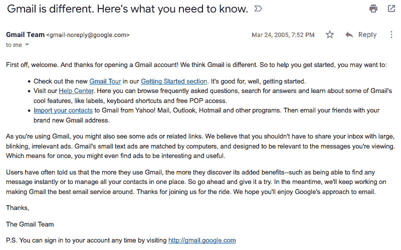
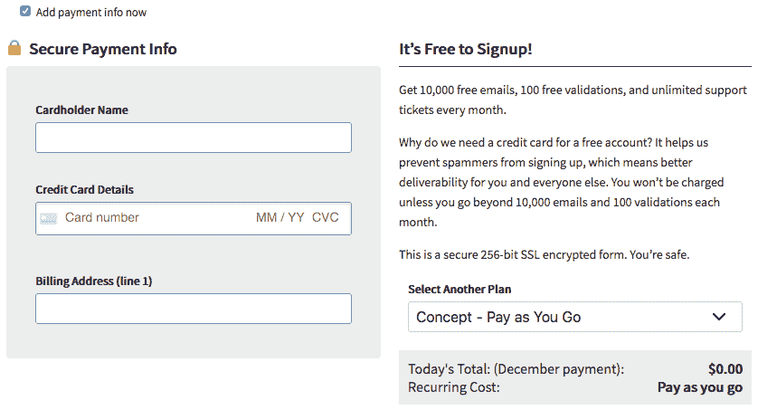
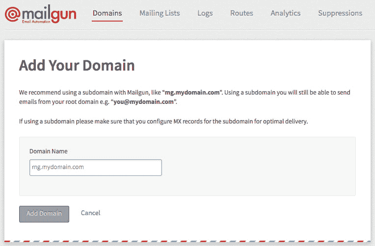
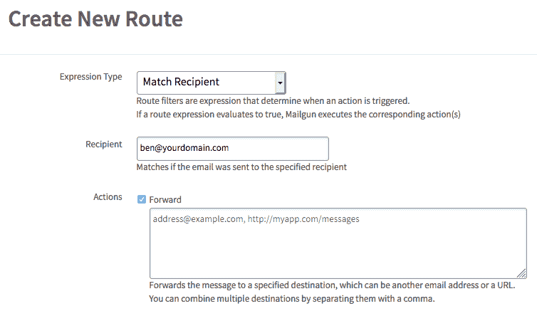
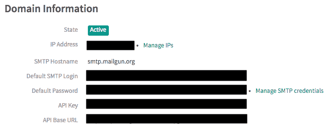
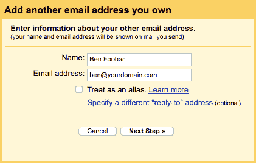
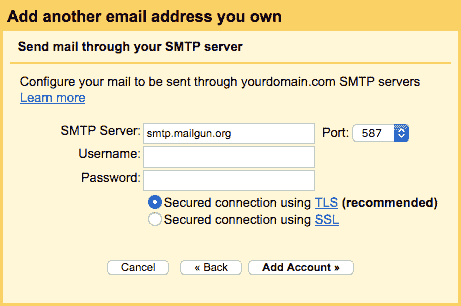
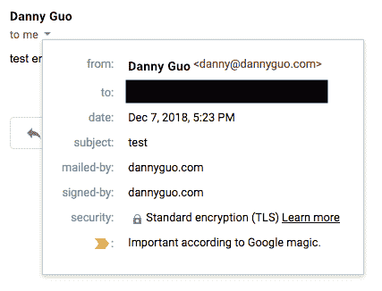

# 使用 Mailgun 为一个免费的自定义域电子邮件地址

> 原文：<https://dev.to/dguo/using-mailgun-for-a-free-custom-domain-email-address-fom>

13 年来，我一直使用 Gmail 作为我的主要电子邮件地址。我应该感谢我的姐姐让我使用我的名字，而不是我现在尴尬的 [AIM](https://en.wikipedia.org/wiki/AIM_(software)) 用户名。这是 2005 年的欢迎邮件。Gmail 还不到一岁。

从那以后，Gmail 一直很好地为我服务，但主要是为了好玩(部分是因为虚荣心)，我最近在自己的域名上[设立了一个电子邮件地址。我最终选择了一个免费的解决方案，包括](https://dannyguo.com) [Mailgun](https://www.mailgun.com/) ，对我的目的来说已经足够好了。我想仍然使用我的 Gmail 帐户来收发自定义域名的电子邮件。对我来说，现在拥有一个独立的收件箱或者停止使用谷歌收发邮件并不重要。

## 选项

几年前，一个常见的选择是 Google Apps(现在被称为 [G Suite](https://gsuite.google.com/) )，因为它对最多五个用户是免费的。g 套件[摆脱了免费版](https://support.google.com/a/answer/2855120)，而[现在每月花费](https://gsuite.google.com/pricing.html)5 美元，所以我调查了替代方案。

我读到过 Zoho Mail 作为一种免费的选择。不幸的是，今年早些时候，它停止为其免费计划[提供](https://help.zoho.com/portal/community/topic/zoho-free-tier-pop-imap-activesync-no-longer-free) [POP](https://en.wikipedia.org/wiki/Post_Office_Protocol) 和 [IMAP](https://en.wikipedia.org/wiki/Internet_Message_Access_Protocol) 访问，因此访问我的电子邮件的唯一方式将是通过 Zoho 的网站或应用程序。添加 POP 和 IMAP 支持每月需要花费 3 美元。我并不责怪 Zoho 做出这样的改变，但我更喜欢通过我的 Gmail 帐户访问我所有的电子邮件。我还看过一些轶事，说 Zoho Mail 收发邮件会很慢。

接下来，我看了看 [FastMail](https://www.fastmail.com/) 和 [ProtonMail](https://protonmail.com/) ，它们经常被选择[避开谷歌服务](https://nomoregoogle.com/)的人引用。FastMail [每月花费](https://www.fastmail.com/pricing/)5 美元，包含自定义域名支持的计划每年花费 50 美元。ProtonMail [需要付费计划](https://protonmail.com/support/knowledge-base/custom-domain-support/)才能使用该功能，最便宜的[付费计划](https://protonmail.com/pricing)为每月 5 美元或每年 48 美元。

另一个选择是使用谷歌域名。它包括一个免费的[电子邮件转发功能](https://support.google.com/domains/answer/3251241)，允许从别名发送电子邮件。然而，该功能只有在你[使用谷歌的域名服务器](https://support.google.com/domains/answer/3251241)时才可用。我的网站运行在 [Netlify](https://www.netlify.com/) 上，我使用他们的 [DNS 服务](https://www.netlify.com/docs/dns/)。

我还查看了其他域名注册商的邮箱。[甘地](https://www.gandi.net)包括[每个域名的两个邮箱](https://www.gandi.net/en/domain/email)，但是甘地的域名价格[似乎比其他地方更贵](https://tld-list.com/)，尤其是考虑到 [Cloudflare](https://www.cloudflare.com/) 的[成本价域名注册服务](https://blog.cloudflare.com/cloudflare-registrar/)计划很快推出。

[Namecheap](https://www.namecheap.com) 有非常实惠的[电子邮件托管](https://www.namecheap.com/hosting/email.aspx)，每年只需 9.88 美元。当我准备设置它时，在“自定义域电子邮件”的搜索结果中，我偶然发现了最后一个解决方案。有些人使用[的气枪](https://www.mailgun.com/)。

## Mailgun

本质上，收到的电子邮件会发送到 Mailgun。通过路由规则，我可以将这些电子邮件转发到我的 Gmail，通过一些额外的配置，我还可以从我的 Gmail 发送电子邮件，但让它们看起来像是从我的自定义域发送的。

Mailgun 的[自由等级](https://www.mailgun.com/pricing)已经足够了。它允许每月 10，000 封电子邮件。这包括收到和发出的电子邮件，但对于个人电子邮件帐户，我永远不会接近这个限制。即使我真的浏览了，每增加一千封邮件也只需要 0.5 美元。

该计划确实限制您向未明确添加到“授权收件人”列表中的电子邮件地址发送邮件。然而，如果你提供一种支付方式，Mailgun 就会解除这一限制，这就把你放在了“概念”计划中。我很高兴这样做。

请注意，Mailgun [没有正式推荐](https://help.mailgun.com/hc/en-us/articles/203306710-Can-I-use-Mailgun-for-my-personal-email-address-)使用个人电子邮件服务，但他们没有禁止。他们推荐使用托管电子邮件服务，比如 G Suite，我肯定会为类似企业这样的东西这么做。

### 指令

这是一步一步的说明。注册一个 Mailgun 账户，并提供一种支付方式，除非你同意发送限制。

转到“[域](https://app.mailgun.com/app/domains)选项卡到[添加一个新的域](https://app.mailgun.com/app/domains/new)。该页面建议使用一个子域，如“mail.yourdomain.com ”,而不仅仅是“yourdomain.com”。这个建议的原因是，一般来说，你不想冒险伤害你的根域的[邮件发送者的声誉](https://www.sparkpost.com/resources/email-explained/email-sender-reputation/)。公司有时会使用不同的域名或子域来发送交易和营销邮件。

就个人电子邮件地址而言，如果你想在根域([ben@yourdomain.com](mailto:ben@yourdomain.com))而不是在子域([ben@mail.yourdomain.com](mailto:ben@mail.yourdomain.com))接收电子邮件，请使用根域。损害你的发件人声誉的风险要低得多，因为你大概不会用你的私人邮件给大量陌生人发邮件。

接下来，转到您管理网站 DNS 设置的地方(如您的域名注册商)，并添加 Mailgun 提供的 DNS 记录。 [MX 记录](https://en.wikipedia.org/wiki/MX_record)用于将 Mailgun 的服务器设置为电子邮件的收件人。 [TXT 记录](https://en.wikipedia.org/wiki/TXT_record)用于设置 [SPF](https://en.wikipedia.org/wiki/Sender_Policy_Framework) 和 [DKIM](https://en.wikipedia.org/wiki/DomainKeys_Identified_Mail) ，这是收件人验证邮件真实性的两种方式。你不需要添加 [CNAME 记录](https://en.wikipedia.org/wiki/CNAME_record)，除非你想跟踪你的收件人对你的电子邮件做了什么，比如打开它们和点击里面的链接。

这可能需要一段时间来传播 DNS 的变化，虽然我只需要大约一分钟。告诉 Mailgun 检查 DNS 记录。一旦通过验证，您就可以进入“[路由](https://app.mailgun.com/app/routes)选项卡，在[创建](https://app.mailgun.com/app/routes/new)一条[路由规则](https://mailgun-documentation.readthedocs.io/en/latest/api-routes.html#routes)。

将表达式类型更改为“匹配收件人”，并设置您想要使用的自定义域地址。然后选中“转发”操作，并设置您实际想要接收电子邮件的地址(如 Gmail 帐户)。您可以设置更复杂的规则，甚至添加额外的地址，全部转发到同一个电子邮件地址。

此时，接收邮件应该可以了。去吧，试试看。我还创建了一个 [Gmail 标签](https://support.google.com/mail/answer/118708)，并设置了一个[过滤器](https://support.google.com/mail/answer/6579)，这样来自我的自定义域名的所有电子邮件都可以用它来标记，这样我就可以很容易地只查看那些我想查看的电子邮件。

要进行发送，您需要 Mailgun 提供一些附加信息。返回“域”选项卡，打开您的域。您需要“SMTP 主机名”、“默认 SMTP 登录”和“默认密码”的值

转到 Gmail 设置，打开“帐户和导入”标签。在“发送邮件为”部分，添加自定义域电子邮件地址。我没有选中“当作别名”选项，因为我想自动回复任何一个预定收件人的地址。我不想手动更改发件人。通常情况下，[取消选中选项](https://support.google.com/a/answer/1710338)意味着发送到其他地址的电子邮件不会显示在 Gmail 中，但在这种情况下，Mailgun 正在处理这一部分。

进入下一步，填写来自 Mailgun 的信息。邮件枪“SMTP 主机名”对应 Gmail“SMTP 服务器”字段，“默认 SMTP 登录”对应“用户名”字段。将 SMTP 端口保留为 587，并确保填写密码。

按下“添加帐户”按钮，您应该会收到一封来自 Gmail 的确认电子邮件，其中包含一个您可以用来验证请求的链接。此时，发送电子邮件应该也可以！当您撰写电子邮件时，您可以点击“发件人”字段来更改发送人。

试试看。您的收件人应该会收到电子邮件，并且电子邮件详细信息应该将“邮寄人”和“签名人”字段设置为您的自定义域。从他们的角度来看，他们不知道你实际上是用 Gmail 发送邮件的。

你可以做的最后一件事是用你的 Mailgun 帐户设置一个每月发送限额。选项在您的[账户设置](https://app.mailgun.com/app/account/settings)中。查找“自定义消息限制”字段。以防有人设法访问您的 Gmail 并试图使用您的自定义域名发送电子邮件，一旦达到限制，Mailgun 将停止处理电子邮件。

### 结论

如果 Mailgun 确实发生了变化，使其成为一种不合理的解决方案，我可能会改用 name price 或 ProtonMail 邮箱。在此之前，我很高兴找到了一个免费的自定义域名电子邮件地址的解决方案。

*最初发表于[www.dannyguo.com](https://www.dannyguo.com/blog/using-mailgun-for-a-free-custom-domain-email-address/)。*

*发现错误或错别字？请随时在 [GitHub](https://github.com/dguo/dannyguo.com/blob/master/content/blog/using-mailgun-for-a-free-custom-domain-email-address.md) 上打开拉取请求。*