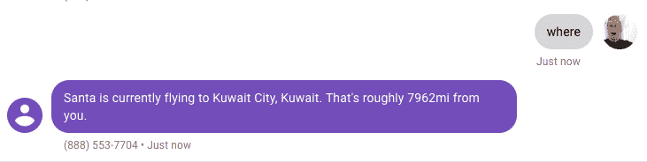

# 用短信和 Java 追踪圣诞老人

> 原文：<https://dev.to/vonagedev/tracking-santa-with-sms-and-java-440b>

自 2004 年 12 月以来，谷歌提供了一个年度圣诞主题网站，允许用户在平安夜追踪圣诞老人。此外，[北美防空联合司令部](http://www.norad.mil/)自 1955 年以来一直在追踪圣诞老人。虽然没有官方 API，但有一个[非官方 API](https://santa-api.appspot.com/info?client=web) 可以用来追踪圣诞老人的行踪。

为了庆祝圣诞节，我想创建一个 [Spring Boot](http://spring.io/projects/spring-boot) 应用程序，可以用来通过短信获得圣诞老人位置的更新。这个 Java 应用程序的完整代码可以在 [GitHub](https://github.com/nexmo-community/santa-tracker-sms) 上找到。

首先，我想解释一下应用程序在更高层次上是如何工作的。然后，我们可以深入一些更具挑战性的问题，以及解决这些问题的方法。

## 见其行动

当我的 Nexmo 号码收到一条短信时，一个有效载荷会被发送到我注册的 webhook。诸如发件人的电话号码和邮件内容之类的信息随后被用于确定如何回复邮件。

下面是它的实际效果:

[](https://res.cloudinary.com/practicaldev/image/fetch/s--jHla0L7t--/c_limit%2Cf_auto%2Cfl_progressive%2Cq_auto%2Cw_880/https://www.nexmo.com/wp-content/uploads/2018/12/tracker-in-action.png)

### 初始消息

第一次收到消息时，用户总是会看到圣诞老人的当前位置。他们还会被问及是否愿意提供邮政编码来获取距离信息。

### 位置查找

位置查找不是一项简单的任务。邮政编码在世界范围内并不一致，这有助于了解用户从哪个国家联系，以便缩小我们的搜索范围。

如果用户选择提供邮政编码信息，我使用 [Nexmo Number Insight](https://developer.nexmo.com/number-insight/overview) 来查找他们发送消息的国家。然后要求他们提供邮政编码。由此，我使用一个名为 [GeoNames](http://www.geonames.org/) 的服务来查找该邮政编码的经度和纬度。

这些信息与他们的电话号码一起保存在数据库中。纬度和经度用来计算圣诞老人离他们有多远:

[](https://res.cloudinary.com/practicaldev/image/fetch/s--rYNnn_9---/c_limit%2Cf_auto%2Cfl_progressive%2Cq_auto%2Cw_880/https://www.nexmo.com/wp-content/uploads/2018/12/where-response.png)

## 越来越技术化

从表面上看，这个应用程序似乎并不复杂。然而，在开发过程中，我遇到了不少挑战。我想强调代码的一些更技术性的方面。

### 路由来电消息

我的 Nexmo 号码被配置为向 webhook URL 发送`POST`请求。我有一个`IncomingMessageController`设置来处理传入的消息:

```
@PostMapping
public void post(@RequestParam("msisdn") String from,
        @RequestParam("to") String nexmoNumber,
        @RequestParam("keyword") String keyword,
        @RequestParam("text") String text
) {
  Phone phone = findOrCreatePhone(from, nexmoNumber);
  findHandler(phone, keyword).handle(phone, text);
} 
```

`findOrCreatePhone`方法用于持久保存一个新的`Phone`实体，或者查找一个现有的实体。下面是电话实体的样子:

```
@Entity
public class Phone {
  @Id
  @GeneratedValue(strategy = GenerationType.IDENTITY)
  private Long id;
  private String number;
  private String nexmoNumber;
  private String countryCode;

  @Enumerated(EnumType.STRING)
  private Stage stage;

  @OneToOne
  private Location location;

  // Getters and Setters
} 
```

该实体包含电话号码、Nexmo 号码、国家代码和用户所处的当前阶段。我将在后面的章节中讨论`Stage`枚举。

`findHandler`方法用于查找合适的`KeywordHandler`来处理消息:

```
public interface KeywordHandler {
  void handle(Phone phone, String text);
} 
```

每个处理器负责处理一个特定的关键字。应用程序知道的关键字有:

*   **HELP** 提供上下文信息来帮助用户。
*   **取消**取消当前系列问题。
*   **REMOVE** 从数据库中删除用户。
*   **YES** 用户对问题的回答是肯定的。
*   **否**用户对问题的回答是否定的。
*   **WHERE** 响应圣诞老人的当前位置。
*   **位置**允许用户更新他们的位置。

每个`KeywordHandler`都注册为一个 Spring 管理的 Bean。例如，`HelpKeywordHandler`看起来像这样:

```
@Component
public class HelpKeywordHandler implements KeywordHandler {
  @Override
  public void handle(Phone phone, String text) {
    // Logic here
  }
} 
```

所有的`KeywordHandler`实现都被注入到`IncomingMessageController` :
上的`keywordHandler`映射中

```
private final Map<String, KeywordHandler> keywordHandlers;

@Autowired
public IncomingMessageController(Map<String, KeywordHandler> keywordHandlers) {
  this.keywordHandlers = keywordHandlers;
} 
```

当注入到 map 中时，Spring 将使用`camelCase`类名作为键，实例化的类作为值。例如，`HelpKeywordHandler`与密钥`helpKeywordHandler` :
存储在一起

```
HelpKeywordHandler handler = keywordHandlers.get("helpKeywordHandler"); 
```

然后使用[策略模式](https://dzone.com/articles/java-the-strategy-pattern)的变体挑选合适的`KeywordHandler`。如果没有找到有效的`KeywordHandler`，则使用`DefaultKeywordHandler`来响应。

```
private KeywordHandler findHandler(Phone phone, String keyword) {
  // New users should always go to the default handler
  if (phone.getStage() == null) {
    return keywordHandlers.get("defaultKeywordHandler");
  }

  KeywordHandler handler = keywordHandlers.get(keywordToHandlerName(keyword));
  return (handler != null) ? handler : keywordHandlers.get("defaultKeywordHandler");
}

private String keywordToHandlerName(String keyword) {
  return keyword.toLowerCase() + "KeywordHandler";
} 
```

当需要添加新的关键字时，像这样路由消息具有灵活性。

### 搬运的各个阶段

每个处理程序负责以其关键字开始的消息。但是，`YesKeywordHandler`怎么知道用户在回答哪个问题呢？这就是`Phone`类中的`Stage`枚举的用武之地。

`Phone`实体可以存在于以下中间阶段:

*   **无阶段(`null` )** 针对刚刚创建且尚未被提问的用户。
*   **`INITIAL`** 适用于第一条消息包含圣诞老人的位置以及是否愿意提供邮政编码的提示的用户。
*   **`COUNTRY_PROMPT`** 针对被询问国家代码是否正确的用户。
*   **`POSTAL_PROMPT`** 用于被要求提供邮政编码的用户。

一旦提出问题，这些问题将进入以下最后阶段:

*   **`REGISTERED`** 针对已经提供了邮政编码的用户，会收到更详细的信息。
*   **`GUEST`** 对于不希望提供邮政编码信息的用户，只接收圣诞老人的当前位置，不计算距离。

这就是`YesKeywordHandler`如何使用阶段:

```
@Override
public void handle(Phone phone, String text) {
  if (phone.getStage() == Phone.Stage.INITIAL) {
    handlePromptForCountryCode(phone);
  } else if (phone.getStage() == Phone.Stage.COUNTRY_PROMPT) {
    handlePromptForPostalCode(phone);
  } else {
    outgoingMessageService.sendUnknown(phone);
  }
} 
```

在`INITIAL`阶段回答的用户必须回答问题“您想提供邮政编码信息吗？”

在`COUNTRY_PROMPT`阶段回答的用户必须回答问题“我看到你从美国发信息。回答“是”，一个 2 个字符的国家代码，或者如果你改变了主意，就取消。”

### 获取国家代码

为了更准确地查找邮政编码，了解用户发消息的国家会有所帮助。我创建了一个`PhoneLocationLookupService`，它使用 Nexmo Basic Number Insight 来查找电话号码的国家信息:

```
@Service
public class PhoneLocationLookupService {
  private final InsightClient insightClient;

  @Autowired
  public PhoneLocationLookupService(NexmoClient nexmoClient) {
    this.insightClient = nexmoClient.getInsightClient();
  }

  public String lookupCountryCode(String number) {
    try {
      return this.insightClient.getBasicNumberInsight(number).getCountryCode();
    } catch (IOException | NexmoClientException e) {
      return null;
    }
  }
} 
```

该应用程序将要求用户确认他们的国家，以防他们正在旅行，并希望将自己设置在一个不同的国家。

### 查找邮政编码

事实证明，查找邮政编码的经度和纬度信息并不是一项简单的任务。我选择与 GeoNames 合作，因为这项服务是免费的。

我创建了一个`PostCodeLookupService`来处理邮政编码信息的查找。`getLocation`方法首先查看我们是否已经知道数据库中的邮政编码。这是一个很好的做法，因为它有助于限制调用第三方服务的次数。

如果不存在现有的`Location`实体，则调用第三方服务，并持久保存一个新的实体。如果我们找不到与那个邮政编码匹配的位置，我们返回一个空的`Optional`，这样应用程序就知道要求用户再试一次:

```
private Optional<Location> getLocation(String country, String postalCode) {
  Optional<Location> locationOptional = locationRepository.findByPostalCode(postalCode);
  if (locationOptional.isPresent()) {
    return locationOptional;
  }

  LocationResponse response = getLocationResponse(country, postalCode);
  if (response.getPostalCodes().isEmpty()) {
    return Optional.empty();
  }

  Location newLocation = buildLocation(response, postalCode);
  return Optional.of(locationRepository.save(newLocation));
} 
```

### 计算距离

一旦我们有了用户的纬度和经度，我们就可以查找圣诞老人的当前位置，并使用一个公式来确定用户离圣诞老人有多远。这是在`DistanceCalculationService` :
中完成的

```
 public double getDistanceInMiles(double lat1, double lng1, double lat2, double lng2) {
  double theta = lng1 - lng2;
  double dist = Math.sin(Math.toRadians(lat1))
          * Math.sin(Math.toRadians(lat2))
          + Math.cos(Math.toRadians(lat1))
          * Math.cos(Math.toRadians(lat2))
          * Math.cos(Math.toRadians(theta));

  dist = Math.acos(dist);
  dist = Math.toDegrees(dist);
  dist = dist * 60 * 1.1515;

  return dist;
} 
```

## 结论

这是一个关于如何创建一个允许你通过 SMS 获得圣诞老人位置更新的应用程序的研究。我们讨论了基于关键字路由消息，使用多个阶段来确定用户对哪些问题做出响应，以及使用 Nexmo Number Insight 来获取电话号码的国家代码。

要了解更多详细信息，我建议查看 GitHub 上的代码。`README`文件包含启动和运行应用程序本身所需的所有信息。

一定要去看看平安夜附近的谷歌圣诞老人追踪器或北美防空司令部圣诞老人追踪器，这是追踪圣诞老人的另一种方式。