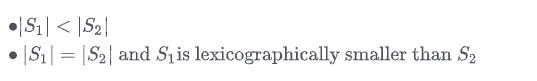
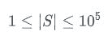

# 每日编码-第 1 天#印刷字体最小

> 原文：<https://dev.to/aryanar28481526/typographically-smallest--2nnf>

给定一个仅由小写字母组成的字符串，找出其中不存在子串的印刷最小的字符串。

给了 S1 和 S2 两根弦。在以下任一情况下，S1 被认为在排印上比 S2 小:

### 输入:

第一行输入包含字符串 s。

### 输出:

如上回答。

约束条件:

### 样本输入

绍拉布

### 样本输出

c