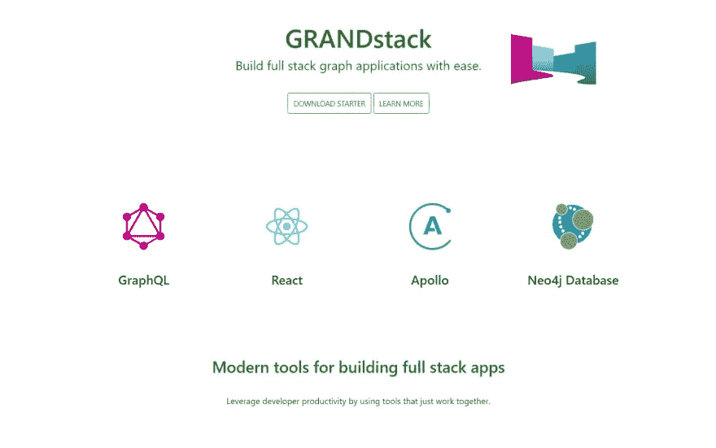
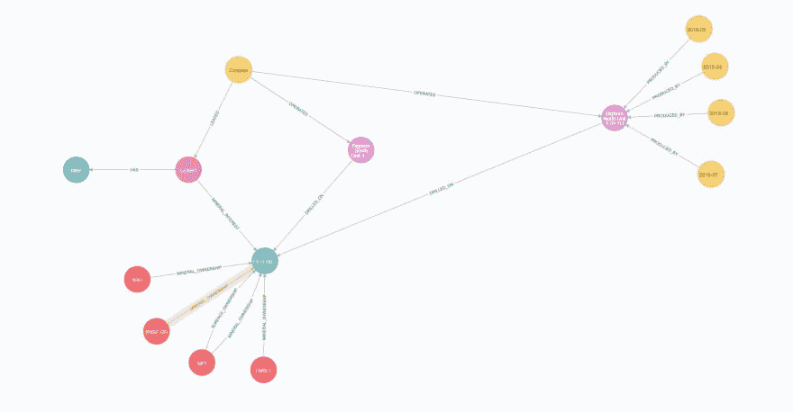
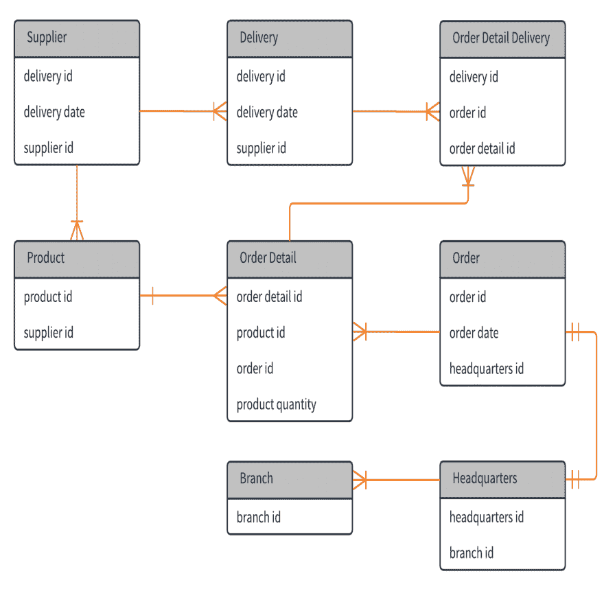

# 引爆点-第 2 部分:堆栈

> 原文：<https://dev.to/muddybootscode/the-tipping-point---part-2-the-stack-43d7>

首先，我想说我对数据库的介绍相当艰难。在我遇到 ORM 和它的各种概念的时候，我一周工作 60 多个小时，参加一个在线训练营，并且全职去我当地的社区大学。回过头来看，我可能是贪多嚼不烂。肯定有一些领域受到了影响，因为我无法像自己希望的那样关注它们，而数据库，尤其是 SQL 数据库正好属于这一类。

我可以把责任归咎于繁忙，但主要是我只是看了看 SQL 数据库的组织方式，然后想，“肯定有更好的方式。”主键和外键、不可变模式和数据规范化的整个系统对我来说毫无意义。我勉强通过了这门课，但最主要的是它给我留下了对 SQL 数据库的厌恶，对我来说这可以概括为现实世界并不是这样的。现在，在仇恨堆积在我身上之前，我知道这些数据库已经存在了，基本上是现代计算的发明。它们经受住了时间的考验，并在世界各地广泛使用，但这并不意味着它们是最好的或唯一的方式。于是我开始了对 NOSQL 数据库的搜索。

因为它非常受欢迎，我几乎立刻就找到了去 MongoDB 的路。我喜欢它是模式不可知论者，我喜欢文档和集合的概念几乎是直接有意义的。我拿起它，开始在一些小的 MERN 堆栈应用程序上使用它，学习教程并将其用于 python web 抓取应用程序。尽管如此，它仍然不太令人兴奋，除了更加直观和易于使用之外，它没有带来任何新的东西，所以我继续搜索。这时候我发现了 Neo4j。

对于一个数据库专业人员或数据争论专家来说，Neo4j 可能算不上什么新发现，但对我来说，它立刻就有了启示。最后，我找到了一些有意义的东西。当我第一次看到 Neo4j 表示的图形，以及这些关系是多么容易理解和遍历时，我的脑海里几乎可以听到咔嚓一声。在其中，我知道我已经为这个 SQL 傻瓜找到了一种方法，最终能够对我希望处理的关系进行建模。最重要的是，内置的数据可视化比我见过的任何 ERD 图表都要好得多。自己找就好了。

对我来说，区别很明显。Neo4j 图不需要解释就能理解，相比之下，ERD 图有着明显的鱼尾纹和不直观的结构。当然，我之前说过我有偏见，但在为客户的项目中使用 Neo4j 后，看到他们能和我一起快速吸收数据和关系也很棒。这是一个不可思议的演示和解释数据的工具。它帮助映射的模式对人们来说非常直观，不管他们对数据库有多少了解。人是视觉化的，拥有这样一种展示数据的视觉方式，几乎立刻就能吸引客户。此外，关系标签是人类可以立即理解的，这在与任何人相处时都有很大的不同。
最后，我要说，我选择 Grand Stack 是因为它使用了图形，而且对我来说很容易理解。用于 API 的 GraphQL，用于图形数据库的 Neo4j，一路向下的图形。在我的下一篇文章中，我将介绍 Neo4j 的 GraphQL 集成，以及它如何简化开发体验。与此同时，你可以亲自去看看 T2。